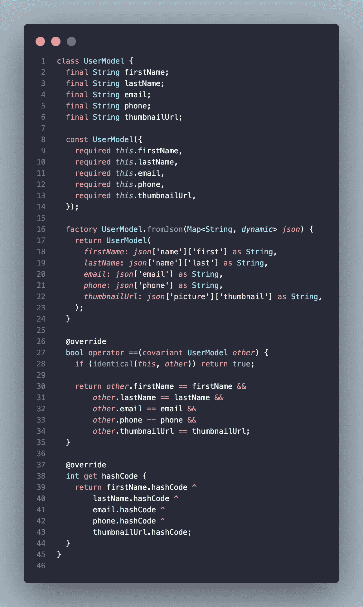
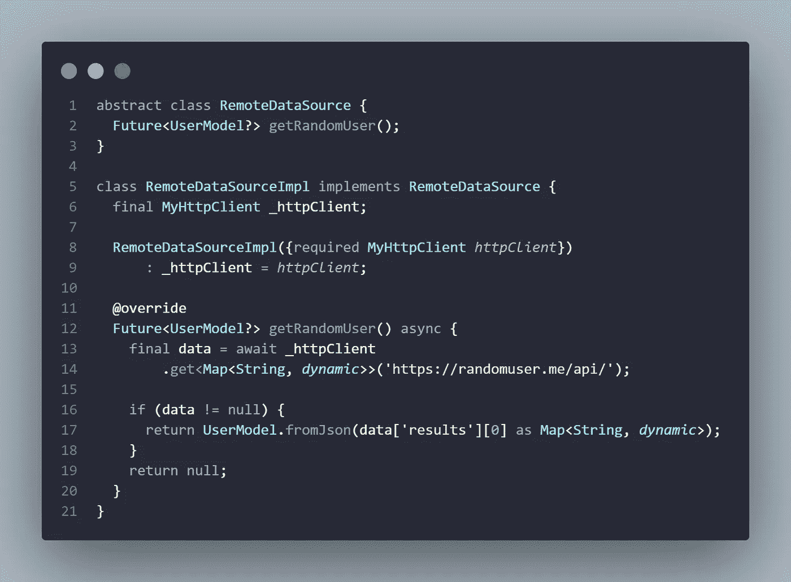
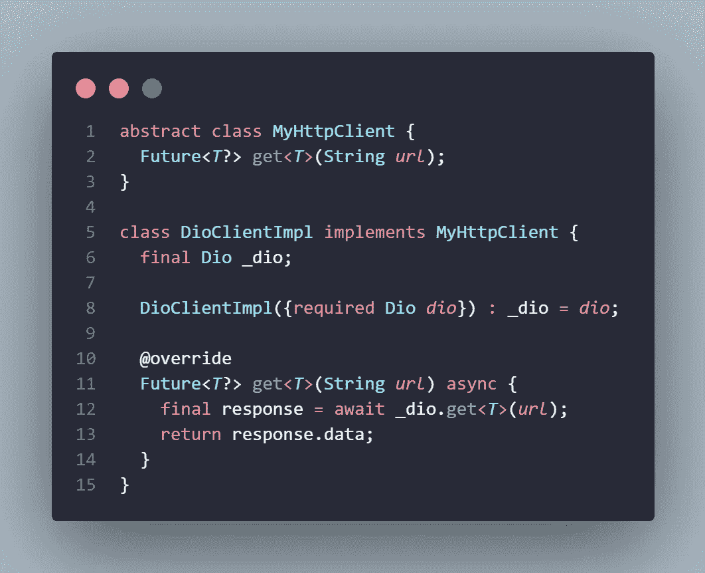
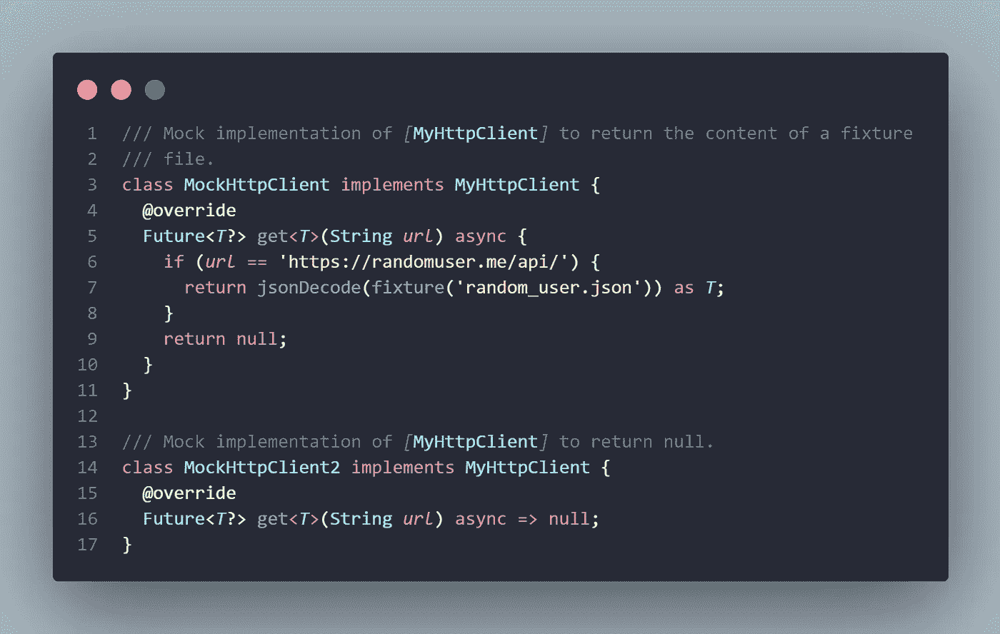
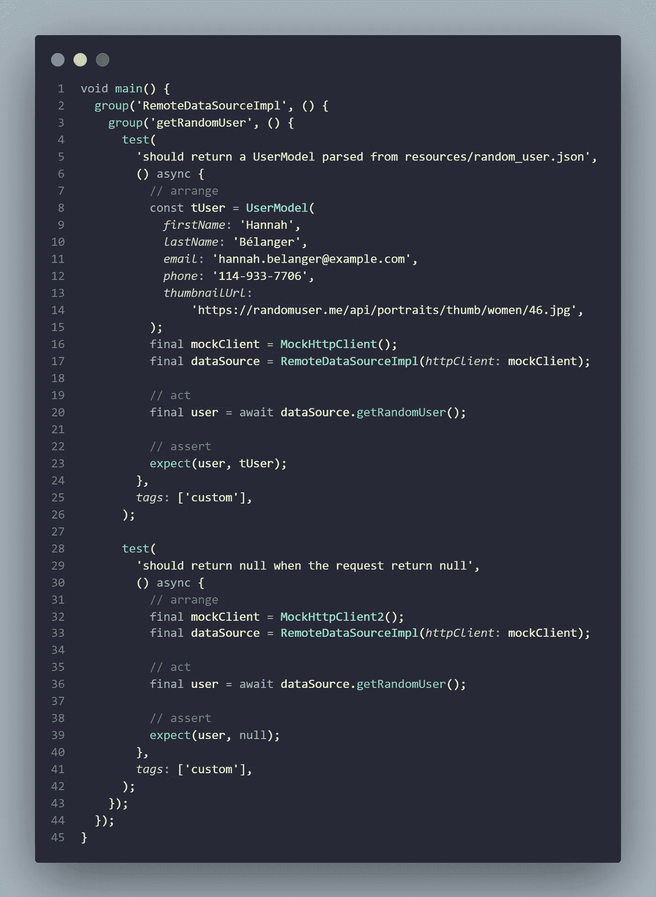
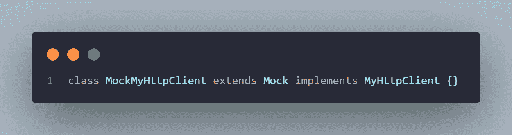
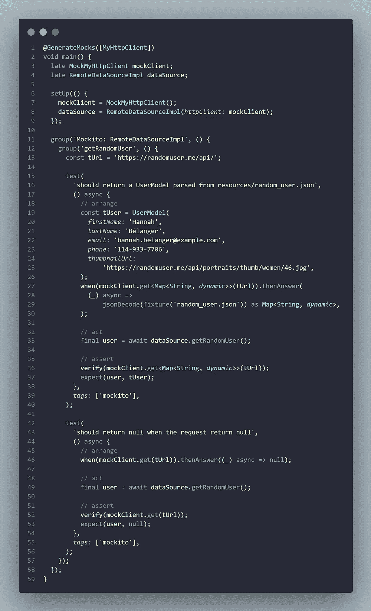
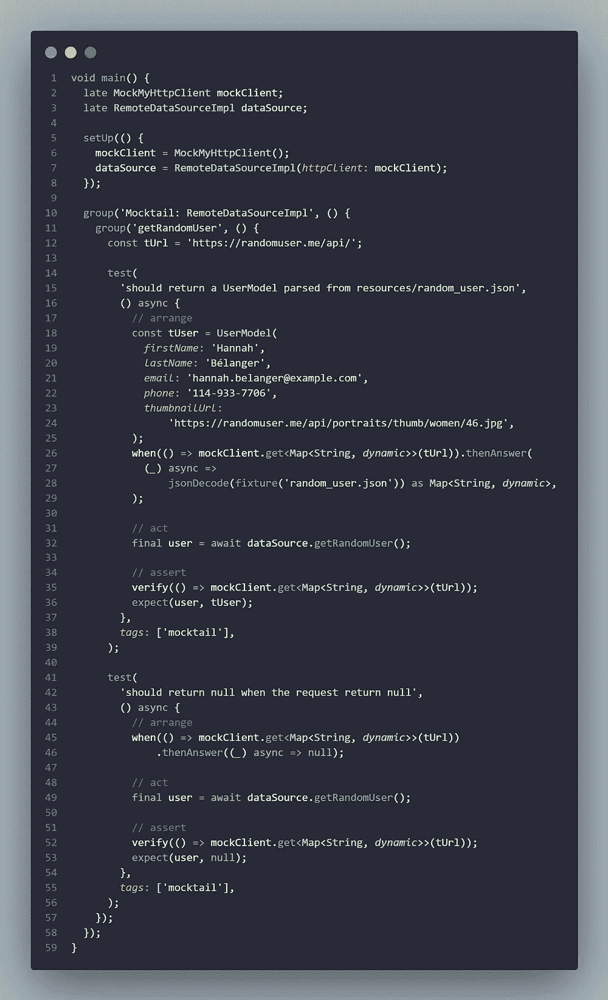

# Flutter 中的 TDD 第 4 部分:创建模拟

> 原文：<https://itnext.io/tdd-in-flutter-part-4-creating-mocks-eb3b0a38bae0?source=collection_archive---------1----------------------->

欢迎来到“Flutter 中的测试驱动开发”系列的第四集，今天我将解释“模仿”类和方法的概念。然后我会比较嘲笑你的类的不同方式，包括两个流行的嘲笑包 [mockito](https://pub.dev/packages/mockito) ，由 [Dart 团队](https://github.com/dart-lang)维护，和 [mocktail](https://pub.dev/packages/mocktail) ，由 [Very Good Ventures](https://verygood.ventures/) 维护。

你也可以在专门的“TDD in Flutter”列表这里查看之前的文章:[https://rouxguillaume . medium . com/list/TDD-in-Flutter-64d 0 D5 f 07854](https://rouxguillaume.medium.com/list/tdd-in-flutter-64d0d5f07854)

# 什么是模仿？

模拟对象是以受控方式模仿真实对象行为的对象。程序员通常创建一个模拟对象来测试其他对象的行为。

模拟对象具有与它们模拟的真实对象相同的接口，允许客户端对象不知道它是在使用真实对象还是模拟对象。(这通常是通过依赖注入工具来管理的。)

在 Flutter 中，你有不同的创建模仿的方法，你可以直接创建你自己的模仿对象，用你想要的方法的特定实现，或者使用第三方包，比如上面提到的那个。

让我们用一个从 [randomuser.me](https://randomuser.me/) 获取随机用户数据的简单应用程序来探索这些不同的模拟和测试方法。

# 基础项目

假设我们想要解析下面的 JSON:

用[https://randomuser.me/api/](https://randomuser.me/api/)生成

首先我们需要定义一个`UserModel`类(为了避免文章变得太长，我将跳过“编写测试”部分，但是你可以在这里找到所有与类[相关的测试):](https://github.com/TesteurManiak/tdd_in_flutter/blob/main/creating_mocks/test/user_model_test.dart)

用户模型. dart

然后，我们必须定义一个 API 来执行我们的 HTTP 请求，在这种情况下，我将创建一个依赖于`MyHttpClient`类的类`RemoteDataSource`，因为如果不依赖于第三方包(如 [http_mock_adapter](https://pub.dev/packages/http_mock_adapter) )来模仿某些包(如 [dio](https://pub.dev/packages/dio) )会有些乏味。

例外的是，我不会事先为这个类编写测试，因为整个重点是向你展示单元测试的不同方法。

my_http_client.dart ( [单元测试](https://github.com/TesteurManiak/tdd_in_flutter/blob/main/creating_mocks/test/my_http_client_test.dart))

现在我们已经写好了基础代码，我们可以开始使用 mocks 为`RemoteDataSource`写一些测试。

# 自定义模拟对象

如果你不想依赖一个软件包，你可以自己写一些模拟程序，下面是一个你可以实现的例子:

mocks.dart ( [fixture](https://github.com/TesteurManiak/tdd_in_flutter/blob/main/creating_mocks/test/utils/fixture_reader.dart) 是一个从测试文件夹中读取文件的实用函数)

如您所见，我必须编写两个模拟类。背后的原因是因为我想测试我的`RemoteDataSourceImpl`的两个行为:

*   我想测试一个`UserModel`是否被正确解析和返回，
*   我想测试一下，如果我没有任何数据要解析，将会返回一个`null`值。

下面是如何编写测试的方法:

我使用了“custom”标签，以便能够使用我的定制模拟只执行测试。

我们创建了一个`MyHttpClient`的模拟实例，它将被我们的`RemoteDataSourceImpl`使用。然后我们将能够调用我们想要测试的方法，因为返回值总是相同的，我们现在可以断言接收到的结果。

通过这样做，我们已经能够测试`RemoteDataSourceImpl`类，但是正如你所看到的，每当我们需要测试一些特定的情况时，我们将不得不创建一个新的模拟类来实现期望的行为。这在中型和大型代码库上会很快变得单调乏味，这就是模仿包派上用场的地方。

# 莫克托&莫克泰尔

在撰写本文时， [mockito](https://pub.dev/packages/mockito) 和 [mocktail](https://pub.dev/packages/mocktail) 是轻松创建类模拟的首选解决方案。虽然我个人偏爱 mocktail，但这两个包提供了几乎完全相同的特性和 API，与您的测试代码不会有任何显著的差异。

那么，用这些包装制作的模型是什么样的呢？

嗯，对于 mockito，类是用 [build_runner](https://pub.dev/packages/build_runner) 生成的，因此，您必须注释该方法以生成正确的 mock 类(您可以直接参考 [mockito 的文档](https://pub.dev/packages/mockito#lets-create-mocks)以了解更多关于如何生成 mock 的信息)。

对于 mocktail，您只需要扩展`Mock`对象。

至于我们的测试，两个代码将几乎相同。

莫克托(左)和莫克泰尔(右)

依靠其中的一个包，我们可以使用两个非常方便的方法，一个是`when`来隐藏模拟的行为(不需要创建一个全新的类),另一个是`verify`,它允许我们确认模拟类中的特定方法已经被调用。

# 结论

本文到此结束，我希望嘲讽一个类背后的概念现在对你来说更清楚了。最终没有“最佳解决方案”，只有你和你的团队会选择。更喜欢写你的 mock 还是依赖一个包完全取决于你。

如果您想更详细地查看代码，可以在我的 GitHub 上找到本文使用的整个项目:

 [## GitHub-TesteurManiak/TDD _ in _ flutter

### 在 GitHub 上创建一个帐户，为 TesteurManiak/tdd_in_flutter 开发做贡献。

github.com](https://github.com/TesteurManiak/tdd_in_flutter) 

如果你有问题，你可以[在 Twitter 上联系我](https://twitter.com/TesteurManiak),如果你喜欢这篇文章，不要犹豫，继续关注，鼓掌和/或评论，这有助于我保持动力。

祝你有美好的一天和快乐的编码！