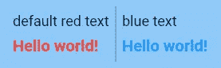

# 颤振中的 tdd 特殊:炼金术士🧙的黄金测试🏼

> 原文：<https://itnext.io/tdd-in-flutter-special-golden-tests-with-alchemist-ea8c96ff4dfe?source=collection_archive---------2----------------------->


超级特别版！

几个月前，我发布了这篇文章:

[](/tdd-in-flutter-part-3-testing-your-widgets-c5e87d76a864) [## Flutter 中的 TDD 第 3 部分:测试小部件

### 大家好，距离上一集已经有一段时间了，但终于来了，我准备向你们解释如何…

itnext.io](/tdd-in-flutter-part-3-testing-your-widgets-c5e87d76a864) 

其中一个主题是“黄金测试”，使用包 [golden_toolkit](https://pub.dev/packages/golden_toolkit) 制作了一个例子。这是一个在测试中执行快照比较的很好的包，但是它有一个主要的警告，即根据所使用的平台，生成的文件之间不一致。

2022 年 2 月 23 日， [Very Good Ventures](https://verygood.ventures/) 联合 [Betterment](https://www.betterment.com/) 发布了一个名为[炼金术师](https://github.com/Betterment/alchemist)的包，旨在简化黄金测试的处理方式，并提高生成的快照之间的一致性。

背后的解决方案实际上非常简单，软件包将生成两组快照，一组特定于您的平台(Linux、MacOS 或 Windows ),另一组专门为您的配置项制作。通过这样做，作为一名开发人员，您将拥有一组人类可读的快照，以确认使用[咳咳字体](https://web-platform-tests.org/writing-tests/ahem.html)为您的 CI 生成的渲染和黄金文件，无论操作系统如何，这些文件都应该保持不变。

既然解释了基本概念，让我们看看如何用这个包编写测试:

## 导入包

这似乎是显而易见的，但是，您必须将包添加到您的`pubspec.yaml`文件中。您可以直接编写导入，如下所示:

```
dev_dependencies:
  alchemist: ^0.3.2 # Latest version at the time of this article
```

或者只运行命令:

```
$> flutter pub add --dev alchemist
```

## 添加字体

现在你已经添加了这个包，你将需要从你的资源中添加一些字体，如果你还没有使用的话，这将需要渲染人类可读的快照。

## 更新的软件包 v0.3.3 —推荐

Roboto 字体直接包含在包的[资产中，你可以用`FontLoader`加载它。我写了一个实用程序来帮助我:](https://github.com/Betterment/alchemist/tree/main/assets/fonts/Roboto)

测试/utils/font_loader.dart

然后，在测试之前，您可以用一个`setUpAll`来设置对方法`loadDefaultTestFont()`的调用。这是一个更好的方法，因为炼金术士是一个`dev_dependency`，所以它不会捆绑你的应用程序中的字体文件。

```
void main() {
  setUpAll(() async {
    await loadDefaultTestFont();
  }); // your golden test
}
```

## 旧方法—不推荐

基本的 [Roboto font](https://fonts.google.com/specimen/Roboto) 应该可以完美地完成这项工作，只需下载并复制项目中的文件即可。

我个人喜欢创建一个`assets/fonts/`文件夹:

```
+-- assets/
|   +-- fonts/
|   |   +-- Roboto/
|   |   |   +-- LICENSE.txt
|   |   |   +-- Roboto-Black.ttf
|   |   |   +-- Roboto-Bold.ttf
|   |   |   +-- Roboto-Light.ttf
|   |   |   +-- Roboto-Medium.ttf
|   |   |   +-- Roboto-Regular.ttf
|   |   |   +-- Roboto-Thin.ttf
```

不要忘记在`pubspec.yaml`中声明你的字体:

```
flutter:
  fonts:
    - family: Roboto
      fonts:
        - asset: assets/fonts/Roboto/Roboto-Thin.ttf
          weight: 100
        - asset: assets/fonts/Roboto/Roboto-Light.ttf
          weight: 300
        - asset: assets/fonts/Roboto/Roboto-Regular.ttf
          weight: 400
        - asset: assets/fonts/Roboto/Roboto-Medium.ttf
          weight: 500
        - asset: assets/fonts/Roboto/Roboto-Bold.ttf
          weight: 700
        - asset: assets/fonts/Roboto/Roboto-Black.ttf
          weight: 900
```

你所有声明的字体都将被这个包加载，这样你就不需要在编写测试时使用像`loadAppFonts`这样的方法。

**不再推荐这种方式，因为您必须将 Roboto 文件与您的应用程序捆绑在一起。**

## 将非 CI 黄金文件添加到 gitignore

只需将以下内容添加到您的`.gitignore`文件中:

```
test/**/goldens/**/*.*
test/**/failures/**/*.*
!test/**/goldens/ci/*.*
```

## 创建黄金测试标签

创建一个`dart_test.yaml`文件，如果你还没有的话，并添加以下属性:

## 配置您的测试

在您的`test/`文件夹中创建一个`flutter_test_config.dart`文件，并添加以下代码:

测试/颤振 _ 测试 _ 配置.飞镖

这将允许您通过使用命令`flutter test --dart-define=CI=true`对 CI 黄金文件运行测试。该参数添加了一个名为“CI”的[环境变量](https://stackoverflow.com/a/61725261/9942346)，可通过以下方法访问:

```
bool.fromEnvironment('CI', defaultValue: false)
```

这就是了！你的设置应该完成了，现在你可以用炼金术士编写并运行你的第一个黄金测试了。

## 写一个黄金测试

让我们看看上一篇文章中制作的`SimpleText`小部件:

我想检查默认情况下文本是红色的，当改变`color`属性时，它将更新我的文本的颜色。

因此，让我们使用炼金术士来重构旧的测试文件:

和 [golden_toolkit](https://pub.dev/packages/golden_toolkit) 一样，你有一个`goldenTest`方法可以调用，这个包也提供了一个`GoldenTestGroup`小部件，它的行为有点像`group`方法。然后，您可以使用`GoldenTestScenario`小部件在您的快照上添加一个标签，并帮助将多个快照合并到一个文件中。

现在，您已经准备好运行命令了:

```
$> flutter test --update-goldens 
```

您应该获得两个包含您的平台和 CI 快照的文件夹:



平台快照


CI 快照

当您丢失 CI 测试的细节时，您并不总是需要确认一个`Text`小部件被正确渲染，但是，您可能想要确保您正在用正确的颜色渲染您的小部件。

这就是如何编写与您的 CI 兼容的黄金测试。请不要犹豫，在 [Pub.dev](https://pub.dev/documentation/alchemist/latest/) 或 [GitHub](https://github.com/Betterment/alchemist) 上查看该软件包的文档，了解该软件包支持的功能的更多详细信息，或者在需要时提出问题。由于这个包还很年轻，我相信任何贡献将非常感谢。

## 结论

我希望这篇文章能帮助你更好地理解炼金术士包。我想欢迎所有最近来的追随者。你们是我写这个系列的主要动力来源。

一如既往，如果你喜欢这篇文章，请不要犹豫发表评论、分享和鼓掌。你可以在它自己的阅读列表中找到“TDD in Flutter”之前的所有文章:

[https://rouxguillaume . medium . com/list/TDD-in-flutter-64d 0 D5 f 07854](https://rouxguillaume.medium.com/list/tdd-in-flutter-64d0d5f07854)

祝你有美好的一天和快乐的编码！