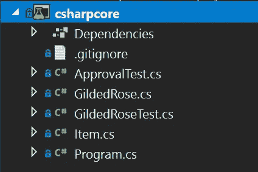
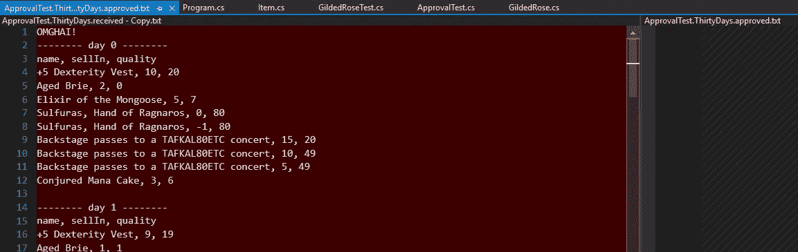
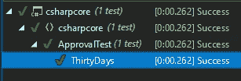
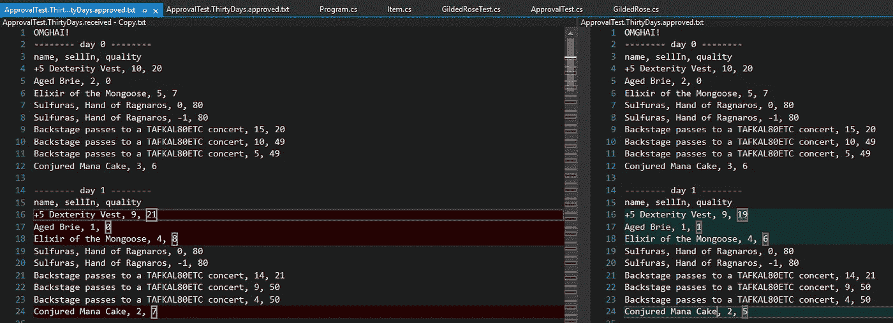
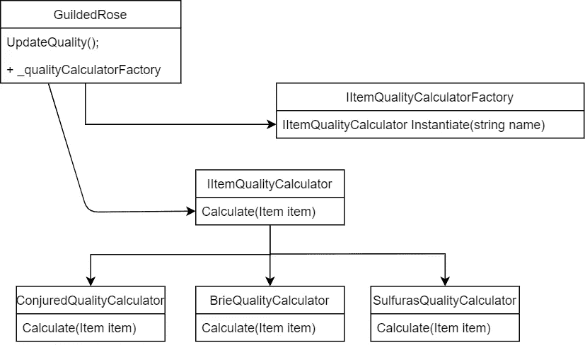
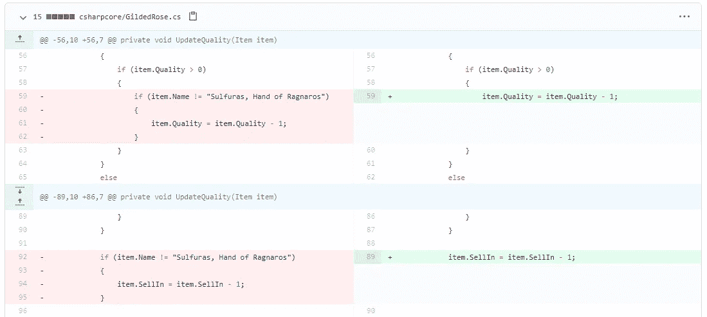
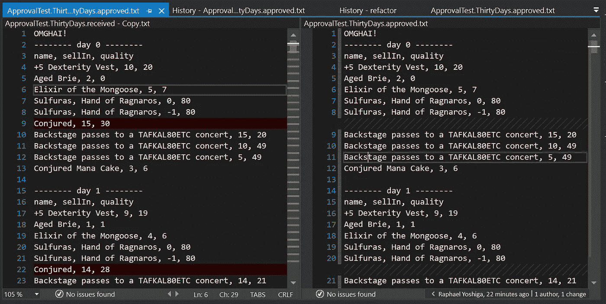

# TDD 第 5 课——扩展遗留代码

> 原文：<https://itnext.io/tdd-lesson-5-extending-legacy-code-b0c507ee989e?source=collection_archive---------1----------------------->

蒂姆·埃文斯在 [Unsplash](/s/photos/safe?utm_source=unsplash&utm_medium=referral&utm_content=creditCopyText) 上拍摄的照片

鉴于我在[之前关于 TDD](/acceptance-test-driven-development-in-net-core-with-specflow-dcb17fb7a893?source=friends_link&sk=e7d7a00242242e63922e0688ba4db51d) 的帖子，TDD 可以很好地用于绿地项目，一个项目从它开始，让你攫取所有的好处，但是绿地项目是一种奢侈品，在我们的职业生涯中不会有太多的时间，有时我们将不得不扩展遗留代码库。我们如何安全地做到这一点？

这篇文章将向您的 TDD 工具箱添加另一项技术，在扩展遗留应用程序之前添加测试覆盖。

# 扩展遗留代码库的两种方法

## 编辑和祈祷

Josh Frenette 在 [Unsplash](/s/photos/careful?utm_source=unsplash&utm_medium=referral&utm_content=creditCopyText) 上拍摄的照片

“编辑并祈祷”在这种情况下，你更改代码并希望你没有破坏它，在这种方法中，你非常仔细地分析代码，查看更改的最小步骤以获得新的行为，并在更改后，进行一系列手动测试以检查回归和新功能。你也可以称之为“精心编辑”。

这样做的一个缺点是，因为你总是修改最小值，你不是在重构代码库，让它进入一个更好的状态。

## 覆盖和修改

您可以使用的另一种方法是“覆盖和修改”，您可以在现有代码中添加测试，现在您有了一个安全网，可以更加自信地进行更改。您现在可以自由重构了。

为了生成这些测试，我们将使用一种称为 Golden Master tests 的技术，基本上我们将输入输入到现有系统并存储其结果，这样我们可以验证以后的行为是否仍然相同。

# 行会玫瑰形

我们将与 K [ata](https://github.com/emilybache/GildedRose-Refactoring-Kata) 一起工作，但是不要担心代码，因为我将提取一些内容，这样我们可以一起浏览。

考虑这些要求:

酷，要求看起来不太难，它只是添加这个“变戏法”的项目，这里是现有的实现:

相当容易阅读，是吗？

您将如何继续修改代码？你能简单地添加一个条件吗，如果名字等于“被召唤”产生新的行为并返回它？这是一种方法，你甚至可以通过“仔细编辑的方法”来做到这一点，但这将使代码库处于这种糟糕的状态。

让我们以一种更安全的方式来做这件事，让我们覆盖现有的行为，重构它，这样我们就可以很容易地添加我们的新行为。

> 这是我鼓励开发人员考虑的一点，不要急于添加功能，而是问问自己，这些代码是否易于扩展，或者重构是否可以使扩展更加简单？

## 第一步——盖住它

我将和老师一起做这个练习。net core 版本，位于“csharpcore”下，来自 guild Rose[Kata GitHub](https://github.com/emilybache/GildedRose-Refactoring-Kata)。

GuildedRose 解决方案资源管理器

形已经为你设置好了，你只需要学习你的第一个金主测试，这是批准文件的样子:

这是使用一个名为 [ApprovalTests](https://approvaltests.com/) 的包，它将捕获程序的输出，将其存储在一个文件中，然后用它来进行比较。因此，第一次运行测试时，您应该会看到一个如下所示的“diff”屏幕:

该测试正在生成一个名为 *ApprovalTests 的文件。ThirtyDays.received.txt* ，然后与*approval tests . thirty days . approved . txt .*做一个简单的字符串比较

但是批准的文件还不存在，这是您验证输出的地方，通过将接收到的文件的内容放入批准的。我建议你复制收到的文件，然后简单地重新命名。

现在你的批准测试应该通过了。

批准测试通过

所以我们这样做的全部目的是创建我们的安全网，所以让我们看看我们能在多大程度上依赖我们的测试。

一个热爱安全网安装工作的人

**突变测试**

我们将故意打破以前的逻辑，看看测试是否失败，简单的事情，如反转 if，注释代码部分，等等。如果测试之后仍然是绿色的，那就是一个遗漏的覆盖率。尝试一下:

正如所料，我们的程序开始给出不同的输出，测试失败:

received.txt 和 approved.txt 之间的批准测试差异

## 步骤 2——重构

很好，现在我们有了安全网，我们可以自由重构了。我们如何使它更容易扩展？

在讨论重构的主要目标之前，我将从几件简单的事情开始:

*   删除“Items[i]”的重复项，只将该项用作变量。
*   把*里面的所有东西都换成*的另一种方法，以减少嵌套，嵌套是罪恶的，尽量把它保持到最小。

我知道这并没有带来很大的不同，但它是下一次重构的基础。

每当我看到这样的需求，不同类型的对象有不同的行为，我立刻想到一个策略模式:

> 在[计算机编程](https://en.wikipedia.org/wiki/Computer_programming)中，**策略模式**(也称为**策略模式**)是一种[行为](https://en.wikipedia.org/wiki/Behavioral_design_pattern) [软件设计模式](https://en.wikipedia.org/wiki/Design_pattern_(computer_science))，它允许在运行时选择一种[算法](https://en.wikipedia.org/wiki/Algorithm)。代码不是直接实现单个算法，而是接收运行时指令，以决定使用哪一组算法。

示例类图:

此场景的策略模式的类图

从重构开始，我寻找最简单的产品类型来实现，在我看来是 Sulfuras，因为它什么也不做。

通过为 Sulfuras 实现工厂和行为，我现在可以执行 Sulfuras 策略，更新质量并返回它。

所以现在 Sulfuras 不再运行在以前的代码上，我们可以在现有代码上寻找任何定制的实现并进行清理。

示例[提交](https://github.com/RaphaelYoshiga/GildedRose-Refactoring-Kata/commit/0b2dbd2f0a070bcb4a07c89b168d589d984a09f7)。

对陈年布里干酪和音乐会重复这一过程，我们得到:

> 注意:我已经重命名为 QualityUpdateStrategy，因为我认为它更好地描述了它。

它已经好多了，但现在剩下的是 GuildedRose。如果工厂不知道产品，这是默认行为，因此我们可以简化:

## 第三步——扩展它

现在我们已经有了策略模式，添加另一个策略是小菜一碟:

当然，将它添加到工厂中，现在解决方案可以处理变出来的项目。

## 步骤 4 —更新现有的认证测试

添加了想象的行为后，您还可以确保它包含在批准测试中。批准测试的产品列表在 Program.cs 上，所以如果您添加一个魔法物品，您将看到新产品及其行为。

使用新产品运行测试会生成不同的输出:

添加新产品的审批流程

重复批准 received.txt 到 approved.txt 之间的过程，并提交新的 approved.txt 文件。

# 结论

我们通过两种方式来扩展遗留系统，“编辑和祈祷”和“覆盖和修改”。我想说的是，这两种方法都有其用武之地，所以金主是你武器库中的一项伟大技术。此外，我们还看到了如何使用策略模式使代码更具可读性、可扩展性和可维护性。测试愉快。

## 来源:

*   [原始回购](https://github.com/emilybache/GildedRose-Refactoring-Kata)。
*   [我与重构最终结果的分歧](https://github.com/RaphaelYoshiga/GildedRose-Refactoring-Kata/tree/refactor/csharpcore)。