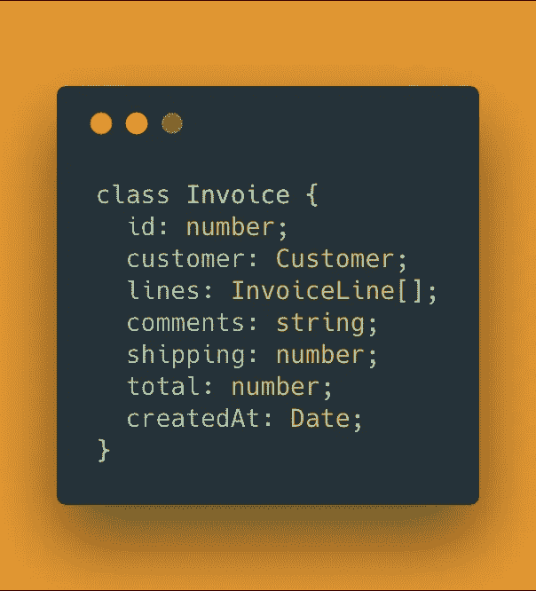
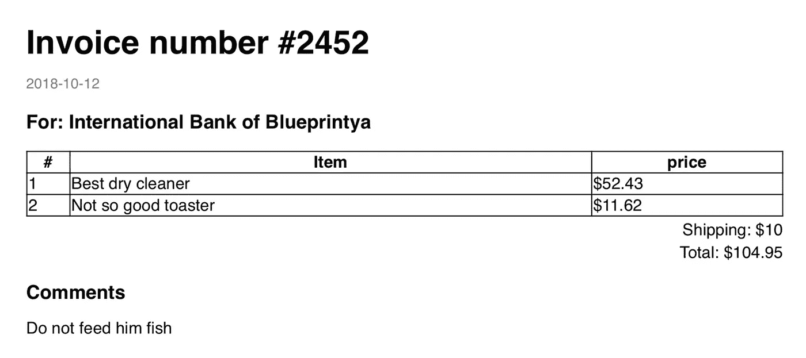

# Tea-School.js —从 Node.js 中的 HTML 和 CSS 生成 PDF 文件

> 原文：<https://itnext.io/tea-school-js-generate-a-pdf-file-from-html-and-css-in-node-js-32529f9b0f37?source=collection_archive---------1----------------------->

[蒂姆·高夫](https://unsplash.com/@punttim?utm_source=medium&utm_medium=referral)在 [Unsplash](https://unsplash.com?utm_source=medium&utm_medium=referral) 上发表的“穿着白色上衣使用 MacBook 的男人”

哦，好家伙，这是一场多么艰难的斗争…
如果你曾经试图用 JavaScript 创建一个 PDF 文件，你可能会发现自己偶尔会说脏话，晚上会不安地躺在床上。

# TL；速度三角形定位法(dead reckoning)

[Tea-School.js](https://github.com/AmirTugi/tea-school) 是我用 Node.js 中的 HTML+CSS 创建一个动态 PDF 文件的包

# 示例—复杂的发票 PDF 文件

让我们一起走过创建发票 PDF 文件的过程。

首先让我们描述一下我们的发票模型(使用 TypeScript):

非常简单明了。

现在让我们定义 PDF 文件生成器的标准:

*   **动态。这不是用已知的、可靠的信息来创建静态的小册子。
    我们希望为每个发票 ID 生成不同的数据。**
*   **国际化** (I18N)。
    在非英语国家开展业务需要您以当地语言开具发票，包括 RTL 支持。
*   **简单。没有人想写复杂的代码，他们不理解他们所做的大部分事情，但是代码片段显示它应该可以工作。**
*   **HTML + CSS。使用 HTML 和 CSS 创建一个模板比使用 PDF 特定方法(例如`pdfFile.rectangle(0, 0, 100, 200)`)创建一个 PDF 文件要容易得多。**

# 茶学网

有几个库满足了我们的一些标准，但是我还没有看到一个满足所有标准的——尤其是简单性。

在这个问题上挣扎了几个星期，我终于找到了一个可能的解决办法:

使用[木偶师](https://github.com/GoogleChrome/puppeteer)和[木偶师](https://pugjs.org/api/getting-started.html)的组合。

对于那些不熟悉这两者的人来说，Puppeteer 是一个无头的 Chrome JS 库，具有 Chrome 浏览器的所有功能——包括从网页(HTML)创建 PDF👍)，而 pug.js 是一个用于创建 HTML 模板并用动态数据编译它们的库。

我创建了一个库来抽象这两个文件创建 PDF 的大部分基本用法，还添加了 [node-sass](https://github.com/sass/node-sass) 来使用 [SASS](https://sass-lang.com/) 作为动态 CSS 内容。

结果:[**tea-school . js**](https://github.com/AmirTugi/tea-school)

轶事:在我的母语(希伯来语)中，茶学校(tiscool)的意思是挫折。这是我在试图找到一个创建 PDF 文件的漂亮解决方案后的状态。

## 使用

让我们使用这个新的库来生成一个简单的发票:

做得漂亮，容易

## HTML 模板

我们的模板文件`invoice-pdf.template.pug`:

如果你没有和哈巴狗相处的经验，不要担心。他们有一个很好的文档，所以你可以很容易地拿起你需要创建你的模板。

注意特殊的`compiledStyle`键。这个键是为嵌入 SASS 样式而保留的，lib 用我们提供的样式文件编译该样式

## SASS 样式文件

`invoice-pdf.scss`

## 生成 PDF

`index.ts`

您也可以在这里查看示例[。](https://github.com/AmirTugi/tea-school/tree/master/examples/invoice)

这不是一个很短的片段，但它涵盖了我们需要的一切，并为我们提供了灵活性。

好的一面是，这非常简单:

*   你使用[节点-Sass 选项](https://github.com/sass/node-sass#options)来定义你需要的样式
*   您为 Pug 模板传递路径
*   你也可以传递额外的 Pug 数据插入到模板中
*   你使用[木偶选项](https://github.com/DefinitelyTyped/DefinitelyTyped/blob/9aa321f04b1dd2eaf2d2bd757ae658680f660a49/types/puppeteer/index.d.ts#L524)来定义你需要的 PDF 文件

我们丢失了`Invoice`数据，但是您可以填充它，并运行脚本(首先编译它，或者使用`ts-node`)。
您会注意到现在在`output`文件夹中有一个`invoice.pdf`文件(该文件夹必须事先手动创建)

我希望我已经帮助了一些和我一样在这个问题上挣扎的人。

**再来，这里是**[**tea-school . js**](https://github.com/AmirTugi/tea-school)**包的链接。**

*如果你喜欢这个帖子，请在* [*中*](https://medium.com/@amir.tugi) *和* [*推特*](https://twitter.com/AmirTugi) 上关注我