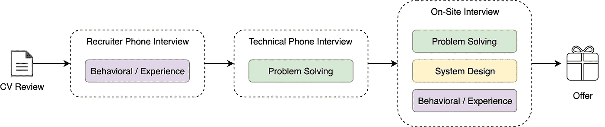
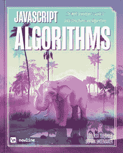

# 技术面试准备清单

> 原文：<https://itnext.io/technical-interview-preparation-checklist-b000125f1535?source=collection_archive---------8----------------------->

这篇文章是我试图总结常见的技术面试流程步骤，并从招聘人员那里收集一些有用的见解，这些见解通常会在面试前发送给申请人。这不是面试过程的全面指南，实际的面试步骤可能因公司而异。

# 面试流程概述

## 按时间排列的面试流程

常见的技术面试流程包括三个主要步骤:

1.  招聘人员电话面试 **当你被要求讲述你的经历并解释你的动机时。**
2.  **技术电话面试**，你将被要求实时解决一些技术问题。
3.  在公司办公室进行现场(面对面)面试，你将被要求解决技术和系统设计问题，并回答一些行为问题。

## 意义面试流程

所有面试步骤主要由以下三个组成部分组成:

1.  **解题**。这里主要关注的是你通过应用不同的算法方法和数据结构解决技术问题的能力。
2.  **系统设计**。这一个是关于你结合许多部分(框架、方法、数据库、微服务)和设计一个系统作为一个整体来成功解决某些任务的能力。
3.  **行为问题**关注你的经历、动机、领导力和软技能。

让我们继续，接触面试过程中的这 6 个方面。

# [按时间面试]介绍电话

招聘人员会介绍自己，并给你更多关于公司和你可能参与的项目的细节。你会被要求介绍你自己，并解释你在以前的项目中的职责。

通常只有你在过去 1-3 年里做的事情才是重要的。所以关注你最近的成就和责任。

从你最近的工作场所介绍你的副业项目、开源项目和生产项目。

这件事将通过电话来做。

要记住的事情:

*   熟悉工作描述，准备好关于工作的问题。
*   准备一份简短的自我介绍，包括你的个人资料、职业经历、资历和教育背景。
*   用具体例子。最有力的例子是基于工作的例子，但你也可以用学习或个人的例子。
*   如果你还没有理解面试官的问题，请他们重复一遍或者进一步解释。
*   了解公司，对公司的产品充满热情(了解公司在做什么)。
*   一般来说，如果你对这个职位或公司有任何疑问，请随时提问。

用清晰的方式解释你的经验例子。使用[星](https://en.wikipedia.org/wiki/Situation,_task,_action,_result)技术将帮助你:

*   *情景/任务* —描述你面临的情景/任务以及故事的背景。
*   *行动*——你采取了什么行动？
*   *结果* —你如何衡量这个项目的成功？取得了哪些成果？

## **📚链接探索**

*   [维基百科上的星术](https://en.wikipedia.org/wiki/Situation,_task,_action,_result)
*   [YouTube 上的明星技术](https://www.youtube.com/watch?v=0nN7Q7DrI6Q)
*   [面试中要问的 105 个聪明问题](https://careersidekick.com/questions-to-ask-the-interviewer/)

ℹ️ *️️Read 更多关于如何准备* ***行为*** ***面试*** *在下面这篇文章里。*

# 【按时间面试】技术电话面试

在电话面试中，你会有一个编码练习(或在线开发的任务)。

通话时长为 45-60 分钟。

有些面试会包括两个人。不要担心——那里将有一个纯粹的训练目的。

您需要使用网络摄像头。建议使用有线互联网和耳机，但不是必需的。您的计算机可能需要安装插件，所以在您打电话之前，请确保有足够的时间测试招聘人员将提供给您的链接。确保在平静的环境中接听电话。

您可能会被要求安装和/或使用特殊程序和服务，如:

*   [亚马逊钟声](https://aws.amazon.com/chime/)
*   [蓝战士](https://www.bluejeans.com/)
*   [Hangouts](https://hangouts.google.com/)
*   [Zoom.us](https://zoom.us/)
*   [Skype](https://www.skype.com/en/)
*   [码本](https://coderpad.io)或其他

**面试中的期待:**

*   使用白板(如果在现场)或笔记本电脑以及类似于 CoderPad 的服务(如果在远程)进行 45 分钟的初始访谈，回答 1-2 个编码问题。
*   您将测试您的问题解决和核心 CS 基本技能(理论、算法、数据结构、设计模式、递归、二叉树问题、斐波那契数列等)。)
*   你需要想出一个高效的、优化的、无错误的解决方案，用你最擅长的语言快速简洁地编写代码。
*   保持简单！如果你认为这是显而易见的，它很可能是。从一个简单的解决方案开始，然后考虑如何让它更有效率。

ℹ️*【️️read】更多关于如何准备* ***解题*** *面试下面这篇文章。*

# 【按时间面试】现场面试

对于现场，你通常有 4 到 5 次面试——至少 2 次严格聚焦于编码，1 次关于设计，1 次关于对话/编码。因此，本章开始时描述的所有三个构件基本上都将包括在内。

将会有一顿 45 分钟的午餐来打断你的一天——午餐很可能是和其中一位工程师一起吃的。请随意与工程师坦诚交流——他们不会提供反馈，但会回答你在面试中可能没有提出的任何问题/顾虑。

ℹ️ *阅读更多关于如何准备* ***问题解决、系统设计*** *和* ***行为*** *面试的下文。*

# 【按意义面试】解决问题面试

**一般提示:**

*   **解释** —面试官想了解你是如何思考的，所以在整个面试过程中解释你的思维过程和决策过程。记住他们不仅评估你的技术能力，也评估你如何解决问题。明确陈述假设，并与面试官一起检查假设，确保它们是合理的。
*   **澄清**——许多问题将被有意地开放，以提供对技术难题中你所重视的类别和信息的洞察。面试官希望看到你如何处理这个问题，以及你解决问题的主要方法。一定要把你的思考过程说出来，如果你需要澄清，可以随意问一些具体的问题。
*   改进——想办法改进你提出的解决方案。大声说出你对一个问题的最初想法是值得的。在很多情况下，你的第一个答案可能需要一些提炼和进一步的解释。如果有必要，从强力解决方案开始，并在此基础上改进
    ——让面试官知道你在做什么以及为什么。
*   **练习** —面试时你无法使用 IDE 或编译器，所以练习在纸上或白板上写代码。一定要测试你的代码，确保它容易阅读，没有错误。不要强调小的语法错误，比如给定方法使用哪个子串(例如，start、end 或 start、length)——只需选择一个并让你的面试官知道。

## **面试前**

**练习！练习！练习！**

给自己设定时间限制，因为速度在面试中很重要。

**问题举例:**

*   编写代码打印二叉树的每一“行”的第一个元素。
*   实施井字游戏
*   编写代码来显示给定字符串的排列数目和类型

您可以使用以下服务获取更多问题示例和可能的解决方案:

*   [LeetCode](https://leetcode.com/)
*   [采访位](https://www.interviewbit.com/practice/)
*   [GeeksForGeeks](https://www.geeksforgeeks.org/)
*   [黑客排名](https://www.hackerrank.com/)
*   [LintCode](https://www.lintcode.com/)
*   [欧拉项目编码问题](https://projecteuler.net/)

你可能还想阅读[破解编码面试](http://www.crackingthecodinginterview.com/)这本书，它将帮助你准备编码面试，类似于你将在整个面试过程中解决的问题。

**涵盖的主题:**

*   **编码**——你应该非常了解至少一种编程语言，最好是 C++、Java、Python、JavaScript、Go 或 C。你应该了解 API、面向对象的设计和编程、如何测试你的代码，以及提出代码的极限情况和极限情况。请注意，面试官将侧重于概念理解，而不是记忆。
*   **算法** —用自下而上和自上而下的算法处理问题。你应该知道算法的复杂性，以及如何改进/改变它。用于解决问题的算法包括排序(加上搜索和二分搜索法)、分治、动态编程/记忆、贪婪、递归或与特定数据结构相关的算法。了解 Big-O 符号(如运行时间),并准备好讨论 Dijkstra 和 A*等复杂算法。了解不同类算法的运行时间、理论限制和基本实现策略比记住任何给定算法的具体细节更重要。
*   **排序** —熟悉常用的排序函数，以及它们对哪种输入数据有效。从运行时间和所用空间的角度考虑效率。例如，在特殊情况下，插入排序或基数排序比一般的快速排序/合并排序/堆排序答案好得多。
*   数据结构 —你应该尽可能多的学习数据结构。最常用的数据结构是数组、链表、栈、队列、哈希集、哈希映射、哈希表、字典、树和二叉树、堆和图。您应该对数据结构了如指掌，并且知道每种数据结构倾向于使用什么算法。
*   **数学** —一些面试官会问一些基本的离散数学问题。在面试前花些时间复习(或自学)基础概率论和组合学的基础知识。你应该熟悉 n-choose-k 问题及其类似问题。
*   **图**——考虑一个问题是否可以用像距离、搜索、连通性、循环检测等图算法来解决。有三种在内存中表示图形的基本方式(对象和指针、矩阵和邻接表)——熟悉每种表示方式及其优缺点。你应该知道基本的图遍历算法，广度优先搜索和深度优先搜索。了解它们的计算复杂度、权衡以及如何在实际代码中实现它们。
*   许多编码问题都涉及到递归思维和潜在的递归解决方案编码。使用递归找到可以迭代解决的问题的更优雅的解决方案。
*   **面向对象设计**——你应该掌握一些常见和有用的设计模式的工作知识，并且知道如何以面向对象的方式编写软件，恰当地使用继承和聚合。你可能不会被要求描述具体的设计模式如何工作的细节，但是你必须为你的设计选择辩护。

## **面试期间**

**求解前:**

*   *不要直接进入编码*，花几分钟了解问题并提出任何澄清问题(但不要太长！).
*   *制定计划。小心不要在没有考虑程序的高层结构的情况下跳入代码。你不需要解决每一个细节(这对于更具体的问题来说是困难的)，但是你应该充分考虑这个问题。如果没有适当的计划，您可能会被迫浪费有限的时间来修改程序的重要部分。*
*   向你的面试官描述你的解决方案，了解他们对你的解决方案的看法。

**一边解决:**

*   *大声想出来*。编写代码时，向面试官解释你的思维过程。这有助于你更充分地传达你的解决方案，并给你的面试官一个纠正误解或提供高水平指导的机会。
*   将问题分解并定义抽象概念。招聘人员寻找的一项关键技能是通过将问题分解成可管理的子问题来处理复杂问题的能力。对于任何重要的事情，您都希望避免编写一个巨大的、单一的函数。随意定义助手函数、助手类和其他抽象来达成一个有效的
    解决方案。您也可以利用设计模式或其他编程习惯。理想情况下，您的解决方案将是分解良好的，因此易于阅读、理解并证明是正确的。
*   *优化*。主动向面试官建议优化的方法，并获得他们的反馈，以确保你试图做的事情不会过于复杂，并且是正确的，然后编码。

**你有解决方案。现在怎么办？**

*   *思考边缘案例。*自然，你应该努力寻找一个在所有可观察到的方面都正确的解决方案。有时，您的解决方案的核心逻辑会有缺陷，但更多时候，您唯一的缺陷是如何处理边缘情况。(现实世界的工程也是如此。)确保您的解决方案适用于您能想到的所有边缘情况。
*   逐句通过你的代码并测试它。检查您的工作的最好方法之一是模拟您的代码如何针对样本输入执行。举一个你之前的例子，确保你的代码产生正确的结果。这里有一个很大的警告:当在头脑中模拟你的代码如何运行时，你的大脑会倾向于投射它想要发生的事情，而不是实际上所说的发生的事情。尽可能不夸张地对抗这种倾向。
*   *重申复杂性*。根据你实际编写的代码，它与你最初的想法是相同的还是不同的？确保你同时考虑了空间和时间。
*   *解释你走的捷径。*如果你因为权宜之计而忽略了在“现实世界”中你会做的事情，请告诉我们你做了什么，为什么。例如，“如果我写这个是为了生产使用，我会在这里检查一个不变量。”因为面试是一个人工环境，这让他/她知道一旦你实际上在工作中，你将如何对待代码。

**记住:**

*   面试官只能根据你写的代码来评价你。
*   谈谈你在整个面试过程中在做什么。如果你需要安静下来思考，那很好——只要让面试官知道就好。
*   如果你正在想办法解决你面前的问题，大声想出来，因为工程师想知道你是如何解决和解决问题的。
*   如果面试官给了你一些改进代码的建议，那就接受它们，并按照它们去做。与面试官一起调整和解决问题，以显示你的思维过程和解决问题的能力，这是很好的。
*   与你的面试官讨论最初的想法和解决方案，这将有助于你澄清任何模糊之处。
*   接受面试官的暗示，展示你的思维过程和解决问题的能力。
*   一般来说，要避免有很多边缘案例或者巨大的 if/else if/else 块的解决方案。在迭代和递归之间做出决定总是一个重要的步骤。
*   思考不同的算法和算法技术(排序、分治、动态编程/记忆、递归)
*   考虑数据结构，尤其是最常用的数据结构(数组、堆栈/队列、Hashset/Hashmap/Hashtable/Dictionary、树/二叉树、堆、图、Bloom Filter 等)。)
*   不要担心死记硬背，比如运行时或 API/本机调用。知道如何快速计算出大概的运行时间是很好的，但是你写的代码更重要。
*   你会被问到 O(内存)约束，你正在编写的算法的复杂性和它的运行时间——O(N)，O(N)等等
*   重要——考虑在整个面试中测试你的代码
*   确保你复习了递归。
*   确保你知道你的基本情况是什么。谈论或实现动态编程解决方案可以加分。
*   在白板上练习编码。

## 面试后

试着为面试官准备 1-2 个问题。

## **📚探索链接**

**书籍**

*   [破解编码面试](https://www.amazon.com/Cracking-Coding-Interview-Programming-Questions/dp/0984782850)
*   [算法介绍](https://books.google.com.ua/books/about/Introduction_to_Algorithms.html?id=VK9hPgAACAAJ&hl=en&redir_esc=y)
*   [编程面试曝光](https://books.google.com.ua/books/about/Programming_Interviews_Exposed.html?id=9_by-rpCSSUC&hl=en&redir_esc=y)
*   [编程珍珠](https://books.google.com.ua/books/about/Programming_Pearls_2_E.html?id=vyhrriC6qcEC&hl=en&redir_esc=y)

*你也可以查看* [*JavaScript 算法*](https://www.newline.co/javascript-algorithms) *书籍*

[JavaScript 算法](https://www.newline.co/javascript-algorithms)书

**课程**

*   [算法(第一部分)](https://www.coursera.org/learn/algorithms-part1)
*   [算法(第二部分)](https://www.coursera.org/learn/algorithms-part2)

**解决问题**

*   [LeetCode](https://leetcode.com/)
*   [采访位](https://www.interviewbit.com/practice/)
*   [GeeksForGeeks](https://www.geeksforgeeks.org/)
*   [黑客排名](https://www.hackerrank.com/)
*   [LintCode](https://www.lintcode.com/)
*   [欧拉项目编码问题](https://projecteuler.net/)
*   [CodeJam:练习&学习](https://code.google.com/codejam/past-contests)

**杂项**

*   [JavaScript 算法和数据结构](https://github.com/trekhleb/javascript-algorithms)
*   [寻找编码面试的动态编程模式](https://www.educative.io/collection/5668639101419520/5633779737559040?authorName=Design%20Gurus)
*   [谷歌:我们如何招聘](https://careers.google.com/how-we-hire/)
*   [采访@谷歌](https://careers.google.com/how-we-hire/interview/)
*   [谷歌技术开发指南](https://techdevguide.withgoogle.com/)
*   为你在脸书的软件工程面试做准备
*   得到脸书的那份工作
*   [五个基本的手机屏幕问题](https://sites.google.com/site/steveyegge2/five-essential-phone-screen-questions)
*   我如何在脸书找到工作的故事
*   在脸书参加软件工程面试，我应该准备和参考哪些资源？
*   [脸书面试问题](https://www.careercup.com/page?pid=facebook-interview-questions)
*   [涵盖](https://docs.google.com/document/d/1yMBDTeM49rm8Yni-BYzxakwSW3Ce_MKum65s6wEPQic/edit)的算法和数据结构
*   [破解 JavaScript 面试的完美指南(一个开发者的视角)](https://medium.com/dev-bits/a-perfect-guide-for-cracking-a-javascript-interview-a-developers-perspective-23a5c0fa4d0d)
*   [科技面试手册](https://github.com/yangshun/tech-interview-handbook)
*   [30 分钟引导你迎接下一次编码面试](https://medium.freecodecamp.org/coding-interviews-for-dummies-5e048933b82b)
*   [技术面试备忘单](https://hackernoon.com/the-tech-interview-cheatsheet-8e28d94f5f04)
*   [探寻面向对象设计面试](https://www.educative.io/collection/5668639101419520/5692201761767424?authorName=Design%20Gurus)
*   [牛逼的面试问题](https://github.com/MaximAbramchuck/awesome-interview-questions)
*   [与同行练习现场面试](https://www.pramp.com/#/)

# 【按意采访】系统设计

你将需要设计一个系统或产品，这个问题将是一个广泛而模糊的问题，你需要创造一些端到端的东西，可以扩展。你不应该假设任何事情。你应该明确这些要求，招聘人员希望你能在整个面试中引导话题。大声说出来，说这是你正在做的/为什么/你的理由。应该是你的设计，而不是你一半，面试官一半。试着涵盖广度和深度，你将需要谈论高层次的概念和相关的细节。

面试官不指望你知道特定领域的疯狂算法(比如四叉树或 Paxos)。但是他们确实希望您知道您有各种各样的权衡，比如一致性、可用性、分区等。他们还期望您使用现代计算机，并且知道 RAM、硬盘、网络等的吞吐量/容量的大概概念。

您应该熟悉的一些主题:

*   *并发*。你了解线程、死锁和饥饿吗？你知道如何并行算法吗？你明白一致性和连贯性吗？
*   *联网*。你大致了解 IPC 和 TCP/IP 吗？您知道吞吐量和延迟之间的区别，以及两者在什么情况下是相关因素吗
*   *抽象*。你应该了解你正在构建的系统。您大致了解操作系统、文件系统和数据库是如何工作的吗？您了解现代操作系统中的各种级别的缓存吗？
*   *现实表现*。你应该熟悉你的电脑所能做的一切事情的速度，包括 RAM、磁盘、SSD 和你的网络的相对性能。
*   *估计*。估计，尤其是以信封背面计算的形式，是很重要的，因为它可以帮助您缩小可能的解决方案列表，只列出可行的解决方案。然后，您只需要编写一些原型或微基准。
*   *可用性和可靠性*。您是否在思考事情是如何失败的，尤其是在分布式环境中？你知道如何设计一个系统来应对网络故障吗？你懂耐久性吗？
*   *数据存储* (RAM 与持久存储、压缩、字节大小)
*   [*上限定理*](https://en.wikipedia.org/wiki/CAP_theorem)
*   *字节数学*

请注意，我们并不期望您成为所有这些方面的专家，但是您应该对它们有足够的了解来权衡设计考虑，并知道何时咨询专家。

## 如何学习

为了练习，拿任何一个知名的应用程序，想象你为一个竞争对手工作。你的工作是找出:

1.  他们大部分钱花在哪里(计算？人？带宽存储？)
2.  他们系统的根本瓶颈。回答这两个问题必然会迫使你思考一个系统实际上是如何实现的。只回答成本和瓶颈迫使你关注重要的领域，而不是设计的乏味细节。

例如，YouTube 在带宽上花费了大量资金，其次是在存储和计算上。另一方面，它们的长尾流量模式意味着它们的根本瓶颈是随机磁盘寻道。网飞也是一个带宽猪，但他们的大多数流量是在晚上(当它便宜的时候)，他们的视频库要小得多，所以磁盘寻道可能根本不是问题。在一张纸上算出上述问题，然后思考分解它们的方法。

也许最好的学习方法是解决下面提到的问题，并思考解决这些问题的方法。在[钻研系统设计面试](https://www.educative.io/collection/5668639101419520/5649050225344512)课程中，你可能会发现很多如何做的例子。

**样题:**

*   设计一个新闻反馈系统。
*   加快此移动应用程序的速度。
*   实施广告定位。
*   设计谷歌照片的后端。
*   设计一个网络爬虫。
*   设计一个键值存储。
*   设计搜索引擎。
*   构建一个全球视频分发系统。
*   建立脸书聊天。

**一个好的设计表明你:**

*   清楚的理解问题，用逻辑的方式分解。
*   考虑一下高层次的设计。
*   提出一个系统设计方案，将问题分解成可以独立构建的组件。
*   在系统扩展时识别瓶颈，找出设计中的漏洞。
*   考虑所有相关的权衡。
*   了解当需求发生变化时如何调整解决方案。
*   画出清晰描述系统中不同组件之间关系的图表。
*   计算使该系统工作所需的物理资源。

## 解决系统设计问题的方法

**第一步:了解需求**

花 1-2 分钟阐明需求。要么给面试官举个例子，说明他们在问什么(例如，“为了确保我理解了这个问题，我将设计新闻订阅服务，所以我需要考虑诸如“订阅中显示什么”、“以什么顺序显示”、“隐私”、“延迟”、“将系统扩展到数十亿个请求”、“冗余”等)。—你是这个意思吗”。或者，你可以向他们要一个他们希望你设计的产品或功能的例子。在此停留不超过 1-2 分钟。

一些进一步的例子:

*   对运行时间有什么要求吗(在线与离线路径)？
*   用户在哪里？
*   有多少用户？
*   存储要求？
*   数据访问或保留要求？
*   安全要求？
*   移动 vs Web？
*   有我们需要对外公开的 API 吗？有集成选项吗？

最后，在继续之前:问一下哪些需求比其他需求更强？例如，是否有关于数据一致性的强烈要求？潜伏？可靠性？数据隐私？你能写一份优先顺序表吗？不要在这里花太多时间，但至少要问一些问题——了解设计系统时存在哪些权衡是很重要的。例如，当速度和一致性非常重要时，您应该考虑同步调用。如果响应中的一些延迟和变化是可以容忍的，那么异步/队列是可以接受的。

**第二步:了解有助于你评估的事实/数据**

有用的资源

*   [每个程序员都应该知道的延迟数字](https://gist.github.com/jboner/2841832)(正文)
*   每个程序员都应该知道的延迟数字

这更清楚地表明，您希望从 SSD 读取数据，而不是从磁盘读取数据，当然也不会进行多次数据中心往返。您还需要小心互斥和对共享资源的访问。

现在，你需要估计你需要的系统的规模——甚至在你开始设计它之前。这里有几个问题要问:

*   我们会收到多少 API 请求？(e..什么是 QPS？)
*   这些请求将返回什么数据？(字节或兆字节或千兆字节)
*   会有读写操作还是只有读操作？

很有可能，你会得到一个很大的数字。但是最好表明你明白，并不是所有的问题都需要用一个分布式的、可扩展的系统来解决(有时事情可以放在一台机器上)。

**第三步:深入探索/设计**

有很多事情你可能要考虑一下。您可以在白板上写下适当的概念，例如:

*   要求，
*   缩放，
*   实体设计，
*   API 设计，
*   数据存储，
*   安全/隐私，
*   记录/分析，
*   可靠性。

这些是任何设计都需要涵盖的许多概念。你可能无法了解所有的问题，但重要的是你要展示出你了解“大局”。把这些话写下来也有助于加快面试的速度，帮助你记住尽可能多的概念。

在思考**实体建模和设计**(系统中会有哪些对象，它们之间有什么关系？)，写下几个对象以及它们之间的关系。设计 API 时，请确保您指出外部和内部开发人员都可以使用该 API(例如，可以由移动应用程序、web 应用程序使用，并打包为面向外部开发人员的 SDK)。想想调用这个 API 会发生什么？这里有两篇关于它的优秀文章:

*   [设计新闻反馈系统(上)](http://blog.gainlo.co/index.php/2016/03/29/design-news-feed-system-part-1-system-design-interview-questions/)
*   [设计新闻反馈系统(下)](http://blog.gainlo.co/index.php/2016/04/05/design-news-feed-system-part-2/)

写出**整体系统拓扑**。在高层次上，它几乎总是看起来像这样。

**数据存储**(数据在客户端和服务器上的物理存储方式，以及访问方式)。您几乎肯定会设计一个分布式系统，所以您会想如何分布它(有时这被笼统地称为“如何分割解决方案”)。所有这一切意味着——当用户向您发出请求时，您将如何决定将请求发送到哪个后端服务器？上图中的“负载平衡器”是如何工作的？你会根据用户名把它发送到不同的服务器吗？地理位置？两者的结合？这里重要的是考虑如何平衡请求。

再想想**缓存**:在客户端和服务器端？您将缓存哪些数据？为什么呢？如何使缓存失效？(会以时间为单位吗？如果有，多长时间？)

**安全/隐私**

*   谁能看到什么？
*   权限呢？
*   但是员工呢？他们可以访问哪些数据？这里是否引入了新的数据类型？
*   API 需要任何特殊的键才能工作吗？用户是否将向外部公司授予权限？如果是，我们将如何监控滥用情况

**日志分析**

*   我们关心什么指标？我们将如何记录这些数据，以便可以计算这些指标？
*   我们将数据保留多长时间？

**可靠性**

*   我们需要对引入的新服务进行监控
*   我们需要能够测量延迟
*   我们需要发布服务水平协议和指标

## 📚探索链接

**杂项**

*   [钻研系统设计面试](https://www.educative.io/collection/5668639101419520/5649050225344512) —本课程包含了对常见系统设计面试问题的深入而清晰的解释
*   [系统设计入门](https://github.com/donnemartin/system-design-primer) —大规模学习系统资源的有组织集合。
*   [如何赢得系统设计面试](https://www.palantir.com/2011/10/how-to-ace-a-systems-design-interview/) —系统设计面试中值得了解的概念总结。
*   [interview bit](https://www.interviewbit.com/courses/system-design/)上的系统设计教程——涵盖大量理论的结构化练习，打包成具体的练习。
*   [系统设计备忘单](https://gist.github.com/vasanthk/485d1c25737e8e72759f)
*   [Bitly:构建一个每月处理 60 亿次点击的分布式系统的经验教训](http://highscalability.com/blog/2014/7/14/bitly-lessons-learned-building-a-distributed-system-that-han.html)
*   [进行系统设计面试](https://www.educative.io/collection/5668639101419520/5649050225344512?utm_source=google_ars&utm_medium=cpc)
*   [上限定理](https://en.wikipedia.org/wiki/CAP_theorem)

**谷歌论文**

*   [谷歌文件系统](https://ai.google/research/pubs/pub51)
*   [Bigtable](https://ai.google/research/pubs/pub27898)
*   [MapReduce](https://ai.google/research/pubs/pub62)
*   [谷歌扳手](https://ai.google/research/pubs/pub39966)
*   [谷歌小胖](https://ai.google/research/pubs/pub27897)

# 【按意义面试】行为面试

许多人都犯了没有准备这次面试的错误。

这里一个很好的起点可能是思考[亚马逊领导原则](https://www.amazon.jobs/en-gb/principles)，并从你过去的职业中拿出一些具体的情况作为每个原则的例子。用清晰的方式解释你的经验例子。使用[星](https://en.wikipedia.org/wiki/Situation,_task,_action,_result)技术将帮助你。

**以下是一些行为问题的例子:**

*   告诉我你面对一个有许多可能解决方案的问题的时候。问题出在哪里？你是如何决定行动方案的？这个选择的结果是什么？
*   你什么时候冒过险，犯过错误或者失败过？你是如何回应的，你从那次经历中学到了什么？
*   描述你领导一个项目的时候
*   在一个特定的项目中，当你需要激励一群人或鼓励合作时，你会怎么做？
*   你是如何利用数据来制定策略的？
*   你能举一个你收到的有价值的反馈的例子吗？
*   描述你在团队中有分歧或冲突的时候
*   你的同事会如何描述你？
*   你能描述一个你不得不做一个你不同意的决定的情况吗？
*   描述一下你最近犯的一个技术错误？你学到了什么？
*   你必须解决的最困难/最具挑战性的问题是什么？
*   如果事情不按计划进行，你如何推进你自己/你的项目？
*   你如何寻找机会？
*   你如何在团队内部以及与其他团队沟通？
*   你最大的失败是什么？你从这件事中学到了什么？
*   你什么时候收到建设性的反馈？你对此有什么反应？

当你回答问题时，你应该把重点放在所提的问题上，确保你的回答结构良好，并在适用的情况下使用指标或数据提供例子。尽可能参考最近的情况。

*   我们将考察你的领导经验，这可能包括许多方面，从技术领导、项目或产品方向、做出架构和设计决策到指导工程师和人员管理。
*   面试官会对你的激情和动机感兴趣。
*   面试官会看你现在的角色，你在做什么，你的所有权和你产生的影响。
*   冲突管理——你如何处理与同事和经理的冲突和分歧。
*   你从过去的错误中学到了什么，你采纳了反馈并采取了行动。
*   面试官会对那些不顺利的事情感兴趣，以及你从经历中学到了什么。
*   面试官会对你如何应对我们的无组织环境感兴趣，并想出你自己的工作。

## 📚探索链接

*   [亚马逊领导原则](https://www.amazon.jobs/en-gb/principles)
*   [面试中要问的 105 个聪明问题](https://careersidekick.com/questions-to-ask-the-interviewer/)

*我希望这些汇总信息对你有用。祝你下次面试好运！*

 [## Oleksii Trekhleb (@Trekhleb) |推特

### Oleksii Trekhleb 的最新推文(@Trekhleb)。@EPAMSYSTEMS 的首席软件工程师。正在创建全堆栈…

twitter.com](https://twitter.com/Trekhleb)