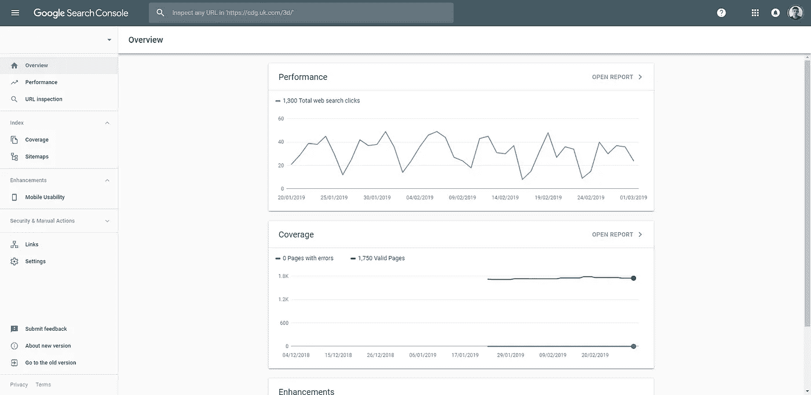
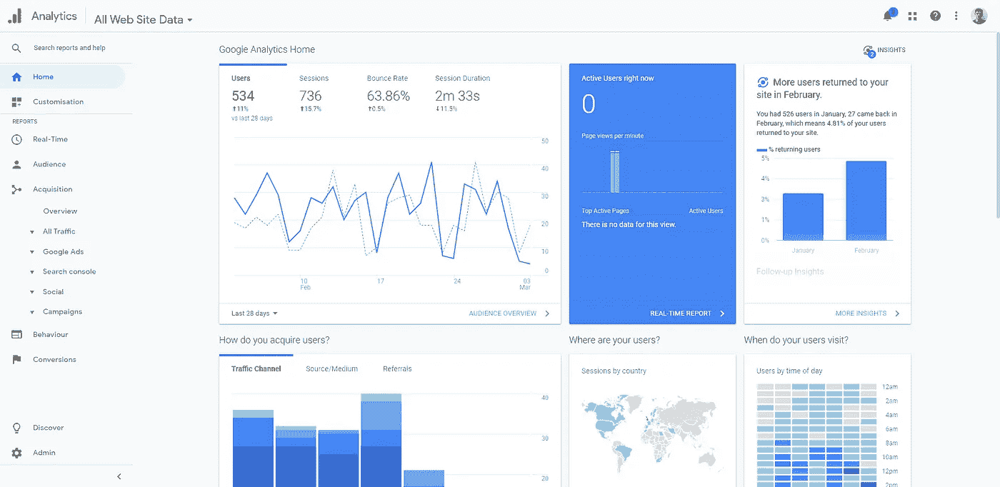
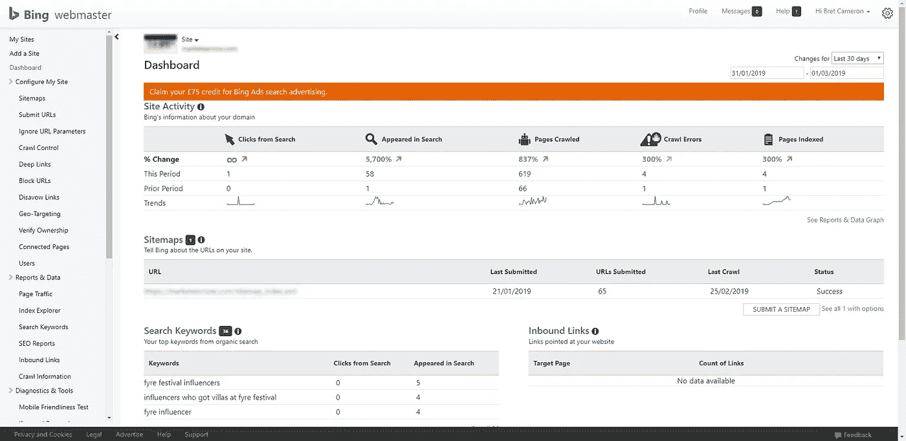
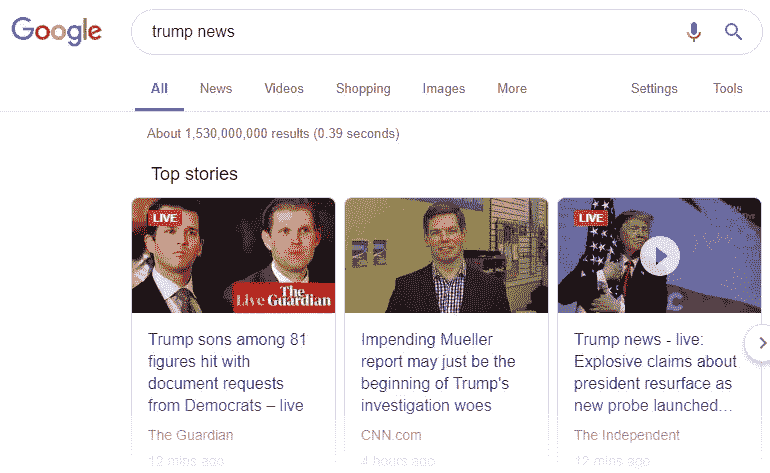
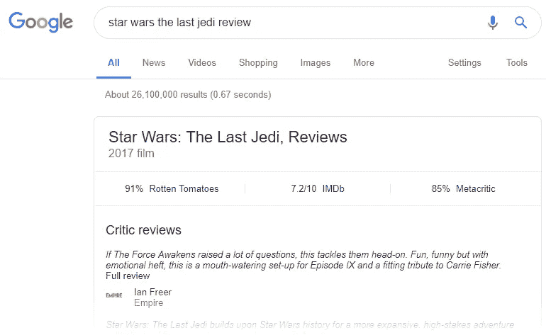
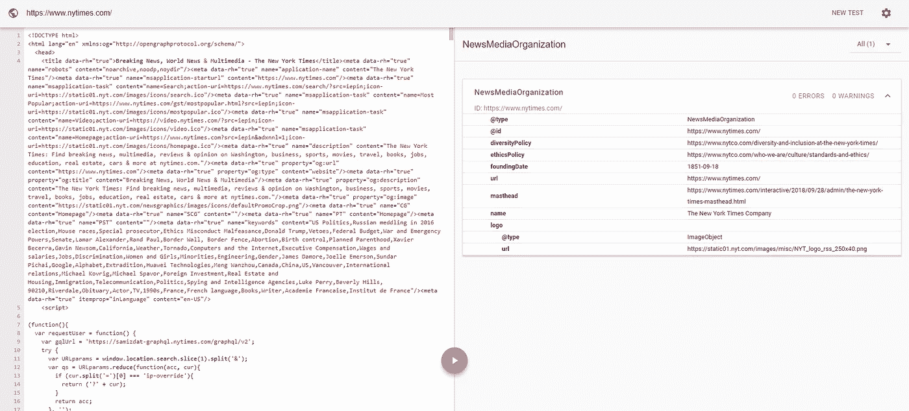
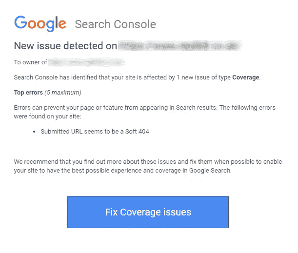
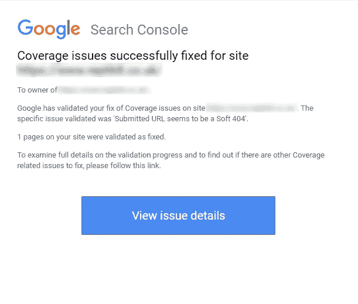

# 开发者技术搜索引擎优化:帮助你在谷歌排名更高的清单

> 原文：<https://itnext.io/technical-seo-for-developers-a-checklist-to-help-you-rank-higher-on-google-850c53e0c063?source=collection_archive---------6----------------------->

## 许多 SEO 策略可以被任何人采用，但是一些策略受益于访问和理解网站代码库的能力。这些是开发者可以采取的步骤，以确保尽可能多的人发现他们的网站。


SEO 或“搜索引擎优化”是确保一个网站在谷歌和必应以及其他搜索引擎，如中国的百度或俄罗斯的 Yandex 的*免费*搜索结果中排名尽可能高的过程。

每当有人搜索一个单词或短语时，这些搜索引擎都使用自己的一套算法对网站进行排名。这些算法是保密的，因为除了允许其他公司模仿他们的技术之外，他们不希望网站所有者玩弄系统，仅仅因为他们采用了特定的策略而排名更高。

在一个理想的世界里，只有最好的和最相关的内容才会在每次搜索中排名第一。然而，这不是一项简单的任务，尤其是因为如果没有一些指针，算法很难理解网站的内容。这些指针中有许多来自内容本身，但有一些属于开发人员的职权范围:这就是技术 SEO 的用武之地。

# 清单

下面的清单给你一个快速浏览步骤，你可以采取这些步骤来提高你的网站的技术搜索引擎优化。在本文的其余部分，我们将更详细地研究每种策略。

我们现在来看看为什么这些步骤对 SEO 很重要，以及如何实现每一个步骤，从谷歌和微软的核心工具开始，了解和优化您的搜索数据。

# 设置 Google 搜索控制台

谷歌搜索控制台非常有用，原因有几个:

*   它让你知道你的网站有多少未付费点击。
*   它会提醒你网站中的任何错误，这些错误可能会对你在搜索结果中的位置产生负面影响。
*   它会检查你网站上的每个页面是否都针对手机进行了正确的优化。
*   它允许你上传 XML 网站地图，这有助于谷歌理解你的网站导航，并在搜索结果中显示部分预览。我们将在下面详细讨论这一点。

## 要设置 Google 搜索控制台，请单击下面的链接:

 [## 开始使用 Google 搜索控制台

### 搜索控制台工具和报告可以帮助您测量站点的搜索流量和性能，解决问题，等等。

search.google.com](https://search.google.com/search-console/about?hl=en&utm_source=wmx&utm_medium=wmx-welcome) 

注册后，你会得到一个独特的代码，放在你网站的`<head>`标签中，就像这样:

```
*<!-- Google Search Console -->* <meta name="google-site-verification" content="+nxGUDJ4QpAZ5l9Bsjdi102tLVC21AIh5d1Nl23908vVuFHs34="/>
```



谷歌搜索控制台的仪表板截图，显示了我管理的一个网站的数据。

# 设置谷歌分析

谷歌分析是了解网站流量的事实上的 T4 工具。它有大量有用的功能，可以帮助你更多地了解你的受众是谁，他们是如何发现你的网站的，以及他们在网站上做什么。

一旦你建立了它，任何人——开发者或其他人——都可以根据谷歌分析收集的数据进行优化，不仅是为了 SEO 的目的，也是为了更广泛的营销目标，如提高转化率。

## **要设置 Google Analytics，请点击下面的链接:**

[](https://developers.google.com/analytics/devguides/collection/) [## 开始使用谷歌分析

### API 和 SDK 收集和发送数据到谷歌分析。

developers.google.com](https://developers.google.com/analytics/devguides/collection/) 

如果你不确定选择什么选项，最常见的是 *gtag.js* 。为此，您需要在站点的结束标签`</head>`之后立即插入一个脚本标签，如下所示。用您的唯一 ID 替换`GA_TRACKING_ID`。

```
<!-- Global Site Tag (gtag.js) - Google Analytics -->
<script async src="https://www.googletagmanager.com/gtag/js?id=GA_TRACKING_ID"></script>
<script>
  window.dataLayer = window.dataLayer || [];
  function gtag(){dataLayer.push(arguments);}
  gtag('js', new Date());
  gtag('config', 'GA_TRACKING_ID');
</script>
```



Google Analytics 仪表板的屏幕截图，显示了我管理的另一个网站的数据。

# 可选:连接谷歌分析和谷歌搜索控制台

默认情况下，Google Analytics 和 Google Search Console 是独立的服务，但是将它们结合起来可以让你在 Analytics dashboard 中看到来自 Search Console 的数据。

只需几个步骤，您就可以将它们整合在一起:

*1。登录您的****Google Analytics****账户。
2。在左侧工具条上，点击* ***采集*** *，然后搜索控制台* ***。
3。*** *点击按钮* ***设置搜索控制台数据共享*** *。
4。选择您的搜索控制台帐户，然后单击* ***保存。***

# **可选:设置 Bing 网站管理员工具**

你是否觉得有必要给你的网站添加 Bing 网站管理员工具可能取决于它的大小。[2019 年 2 月，必应的搜索流量市场份额仅为 2.4%，而谷歌的份额为 92.9%。](http://gs.statcounter.com/search-engine-market-share)

尽管如此，微软的 Bing 是世界上第二大搜索引擎，在你的 SEO 工具套件中包含 Bing 当然不会有什么坏处。此外，网站管理员工具有一些自己的有用功能，包括一个上传 XML 网站地图到 Bing 的地方，一个关键字研究工具，和一个“SEO 分析器”(目前处于测试模式)，它可以帮助你遵循最佳实践。

## 要设置网站管理员工具，请单击下面的链接:

[](https://www.bing.com/toolbox/webmaster/) [## 开始使用 Bing 网站管理员工具

### 登录或注册 Bing 网站管理员工具，提高您网站的搜索性能。

www.bing.com](https://www.bing.com/toolbox/webmaster/) 

类似于谷歌搜索控制台，你需要在你的网站`<head>`标签中添加一些代码，就像这样:

```
*<!-- Bing Webmaster -->* <meta name="msvalidate.01" content="FED2AB6487024C823AB7433FG2F01D63" />
```



Bing 网站管理员面板的截图，显示了我的一个新网站的数据。看起来我有一些爬行错误要修复！

# 获取 SSL 证书

SSL 代表“安全套接字层”。它用于在 web 服务器和浏览器之间建立加密链接，并确保在 web 服务器和浏览器之间传递的任何数据都是保密的。

你可以判断一个网站是否有 SSL 证书，因为 URL 是以`HTTPS://`而不是`HTTP://`开头的。谷歌已经声明网络安全是其首要任务之一，因此一个网站是否有 SSL 证书已经成为其搜索算法的排名信号。因此，强烈建议您为您的站点获取一个 SSL 证书。

越来越多的，`HTTPS`正在成为网络上的标准，你的网站可能已经有了 SSL 证书。但是如果没有，找到如何得到一个的最好的地方是使用谷歌的官方指南。


图片来源:[派拉蒙网站](https://paramountweb.com/ssl-certificate-nigeria/)

# 创建 robots.txt 文件

搜索引擎使用爬虫——有时被称为“机器人”、“机器人”或“蜘蛛”——来收集互联网上网站的信息。提高技术搜索引擎优化的一部分包括控制你给这些爬虫的信息。

爬虫每次访问一个网站，都会寻找一个名为`robots.txt`的文件。该文件主要用于告诉爬虫程序哪些页面*不*要爬行。例如，您可能不希望爬网程序访问只能由已登录用户访问的内容。为此，您只需编写`Disallow:`，后跟要忽略的 URL 字符串，例如:`Disallow: /dashboard/`。

您还可以指定一个用户代理，允许您为特定的爬虫定义特定的行为。所以，比如谷歌爬虫的一系列规则应该以`User-agent: googlebot`开头，而必应爬虫的规则应该以`User-agent: bingbot`开头。

要为除了您已经命名的用户代理之外的所有用户代理指定规则，您可以使用`User-agent: *`。一个简单的`robots.txt`文件可能如下所示:

```
User-agent: *
Crawl-delay: 120
Sitemap: /sitemap.xml
Disallow: /dashboard/
Disallow: /static/
Disallow: /api/
Disallow: /embed/
```

> 注意:标签`Crawl-delay: 120`要求爬虫在爬行我们的站点之前等待 120 毫秒。

它可能会保护敏感页面，但是`robots.txt`与搜索引擎优化有什么关系呢？如示例所示，我们可以使用`robots.txt`将他们引导到您的站点地图。

# 创建 XML 站点地图

XML 站点地图允许搜索引擎的网络爬虫理解你的网站的布局，并且更容易地导航它。如果你想让谷歌显示你网站的链接，即指向用户特定页面的副标题，那么网站地图也是一个非常有用的工具。


这个截图显示了 GatsbyJS 的搜索结果中的四个站点链接

XML 只是一种标记语言，通常用于表示数据结构。不像`robots.txt`，它的名字是固定的，你可以随意命名你的站点地图，尽管`sitemap.xml`是最常见的。

有许多方法可以自动创建 XML 站点地图。许多 CMS 系统都有插件来完成这项工作(比如 WordPress 的 [Yoast](https://yoast.com/wordpress/plugins/seo/) ，React 的 [XML Sitemap 模块](https://www.npmjs.com/package/react-router-sitemap)。和以往一样，[谷歌有一些关于构建网站地图的有用建议，包括一些不常用的格式](https://support.google.com/webmasters/answer/183668?hl=en)。

如果你想手动创建你的站点地图，或者你只是想了解正在发生的事情，下面是你的 XML 代码看起来像一个只有一个 URL 的站点:

```
<?xml version="1.0" encoding="UTF-8"?>

<[urlset](https://www.sitemaps.org/protocol.html#urlsetdef) >

   <[url](https://www.sitemaps.org/protocol.html#urldef)>
      <[loc](https://www.sitemaps.org/protocol.html#locdef)>http://www.example.com/</loc>
      <[lastmod](https://www.sitemaps.org/protocol.html#lastmoddef)>2019-03-04</lastmod>
      <[changefreq](https://www.sitemaps.org/protocol.html#changefreqdef)>daily</changefreq>
      <[priority](https://www.sitemaps.org/protocol.html#prioritydef)>1.2</priority>
   </url>

</urlset></urlset>
```

为了确保你的站点地图被抓取，把它作为一个页面上传到你的站点，并包含在你的`robots.txt`文件中，如上所述。你也可以分别使用[搜索控制台](https://support.google.com/webmasters/answer/7451001)和[网站管理员工具](https://support.bigcommerce.com/s/article/Bing)将你的网站地图直接提交给 Google 和 Bing 这是检查你的站点地图是否工作的有效方法，因为这些服务会指出是否有任何错误。

# 添加结构化数据以获得丰富的结果

下图是“丰富的结果”或“丰富的片段”的示例:



在许多方面，丰富的结果是你希望从 SEO 中得到的最好结果。它们比页面上的其他结果更引人注目，据报道，[特色片段(页面顶部优先显示的单个片段)的页面浏览量增加了 500%以上](https://searchengineland.com/seo-featured-snippets-leads-big-gains-236212)。

但是让你的网站获得丰富的结果是困难的。对于任何给定的搜索词，你不仅需要进入前几个结果的行列，而且甚至有资格获得丰富的结果，你需要使用结构化数据标记页面上的某些元素。

结构化数据有几种不同的格式，它允许谷歌和其他搜索引擎更好地理解你的页面内容。不管是哪种格式，每种结构化数据格式都有相同的基本定义，这些定义可以在[schema.org](https://schema.org)上找到。

## JSON-LD

向网站添加结构化数据的推荐方法是使用 JSON-LD，因为它最容易实现和维护。

您只需使用`<script type="application/ld+json"> … </script>`将它作为脚本插入到您的每个 HTML 页面中。

下面是 JSON-LD 在实践中的样子。我从奥斯卡官网上用的 JSON-LD 里取了一小段:

```
<script type="application/ld+json">
  {
    "[@context](http://twitter.com/context)":"[http://schema.org/](http://schema.org/)",
    "[@type](http://twitter.com/type)":"Organization",
    "name":"Oscars",
    "url":"[https://oscar.go.com](https://oscar.go.com)",
    "logo": 
      {
        "[@type](http://twitter.com/type)":"ImageObject",
        "url":"[https://oscar.go.com/images/91Oscars-Logo.png](https://oscar.go.com/images/91Oscars-Logo.png)",
        "width":166,
        "height":48
      },
    "sameAs": ["//[www.facebook.com/TheAcademy](http://www.facebook.com/TheAcademy)", "//instagram.com/theacademy/", "//twitter.com/theacademy", "//[www.youtube.com/user/Oscars](http://www.youtube.com/user/Oscars)", "//plus.google.com/+Oscars/posts"]
  }
</script>
```

你在上面看到的按键——比如`"@context"`、`"@type"`和`"name"`——都是在[schema.org](https://schema.org/docs/full.html)网站中定义的。

许多不同类型的内容都有预定义的类别，每个类别都有自己的标准属性集。例如，参见[文章](https://schema.org/Article)、[电影](https://schema.org/Movie)和[照片](https://schema.org/Photograph)。另一个有用的网站，[https://jsonld.com/](https://jsonld.com/)，包含许多 JSON-LD 标记的例子。通常，如果你在你的网站的利基中检查一个流行的网站，你将能够看到他们在他们的源代码中使用的标记，并使用它作为你自己网站的灵感。

## 向 JSON-LD 添加动态值

通常，您会希望向 JSON-LD 添加动态数据。具体如何做将取决于您在站点上使用的语言，以及他们喜欢如何创建 JSON 对象。

对于面向对象的语言，通常的方法是用您选择的语言创建一个动态对象，然后使用内置方法将其转换为 JSON，比如 PHP 中的`json_encode()`、Python 中的`json.loads()`或 JavaScript 中的`JSON.stringify()`。

## 微数据和 RDFa

微数据和 RDFa 是 JSON-LD 的替代品。它们实现起来有点耗时，尽管微数据曾经是谷歌的首选方法，但他们现在推荐 [JSON-LD](https://developers.google.com/search/docs/guides/intro-structured-data#markup-formats-and-placement) 。

因此，我不会详细讨论这些替代方案。如果你想了解他们的更多信息，[点击这里了解微数据](https://schema.org/docs/gs.html)，而[点击这里了解 RDFa](https://en.wikipedia.org/wiki/RDF_Schema) 。

## 检查您的结构化数据是否正常工作

为了确保你的结构化数据被 Google 选中，你可以使用他们的[结构化数据测试工具](https://search.google.com/structured-data/testing-tool)。只需插入您的 URL 或粘贴您的代码，测试工具就会告诉您它可以读取什么，以及您应该修复的任何错误或警告。



纽约时报的主页，使用谷歌的结构化数据测试工具进行分析。

# 让你的网站越快越好

[自 2010 年](https://webmasters.googleblog.com/2010/04/using-site-speed-in-web-search-ranking.html)以来，谷歌一直使用速度作为搜索信号，拥有一个更快的网站也有相关的 SEO 好处:众所周知，你的网站加载越快，用户在上面停留的时间越长，他们就越有可能点击进入不同的页面。

这些指标——用户在你的网站上停留的时间长度和点击率——都是排名信号。

这个主题可以是一篇文章，甚至可以是一整本书，但是这里有一些加速方法可以帮助你开始:

*   优化图像尺寸，使用 lazyloading。
*   升级到更快的 DNS 提供商和更快的主机提供商。
*   用诸如 [GZIP](https://www.gnu.org/software/gzip/) 之类的工具压缩你的文件。
*   针对网站的构建版本缩小文件。
*   通过只在必要的地方使用脚本和插件，减少对服务器的 HTTP 请求数量。

# 确保你的网站是移动友好的

2018 年，[手机约占所有网络流量的 50%](https://www.statista.com/statistics/277125/share-of-website-traffic-coming-from-mobile-devices/)。2018 年 3 月，[谷歌宣布遵循其移动最佳实践的网站将迁移到移动优先列表](https://webmasters.googleblog.com/2018/03/rolling-out-mobile-first-indexing.html)。这意味着，如果你的网站没有针对移动设备进行优化，那么你在互联网上的访问量将会减少一半。

要做到这一点，你需要确保你的布局在移动设备上易于阅读，没有任何元素遮挡其他元素或从屏幕上消失。谷歌还坚持认为**你的移动网站应该包含和桌面网站相同的内容**——这包括结构化数据和元数据，以及你网站上的可视内容。

要了解更多信息，并查看 Google 推荐的完整列表，请单击下面的链接:

[](https://developers.google.com/search/mobile-sites/) [## 移动网站|谷歌开发者

### 移动对您的业务至关重要，并将继续如此——无论您是在博客上谈论您最喜爱的运动…

developers.google.com](https://developers.google.com/search/mobile-sites/) 

# 可选:启用放大器

AMP(“加速移动网页”)项目得到了谷歌的支持，它的成立是为了努力创建在移动设备上尽可能快地加载的网页，以及提供全面更流畅的移动体验。

了解 AMP 的最佳方式是使用他们的官方网站:

[](https://www.ampproject.org/) [## 加速移动页面项目- AMP

### 加速移动页面(AMP)项目是一个开源项目，它使出版商可以轻松地创建…

www.ampproject.org](https://www.ampproject.org/) 

简而言之，AMP 使用 3 个核心组件。这些可以专门提供给移动用户。或者，如果它对桌面版有意义，它甚至可以作为整个网站的基础；这就是所谓的“规范放大器”。

3 个核心组件是:

*   AMP HTML——HTML 的一种受限形式，其限制确保它与其他工具一起尽可能好地工作。
*   AMP JS——一个 JavaScript 库，实现了 AMP 的最佳性能实践，并管理资源加载以确保 pagae 尽可能快地渲染。
*   Google AMP 缓存——获取 AMP 页面并缓存它们。它还确保只向用户分发有效的 AMP 页面。

AMP 的使用向谷歌证明了你的网站是为移动优化的，相关的速度优势也是有用的——因为速度是 SEO 的排名信号。

AMP 是可选的原因是这个工具本身并不是成功的 SEO 的一部分。然而，很少有其他方法可以让你的移动网站快速响应，所以如果你认真对待移动搜索引擎优化，这是你应该认真考虑的事情。因为它是使用现有的 web 技术构建的，所以对于大多数开发人员来说，启动并运行它不需要太长时间。

# 关注较小的修复

最后，有一大堆更小的修复，你可以实现，以确保你的技术搜索引擎优化尽可能好。如果你已经正确设置了谷歌搜索控制台和必应网站管理员工具，他们会在抓取你的网站时发现错误后立即告诉你，并给你修正错误的建议。



搜索控制台最近在我的一个网站上引起了人们对软件 404 的注意

例如，软 404 是返回页面的 URL，该页面告诉用户该页面不存在，没有适当的代码(例如 404“未找到”或 410“已消失”)。

## 重复内容

一个更严重的“小修补”是删除任何重复的内容。在搜索引擎的早期，一些黑帽 SEO 营销人员使用重复的内容来欺骗搜索引擎，使其认为他们的网站更相关。因此，在有些情况下，谷歌和必应会惩罚那些有可疑重复内容的网站。

如果出于合理的原因而存在单个页面的多个副本(例如，页面的移动版本或打印机友好版本)，您有两个选项可以确保它不会被错误地识别为重复内容:

*   **规范链接**:您可以使用规范链接元素，通过在每个页面的头部使用标记来告诉搜索引擎哪个 URL 是首选的，例如:

```
<**link** rel="canonical" href="https://example.com/page.php" />
```

*   **301 重定向**:至少有一位谷歌工程师马特·卡茨(Matt Cutts)建议[搜索引擎更喜欢 301 重定向到规范链接](https://www.mattcutts.com/blog/rel-canonical-html-head/)。虽然这种情况很少见，但爬虫可以选择忽略规范链接，因此 301 重定向更具权威性。您可以在一个`.htaccess`文件中实现 301 重定向，如下所示:

```
**redirect** 301 /old_file.html /new_file.html
```

# 结论

最终，大多数搜索引擎关于如何排列搜索结果的决定都归结于你网站上的内容以及它与正在讨论的搜索词的相关性。

然而，技术性搜索引擎优化是整个搜索引擎优化难题中非常重要的一部分——非开发人员可能很难完成。技术 SEO 不仅为站点链接、丰富的结果和特色片段提供了机会，而且技术问题也有自己的排名信号，包括页面速度、移动优化等等。

我希望这篇文章能帮助你提高网站的搜索引擎优化，我很乐意回答评论中的任何问题！