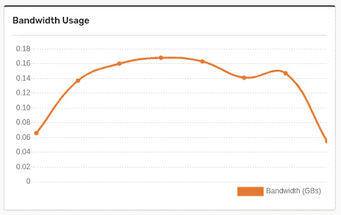
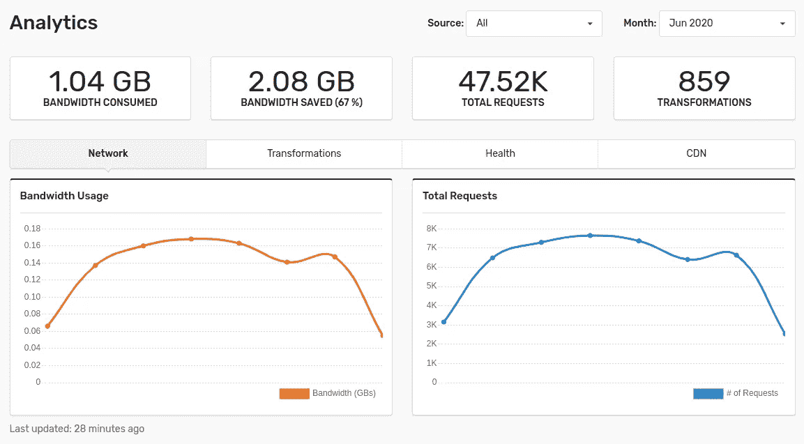

# 技术性搜索引擎优化:用大小合适的图片来提高页面负载

> 原文：<https://itnext.io/technical-seo-improving-your-page-loads-with-properly-sized-images-58f171b66e4e?source=collection_archive---------4----------------------->



我们都知道，我们应该使用适当大小的图像，而不是使用全尺寸的图像，并用 HTML 或 CSS 将它们变小。全尺寸图像尺寸更大，有时是兆字节而不是几千字节。当你加载一个页面时，这会使加载时间变得更长，因为所有的信息都必须提供给客户端。使用适当大小的图片，你只提供你需要的东西。这可以将你巨大的 5 兆字节的图像减少到只有几千字节。你的网页加载速度更快，尤其是在移动设备和无线网络上。

虽然只提供较小的图片是成功的一半，但是你还可以做更多的事情。大多数最新的浏览器现在都支持 WebP 图像。这是一种比 png 甚至 jpg 小得多的现代图像格式。如果您可以自动将图像调整到合适的大小，并以尽可能小的格式提供给您的客户，会怎么样？嗯，有一个解决办法:口香糖。

# 设置 Gumlet

使用 Gumlet 服务您的图像很容易。创建帐户时，您可以添加新的来源。这种情况下的来源是一个网站。如果您拥有自己的图像，创建源所需的全部工作就是:

*   将源类型设置为“Web 文件夹”
*   将基本 URL 设置为“[https://my-domain.com](https://my-domain.com)
*   为 Gumlet 选择一个子域。

这是将您对 Gumlet 的请求代理到您自己的 web 服务器。在下一步中，我们将回顾它是如何工作的。如果您没有托管任何您自己的映像，例如，您正在使用 S3，那么您可以在“源类型”下拉列表中选择另一个源，并从那里完成步骤。

# 它是如何工作的？

在上一步中，您已经用 Gumlet 设置了您的图像服务子域。在这一步，我将向您展示一个 Gumlet 如何为您的网站提供图像的示例。假设您有以下图片 URL:

```
<img src="https://my-domain.com/images/banner.jpg"
```

这张图片是 1200 像素乘 800 像素。

为了能够利用图像的压缩和大小调整，我们首先需要确定图像的理想大小。例如，我们可以确定图像应该是 300 像素乘以 200 像素。为了告诉 Gumlet 我们需要这种格式的压缩图像，我们可以将图像的 URL 更新为:

```
<img src="https://my-domain.gumlet.io/images/banner.jpeg?w=300&h=200"
```

这将从 Gumlet CDN 请求图像。反过来，Gumlet 将使用您指定的路径从您之前设置的“基本 URL”中获取图像。这意味着 Gumlet 将从您指定的位置请求图像，调整它的大小，并压缩它。很有可能你会节省超过 60%的文件大小，你所有的图片现在都是 webp 格式。

这是初学者使用[植物护理口香糖一周的结果](https://plantcareforbeginners.com):



# 结论

现在你已经设置了 Gumlet 并更新了图片来源，你会发现网页加载速度更快，图片大小也更合适了。这个相对简单的改进可以给你的搜索引擎优化带来很大的提升，尤其是如果你的网站有很多图片，并且因此而运行缓慢。

发布时间:2020 年 6 月 24 日

*最初发表于*[*【https://roelofjanelsinga.com】*](https://roelofjanelsinga.com/articles/technical-seo-improving-your-page-loads-with-properly-sized-images)*。*