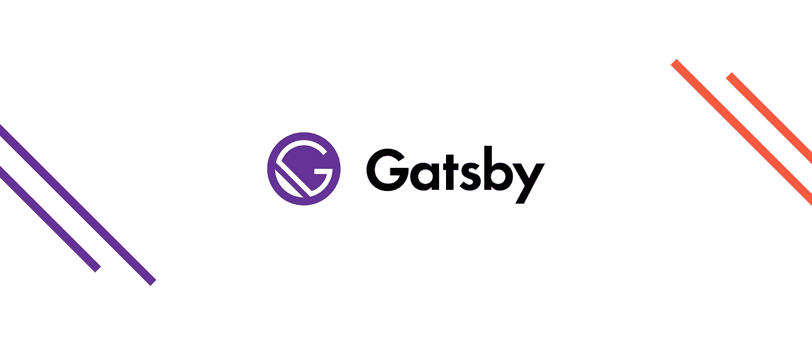

# 如何使用多语言 Gatsby 应用程序

> 原文：<https://itnext.io/techniques-approaches-for-multi-language-gatsby-apps-8ba13ff433c5?source=collection_archive---------0----------------------->



我最近必须实现一个多语言静态网站，所以我认为盖茨比将是一个有趣的选择；人们肯定有很多关于如何做的指南。事实证明，用简单的方法实现它很容易，但是如果你想通过自动化过程减少手工工作和简化翻译，事情会变得困难。在本文中，我将尝试展示我所面临的问题、我最终使用的解决方案以及每种方法的优势。

# 介绍

最初，内部化似乎是一项简单的任务。收到请求后，检查请求的语言，用正确的数据预先填充文档，然后将 HTML 返回给浏览器。你可能忘了，盖茨比没有配备服务器。与 NextJS 不同，Gatsby 输出一组静态资产，通常由 Netlify 或 S3 等静态网站主机自动提供服务(打开网站配置)。手动设置&配置服务器来提供适当的内容，这完全违背了使用 Gatsby 的初衷。因此，尽管内部化被认为是服务器端渲染世界中一个“已解决”的问题，但它突然在**现代静态文件服务世界**中变得有趣起来。

我们希望实现以下目标:

*   我们支持的每种语言的每个页面的输出变化。
*   用正确的语言预渲染每个输出的页面。
*   在每个输出的页面上添加适当的 SEO 内在化标签。
*   实现一个语言选择器来改变语言。
*   基于访问用户的语言环境添加适当的服务器端重定向。

同时，该项目应受以下技术要求的约束:

*   有一个集中处理翻译的方法。
*   自动创建每个页面的本地化版本(即每个页面只需编写一次代码)
*   自动添加适当的搜索引擎优化标签到每个页面。
*   自动添加基于地区的服务器端重定向。
*   自动创建智能语言选择器和语言感知链接。

哦，天啊，你一定会喜欢的。我们开始吧！

# 集中翻译

第一件事是决定如何处理翻译。通常，你要做的是保存一个 JSON 文件，里面有你的网站的所有短语或单词的变体。是为所有内容保留一个 JSON 文件，还是将它分割成每页独立的 JSON 文件，这实际上取决于用例。如果您的网站足够小，并且只支持少数几种语言，那么一个单一的 JSON 文件(即使只有几百 kb)可能是最好的解决方案。另一方面，如果你有一个多语言的网站，支持任意数量的页面(例如，一个有很多产品的网上商店)，那么生成多个翻译文档通常会更好。通常，在 React 项目中，您有以下选项:

*   在开始处加载单个翻译文档**一次** **，然后自由导航&切换语言。**
*   **按需延迟加载**翻译文档，并在请求翻译文档时使用`<React.Suspense>`回退。

对于本文，我们将继续使用单文档方法，利用 [i18next](https://github.com/i18next/react-i18next) 库。我们将首先配置一个翻译模块(即如何加载文档、备用语言是什么、如何处理翻译请求)，然后通过`React.Context`将其传递到组件链。这将包含有用的方法，允许我们改变语言和翻译某些文本。

让我们创建一个`i18next`库的实例，并将其配置为使用在`translations.json`下找到的翻译:

i18next 的翻译文档示例

i18 的配置示例接下来

导出的模块具有我们需要的方法，以便更改语言或执行翻译。让我们通过上下文提供者，通过安装`react-i18next`(即`i18next`的 react-binding)及其`I18nextProvider`模块，将它公开给我们的 React 组件。然后，组件可以使用同一个包中的`useTranslation`钩子，以便访问翻译功能:

翻译示例

太好了，现在我们有了集中翻译的方法。让我们看看如何在《盖茨比》中运用这一点。

# 自动化页面本地化

因为我们输出静态资产，所以我们需要用每种可用的语言为每个页面创建一个 HTML 文档。当然，我们可以像过去一样，手动为每种语言编写不同的 HTML 文档，但是我们正在使用现代工具，所以我们应该寻找现代的解决方案。

在其国际化文档中，Gatsby 提到了 [gatsby-plugin-18n](https://github.com/angeloocana/gatsby-plugin-i18n) ，它将所有`src/pages/about.en.js`文件转换为`/en/about/`URL。不幸的是，这对我们不起作用，因为这意味着我们实际上需要创建与我们支持的语言数量一样多的`about.{LOCALE}.js`文件。我们想要的是编写一个单独的`src/pages/about.js`文件，并自动为我们所有支持的语言生成`/en/about`、`/el/about`、`/fr/about`。通过利用 [Gatsby 节点 API](https://www.gatsbyjs.org/docs/node-apis/)，这非常容易实现。

我们要做的是使用`onCreatePage`钩子自动创建在`pages`文件夹中找到的每个页面的新的本地化版本(在正确的路径上)。为此，我们将以下内容添加到位于项目目录顶层的`gatsby-node.js`文件中:

帮助我们动态创建页面的 Gatsby 节点 API

在上面的例子中，我在`gatsby-config.js`中添加了可用的语言环境作为键。`supportedLanguages`的值将是一个类似于`['en', 'el', 'fr']`的字符串区域的简单数组。

如果您试图构建您的 Gatsby 项目(通过`gatsby build`，您会看到 HTML 页面已经创建，但是内容没有翻译。这是因为我们还没有告诉我们的页面他们正在实现什么语言，或者他们应该翻译什么东西。让我们解决这个问题。

首先，让我们在根组件中添加`<I18NextProvider>`，这样页面就可以使用`useTranslation()`钩子。为此，我们像这样编辑我们的`gatsby-browser.js`和`gatsby-ssr.js`:

gatsby-ssr 用提供者包装根元素。gatsby-browser 只是输出 ssr 所做的一切。

现在 pages 可以翻译他们的文本。缺少的是语言。每个页面**都不知道**应该翻译成哪种语言。当然，我们可以通过路径来推断(即`/en/about`有一个`en`的语言)，但这有点站不住脚，容易出错。相反，我们要做的是，通过在创建过程中显式地传递给它，使每个页面知道它的位置。在 Gatsby 中，这意味着在页面创建期间向页面传递一个`context`。这个`context`是一个对象，其内容由页面组件作为`props`接收。因为我们可能在一个页面中的多个其他组件中需要它，所以我们将它添加到一个`React.Context`中，以便从任何子组件中读取它。

为此，我们需要将之前的`gatsby-node.js`文件修改如下:

gatsby-node 为每个生成的页面添加顶级道具

创建一个`PageContext`(和`usePageContext`钩子)将这些`context`道具传递给页面中的任何 React 组件:

一个允许我们将这些顶级道具(包含在“pageContext”中)传递给链中任何组件的上下文。我们还在这里为整个页面及其组件设置了正确的语言。我们不能在反应效果中添加“更改语言”。

最后修改`gatsby-ssr.js`和`gatsby-browser.js`，用`PageContext.Provider`包装每一页，这样我们就可以“读取”通过`gatsby-node.js`文件传递的数据。同时，我们确保在服务器端渲染时设置正确的语言(因为我们现在知道每个页面的语言)，以便`useTranslation()`的`t`方法可以知道翻译成哪种语言。

传承“页面上下文”道具

# 自动化添加基于区域设置的重定向的过程。

所以一切都很完美！现在，每一页都有正确的翻译，一切都很好。如果你通过`gatsby develop`启动一个开发服务器，你会看到`localhost:8000/`返回一个 404，因为`/`页面只存在于它的本地化版本中(即`/en/`)。我们应该做的是添加一个从`/`到默认/备用区域的重定向。事实上，我们应该对每个页面都这样做。理想情况下，我们会希望根据用户的语言偏好将他们重定向到正确的语言环境，或者如果我们不支持他们偏好的任何语言，则返回到英语。

这是“服务器的事情”,与解析`Accept-Language`头并从中创建适当的重定向规则有关。Gatsby 不能单独处理它，因为，如前所述，它没有服务器的概念。有趣的是，Gatsby 有一个用于创建重定向的 API，叫做`createRedirect()`，我们可以在`gatsby-node.js`中使用它。我们可以使用这个 API 来“发布”我们创建从一个页面到另一个页面的重定向的意图。这取决于服务器端技术来“订阅”这些意图并创建重定向规则。简而言之，Gatsby 说“当开发人员想要创建重定向时，我会记录日志”，而其他人必须说“我会读取那些日志并创建重定向规则”。像 [gatsby-plugin-netlify](https://www.gatsbyjs.org/packages/gatsby-plugin-netlify/) 或 [gatsby-plugin-s3](https://www.gatsbyjs.org/packages/gatsby-plugin-s3/) 这样的插件就是这么做的。Netlify 在您的构建目录中创建一个`_redirects`文件，其中包含所有的重定向规则(通过您的`gatsby-node.js`中的`createRedirect`调用读取)，Netlify 能够理解这些规则。我们将利用它为生产网站创建服务器端重定向，同时为开发创建浏览器端 javascript 重定向，以便`localhost:8000/about`可以正确地重定向到`localhost:8000/en/about`。为此，我们将`gatsby-plugin-netlify`添加到`gatsby-config.js`，并将`gatsby-node.js`修改如下:

基于接受语言添加重定向

我们现在确保根据用户的区域设置自动将用户重定向到正确的页面版本，如果没有匹配的区域设置，则返回默认语言(通常是`en`)。Netlify 按顺序解析重定向，所以如果在此之前没有其他匹配，它将只到达最后一个(我们的默认语言)。位于`/build/_redirects`的输出类似于:

```
/about /en/about/ 301 Language=en
/about /fr/about/ 301 Language=fr
/about /en/about/ 301
```

如果您想知道为什么我们需要服务器端重定向而不仅仅是浏览器端重定向，那是因为我们不想依赖定制的 Javascript 代码来为我们执行它。用户可能会禁用脚本或互联网连接不良，这可能会导致后期重定向。此外，我们不能为重定向设置状态代码，因此搜索引擎将不能正确地索引这个动作。出于开发目的依赖 JS 是好的，但是对于生产来说是不允许的。

# 自动化的过程中添加适当的搜索引擎优化标签到每个页面。

每个页面都有自己的区域设置，但不幸的是谷歌并不知道这一点。让我们通过在每个页面中添加适当的 SEO 标签来帮助解决这个问题。遵循[官方惯例](https://www.gatsbyjs.org/docs/add-seo-component/)，让我们创建一个 SEO 组件，它将通过我们在上面创建的`usePageContext`钩子读取区域信息。然后，它将使用[react-头盔](https://github.com/nfl/react-helmet)向文档添加适当的 HTML 标签(确保添加[Gatsby-plugin-react-头盔](https://www.gatsbyjs.org/packages/gatsby-plugin-react-helmet/))。

包含电池的 SEO 组件

我们做的第一件事是向`gatsby-config`查询可用的语言(即一个地区字符串列表)和基本 URL(即`https://example.com`)，以便构建必要的`<meta>`属性。下一件事是获取与当前本地化页面相关联的当前语言，以及页面在未本地化时的原始路径。有了这些信息，我们可以:

*   给`<html>`标签添加一个`lang`属性。
*   生成一个`og:locale` `<meta>`标签。
*   为标签`description` `<meta>`添加回退，如果用户没有为当前页面提交回退。
*   为当前页面添加`<meta rel="canonical" … />`。
*   为当前页面的所有本地化版本添加`<meta rel="alternate" … />`。

这有助于谷歌显示正确的本地化搜索结果。基于用户的语言偏好。只要确保所有页面都添加了一个`<SEO />`组件。我们不会自动包含它，因为它的属性可能会因页面而异。

# 创建智能语言选择器组件

难题的最后一部分是允许用户正确地浏览网站并在语言之间切换。

当用户是英国人时，标题中出现的所有链接都应该有`/en/`前缀。当它们是法语时，那么导航中的所有页面都应该以`/fr/`为前缀。这对我们来说应该是自动完成的，根本不用考虑语言环境。让我们创建一个新的`Link`组件，基于当前活动的语言，通过向路径添加地区前缀来扩展 Gatsby one。看起来大概是这样的:

阿郎感知链路组件

现在我们需要做的，就是在我们使用原始`Link`组件的地方使用它。有了这个组件，我们根本不用担心语言环境。我们只需编写`<Link to="/about/">About</Link>`,适当的区域设置就会自动为我们加上前缀，确保用户在浏览时总是停留在相同的区域设置。

最后，让我们给他们改变语言的能力。每个本地化页面都有自己的 URL，因此更改语言只不过是更改页面。诀窍在于，我们不仅希望自动创建这个选择器，还希望确保将用户重定向到他们所在的页面。例如，如果他们在`/en/about/`上，他们将语言改为法语，我们希望将他们重定向到`/fr/about`。这意味着我们的语言选择器应该是一组链接，其`href`属性在用户每次改变页面时都会改变。

我们可以利用我们的`usePageContext`来读取当前页面的`originalPath`并创建一个链接列表，每个区域都有前缀`originalPath`。一个无样式的实现应该是这样的:

一个简单的自动生成的语言选择器

这样，每种新的语言都会自动添加到选择器中，同时确保更改语言会让用户停留在同一页面。

# 结束语

哇，太多了。总而言之，我们:

*   设置一种为所有地区自动生成 HTML 文档的方法。
*   处理生产中的服务器端重定向和开发中的客户端重定向。
*   为每个页面设置语言，并使用`React.Context`将其传递给子组件。
*   设置一个`<SEO />`组件，它读取每个页面的语言并创建必要的 i18n 元标签。
*   创建了一个有用的语言感知`<Link>`组件。
*   创建了一个动态和智能的语言选择器组件来切换语言。

我们还实现了一个完全模仿生产环境的本地化开发环境。这一切的目的都是为了自动化 Gatsby 网站的本地化，同时对开发人员隐藏其复杂性&公开的组件 API。无论如何，请随意提出替代方案或事情，这些方案或事情本可以使这一切变得简单得多。我真的很想了解他们。

我还发布了一组实现上述所有内容的工具。它包括:

*   用作新的多语言 Gatsby 应用程序样板的入门工具
*   一个主题(不包括样式)来帮助将现有的 gatsby 应用程序迁移到多语言应用程序
*   当你想使用自己的翻译框架，但仍然需要自动生成本地化页面(包括 SEO 标签)时，这个插件可以提供帮助

您可以在此查看所有内容:

[https://github.com/3nvi/gatsby-intl](https://github.com/3nvi/gatsby-intl/)

感谢阅读:)

*👋 ***嗨，我是***[***Aggelos***](https://aggelos.dev)***！如果你喜欢这个，考虑一下*** [***在 twitter 上关注我***](https://twitter.com/AggArvanitakis) ***并与你的朋友分享这个故事*😀***