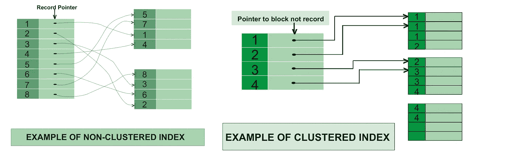
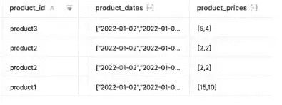

# 优化 SQL 查询的技术

> 原文：<https://itnext.io/techniques-for-optimising-sql-queries-c362dbe626b4?source=collection_archive---------0----------------------->


众所周知，SQL 数据库是当今使用最多的数据库之一。它们可以在不同的用例中使用，从简单的新闻订阅数据库这样的小型应用程序到用于数据分析的大型数据库。

由于这种使用的灵活性，数据库越大，如果我们不在数据库的表中进行相应的优化，查询就会越慢。

在这里，我们将列出并快速介绍如何实现这一点的技术和方法，从最简单的开始，如优化查询，到繁重的内容，如表分区。

## 1.解释的力量

这个关键字将给出我们的查询将做什么的详细信息，以及在执行时将花费多少时间。

根据我们使用的 SQL 数据库，它将提供额外的信息，如我们正在尝试执行什么类型的查询，我们是否有连接，我们使用什么键来过滤，我们期望的结果行数等等。

在这篇 [**文章中**](https://medium.com/random-life-journal/explain-sql-command-in-postgresql-6b0d50c7bd9a) 出自[雨武](https://medium.com/u/edcc77054fcb?source=post_page-----c362dbe626b4--------------------------------)我们举几个例子来说明一个 PostgreSQL 数据库。

## 2.停止循环运行查询

这是我见过的许多人犯的最常见的错误之一，不管他们的经验水平如何，也不管他们在这个行业有多少年。

这样做确实很有诱惑力，因为它的简单性和加速一个特性的交付。考虑一个合适的 SQL 查询需要更多的时间，这样我们就不必循环运行它了。

例如，我们有一个用户表和一个地址表。地址表中有用户 id。我们需要找到某个用户的地址来执行一些操作。

最简单和直观的方法是使用两个查询，一个获取用户，遍历用户并对用户数据执行一些操作，直到我们意识到我们也需要地址，并且本能地开始在循环中编写地址查询，而没有意识到这一点。有两种可能的解决方案比这个更好。

*   首先，运行第一个查询来获取所有用户数据，从结果集中过滤出用户 id，然后运行地址查询，条件是表中的用户 id 字段与我们从第一个查询中获取的一个 id 相匹配。
*   第二种也是最好的方法是执行一个`JOIN`并从两个表中获取数据。这样，我们只执行一个查询，就拥有了我们需要的所有数据。

## 3.仅选择您需要的字段

另一个常见的问题是，我们不考虑哪些数据是我们需要的，哪些是我们不需要的，所以我们所做的是编写一个`SELECT * …`查询。

根据上面的例子，假设我们只需要用户的全名、街道、邮政编码和城市。我们的查询应该是这样的，带有一个内部连接，因为我们需要基于条件的两个表的交集

```
SELECT u.firstname, u.lastname, a.street, a.zipcode, a.city 
  FROM user u 
  INNER JOIN address a
WHERE a.userid = u.id
```

这样我们就不会增加结果集的开销，并且我们只处理我们需要的数据。

## 4.避免在内部联接中使用 WHERE

从上面的查询中，我们还注意到在连接两个表时使用了过滤。连接时使用`ON`过滤器，而不是使用`WHERE`子句。

```
SELECT u.firstname, u.lastname, a.street, a.zipcode, a.city 
FROM user u 
INNER JOIN address a ON a.userid = u.id
```

## 5.用 WHERE 代替 have

WHERE 和 HAVING 子句之间的主要区别在于，WHERE 在任何分组之前被处理，并且不能访问聚合值，如`max`、`min`函数等等。另一方面，HAVING 是在分组后处理的，这会降低查询速度，降低查询性能，因为我们需要处理更多的记录。

简单来说， **WHERE 用于分组前筛选行，HAVING 用于分组后排除记录**。

## 6.使用有利于子查询的连接

虽然子查询更容易编写和理解，但它们会使查询变得冗长、不可读、难以维护且性能较低。

在某些情况下，子查询是首选的，也是鼓励使用的，比如在返回聚合值的 where 子句中。

```
SELECT name FROM product
WHERE cost<(SELECT AVG(price) from sale);
```

或者在 FROM 子句中使用 group by。

```
SELECT city, sum_price 
 FROM 
(
  SELECT city, SUM(price) AS sum_price FROM sale
  GROUP BY city
) AS s
WHERE sum_price < 2100;
```

## 7.避免使用 SELECT DISTINCT

就性能而言，该子句的代价非常高，因为它必须检查所有数据集以确保没有重复。它逐行扫描数据集，当发现一个重复时就删除它。

这个过程会增加 CPU 和内存的使用。

要获得更详细的解释，我鼓励你阅读这篇详细的 [**文章**](https://jmarquesdatabeyond.medium.com/sql-like-a-pro-please-stop-using-distinct-31bdb6481256) 来自[Joao Marques @ Data Beyond Ltd](https://medium.com/u/1afd200bdabf?source=post_page-----c362dbe626b4--------------------------------)关于 DISTINCT 子句。

## 8.使用 EXISTS()代替 COUNT()

使用 EXISTS 关键字执行存在性检查几乎总是比使用 COUNT(*)快。

只要逻辑测试证明为真，EXISTS 就可以停止，但是 COUNT(*)必须对每一行进行计数，即使它知道有一行通过了测试。

下面简单介绍一下 [**基准**](https://mattsuyolo.medium.com/choose-exists-rather-than-count-61476b702919) 来自 [Mattsuyolo](https://medium.com/u/c80a8ac50fa0?source=post_page-----c362dbe626b4--------------------------------) 这两个关键词。

## 9.利用索引

索引是 SQL 中最重要的性能因素之一。它通过提供对所请求数据的快速访问(称为索引查找操作)来帮助加速查询，而不是扫描整个表来检索几条记录。

它有一些缺点，因为需要额外的磁盘空间，并且通过插入、更新和删除进行的数据修改会变慢。

这就是为什么我们需要特别注意在必要时只在我们需要的列上使用它，并删除未使用的索引。

在 Kousik Nath 的文章中，我们对它的工作原理有详细的解释。

## 10.使用聚集索引进行数据修剪

数据修剪是查询引擎用来确保查询只扫描与 WHERE 子句提供的条件相匹配的行的技术。

聚集索引是数据中行的顺序与索引中行的顺序相对应的索引。它提供了对数据的线性访问。聚集索引的一个例子是可以由一列或多列组成的主索引。

更详细的解释可以在火弩箭博客 [Octavian Zarzu](https://medium.com/u/7664a035848d?source=post_page-----c362dbe626b4--------------------------------) 的`[**Indexes in Action**](https://www.firebolt.io/blog/firebolt-indexes-in-action)`博文中找到。



聚集索引与非聚集索引

## 11.使用 JSON/ARRAY 列和 LAMBDA

使用这种技术，我们试图最小化表的数量，因此，也最小化连接的数量，只使用一个具有数组或 JSON 列的表，以结构化的方式包含我们的数据。

例如，我们有一个产品表和一个产品价格表，其中记录了每天的产品价格。我们可以想象，这些桌子的尺寸会增加很多。

在这种情况下，我们可以做的是只有一个产品表，其中有两列作为数组，一列存储日期，另一列存储价格，其中日期索引与价格索引相匹配。



合并表结果

在本例中，为了根据日期对产品价格进行升序排序，我们使用了一个名为`ARRAY_SORT`的 SQL Lambda 函数

同样的方法也用于 JSON 列，其中数据存储为一个键值对 JSON 对象。

为了更好地理解 SQL 中的 Lambdas，我鼓励阅读 Firebolt 博客中由 [Octavian Zarzu](https://medium.com/u/7664a035848d?source=post_page-----c362dbe626b4--------------------------------) 撰写的`[**SQL: Thinking in Lambdas**](https://www.firebolt.io/blog/sql-thinking-in-lambdas)`博客文章，并观看下面的视频 [Matan Sarig](https://medium.com/u/57fe71010707?source=post_page-----c362dbe626b4--------------------------------) ，他是 Firebolt 的解决方案架构师团队领导。

## 12.表分区/减小表的大小

这是另一个非常重要的技术，它包括将数据库表分割成多个称为分区的部分，然后我们可以分别查询每个分区。

我们的查询将变得更高效，因为我们将查询记录更少的整个表的一小部分。

为此，您可以阅读我的 [SQL 缓存和表分区](https://albionbame.medium.com/mysql-caching-and-table-partitioning-c65d7010216e)文章。

希望你觉得这些信息有用，并随时让我知道你的想法。

如果您想与我联系，您可以关注或联系我的任何社交网站，或者通过我的[个人网站](https://abame.github.io/)上的联系方式。