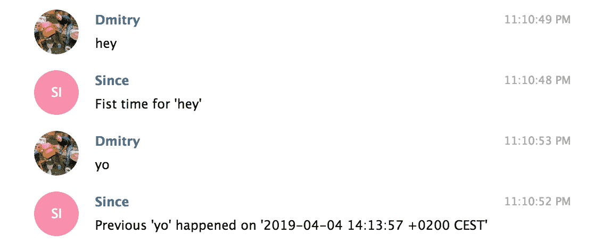
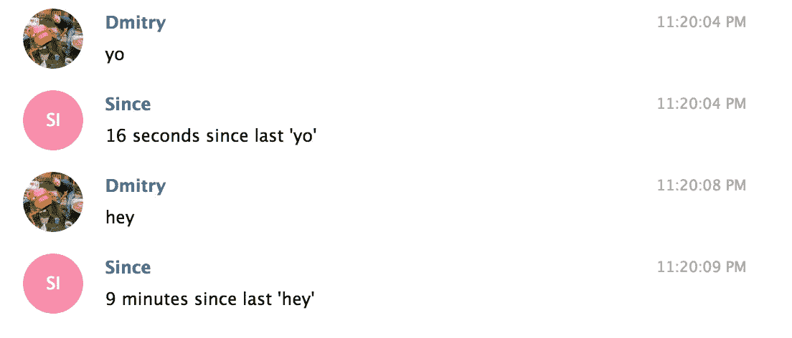

# 围棋中的电报机器人:说人话

> 原文：<https://itnext.io/telegram-bot-in-go-speak-human-b2b4547cad29?source=collection_archive---------4----------------------->


[上次](https://medium.com/@detunized/telegram-bot-in-go-concurrent-sqlite-e6176fac088e)我对我的 SQLite access 基础进行了防弹测试。让我们看看它在生产中是否成立。太糟糕了，我永远也不会有那么高的负荷去打碎东西。哦，好吧，让我们拭目以待。也许我很幸运，两个可悲的并发请求最终会使我的 Go 二进制崩溃。

今天，我将重点介绍特性。我想让我的机器人变得智能。不太喜欢，只是当你输入错误的命令时，听起来比`cmd.exe`好一点。我不会把事情搞大，更像是把脚趾浸在水里看看怎么样。

首先，我想找到同名的最后一个事件，因为我将它们存储在数据库中，并发回事件的日期。想象这样的互动:

```
me: eat
bot: Previous 'eat' happened 6 hours ago
```

要找到同名的事件，我必须让 SQLite 给我用户相同的那一行，事件的名称也相同，并且我想要按日期排序后的最后一行。将英语转换成 SQL，我得到:

```
SELECT date FROM events
    WHERE user = ? AND name = ?
    ORDER BY date
    DESC LIMIT 1
```

很简单，是吧？现在，把它转换成 Go 和`crawshaw.io/sqlite`,我得到如下结果:

```
// Default response
response := fmt.Sprintf("Fist time for '%s'", name)

// Get the last event with the same name and format the response
err := sqlitex.Exec(connection,
    "SELECT date FROM events "+
        "WHERE user = ? AND name = ? "+
        "ORDER BY date "+
        "DESC LIMIT 1",
    func(s *sqlite.Stmt) error {
        response = formatResponse(s.GetInt64("date"), name)
        return nil
    },
    message.From.ID,
    name)

// Send the message back to the user
go func() {
    bot.Send(tgbotapi.NewMessage(message.Chat.ID, response))
}()
```

那里`formatResponse`非常简陋:

```
func formatResponse(date int64, name string) string {
    last := time.Unix(date, 0)
    return fmt.Sprintf("Previous '%s' happened on '%v'", name, last)
}
```

现在交互看起来像这样:



不完全是地球上最聪明的机器人，但我们要去某个地方。

现在，我想让它听起来少一点愚蠢，多一点人性，这两者并不总是一致的。在这种情况下，他们是。我不希望机器人说像`happened on '2019-04-04 14:13:57 +0200 CEST'`这样的话，而是像`8 minutes since`或`1 year since`这样的话。信不信由你，但是有一个专门的包装。欢迎 [hako/durafmt](https://github.com/hako/durafmt) 。在它的帮助下，很容易将对话变成这样:



可读性要好得多。为了让它工作，我只需稍微修改一下`formatResponse`函数(现在它还必须接受当前的消息日期):

```
func formatResponse(name string, date int64, prevDate int64) string {
    prev := time.Unix(prevDate, 0)
    now := time.Unix(date, 0)
    duration := durafmt.ParseShort(now.Sub(prev))
    return fmt.Sprintf("%s since last '%s'", duration, name)
}
```

很简单。没有那么多台词，不到一个小时的工作，我就有了一个会说人话的机器人，它能告诉我上次发生了什么。装运它！🚢

如果你好奇，可以在 GitHub 上找到代码[。这个版本被标记为`day-4`。](https://github.com/detunized/since-bot/tree/day-4)

*原载于 2019 年 4 月 4 日*[*detunized.net*](https://detunized.net/posts/2019-04-04-telegram-bot-in-go-speak-human/)T22