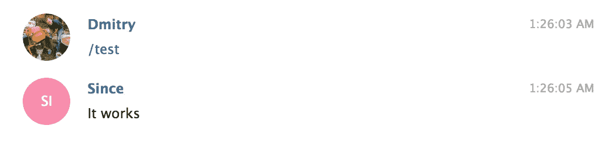
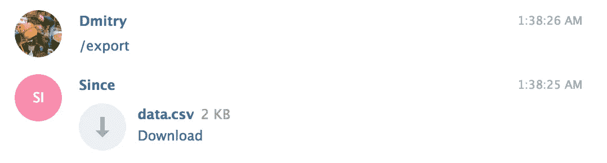
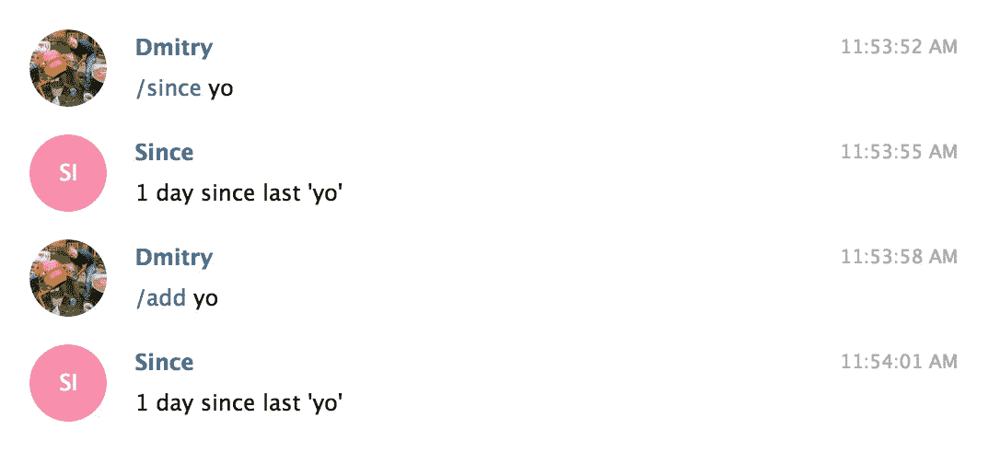
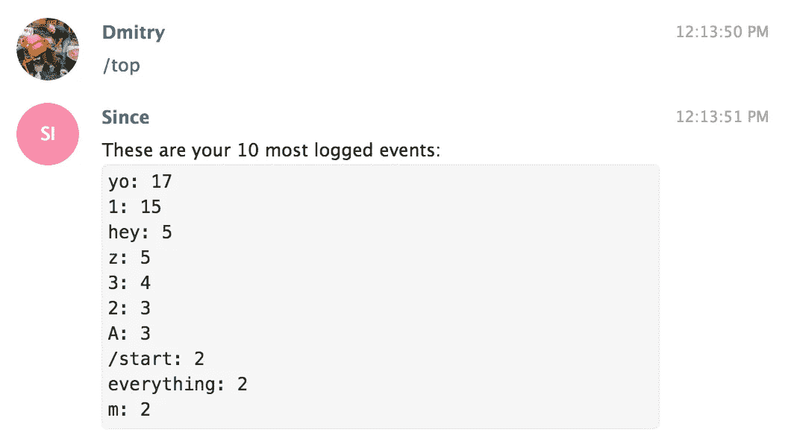
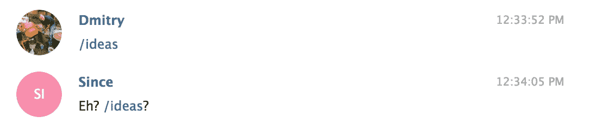

# 围棋中的电报机器人:说话机器人

> 原文：<https://itnext.io/telegram-bot-in-go-speak-robot-16c54d655455?source=collection_archive---------4----------------------->


上次我教我的机器人跟人说话。这次我要教它和机器人说话。我将添加几个 bot 命令。在 Telegram 中，机器人接收的文本与你发送的完全一样。按照惯例，当第一个单词以反斜杠(`/`)开头时，它被解释为命令。命令用来告诉机器人做什么。这有点像壳牌，我想你大部分时间都在这里度过。

`go-telegram-bot-api/telegram-bot-api`包提供了一些函数来检查接收到的消息中是否有命令，并让您提取它和它的参数。

```
for update := range updates {
    if update.Message.IsCommand() {
        command := update.Message.Command()
        arguments := update.Message.CommandArguments()
    }
}
```

经过一些轻微的重构，我的机器人已经可以接受命令和普通文本了。实际上，纯文本被简单地映射到`/add`命令。

```
if message.IsCommand() {
    switch command := message.Command(); command {
    case "a", "add":
        c.add(message.CommandArguments())
    case "e", "export":
        c.export()
    case "h", "help":
        c.help()
    case "s", "since":
        c.since(message.CommandArguments())
    case "t", "top":
        c.top()
    case "test":
        c.test()
    default:
        c.sendText(fmt.Sprintf("Eh? /%s?", command))
    }
} else {
    c.add(message.Text)
}
```

## /测试

最简单的命令是`/test`，它只是发回一些硬编码的文本。实现起来非常简单:

```
func (c context) test() {
    c.bot.Send(tgbotapi.NewMessage(c.message.Chat.ID, "It works"))
}
```



## /导出

导出是一个非常重要的命令。我认为它非常重要，所以我首先实现了它。它允许用户下载存储在机器人数据库中的所有数据。对供应商锁定说不。

这几天真的很烦。以任何应用程序为例，比如健身追踪器应用程序。它会跟踪你的跑步记录，并将你的数据存储在手机或云端的某个地方。有一天，它停止工作，或者你决定开始使用另一个应用程序。你是做什么的？您如何迁移您的数据？通常，没有简单的方法或者根本没有方法。你必须放弃所有的历史和进步，在新的应用程序中重新开始。

我不希望我还不存在的用户也这样。让他们随时把数据带回家。这就是我拥有`/export`指挥权的原因。只要对机器人说`/export`，它就会很乐意遵从:



为了生成 CSV 文件，我使用了内置的包`encoding/csv`。将所有行导出到 CSV 文件非常容易:

```
buffer := &bytes.Buffer{}
csv := csv.NewWriter(buffer)

// For each row
for ... {
    csv.Write([]string{name, date})
}

// Flush when done (important!)
csv.Flush()

// Send
c.bot.Send(tgbotapi.NewDocumentUpload(
    c.message.Chat.ID,
    tgbotapi.FileBytes{
        Name:  "data.csv",
        Bytes: buffer.Bytes()}))
```

## /add 和/since

`/add`和`/since`命令是这个机器人的面包和黄油。顾名思义，一个用于添加事件，另一个用于检查上次添加事件的时间。`/add`是二合一命令，就像一瓶洗发水&护发素，显示添加前的时间。



## /顶部

为了练习 SQL，我添加了一个相对无用的命令来显示 10 个最常记录的事件。

```
SELECT name, COUNT(name) freq FROM events
    WHERE user = <user-id>
    GROUP BY name
    ORDER BY freq DESC
    LIMIT 10
```

在我的非常愚蠢的数据集上，它看起来像这样:



我不得不说，到目前为止，SQL 给我留下了深刻的印象。理论上我知道它能做什么。但是现在我开始尝试，这真的很酷，我可以只写一个简单的查询，而不是写一堆带有循环和变量的代码。可能也更有效率。

## 下一步是什么

机器人变得越来越聪明。现在它可以用不同的方式响应一些基本的命令。更多的来了。我希望机器人能够绘制图表，并显示一些统计数据，如多长时间发生的事情或分布在一天/一周/一个月。你有什么想法吗？



如果你好奇，可以在 GitHub 上找到代码[。这个版本被标记为`day-5`。](https://github.com/detunized/since-bot/tree/day-5)

*原载于*[*detunized.net*](https://detunized.net/posts/2019-04-09-telegram-bot-in-go-speak-robot/)*2019 年 4 月 9 日*