# (第四部分。统一中的心灵遥控

> 原文：<https://itnext.io/telekinesis-in-unity-part-4-gamedev-series-8cc110b8ab55?source=collection_archive---------3----------------------->

每个人小时候都想过拥有心灵遥感。为什么不在游戏中实现这种幻想，给自己这种力量呢？如果你想知道像**控制**或**心灵控制:心灵之门阴谋**这样的游戏是如何做到的，你来对地方了。比你想象的容易！

我们将创造什么:

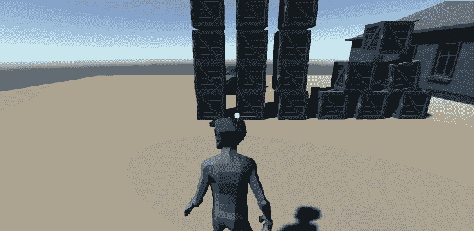

这是我的 Unity gamedev 系列的第四部分。对于上一部分，请访问:

 [## 接下来是:在 Unity 中创造僵尸敌人(Unity gamedev 系列的第 3 部分)

### 在这一部分，我将向你展示如何在 NavMesh 上制造敌人。我会让他们追我，和物体碰撞…

itnext.io](/it-follows-creating-zombie-enemies-in-unity-part-3-of-unity-gamedev-series-988da87c8273) 

如果你刚刚开始学习如何开发游戏，你可以关注我的 udemy 初学者 Unity 开发课程:

 [## 完整指南:Unity 2020 中的动作恐怖 3D 游戏

### 大家好，我叫 Jan Jileč ek，是一名拥有计算机科学硕士学位的专业游戏开发人员，我…

www.udemy.com](https://www.udemy.com/course/make-a-3d-game-in-unity-2020-from-scratch-with-free-assets/?referralCode=8B96F6C67527AEEA39D9) 

# 场景设置

如果你已经从我的 gamedev 系列的前几部分中设置好了场景，添加*刚体*组件到场景中的盒子里。如果没有，并且你正在使用你自己的控制器和播放器，只需添加一个 3D 立方体并给它分配*刚体*。

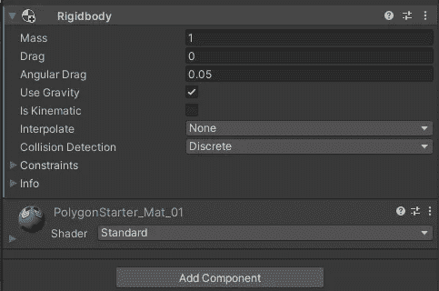

创建一个标签*框*并将其添加到框中。我们将可以在任何有*盒子*标签的东西上使用心灵遥控。

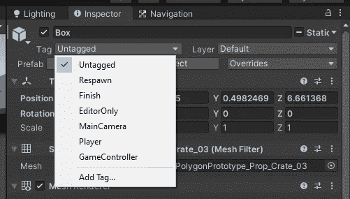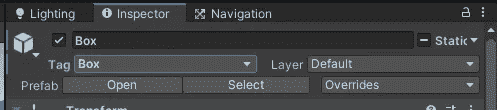

复制物体几次，这样我们就有一些盒子可以玩了。

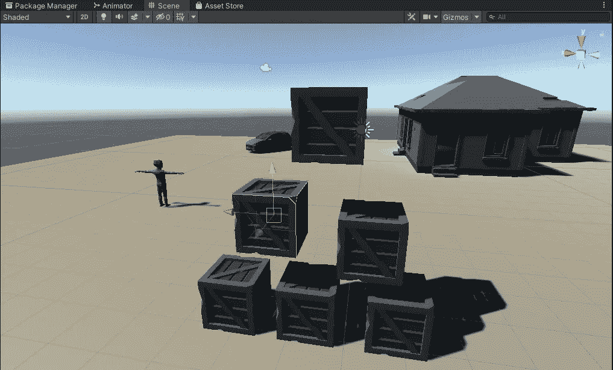

创建一个名为 *HoldPosition* 的空对象。将它放置在播放器前面，并将其作为播放器对象的父对象。在我们吸引它之后，它将会是心灵遥感物体悬浮的地方。

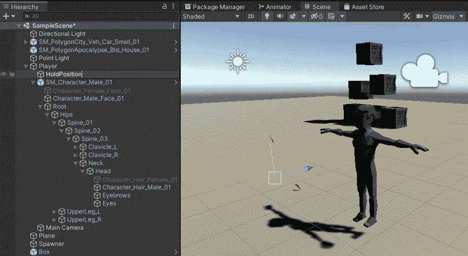

如果你刚刚开始学习如何开发游戏，你可以关注我的 udemy 初学者 Unity 开发课程:

 [## 完整指南:Unity 2020 中的动作恐怖 3D 游戏

### 大家好，我叫 Jan Jileč ek，是一名拥有计算机科学硕士学位的专业游戏开发人员，我…

www.udemy.com](https://www.udemy.com/course/make-a-3d-game-in-unity-2020-from-scratch-with-free-assets/?referralCode=8B96F6C67527AEEA39D9) 

# 心灵遥控功能

创建一个新的 C#脚本，将其命名为 *Telekinesis* (代码在我的 github 上，链接如下)。

我想吸引我用十字准线指向的物体。我在 x 和 y 坐标中间调用 ViewportPointToRay。

如果我击中离我足够近的物体，我会检查它是否有*框*标签。如果是这样，我将该对象作为我之前设置的 *holdPosition* 对象的父对象。然后，我冻结刚体在适当的位置，我调用旋转功能(这是一个波兰的功能，我将实现最后，功能是现在的优先事项)。

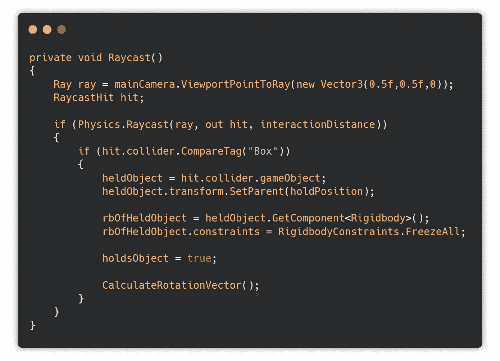

*检查距离*只是检查物体和保持位置之间的距离。*移动物体位置*将物体移动到保持位置。释放对象从保留位置释放对象(取消引用所有值)。 *ShootObject* 用投掷力朝相机的前进方向拍摄物体。

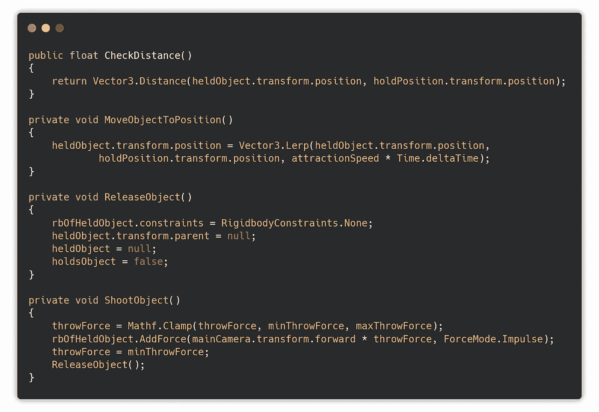

旋转效果将使用变换来完成。旋转功能。它每次使用时都使用随机值。

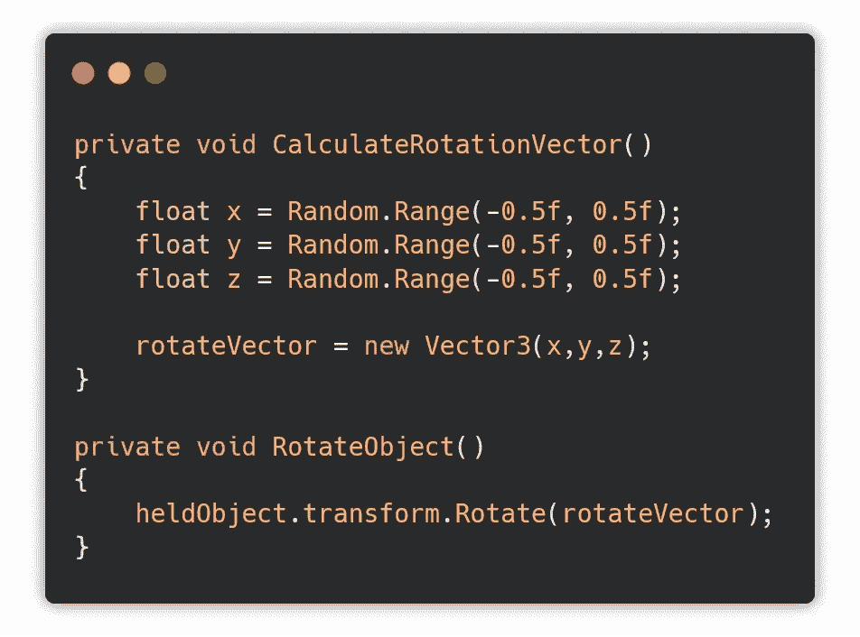

我们现在需要做的就是添加实际的控件，并将映射到函数。

在*开始*中，我只是初始化 throwForce。*更新*方法负责输入。

如果我按下鼠标左键，我会吸引物体。如果我按住鼠标右键，投掷力度会更大。如果我按下它，它会以默认的力被抛出。如果我按 F，我就放下这个物体。

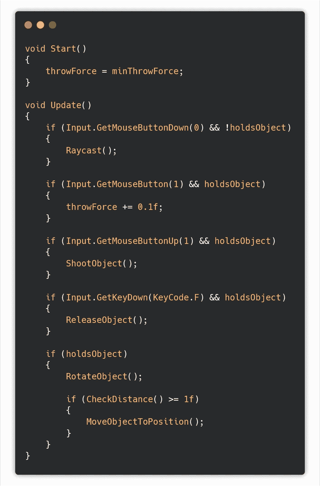

# 完成动作

将*心灵遥控*添加到*玩家*中，并分配必要的值，如相机、保持位置和选择您自己的变量值。

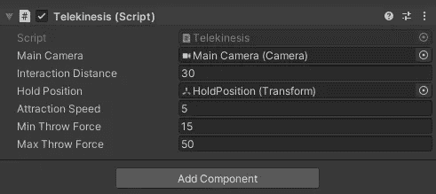

对于十字准线，创建一个新的游戏对象— *图像(自动创建*画布)。

将图像设置为锚定到屏幕中央。

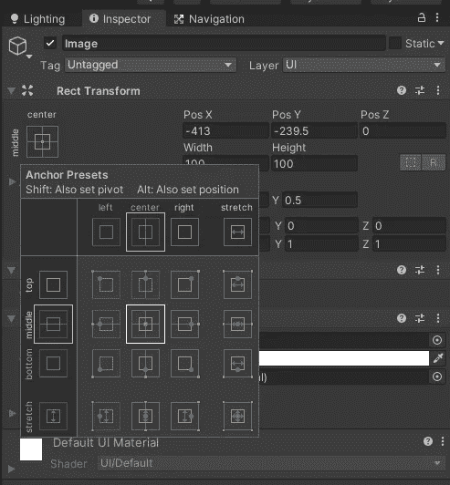

将其位置设置为(0，0，0)，使其正好位于屏幕中间，并将宽度和高度更改为 10。将源图像更改为*旋钮，*这样它就变成了一个漂亮的小圆圈。

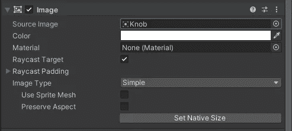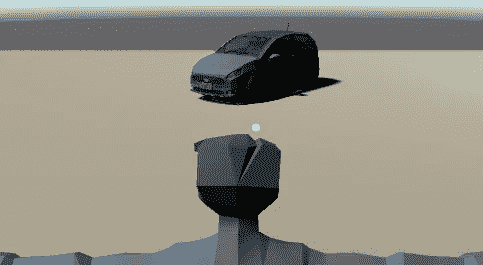

运行游戏。完成了。

# 结果呢

在下一部分，我将添加敌人/心灵遥控的动态，这样我们就可以伤害第三部分的僵尸。

关注我的更多像这样的教程。你也可以关注我的 twitter 或 youtube，我在那里发布 gamedev、荣格心理学和神话学的相关内容。

 [## 扬·吉勒切克

### Jan Jilecek 的最新推文(@janjilecek)。INTP，独立游戏开发者，导演，作家，系统管理员，摄影师。我…

twitter.com](https://twitter.com/janjilecek)  [## 扬·吉莱切克

### 我是捷克独立游戏开发者和电影制作人，我非常喜欢荣格心理学和神话。

www.youtube.com](https://www.youtube.com/janjilecek) 

github 上的源代码。

 [## janjilecek/unity_tutorial

### 在 GitHub 上创建一个帐户，为 janjilecek/unity_tutorial 开发做贡献。

github.com](https://github.com/janjilecek/unity_tutorial/blob/master/Assets/Scripts/Telekinesis.cs)