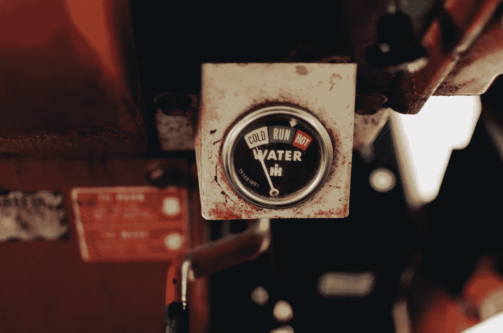
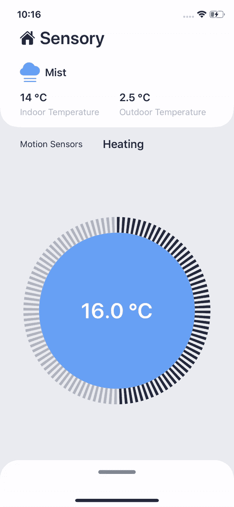

# SwiftUI 中的温度刻度盘

> 原文：<https://itnext.io/temperature-dial-in-swiftui-d2d113449a46?source=collection_archive---------3----------------------->

由[凯利·西克玛](https://unsplash.com/@kellysikkema?utm_source=unsplash&utm_medium=referral&utm_content=creditCopyText)在 [Unsplash](https://unsplash.com/s/photos/temperature?utm_source=unsplash&utm_medium=referral&utm_content=creditCopyText) 上拍摄的照片

当我在创建我的家庭自动化应用程序时，我想控制我的 Nest 恒温器。看着官方的 Nest 应用程序，我很清楚我想要重新创建一个类似的控件。

像往常一样，由于我正在 SwiftUI 中进行试验，我觉得与你们分享我的经验会很好。

这就是我们将要创造的。

看看这个美女！亲提示:(`xcrun simctl io booted recordVideo <filename>.<extension>)`

让我们分析一下创建工作温度刻度盘所需的视图。该视图由三个相互堆叠的**圆形**视图组成，内部有一个**文本**视图。

第一个**圆圈**将用于显示内部的蓝色，并允许我们以圆周运动的方式拖动和改变温度。第二个将用于显示第一个圆周围的描边。最后一个将用于可视化我们打开了多少热量。

我们将需要一些默认值，让我们来定义它们

我们希望观察到*值*，因此我们将其定义为 [**状态**](https://developer.apple.com/documentation/swiftui/state) **。**

视图应该是可缩放的，所以我们定义了一个默认比例，它下面的描边圆也应该有一个最大宽度。因为我们在温度下工作，我们需要能够控制它。因为大多数恒温器的步进为 0.5 度，所以我们也希望对其进行定义。

因为我们需要画不同大小的圆，所以我们定义了一个计算 var 来计算内圆的大小(我们会经常用到)。

如上面的代码片段*所示定义视图。很高兴知道我们需要在第一个圆上添加一个修改器来旋转它-90 度，这样它就从顶部开始了。

你可以随意改变这些值，让它看起来像你想要的那样。

**AssetColor 是一个自定义枚举，允许您以类型安全的方式访问您的资产颜色，您可以用任何* [*颜色*](https://developer.apple.com/documentation/swiftui/color) *属性替换它。*

计算两个给定点之间的度数需要上述函数。* *注意，我们在这里也将角度偏移 90 度，从顶部开始*

最后，是时候实现圆周运动的拖动了，我们将一个拖动手势附加到第一个圆上。

这就是所有的人，一个工作温度拨号！完整的源代码可以在这里找到[。](https://gist.github.com/Plnda/2fb3d5fbd8d1614efce01f77ef474d4b)

*在这里的* [*捏*](https://pinch.nl/en) *，我们继续试验 SwiftUI，让我们的应用变得更好。你有任何问题或评论吗？请在评论中告诉我们。*