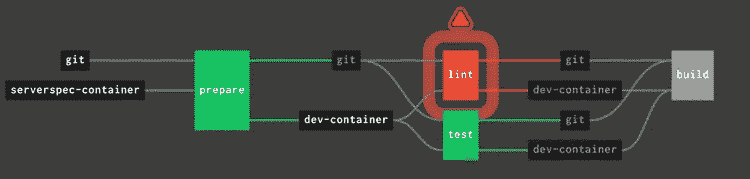
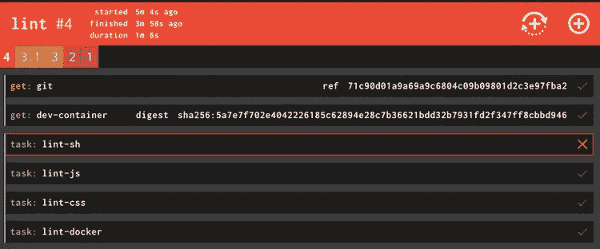
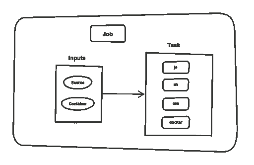

# 用 Jsonnet 模板化 Concourse 管道:简介

> 原文：<https://itnext.io/templating-concourse-pipelines-with-jsonnet-an-introduction-1d5fdadc1db2?source=collection_archive---------10----------------------->


如果你在 YAML 谈论[模板，这肯定会引起一些人的惊讶。这是完美风暴。一个支持空白的模板语言加上一些糟糕的注释意味着你将陷入痛苦的世界。我最近试图滥用](https://www.thoughtworks.com/radar/techniques/templating-in-yaml) [gomplate](https://docs.gomplate.ca/) 来生成一些 *YAML* 的文件，结果很恶心。

让我们同意不做它。它不是为此而建的。然而，在某些时候，YAML 的文件变得很难处理。就像你在[广场](https://concourse-ci.org/)定义管道一样。

这就是为什么我想讨论生成 YAML 的*模板。为此我一直在使用 Jsonnet，我对目前的结果很满意。代码是[这里](https://github.com/sirech/example-concourse-pipeline)如果你想直接跳到它。*

# 无论如何，模板化有什么意义呢？

简单地说， *YAML* 很**啰嗦。这也是大多数 CI/CD 工具选择的格式。这意味着很有可能你迟早会使用 *YAML* 定义交付管道。我在[深度](https://www.thoughtworks.com/insights/blog/modernizing-your-build-pipelines)中写过关于高质量管道的文章。我只关心管道，它能告诉我到底哪里出了问题，而不必检查大量的日志输出。假设我的管道中有一个作业失败了:**



我知道林挺失败了。具体是哪一部分？如果这项工作被很好地分成几个任务，我一眼就能发现问题所在:



我有一个颗粒分解，包括每一个任务，我可以直接找到错误，而不用进行考古调查。不过，坏处呢？很多加价。很喜欢，非常喜欢。这就是这个简单的任务的样子:

这个任务定义使用锚和一个参数化的任务来减少重复，这是你在*会场*所能做的最多的事情。尽管如此，这仍然是太多的代码。随着管道功能的增加，它会变得越来越大。YAML 并没有给我们提供一种对抗重复的方法。

# 拯救世界

*Jsonnet* 是一种数据模板语言。您定义您的数据，它为您创建一个或多个 *JSON* 文档。至关重要的部分是，它为您提供了函数、条件、变量和其他工具来构建更强大的抽象。正是我需要的！一会儿之后，我们就可以出发了。

你肯定知道， *YAML* 是 *JSON* 的超集。如果该工具正在输出 *JSON* ，我们可以无损地将其转换为 *YAML* 。我们将建立一个精简的、可维护的、没有任何丑陋的漏洞的管道。

# 一个小型实用函数库

Concourse 有一堆基本的抽象概念。你有[资源](https://concourse-ci.org/resources.html)、[工作](https://concourse-ci.org/jobs.html)和[任务](https://concourse-ci.org/tasks.html)等等。每一个都由一个具有某些属性的对象来表示。我们可以通过使用接收配置并发出有效对象的函数来实例化一个。以下是一些例子:

在导入库之后，您可以在一个`.jsonnet`文件中使用它们作为常规函数。

```
local concourse = import 'concourse.libsonnet'; concourse.GitResource(source, 'https://github.com/sirech/example-concourse-pipeline.git')
```

语法有点类似于 JavaScript 和 Python。它不完全是一种编程语言，但是你有更多的玩具可以玩。此外，还有一个很大的标准库可以使用。我已经将这些构建模块打包成一个[小库](https://github.com/sirech/concourse-jsonnet-utils)，只需提取代码就可以重用。

# 少点 YAML，多点索尼特

假设我们正在定义我们的`resources`。我有一个示例项目，看起来像这样:

代码并不多，但是你可以感觉到它的结构非常重复。在我们之前定义的助手的帮助下，我们可以做得更好。

通过使用`GitResource`和`DockerResource`，我们在不损失可读性的情况下获得了更紧凑的东西。

# 构建您自己的 DSL

每个管道都是不同的，这意味着很难找到通用的抽象。但是在一个管道中，你倾向于看到某些模式的出现。我们创造它们是为了让过量的 YAML 更容易被接受，即使我们仍然依赖于复制粘贴。

如果构建一个小型 DSL 来表达这些模式会怎么样？我通常将相同的输入传递给每个作业，因此我有一个函数来并行获取它们:

你可以看到，通过变量，我将它与上面定义的资源保持同步。你可以使用[列表理解](https://www.pythonforbeginners.com/basics/list-comprehensions-in-python)让代码更有表现力。

我的[任务定义](https://concourse-ci.org/tasks.html)也遵循定义好的结构。它们存储在`source`中，在一个定义的文件夹中。我们设置了一些基线参数。所有这些上下文都以特定于管道的方式来创建任务。

一步一步，我们有一个定制的功能集，产生一个更小的管道。这样更一致，也更容易改变。

# 回到我们开始的庞大的棉绒工作

那个剥棉绒的工作有很多重复。是时候将所有这些小块组合成一个作业定义了。其结构如下所示:



我们有`Job`、`Inputs`，还有一些`Tasks`。让我们使用我们定义的所有函数:

我真的很喜欢这个！是不是太自作聪明了？我觉得不是！你会看到一个清晰的结构。如果你需要改变或添加什么东西，你做一次，而不是多次。我们已经从大约 30 行的纯粹重复变成了一个紧密的块，仍然清楚地传达它做了什么。

# 如何由此生成管道

我喜欢将`json`输出转换为 *YAML* ，并使用`fly set-pipeline`生成文件。这是脚本:

# 结论

当我开始使用 Jsonnet 时，我有所保留，但我真的印象深刻。您可以真正减少重复的数量。检查[该管道](https://github.com/sirech/example-concourse-pipeline/blob/master/pipeline.jsonnet)以获得初步体验。在以后的文章中，我会试着举一个更大的例子，我们正在处理一个巨大的 500 多行的基础设施管道。

*原载于 2020 年 5 月 19 日 https://hceris.com**T21*[。](https://hceris.com/templating-concourse-pipelines-with-jsonnet/)