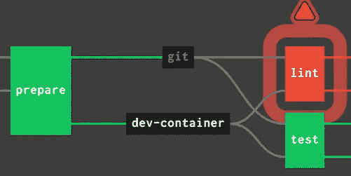

# 用 Jsonnet 模板化 Concourse 管道:后续

> 原文：<https://itnext.io/templating-concourse-pipelines-with-jsonnet-follow-up-e3d0ac0cba9d?source=collection_archive---------5----------------------->

大约一个月前，我开始尝试用 [jsonnet](https://jsonnet.org/) 以编程方式为 [Concourse](https://concourse-ci.org/) 生成管道。从那以后，我用它来建造基础设施管道。我们使用 [Terraform](https://www.terraform.io/) 在 AWS 中提供基础设施。以前，这一过程大多是手动的。随着越来越多的团队加入我们的平台，这种方法变得难以为继。我想在第一篇文章的基础上展开，谈谈我在这个过程中学到的东西。

# 项目特定资源

在开发我们的管道时，我写了一个小的通用助手函数库。我们在它们的基础上构建了特定于我们的用例的定制资源。多亏了`+:`操作符，我们可以覆盖我们所需要的，同时从合理的缺省值中获益。

我们的`git`和`docker`资源已经过调整，可以包含凭据:

我们意识到我们所有的作业都声明了相同的输入，所以我们也为此构建了一个资源。

# 助手功能

每当你试图用简单的 YAML 重用代码时，你最终都会碰壁。即使你使用[锚](https://confluence.atlassian.com/bitbucket/yaml-anchors-960154027.html)，它们也不容易参数化。

有了`jsonnet`，我们可以通过构建简单的函数来基于环境检查条件，从而解决这个限制。

您可以看到，我们从外部接收到了一个`config`对象，这就引出了我的下一点，配置共享相同结构的不同管道。

# 配置管道

我们的管道为不同的团队部署相同的基础设施。存在一些差异，如产品名称、要部署的环境数量、区域等等。

我们发现这个配置更容易保存在一个单独的`product.yaml`文件中。这样，这个领域的变化看得更清楚，新产品也能很快推出。看起来是这样的:

`jsonnet`可以接收外部配置(`local config = std.extVar('CONFIG')`)，虽然你得先把这个文件转换成`json`。

# 结合一切

通过使用所有这些助手和抽象，我们实际的管道定义大约有 80 行长。下面是提供完整环境的功能的简化版本:

不可否认，这段代码变得相当复杂！这是难以避免的，因为不同工作之间的依赖关系本身就很复杂。试图在 YAML 描述所有这些依赖关系将会冗长得多。

# 最终结果

为了让您有个概念，这里是我们供应的一种产品的完整管道的图形表示:

是啊，你可能连工作的名字都看不清。那东西太大了！如果你想知道，实际的 YAML 文件有 2781 行。你可能会问，为什么它这么大？首先，它在不同地区提供四种不同的环境。我们已经尝试将基础架构划分为更小的模块，以便于管理。

结果是更容易想象一个大的工作。更小的模块也更容易应用和维护。多亏了`jsonnet`，管理管道的复杂性大大降低。我们试着用手工制作这个，但是一点也不成功。

# 值得吗？

如果您的管道共享相似的结构，只有一些参数不同，这显然是肯定的。你做这件事会轻松得多。

即使没有要抽象的公共结构，您也可以避免大量的 YAML 重复，并减少意外的复杂性。我建议探索这个选项，尽管必须小心不要构建一些变得不可维护的东西。

*原载于 2020 年 6 月 12 日【https://hceris.com】**。***