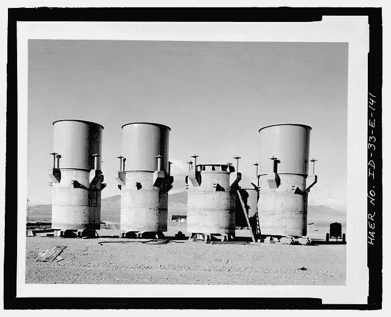

# Kubernetes 豆荚的临时储存

> 原文：<https://itnext.io/temporary-storage-for-kubernetes-pods-f8330ad8db88?source=collection_archive---------1----------------------->

## ***或空目录 vs .容器文件系统***

Kubernetes 应用程序可能需要一些临时存储，在容器停止/移除后可以丢弃这些临时存储。应用程序可能使用 FS 来存储中间结果、检查进程、下载临时文件、缓存请求结果等等。为此，您可以使用 Kubernetes `emptyDir`或容器本地存储。

## 集装箱存储

一旦您的容器运行，您已经有了一个与容器映像一起提供的文件系统。这个文件系统是一致的和只读的:每次您启动一个新的容器，您都会在确切的位置获得相同的文件。然而，在容器中并不一定要保持任何东西不变:您可以修改现有文件或创建新文件。这是可能的，因为容器是在带有[写时复制(COW)](https://en.wikipedia.org/wiki/Copy-on-write) 的[分层文件系统](https://en.wikipedia.org/wiki/UnionFS)之上工作的。

正在运行的容器中的任何更改通常会在容器重新启动后丢失。你可以在官方的 [docker/storage](https://docs.docker.com/storage/storagedriver/) 文档中读到更多关于容器文件系统和实现它的存储驱动的内容。

以上所有内容也适用于包装普通容器的 Kubernetes 豆荚。如果您需要一点临时存储，您不需要做任何事情:只需启动 pod 并做您想做的任何事情。

虽然容器的临时存储可能适合用例的子集，但它还具有以下属性:

*   **容器可写层被绑定到容器的生命周期** —一旦容器消失，可写层也随之消失
*   对于其他进程来说，从这个可写层获取任何东西都可能很棘手
*   为了从容器层创建可用的文件系统，存储驱动程序必须做额外的工作，这有其性能损失

所以接下来是…

## Kubernetes EmptyDir

首先，`emptyDir`是卷类型之一。当一个 Pod 被分配到一个节点时，一个`emptyDir`卷首先被创建，最初，它是…(你不会相信的！)空的。

这种卷类型可以解决上面列出的一些限制:

*   `emptyDir`可以在 pod 内的所有容器之间共享
*   **卷遵循 pod 生命周期** —它是与 Pod 一起创建的，只有在 Pod 被删除后才会被删除。
*   如果容器崩溃(错误、内存不足或任何原因)，它将与其临时可写存储层一起被删除。如果 Pod 支持容器，kubelet 可能会在同一节点上重新创建一个新的容器，但是容器 FS 将与容器映像中的一样，没有您在那里所做的所有临时更改。但是容器崩溃不会将 pod 从节点上删除，因此在容器重启后，`emptyDir`卷中的数据是安全的。例如，这允许对长时间的计算进行检查点操作，以便从意外故障中恢复。
*   `emptyDir`是一个 Linux 原生文件系统，速度更快，并且没有容器存储驱动的损失。

此外，`emptyDir`允许你定义最大大小和使用内存作为存储介质。想象一下，所有容器都无限制地写入主机文件系统，因此唯一的流氓容器可以消耗整个磁盘空间，并给所有邻居造成问题。老实说，`sizeLimit`并没有完全消除这样的问题，但是它至少可以在一定程度上控制空间的使用。

这里有一份 api-reference 用于之前提到的`emptyDir`参数:

> `*medium*` *什么类型的存储介质应该备份这个目录。默认值为“”，表示使用节点的默认介质。必须是空字符串(默认)或内存。更多信息:*[*https://kubernetes . io/docs/concepts/storage/volumes # empty dir*](https://kubernetes.io/docs/concepts/storage/volumes#emptydir)
> 
> `*sizeLimit*` *此 EmptyDir 卷所需的本地存储总量。大小限制也适用于存储介质。内存介质 EmptyDir 的最大使用量是此处指定的 SizeLimit 和 pod 中所有容器的内存限制总和之间的最小值。默认值为零，这意味着未定义限制。更多信息:*[*http://kubernetes.io/docs/user-guide/volumes#emptydir*](http://kubernetes.io/docs/user-guide/volumes#emptydir)

## 如何选择？

在我看来，如果:

*   您需要在同一个 pod 内的容器之间共享文件系统的一部分
*   应用程序大量使用临时存储，性能至关重要
*   您需要对您的流程进行检查点检查，使其能够经受住意外的容器崩溃
*   您需要控制单个 pod 可以使用多少磁盘空间

在所有其他情况下，什么都不做，坚持使用容器本地可写层。