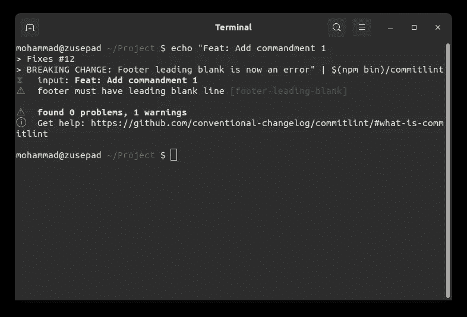

# Git 提交消息的十诫

> 原文：<https://itnext.io/ten-commandments-of-git-commit-messages-94bd6dcf6e0e?source=collection_archive---------2----------------------->


git 提交消息的十诫试图统一[常规提交 1.0.0](https://www.conventionalcommits.org/en/v1.0.0/) 、提交消息的 [7 规则](https://chris.beams.io/posts/git-commit/)以及 Git 本身、GitHub 和 GitLab 使用的格式。

《布道文》中提到的戒律如下:

> 0.git 提交消息不应为空
> 1。用空行
> 2 将页眉和页脚分开。将标题限制在 72 个字符内
> 3。主语不能用任何格，只能用句子格。你不应该以句号结束这个主题。你不应该在主语中使用祈使语气。在 72 个字符处将正文和页脚换行
> 7。用身体来解释什么和为什么以及如何
> 8。使用类型进行语义版本控制
> 9。使用页脚连接到问题并指定重大变更

## 介绍

第一节，1。Commitlint，是关于建立一个 commit linter，它根据戒律验证提交消息。第二节，2。戒律，是对戒律和每条戒律背后的原因的解释。

# **1。承诺**


Commitlint CLI 演示

使用 Node.js，人们可以使用`commitlint`和`[commitlint-config-commandments](http://npm.im/commitlint-config-commandments)`来执行戒律:

```
npm i -D commitlint-config-commandments @commitlint/cli
echo "module.exports = {extends: ['commandments']};" \
  > commitlint.config.js
```

到目前为止，只有戒律 1、2、3、4 和 6 是由这个预置配置强制执行的。在初始化 linter 之后，可以通过命令行通过管道完成林挺:

```
echo "Feat: Add dry run functionality" | commitlint
```

## Git 挂钩

为了即时处理每个提交消息，可以使用`husky`来设置一个 git 挂钩:

```
npm i -D husky
```

在你的`package.json`中添加以下几行:

```
"husky": {
  "hooks": {
    "commit-msg": "commitlint -E HUSKY_GIT_PARAMS"
  }
}
```

## 特拉维斯·CI

```
npm install --save-dev @commitlint/travis-cli
```

然后在`travis.yml`:

```
language: node_js
node_js:
  - node
script:
  - commitlint-travis
```

## GitLab-CI

创建以下 BASH 脚本，并将其命名为`commitlint.sh`或其他名称:

```
if [ $CI_BUILD_BEFORE_SHA == "0000000000000000000000000000000000000000" ]; then
  npx commitlint --from=HEAD~1
else
  npx commitlint --from=$CI_BUILD_BEFORE_SHA;
fi;
```

然后在`.gitlab-ci.yml`中运行它:

```
test:commitlint:
  image: node:${NODE_VERSION}
  script:
    - bash commitlint.sh
```

# **2。**戒律

提交消息具有以下格式:

```
<header>[body][footer]
```

符号`<x>`表示强制占位符，其中`[x]`表示占位符为可选部分保留一个位置。

[常规提交版本 1.0.0](https://www.conventionalcommits.org/en/v1.0.0/) 将报头进一步划分为子部分，实现以下格式:

```
[type]([scope]): <subject>[body][footer]
```

在传统的提交版本 1.0.0 中，类型是强制的，但是我们想让它保持可选。同样，在没有作用域的情况下，作用域的括号也会消失。

## 戒律 0

> git 提交消息不应为空

这条基本规则对于接下来的事情是必要的。虽然有可能出现一个空的提交消息或者至少一个*几乎*空的消息(例如`.`作为消息)，但是应该避免，因为它对提交没有任何解释。

## 戒律 1

> 用一个空行将页眉和正文分开，将正文和页脚分开

页眉总是一行代码，但是页脚不是这样。可以有很多行，如果没有一个空行将它与正文(或者是空正文的标题)分开，就不可能区分它们。



违反戒律 1

分隔标题和正文的空行虽然不是机械要求的，但可以提高可读性。

## 戒律二

> 将标题限制在 72 个字符以内

72 的确切数字背后有一个历史原因。过去，程序员用穿孔卡把他们的程序输入机器。穿孔卡片有 80 列，其中 8 列是保留的，每行 72 个字符。


Fortran 穿孔卡来自[虚拟键穿孔](https://www.masswerk.at/keypunch/)

当程序员得到显示器时，屏幕有 72 列，最大行长度为 72 个字符。从那时起，这一标准被广泛应用于许多领域。在我们的例子中，GitHub 截断超过 72 个字符的头。

## 戒律三

> 主语不能用任何格，只能用句子格

“句子格”是指你以大写字母开头。这条规则背后的主要原因是与 git 自动生成的提交消息保持一致。

下面举个例子:

```
Revert "Feat: Add list transformations" 

This reverts commit 1a18b1cef017f457f6e3d39a7bc7b177dc1b24a4.
```

此提交消息是通过恢复提交而生成的。如你所见，没有类型和范围，主语是句子格。

## 戒律四

> 你不应该用句号来结束这个主题

同样，为了保持一致。查看戒律 3 中生成的 revert 消息，头部没有句号，但是主体有。

## 戒律五

> 你不应该在主语中使用祈使语气

同样，为了保持一致。再次查看戒律 3 中生成的回复信息，主题有一种命令式的情绪。

## 戒律六

> 将正文和页脚换行到 72 个字符

Git 不会包装提交消息体。所以，我们应该在*处缠绕一段*长度。为什么不是 72 年的老歌？特别是，它将使正文与标题对齐。

## 戒律 7

> 用身体来解释什么和为什么以及如何

提交包含您所做的更改。所以，提改了什么就多余了。人们回顾这些行为时，通常会感到困惑的是它们背后的原因。下面是一个例子:

```
Remove the HTTPS serverRemoved the HTTPS server from main.ts, as well as the certs folder.
```

看了那具尸体，我会说“那么，你到底为什么要那样做”？我所期望的是:

```
Remove the HTTPS serverAs we now use NGINX in front of the Node.js server, we won't need
to provide HTTPS by Node.js itself; NGINX does it both for dynamic
and static serves.
```

## 戒律 8

> 使用类型进行语义版本控制

提交消息类型最重要的目的是语义版本化。事情是这样的:

*   如果你有一个`Fix`类型，那么版本在最后一部分颠簸:1.2.3 → 1.2.4。
*   如果你有一个`Feat`型，那么版本在中间部分凸起:1.2.3 → 1.3.0。
*   如果你在页脚有一个`BREAKING CHANGE`，那么版本在第一部分就颠簸了:1.2.3 → 2.0.0。

这甚至可以通过适当的工具实现自动化。

## 戒律九

> 使用页脚连接到问题并指定重大变更

像 GitHub 和 GitLab 这样的代码托管服务现在足够智能，可以基于提交消息触发操作。页脚是利用这些功能的合适位置:

```
Add Docker image build processFixes #666
```

现在，页脚有这一行:

*   GitHub/GitLab 将提交与问题联系起来。提交将出现在问题中。
*   GitHub/GitLab 在接受拉/合并请求时自动关闭问题。
*   未来的开发人员知道提交发生的原因，并可以研究这个问题以了解更多信息。

# 结论

十诫是基于许多现有的标准和经验。这篇文章以及 linter 都是年轻的，可能会经历更多的审查和修复。要获得更新通知，请在 [Twitter](https://twitter.com/MohammadAliEN) 上关注我。