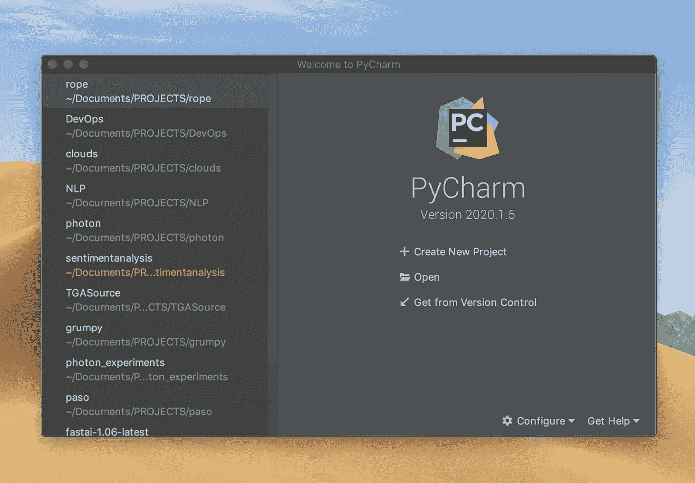
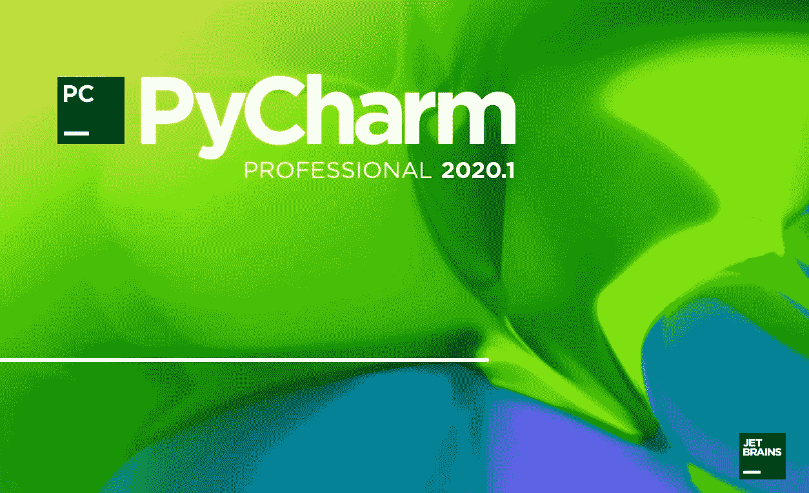
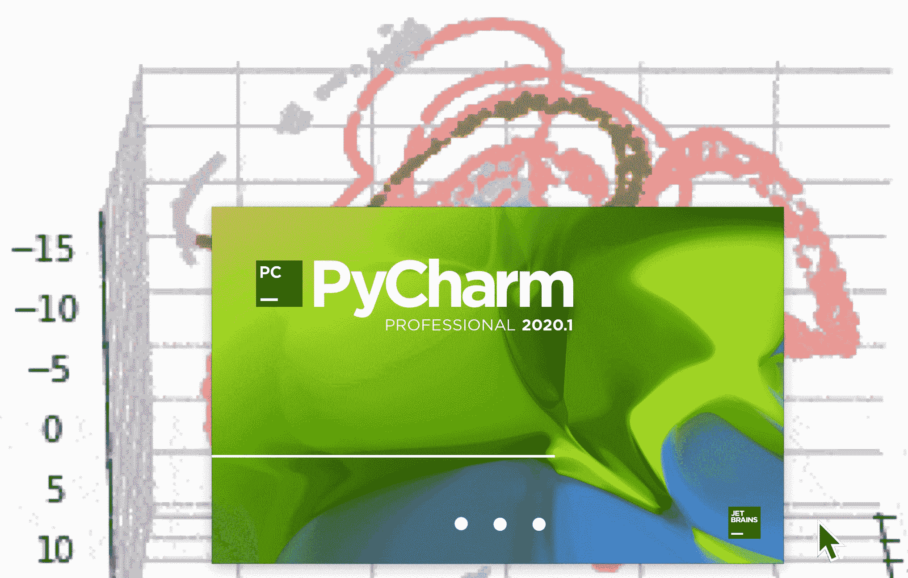
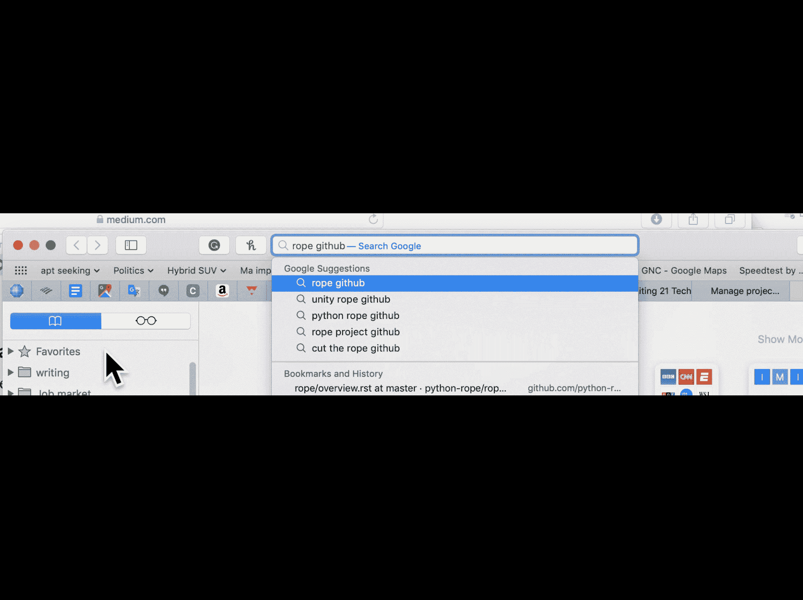
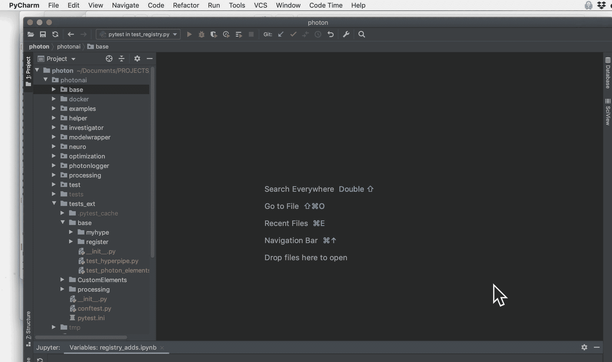
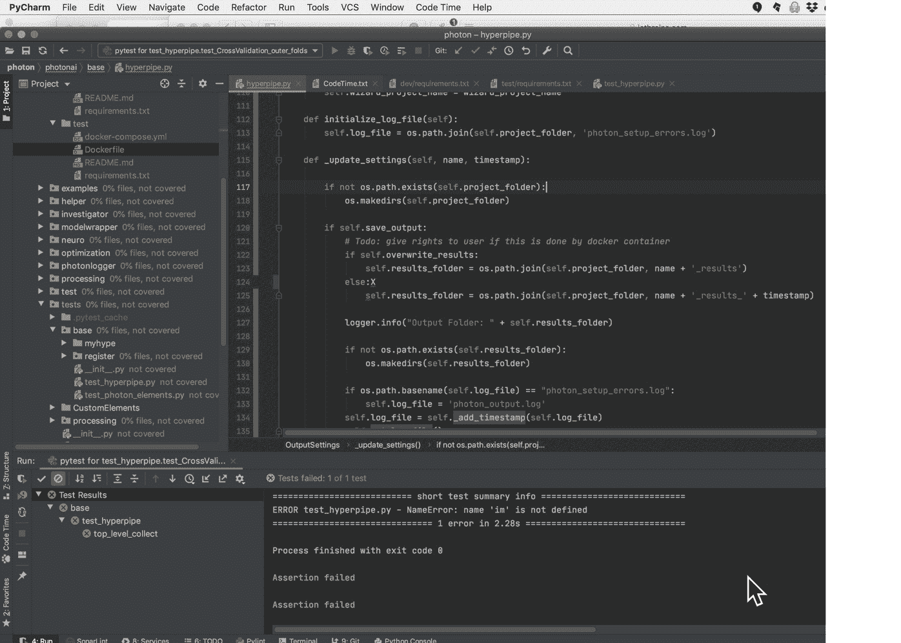
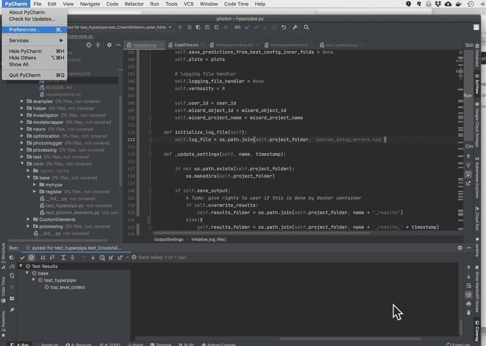
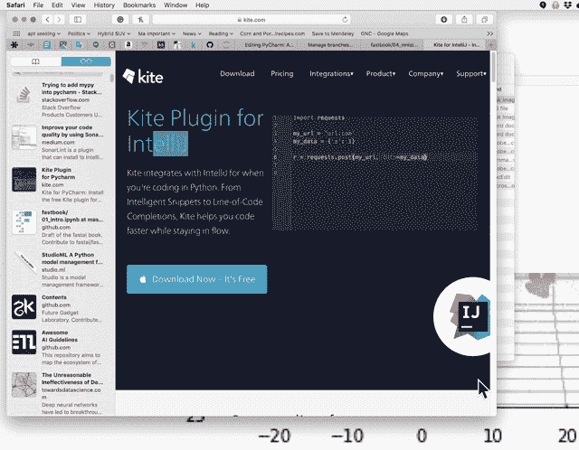

# Python 项目的十个 PyCharm 特性

> 原文：<https://itnext.io/ten-pycharm-features-for-python-projects-35c6029cf0d6?source=collection_archive---------2----------------------->

我展示了 PyCharm IDE 的十个可视化动画，用于创建新项目或增强现有项目。

PyCharm 列出了我的一些项目。

我是一个视觉学习者。如果你告诉我如何用视觉动画而不是用文字来描述，我会学得很快，记得更久。随函附上 PyCharm 的十个可视化动画，用于创建新项目或增强现有项目。

# 计算机编程语言

在过去的七年里，我们主要(90%)使用 Python，因为:

*   几乎所有新的机器学习模型，云，GPU 和许多其他平台都可以作为 Python 包使用。
*   免费代码和包的种类和数量是我们见过的最大的。
*   原生 Python 比 C 慢 20 多倍，但是几乎所有的 Python 包都接近 C 的速度，因为它们是 CPython 上的瘦 API，或者使用一些其他的性能增强技术。

在这篇博客文章的其余部分，我只讨论与 Python 相关的 ide。

# 集成开发环境(IDE)

对于 Python IDE，我们使用这四个好的选择。我们结合使用了:

*   [Jupyter 笔记本或 JupyterLab](https://jupyter.org/index.html) 和
*   [PyCharm](https://www.jetbrains.com/pycharm/) 或 [VS Code](https://code.visualstudio.com/)

## Jupyter 笔记本或 JupyterLab

Jupyter Notebook 或 JupyterLab 使您能够嵌入文本、嵌入代码和交互式运行代码。它们基于实验笔记本。

## PyCharm 或 VS 代码

PyCharm 和 VS Code 是 Python 最流行的 ide(交互式开发环境)。

我们使用 PyCharm(或 VS 代码)进行开发、文档、测试和调试。两者都集成了内联文档格式、版本控制(Git 或 GitHub)、测试包、覆盖率、linters、类型提示检查器和代码格式。

我在这个博客中使用 PyCharm。所有使用的例子也适用于 VS 代码。

*注:四月。2020 版 PyCharm Professional 现在支持 Jupyter。我在虚拟环境中展示 Jupyter(Docker 图片)。*

 [## 将 Jupyter 笔记本扩展添加到 Docker 映像

### 我们的 Jupyter Python 和 R 用户的 Docker 映像要求他们在每隔…之后设置他们的 Nbextensions 首选项

towardsdatascience.com](https://towardsdatascience.com/adding-jupyter-notebook-extensions-to-a-docker-image-851bc2601ca3) 

*注:我用的是麦金塔电脑。在 Windows 或 Linux 上可能有所不同。还有，我用 PyCharm Professional。免费版将不会有一些显示的功能。*

图 1: PyCharm 开始屏幕

## 用于项目设置的 PyCharm 动画

我使用 PyCharm 为两个不同的开源包**、**、[、](https://github.com/python-rope/rope)、和**、**、[、Photonai](https://github.com/bcottman/photon) 、**展示 Python 项目启动操作。**

*为什么*，你在 PyCharm 中选择指挥官的动机取决于你的方法、战略和战术。我关注的是*在 PyCharm **:** 中你需要做什么来完成这些日常动作*

1.  创建项目；
2.  设置项目行为。

# 创建项目

## 1.从本地文件系统创建项目

PyCharm 帮助文本:[https://www . jetbrains . com/Help/py charm/creating-empty-project . html](https://www.jetbrains.com/help/pycharm/creating-empty-project.html)

> 要创建项目，请执行以下操作之一:
> 
> 从主菜单中选择**文件|新建项目**
> 
> 在[欢迎屏幕](https://www.jetbrains.com/help/pycharm/welcome-screen.html)上，点击**创建新项目**
> 
> **新建项目**对话框打开。
> 
> … 5 步以上

动画显示了从 PyCharm 的本地目录添加新项目 Photonai。

**动画**

从本地目录创建 **PyCharm Photonai** 项目。瑞秋·科特曼的动画

## 2.从 Github Repo 创建项目

如果你的目标是为托管在 **GitHub** 上的项目做贡献，推荐的方法是`git clone <GitHub-project-URL>`进入一个本地目录。

**PyCharm** 帮助文本[:https://www . jetbrains . com/Help/py charm/manage-projects-hosted-on-github . html](https://www.jetbrains.com/help/pycharm/manage-projects-hosted-on-github.html)

注意:您可以直接从 PyCharm 克隆您想要贡献的存储库，并基于它创建一个新项目。(编辑:10 步以上流程)

我通过克隆 GitHub 上托管的开源包 Rope 在 Pycharm 中创建了一个项目。

*注:取决于你的网速(我的是 150 Mb/秒)。从 GitHub repo 完成下载可能需要 60 秒左右的时间。*

**动画:**

从 Github Repo 创建一个本地 **Rope** 项目。瑞秋·科特曼的动画

## 3.将虚拟环境(Docker)配置为项目的 Python 解释器

我将 Jupyter IDE 和一些扩展放在 Docker 映像中，如:

 [## 将 Jupyter 笔记本扩展添加到 Docker 映像

### 我们的 Jupyter Python 和 R 用户的 Docker 映像要求他们在每隔…之后设置他们的 Nbextensions 首选项

towardsdatascience.com](https://towardsdatascience.com/adding-jupyter-notebook-extensions-to-a-docker-image-851bc2601ca3)  [## 我们将 Docker 企业解决方案的速度提高了一倍

### 我们收到了大量关于 Docker 解决方案 0.0.2 版本的反馈。反馈有一个共同的主题:只有 R&D…

dr-bruce-cottman.medium.com](https://dr-bruce-cottman.medium.com/a-docker-solution-for-the-test-groups-use-cases-8e8ed6c28e11)  [## 面向企业的 Docker 解决方案

### 这是一个关于我们公司推出 Docker 的故事。我展示我们的 Docker 和 Docker-Compose 解决方案。被警告…

medium.com](https://medium.com/swlh/a-docker-solution-for-the-enterprise-7b5d2942b43a) 

PyCharm 帮助文本[:](https://www.jetbrains.com/help/pycharm/manage-projects-hosted-on-github.html):[https://www . jetbrains . com/Help/py charm/creating-virtual-environment . html](https://www.jetbrains.com/help/pycharm/creating-virtual-environment.html)

> 在⌃⌥s**设置/首选项**对话框中，选择**项目<项目名称> |项目解释器**。

我展示了如何将 PyCharm 虚拟环境配置为 Docker(使用 Jupyter **)** 映像进行增强。

**动画**

为 PyCharm Rope 项目配置一个虚拟环境(Docker)作为 Python 解释器。瑞秋·科特曼的动画

# 设置项目行为

## 4.为项目配置 Jupyter

我每天大部分时间都住在 PyCharm，与 GitHub 合作进行地理上分布式的开源项目、产品编码、开发和运行测试套件或版本控制。

通过使 Jupyter 能够在 PyCharm 内的 Docker 中工作，我将三种环境合二为一，即 PyCharm 环境。

PyCharm 帮助文本:[https://www . jetbrains . com/Help/py charm/jupyter-notebook-support . html](https://www.jetbrains.com/help/pycharm/jupyter-notebook-support.html)

> PyCharm 中的笔记本支持包括:
> 
> 编辑和预览:
> 
> 单元执行输出和降价内容的实时预览。
> 
> 自动保存您在文件中所做的更改。保存由各种事件触发，例如，关闭文件或项目，或者退出 IDE。
> 
> 错误和语法[高亮显示](https://www.jetbrains.com/help/pycharm/code-inspection.html)。
> 
> [代码完成](https://www.jetbrains.com/help/pycharm/auto-completing-code.html)。
> 
> 能够[运行单元格](https://www.jetbrains.com/help/pycharm/running-jupyter-notebook-cells.html)并预览执行结果。
> 
> 专用 [Jupyter 笔记本调试器](https://www.jetbrains.com/help/pycharm/running-jupyter-notebook-cells.html#debug-notebook)。
> 
> Jupyter 笔记本基本操作的快捷方式。
> 
> 识别能力。ipynb 文件，并用

为 PyCharm 配置 Jupyter 需要两个步骤:

1.  将 Jupyter 放置在您的环境中，如上面的动画所示，*“为项目配置 Jupyter”*；
2.  然后我将 PyCharm *项目 Jupyter 服务器*配置为*dockered Jupyter**链接的 URL。注意 Jupyter 是从`8889`而不是`8888`发出的。港口`8888`保持自由。*

**注意:每次启动时，必须在本地 docker 目录中启动 Docker 镜像 docker-compose up。例:* `*˜/PROJECTS/photon/photonai/docker/dev/*`*

*注意:每次你建立一个新的 docker 映像。docker-在本地 Docker 目录中构建构建。例如: `*˜/PROJECTS/photon/photonai/docker/dev/*` *你必须为 PyCharm 配置 Jupyter，如下图动画所示。**

*如果你没有，那么你在端口`8889`上使用一个不再被接受的旧令牌引用 Jupyter 。*

***动画***

**

*在 **PyCharm** 中为一个项目配置 **Jupyter** 。瑞秋·科特曼的动画*

## *5.显示鼠标移动的文档*

*在 PyCharm 中，我可以显示任何方法或函数的 docstring，以查看参数的正确签名和类型。从那里，我经常，`Show Source`，它直接把我带到一个项目的文件和那个文件中的源代码。*

* [## 代码参考信息-帮助| PyCharm

### 本节介绍如何查看符号定义、显示文档参考以及使用视图参数…

www.jetbrains.com](https://www.jetbrains.com/help/pycharm/viewing-reference-information.html) 

> 在**设置/首选项**对话框⌃⌥S 中，转到**编辑器|代码编辑|快速文档**并勾选**鼠标移动时显示快速文档**复选框。

下面显示了鼠标悬停时函数、方法或类的签名和 docstring(如果存在)。
注意:您可以点击文档弹出窗口最右侧的垂直省略号，在 4 个选项中进行选择。其中一个选项是关闭`show documentation.`

**动画**

在 **PyCharm** 中显示`os.makedirs`的鼠标悬停文档。瑞秋·科特曼的动画* 

## *6.管理插件*

*我安装了`Materials Design UI`，它显示了一种新的图形布局风格。请注意，在项目 **Photonai** 目录的最左侧显示中，一些文件图标的显示发生了变化。*

***PyCharm** 帮助文本:[https://www . jetbrains . com/Help/py charm/managing-plugins . html](https://www.jetbrains.com/help/pycharm/managing-plugins.html)*

*大多数插件可以用于任何 JetBrains 产品。有些仅限于商业产品。有些插件需要单独的许可证。*

*如果一个插件依赖于其他插件，PyCharm 会通知你依赖关系。如果你的项目依赖于某些插件，把它们添加到必需插件的列表中。*

*默认情况下，PyCharm 包含几个捆绑插件。您可以禁用捆绑插件，但不能移除它们。您可以从插件库或本地归档文件(ZIP 或 JAR)安装附加插件。*

*注意:你可以左键点击一个插件的标题来查看它的文档。*

**注意:安装或卸载插件后，必须重启 PyCharm。**

***动画:***

**

*管理 **PyCharm** 的插件。瑞秋·科特曼的动画*

## *7.选择测试框架*

*PyCharm 默认的测试框架是动画中的`Unittests.`，我将测试框架设置为`pytest`。*

*PyCharm 帮助文本:[https://www . jetbrains . com/Help/py charm/choosing-your-testing-framework . html](https://www.jetbrains.com/help/pycharm/choosing-your-testing-framework.html)*

> *1.打开**设置/首选项**对话框(按⌃⌥S)，在**工具**节点下，点击 [Python 集成工具](https://www.jetbrains.com/help/pycharm/settings-tools-python-integrated-tools.html)页面。*
> 
> *2.在这个页面上，点击**默认测试运行器**字段。*
> 
> *3.选择所需的测试跑步者:*

***动画:***

**

*在项目 Photonai 1.1.0 的 Pycharm 中将测试框架设置为 [pytest](https://pytest-cov.readthedocs.io) 。瑞秋·科特曼的动画*

## *8.为项目配置文档样式*

*PyCharm 列出了五种受支持的样式。我对 docstrings 使用****Numpy**样式，因为它适合于类、方法、函数和参数的详细文档。*******

*******PyCharm 帮助文本:[https://intellij-support . jetbrains . com/HC/en-us/community/posts/115000784410-how-to-change-py charm-default-commenting-style-for-function-](https://intellij-support.jetbrains.com/hc/en-us/community/posts/115000784410-how-to-change-pycharm-default-commenting-style-for-function-)*******

> *******您可以在**设置|工具| Python 集成工具|文档字符串格式**中切换文档字符串样式*******

*****我将 docstring 样式设置为`Numpy.`*****

*******动画*******

**********

*****PyCharm 将项目 **Photonai** 1.1.0 的 docstring 样式设置为 Numpy。瑞秋·科特曼的动画*****

## *****9.为项目配置代码段以完成代码行*****

*****在用 Python 编码时，Kite 与 PyCharm 集成了升级的(IMHO)自动完成体验。您可能同意它改善了 PyCharm 显示项目目录布局的外观。*****

*****PyCharm 帮助文本:[https://kite.com/integrations/intellij/](https://kite.com/integrations/intellij/)*****

*****左侧显示发生变化:*****

1.  *****每个目录名和每个文件名之间的垂直间距是 1.5 行(1.0 行)；*****
2.  *****现在每个文件名上都有文件类型的徽标。不错！*****

*******动画*******

**********

*****为项目添加风筝 **Photonai** 1.1.0。由瑞秋·科特曼制作的动画*****

## *****10.添加外部工具:使用黑色格式化*****

*****PyCharm 可以运行外部工具进行格式化。我使用黑色的**、**，将一个`.py`文件或整个项目格式化成符合 PEP-8 **、**的格式**。**结果是所有文件的格式都相同。后续结果增加*可读性* **。*******

*****PyCharm 帮助文本:[https://www . jetbrains . com/Help/py charm/configuring-third-party-tools . html](https://www.jetbrains.com/help/pycharm/configuring-third-party-tools.html)*****

*****您可以将独立的第三方应用程序定义为外部工具，并从 PyCharm 运行它们。*****

*****您可以将项目中的上下文信息作为命令行参数传递给外部工具(例如，当前选定或打开的文件、项目源路径等)，查看工具生成的输出，配置在运行/调试配置之前启动工具，等等。*****

*****下面的动画展示了 PyCharm 外部工具的使用。Black 将所有文件格式化为 Photonai 项目中的 *PEP-8* 标准。*****

******可读性*是 Python **的主要目标之一。** *PEP-8* 是通过遵循标准格式样式来提升*可读性*的标准。Black 完全自动格式化，这样开发人员就可以从繁琐的任务中解脱出来。*****

*******动画:*******

**********

*****将 Photonai 1.1.0 项目中的所有文件用黑色格式化为 PEP-8 标准。瑞秋·科特曼的动画*****

# *****资源*****

***** [## 开始

### 如何快速上手 PyCharm

www.jetbrains.com](https://www.jetbrains.com/help/pycharm/quick-start-guide.html)  [## PyCharm 博客

### py charm——面向专业开发人员的 Python IDE

blog.jetbrains.com](https://blog.jetbrains.com/pycharm/)***** 

# *****结论*****

*****有像我一样的视觉学习者，他们更喜欢视觉动画而不是文本。我提供了一些 PyCharm 的可视化动画来创建一个新项目，并设置与项目相关的编码生命周期工具。*****

*****我将这些动画收集到一篇博客文章中，对我在 PyCharm 的工作有用。希望对你有所裨益。*****

*****让我知道这是否有帮助，以及你想看到的其他工具视觉动画。*****

*****编码快乐！*****