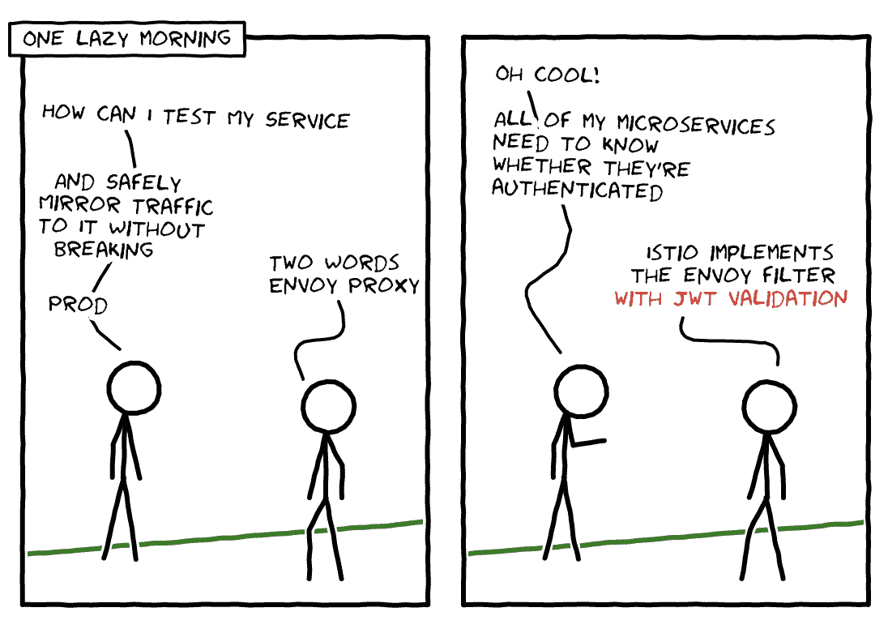
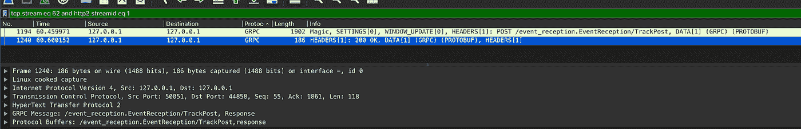
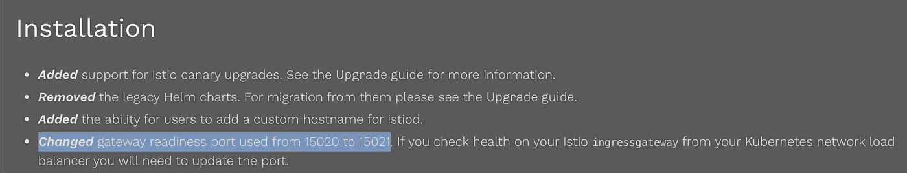

# 在生产中运行 Istio 的十个技巧

> 原文：<https://itnext.io/ten-tips-for-running-istio-in-production-4ea2b158440a?source=collection_archive---------4----------------------->

如果你已经阅读了所有的 pasta BookInfo 博客帖子，这里有十个关于 Istio 的建议，可能会帮助你在 Istio 和 Envoy Proxy 领域获得博士学位。



我们是如何选择 Istio 的

1.  使用 [Kubectl Sniff](https://github.com/eldadru/ksniff) 和[Wireshark](https://www.wireshark.org/)——如果你没有在夏天的网上跌跌撞撞和开车，你可能没有听说过 Wireshark。Sniff 提供了一种抽象，允许您通过 Wireshark 监听进出 Istio 代理的数据包。Sniff 非常适合于低级分析，允许您隔离应用程序级与特使级问题的根本原因。首先在您的 IstioOperator CRD 上启用特权模式`global.proxy.privileged=true`,并将以下注释添加到您的部署中。

```
apiVersion: apps/v1
kind: Deployment
metadata:
  name: reception
spec:
  template:
    metadata:
      annotations:
        sidecar.istio.io/capNetBindService: "true"
```

在 Wireshark 中，您可以启用对 GRPC 请求的[捕获](https://www.ridingthecrest.com/blog/2018/10/29/wireshark-getting-started.html)，并基于它们进行过滤，以及“跟踪”请求的生命周期以确定其进入和离开。本地端口转发您的服务，并使用 [BloomRPC](https://github.com/uw-labs/bloomrpc) 或 [Postman](https://www.postman.com/downloads/) 来隔离连接问题。



在 Wireshark 中过滤 GRPC 请求

2.先用特使。通过在本地 docker-compose 文件中运行 Envoy 来了解如何配置 Envoy 过滤器链，可以更容易地对请求镜像或 WASM 等更改进行原型化。在将 Envoy 转换为 Istio 配置的过程中，树立对其理解的信心会有所收获。

3.虔诚地阅读发行说明。这是值得重申的，因为在过去，我们已经错过了发布说明上光的关键变化。在我们之前的 Istio 升级期间，我们错过了一个看似良性的更改，即特使状态端口被修改(15020 -> 15021)，导致我们认为我们的负载平衡器不健康。



Istio 网站上的发行说明和升级指南

4.在 Istio 操作符上使用 Istioctl 生成清单——我们最近从 1.6 -> 1.7 进行了升级，注意到操作符由于结构的变化而无法完成其协调循环(label-> labels in kind:envoy filter)。我们期望运营商能够以向后兼容的方式处理这种升级。对于没有通过操作符 CRD 公开的字段(例如:服务注释)，通过 Istio Overlay API 或 Kustomize 可以更容易地操作生成的清单。

```
apiVersion: networking.istio.io/v1alpha3
kind: EnvoyFilter
metadata:
  name: wasm-hmac
spec:
  workloadSelector:
    labels: # labels, not label
      app: pubsub-gateway
```

5.当您找到一个示例清单时，请确认该示例与代理容器中的 Envoy API/Protobuf 版本一致。对于一些关键特性，与最新的 Envoy 相关的 typed_config 示例记录得很少。

```
patch:
     operation: INSERT_BEFORE
     value:
       name: envoy.filters.http.wasm
       typed_config:
         "@type": type.googleapis.com/udpa.type.v1.TypedStruct
         type_url: type.googleapis.com/envoy.config.filter.http.wasm.v3.Wasm
         value:
           config:
             name: "signature_auth"
             root_id: "signature_auth"
             configuration:
               "@type": "type.googleapis.com/google.protobuf.Struct"
               value:
                 signing_key: ""
                 signature_header: "X-My-Hmac-Header-SHA256"
             vm_config:
               runtime: "envoy.wasm.runtime.v8"
               code:
                 local:
                   filename: "/etc/wasm/your-binary.wasm"
               allow_precompiled: true
```

6.如果您使用 Istio Ingress 网关作为 GKE 上集群的入口，并希望启用 HTTPS，请使用 Istio Ingress 网关服务的单个上游设置一个入口对象。添加静态 IP 计算地址、托管证书和 BackendConfig(以设置运行状况检查)，以便通过负载平衡器提供安全访问。这里有一个关于这个话题的[教程](https://cloud.google.com/solutions/exposing-service-mesh-apps-through-gke-ingress)。

7.请求镜像是一种“生产测试”的强大手段。如果您在安装中启用了此功能，并且无法解释为什么下游服务会拒绝请求，请查看您的主机头。[特使将“-阴影](https://www.envoyproxy.io/docs/envoy/latest/api-v2/api/v2/route/route_components.proto#route-routeaction-requestmirrorpolicy)”附加到你的主机头。如果您使用的是 [vanilla Envoy](https://github.com/envoyproxy/envoy/issues/9094#issuecomment-565380693) ，您可以通过创建一个单独的监听器来解决这个问题。通过 Istio 重写这个头在 Istio 中不太可行，所以我们选择添加一个单独的 Envoy 部署来将头重写到我们想要的目的地。

同样，如果您正在使用`istio-ingressgateway`在边缘实现请求镜像，并且希望在集群中实现镜像，那么将本地服务名和关键字`mesh`添加到您的 virtualservice 中。

```
kind: VirtualService
metadata:
  name: mirror-policy
  namespace: your-app
spec:
  gateways:
    - istio-system/your-gateway
    - mesh
  hosts:
    - 'your-service.your-app.svc.cluster.local'
    - 'your-api.dot.com'
```

8.JWT 验证提供了一个有趣的抽象，允许您的服务知道它是否经过身份验证。与基于工作负载选择器标签方案选择退出相比，不得不“选择加入”可能公开的经过身份验证的服务似乎是有风险的。使用 Open Policy Agent 等工具在您的工作负载上强制执行所需的标签，以确保所有服务上都有身份验证标签。此外，当您在 JWTRule 上启用“outputPayloadToHeader”来传播上下文时，预计负载在被服务使用时会缺少 base64 填充。

9.GRPC JSON 代码转换是一个方便的抽象，节省了工程师编写助手代码将 JSON 代码转换成 GRPC 代码的时间。然而，将变更部署到原型描述符的过程似乎有点笨拙。我们最初的解决方法包括对我们的原型描述符进行 base64 编码，并将其作为一个秘密挂载。这很快变得难以处理，因为每当 Protobuf 定义发生变化时，没有工程师愿意对二进制文件进行 base64 编码。一种稍微好一点的方法是用您的描述符构建一个容器映像，并将其作为一个具有共享内存卷的 initContainer 来运行。在 pod 启动时，initContainer 会将二进制文件复制到共享卷空间中，并且 Istio 代理容器可以访问它。

```
apiVersion: apps/v1
kind: Deployment
metadata:
  name: reception
spec:
  template:
    metadata:
      annotations: # only good for prototyping!
        sidecar.istio.io/userVolumeMount: '[{"name":"my-cert", "mountPath":"/etc/envoy", "readonly":true}, {"name": "cache-volume", "mountPath":"/tmp"}]'
        sidecar.istio.io/userVolume: '[{"name":"my-cert", "secret":{"secretName":"event-reception-pb"}}, {"name": "cache-volume", "emptyDir":{}}]'
```

10.Envoy 提供了一种修改过滤器的虚拟主机特定配置的方法。用 Istio 术语来说，这意味着能够改变特定虚拟主机路径上现有过滤器的功能。该功能适用于那些声称支持每条路由配置的[的特定过滤器，但不适用于 WASM 等过滤器。](https://www.envoyproxy.io/docs/envoy/latest/configuration/http/http_filters/http_filters#config-http-filters)

额外收获:如果你必须添加一个标签，它可能是 pod 模板规范标签，而不是部署标签。使用 istioctl analyze 为您提供低挂水果修复。