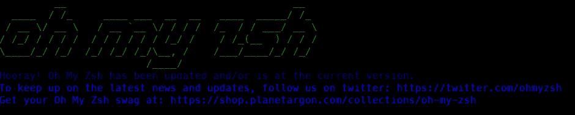
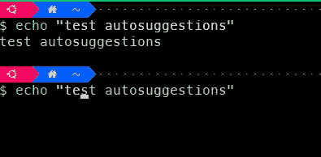
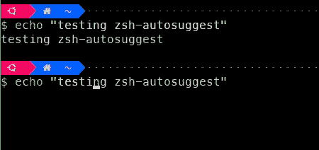
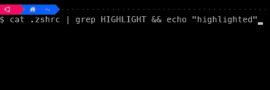
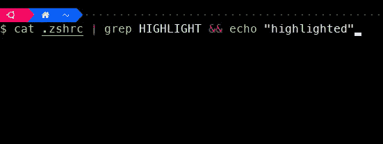
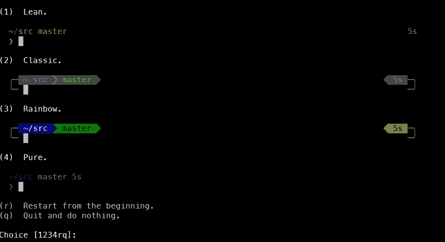
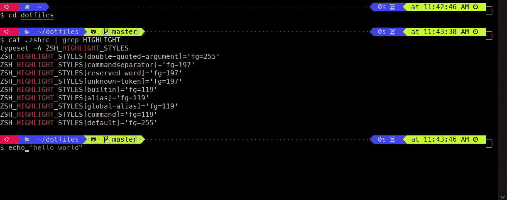

# 终端 101 —将促进您工作流程的设置指南

> 原文：<https://itnext.io/terminal-101-the-setup-guide-that-will-boost-your-workflow-12df2570052?source=collection_archive---------0----------------------->

## 指南和提示

## 让您的 MAC/Linux/Windows 终端更上一层楼


照片由[詹姆斯·哈里逊](https://unsplash.com/@jstrippa?utm_source=medium&utm_medium=referral)在 [Unsplash](https://unsplash.com?utm_source=medium&utm_medium=referral) 拍摄

我们都使用终端。

事实上，它让我们可以做大多数没有它也能做的事情，但通常是以更快更简单的方式。

从基本的系统操作到运行复杂的脚本，绝对是每个程序员都应该知道的工具**。**

在本指南中，我们将通过**安装&设置**，展示**最有用的命令**，通过**设置别名**来缩短命令并提高速度！

> 剧透提醒:结尾有加分部分！

# 选择并安装终端

首先，我们需要安装和设置我们的终端，以便能够定制它。

## 对于 Linux

可以使用 Linux 的默认终端，但是有朋友推荐的一个是 [Linux Terminator](https://terminator-gtk3.readthedocs.io/en/latest/) 。尽管可能有许多其他终端版本可用，但这个版本做得很好。

## 对于 Mac

Mac 的默认终端也很好，但是通过使用 [iTerm2](https://www.iterm2.com/) 有一个非常好的改进。分割窗格，搜索，甚至粘贴历史，ITerm2 让你无所不能。

您有两种安装方式:

*   或者去[下载区](https://www.iterm2.com/downloads.html)，下载你想要的版本，然后拖到应用文件夹
*   或者干脆用[自制](https://brew.sh/) : `brew cask install iterm2`安装

## 对于 Windows

这就是变得更棘手的地方..或者不是真的。Windows 使得使用 WSL 变得越来越可能，现在设置它并不困难。我强烈推荐[这个教程来设置](https://scotch.io/bar-talk/trying-the-new-wsl-2-its-fast-windows-subsystem-for-linux)。

然后你会想下载并安装**新的 Windows 终端**，标准的 Windows 终端[远不及这个漂亮的 Windows 终端](https://www.microsoft.com/fr-fr/p/windows-terminal/9n0dx20hk701#activetab=pivot:overviewtab)。

现在我们已经安装了终端，我们需要选择我们的**外壳。**

# 将 Zsh 设置为默认 Shell

我们将使用 [Zsh](https://en.wikipedia.org/wiki/Z_shell) ，因为它只是将**交互性和定制**带到了一个新的层次，同时保留了 Bash 的**脚本**功能。

如果你有 Linux 发行版或者遵循了 Windows 教程，你肯定有一个默认的 [Bash shell](https://en.wikipedia.org/wiki/Bash_(Unix_shell)) 。对于 Catalina 之前的 macOS 版本，情况也是如此。对于新版本，幸运的是，苹果已经选择将 Zsh 作为默认外壳。

**对于 Linux 或 Windows WSL** :

`apt install zsh`

**适用于苹果电脑(如果你还没有的话):**

`brew install zsh`

要使 **Zsh 成为默认 shell:**

`chsh -s $(which zsh)`

您可以通过运行以下命令来验证其安装:

`zsh --version && echo $SHELL`它应该会输出你刚刚安装的 Zsh 版本以及`/bin/zsh`

更多信息，[这里有一个链接](https://github.com/ohmyzsh/ohmyzsh/wiki/Installing-ZSH)，它可以帮助你使用其他的 Linux 发行版或者获得更多的详细说明。

# 安装和配置 OhMyZsh

然后我们将为 Zsh 配置安装 [OhMyZsh](https://ohmyz.sh/) 框架。

> 我们为什么需要它？

因为它是在像素精度水平上管理和定制终端的最佳工具。

我真的很喜欢他们在 Github 回购上的引用:

> OhMyZsh 不会让你成为 10 倍的开发者…但你可能会觉得自己是。

因此，首先确保您有`git`和`curl`或`wget`可用，并键入:

```
sh -c "$(curl -fsSL https://raw.githubusercontent.com/ohmyzsh/ohmyzsh/master/tools/install.sh)"
```

或者

```
sh -c "$(wget -O- https://raw.githubusercontent.com/ohmyzsh/ohmyzsh/master/tools/install.sh)"
```

安装完成后，您应该会看到修改后的终端界面，并显示如下消息:



作者图片

现在，OhMyZsh 有了几乎无限的选项，但是有两个重要的概念可以让你的 shell 变得令人惊叹:**插件和主题。**

# 您应该使用的插件

## [1—zsh-自动建议](https://github.com/zsh-users/zsh-autosuggestions)

这个是必须的，它基本上**预测你将要输入什么，**一旦你使用了它，你*就不能*回去了。

在这个简单的例子中，我们展示了 shell 记住了前面的命令，并且能够根据前缀查找来建议最佳命令:



作者图片



作者图片

```
git clone https://github.com/zsh-users/zsh-autosuggestions ${ZSH_CUSTOM:-~/.oh-my-zsh/custom}/plugins/zsh-autosuggestions
```

并将其添加到您的`.zshrc`文件中的`plugins`:

```
plugins=(git nvm **zsh-autosuggestions)**
```

## [2 — zsh 语法突出显示](https://github.com/zsh-users/zsh-syntax-highlighting)

这也是我的最爱之一，它为不同类型的命令提供了无限的颜色定制。这是它没有的样子:



作者图片

这是一个小配置:



作者图片

```
git clone https://github.com/zsh-users/zsh-syntax-highlighting.git ${ZSH_CUSTOM:-~/.oh-my-zsh/custom}/plugins/zsh-syntax-highlighting
```

并将其添加到您的`.zshrc`文件中的`plugins`:

```
plugins=(git nvm zsh-autosuggestions **zsh-syntax-highlighting)**
```

我只能说这些是必须的，但是你可以在这里看看更多的[很棒的 zsh 插件](https://github.com/unixorn/awesome-zsh-plugins)。

# 将会改变这一切的主题

现在是我最喜欢的定制终端的部分:**主题化！**

我认为这与为你的终端选择颜色和字体是非常个人化的事实有关，它在视觉上反映了“你是谁”。

我目前为止找到的最好的题材是 [Powerlevel10k](https://github.com/romkatv/powerlevel10k) (或者它的大哥 [Powerlevel9k](https://github.com/Powerlevel9k/powerlevel9k) )。



作者图片

它有数百万个配置选项，通过在你的命令旁边显示所谓的**提示**来节省你的时间，更重要的是，它会取悦你的眼睛！

要安装它，首先建议为您的终端获得推荐字体。

然后，对于 OhMyZsh 的例子:

```
git clone --depth=1 https://github.com/romkatv/powerlevel10k.git ${ZSH_CUSTOM:-~/.oh-my-zsh/custom}/themes/powerlevel10k
```

然后在你的`.zshrc`文件中:

```
ZSH_THEME="powerlevel10k/powerlevel10k"
POWERLEVEL10K_MODE="nerfont-complete"
```

然后，您应该会看到一个**配置向导**出现在您的下一个终端会话中(类似于上面显示的那个)，根据您的喜好定制您的终端！

如果您没有看到它或者希望更改您的配置，只需输入`p10k configure`，这将创建一个自定义的`.p10k.zsh`文件。

在这个文件中，你可以真正定制**显示的每一个细节，**这里有一个[列表，你可以尝试](https://github.com/Powerlevel9k/powerlevel9k/wiki/Show-Off-Your-Config)。

# 您可能想知道的命令

我们每天都在使用很多命令，这里有一个我发现非常有用的[列表](https://www.ubuntupit.com/best-linux-commands-to-run-in-the-terminal/):

## **1 —系统命令**

*   `df`用于显示文件系统上磁盘空间的基本信息
*   `ps`可视化您的机器上正在运行的进程
*   `kill`停止可能无法运行的进程
*   `batch`将按计划运行您定义的服务

## 2-文件命令

*   `touch`创建文件最优雅的方式
*   `cat`查看文件内容，重定向输出并创建新文件
*   将文件从一个目录复制到另一个目录比使用 Finder/explorer 更快
*   `less`在终端中浏览文件内容
*   `cmp`比较文件并将结果输出到标准流

## 3 —输入/输出和搜索

*   `find`直接从您的终端按多种标准搜索文件
*   `grep`经典，用于在文本文件中搜索模式
*   `sed`通过替换特定部件来操作任何文件
*   `echo`经典，输出你传递给标准输出的任何东西
*   `sudo`从您的帐户访问 root 权限
*   `chmod`修改文件的系统访问权限

# 设置别名以提高生产率

别名在优化重复性工作和命令时非常有用。

好消息是, **OhMyZsh 带有默认别名**,这已经可以节省你很多时间。这里有一个关于 git 的例子:

```
gcmsg='git commit -m'
gco='git checkout'
gcp='git cherry-pick'
gd='git diff'
gdct='git describe --tags $(git rev-list --tags --max-count=1)'
gdcw='git diff --cached --word-diff'
gf='git fetch'
gfa='git fetch --all --prune'
gfg='git ls-files | grep'
gfo='git fetch origin'
...
```

如果您想知道我是如何看到 OhMyZsh 默认设置的别名的，只需在您当前的终端会话中键入`alias`即可列出所有当前设置的别名。

一般来说，尝试按照别名服务的工具对别名进行分组是一个很好的做法**(在上面的例子中是 *git* )，这样你不仅可以针对那些你知道经常使用的别名，还可以确保你不会忘记任何别名。**

如果您经常使用，可以为 [Docker](https://www.docker.com/) 设置一些:

```
# Get latest container ID
alias dl="docker ps -l -q" 
# Get container process
alias dps="docker ps" 
# Get process included stop container
alias dpa="docker ps -a" 
# Get images
alias di="docker images" 
# Get container IP
alias dip="docker inspect --format '{{ .NetworkSettings.IPAddress }}'" 
```

最终，这归结于个人喜好，但是这里有一个方便的链接可以帮助你找到真正有用的。

# 奖金

## OhMyZsh 插件

实际上，OhMyZsh 框架有很多可用的插件。

这些真的可以帮助你**提升你的日常工作流程，**所以[这里有一个所有这些的链接](https://github.com/ohmyzsh/ohmyzsh/tree/master/plugins)，你可以从中挑选适合你的。

## Zsh 配置

有了上面提到的*zsh-syntax-highlighting*插件，你实际上可以**完全定制每种类型命令的颜色**。

例如，如果您喜欢，您可以将所有的`git`、`npm`或`docker`命令显示为绿色，所有的参数都必须在`.zshrc`文件中引用:

```
# Declare the variable
typeset -A ZSH_HIGHLIGHT_STYLESZSH_HIGHLIGHT_STYLES[double-quoted-argument]='fg=255'
ZSH_HIGHLIGHT_STYLES[commandseparator]='fg=197'
ZSH_HIGHLIGHT_STYLES[reserved-word]='fg=197'
...
```

如果你喜欢我的配置，[这里有一个链接](https://github.com/alexZajac/dotfiles/blob/master/.zshrc)指向我的`.zshrc`文件。

## 更快地编辑您的文件

嗯，有很多方法可以编辑你的文件。

即使 [VSCode 正在获得很大的吸引力](https://insights.stackoverflow.com/survey/2019#technology-collaboration-tools-professional-developers2)并且可能是目前最受欢迎的 IDE 之一，也不可能与 VIM、EMacs 或 nano 等内联文本编辑器相提并论。

我用的最多的是 [Vim](https://www.vim.org/) ，因为我是用它开始的，不过只是个人喜好问题。

即使我没有广泛使用，你也可以用它做很多事情。一个特殊的配置使它运行在类固醇上: [**vimrc**](https://github.com/amix/vimrc) 。

## 配置 Powerlevel10k

正如我所写的，Powerlevel10k 将**令人惊叹的定制水平**带到了您的手中。

您可以添加、更改或删除**多个提示元素**以满足您的需求，并取悦您的眼睛！



如果你喜欢我的提示元素的组织和主题，请随意点击这里的`.p10k.zsh`文件[！](https://github.com/alexZajac/dotfiles/blob/master/.p10k.zsh)

因为终端是我们工作流程的核心，所以关于终端还有无数的事情要写,但是今天我就讲到这里！

今天到此为止，伙计们！你可以随时给我发邮件[](mailto:dev@alexandrezajac.com)**联系我*[***Linkedin***](https://www.linkedin.com/in/alexandre-zajac/)*或者访问我的 [***GitHub 项目***](https://github.com/alexZajac) 。****

****

**黑客快乐！**