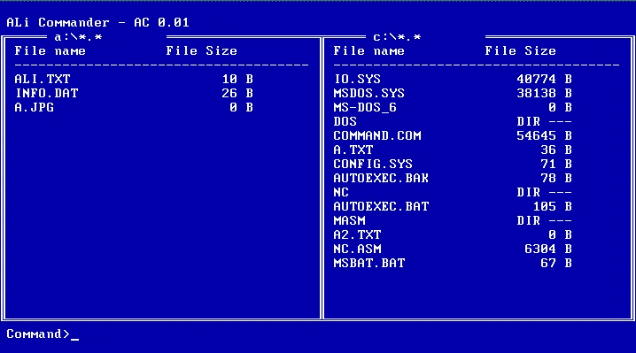
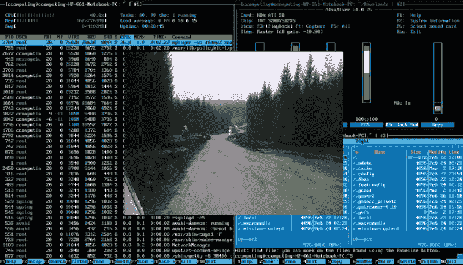
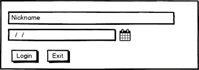
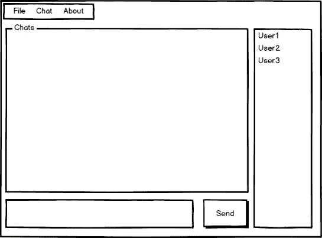
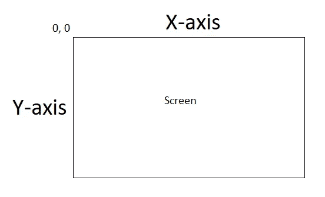
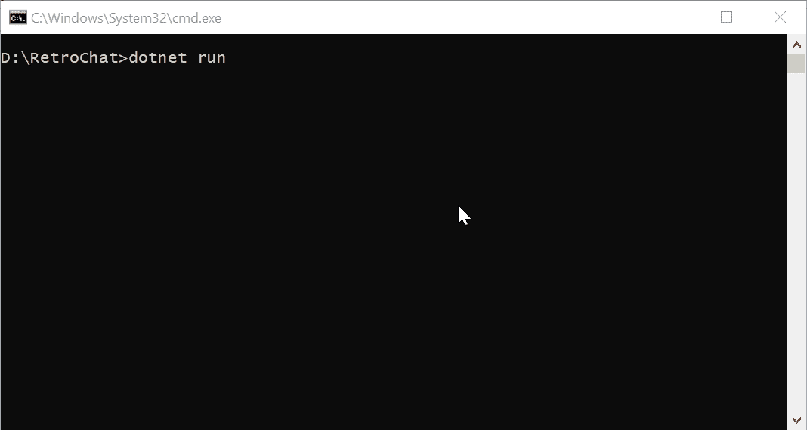
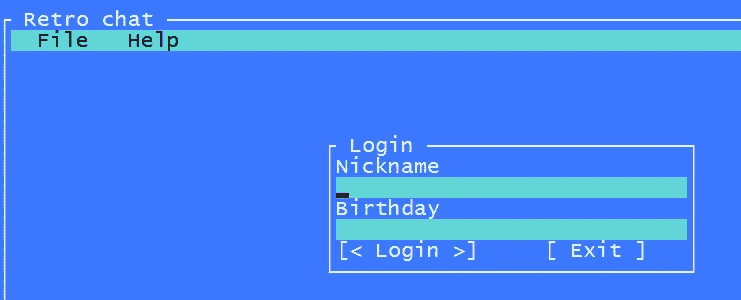
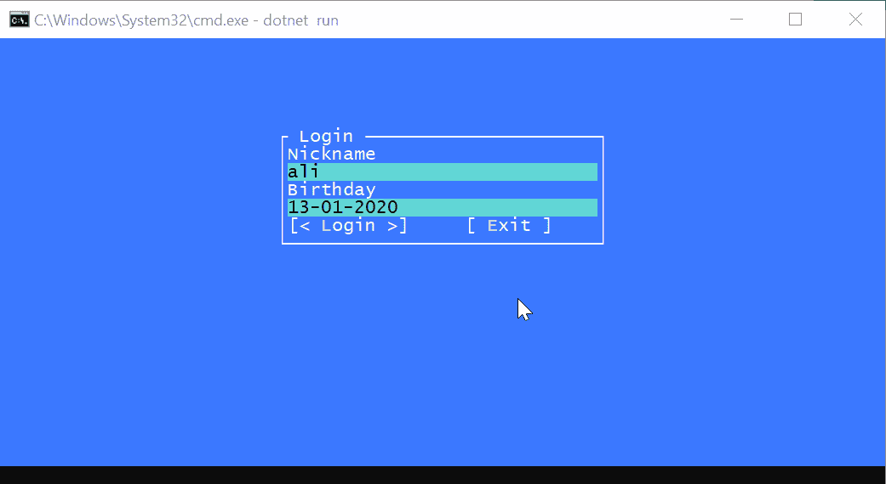
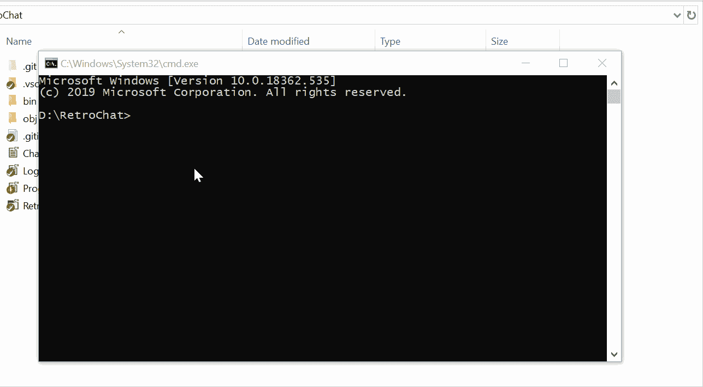

# 终端/控制台用户界面。网络核心

> 原文：<https://itnext.io/terminal-console-user-interface-in-net-core-4e978f1225b?source=collection_archive---------2----------------------->

我们并不总是使用桌面环境来与应用程序交互。有时(或者可能总是)我们进入计算机/服务器并在终端内执行我们的命令。

基于终端/控制台的 GUI 不像一个丰富的桌面/移动应用程序那样有图像和复杂的组件，它都是关于字符的。我在大学的时候，对于系统编程语言课程，我们要用 [x86 汇编语言](https://en.wikipedia.org/wiki/X86_assembly_language)写一个类似[诺顿指挥官](https://en.wikipedia.org/wiki/Norton_Commander) (NC)的应用。



Ali Commander(AC)——我的 NC，我几年前用 x86 汇编写的

那时，编写基于控制台的应用程序对我来说只是将 ASCII 字符打印到屏幕上，**但它不仅仅是字符。**

在本文中，我将介绍:

1.  基于终端/控制台的应用程序如何工作？
2.  介绍[图形用户界面。CS](https://github.com/migueldeicaza/gui.cs) ，一个简单的 UI 工具包。网，。网芯和 Mono。
3.  用 Gui.cs 实现项目

****

## 基于终端/控制台的应用程序是如何工作的？

终端显示有两种模式，**帧缓冲**和**文本模式**:

**文本模式**:是一种终端显示模式，内容在显示器上用[字符](https://en.wikipedia.org/wiki/Character_(computing))而不是单个[像素](https://en.wikipedia.org/wiki/Pixel)来表示。从字面上看，屏幕将被认为是一个统一的[矩形网格](https://en.wikipedia.org/wiki/Rectangular_grid)的字符单元。在文本模式下，应用程序可以使用字符在终端上显示它们的用户界面。例如，IBM PC 代码页 437 提供了几个字符，比如框形绘制字符(像边、线等)，许多应用程序用它们来绘制 UI。例如，在这里(或者在 Ali Commander 中),我使用盒形绘制字符来绘制我的 UI。

```
╔══════════════════════════════════════════╗
╟──────────────────────────────────────────╢
║ Progress                          25%    ║
║ ▓▓▓▓▓▒▒▒▒▒▒▒▒▒▒▒▒▒▒▒▒▒▒▒▒▒▒▒▒▒▒▒▒▒▒▒▒▒▒▒ ║
║                                          ║
║ ┌────┐  ┌────────┐                       ║ 
║ │ OK │  │ Cancel │                       ║
║ ╘════╛  ╘════════╛                       ║   
╚══════════════════════════════════════════╝
```

[**frame buffer**](https://www.kernel.org/doc/Documentation/fb/framebuffer.txt)**:**在显示器上显示图形的图形硬件无关的抽象层。不像文本模式，帧缓冲区使用图形，像素。帧缓冲区在 Linux 终端上使用。以下是一个帧缓冲模式的示例:



奶牛计算博客的 Framebuffer

写一个基于控制台的 GUI 是困难的，因为你需要记住很多东西，物体的位置，像素，字符，知道什么时候重新绘制，最糟糕的是图层。想象一下，你需要打开一个提示来请求用户输入，你需要在你的应用程序上覆盖提示对话框，这太疯狂了！

而且不是一切都是绝对的！你需要知道终端/控制台的高度和宽度。默认的(文本模式)MS-DOS 显示是 80 列 25 行。这很容易，你可以保持一切固定，但现在终端模拟器和控制台的大小可以变化，用户可以自定义它们。

除了所有的困难之外，要创建一个基于控制台的应用程序，你需要计算所有的百分比，以使其响应迅速！

我们知道了一些关于基于终端/控制台的应用程序的信息，是时候写一些代码了。

## 的终端用户界面工具包。网

Gui.cs 是一个 ui 工具包，用于使用. NET 创建令人惊叹的基于控制台的应用程序。他是这样介绍它的工具的:

> 这是我在 2007 年为 [mono-curses](https://github.com/mono/mono-curses) 编写的 [gui.cs](http://tirania.org/blog/archive/2007/Apr-16.html) 的更新版本。
> 
> 最初的 gui.cs 是一个 ui 工具包，放在一个文件中，与 curses 绑定在一起。这个版本尝试与控制台无关，而不是有一个容器/小部件模型，只使用视图(可以包含子视图),并更改渲染模型以依赖损坏区域，而不是用细节来加重每个视图的负担。
> 
> —米盖尔·德·伊卡萨[https://github.com/migueldeicaza/gui.cs](https://github.com/migueldeicaza/gui.cs)

**功能:**

*   丰富的组件集，如按钮、标签、文本输入、文本视图、时间字段、单选按钮、复选框、对话框、窗口、菜单、列表视图、框架、进度条、滚动条、滚动视图和十六进制编辑器/查看器。
*   良好的 [API 文档](https://migueldeicaza.github.io/gui.cs/api/Terminal.Gui.html)
*   [NuGet 包](https://www.nuget.org/packages/Terminal.Gui)
*   支架*。网*，*。网芯*和*单声道*。
*   可在 Windows、Linux 和 MacOS 上运行。
*   鼠标和键盘输入

工具包库设计得很好，也很容易使用，但在这一切之前，我们需要学习一些信息和概念。

## 建筑和设计

**Gui.cs** 是一个基于文本的工具包，但是它以类似于图形工具包的方式提供 Gui。屏幕上的每个可见元素都被实现为[视图](https://migueldeicaza.github.io/gui.cs/api/Terminal.Gui/Terminal.Gui.View.html)。视图是独立的对象，负责显示它们自己。它们可以接收键盘和鼠标输入，并参与聚焦机制。每个视图可以包含零个或多个子视图，称为子视图。

## **-布局**

cs 支持两种不同的布局系统，绝对的和计算的。当你想通过固定点(x，y)手动控制视图的位置时，使用绝对系统。计算布局系统提供了一些附加功能，如自动居中、尺寸扩展和一些其他功能。

## -顶层视图

[顶层视图没有可见的用户界面元素，占据了部分屏幕。](https://migueldeicaza.github.io/gui.cs/api/Terminal.Gui/Terminal.Gui.Toplevel.html)

## -线程

Gui.cs 不是线程安全的，但是它有一个变通方法可以让你的应用程序线程安全。

学习一个新的框架、工具或库的最好方式(当然是在阅读文档之后)是使用它。

一个简单的聊天应用程序可以向在线的每个人广播消息。用户可以看到在线用户。



登录用户界面



1.  创建新的控制台项目

```
dotnet new console -o RetroChat
```

2.添加**端子。Gui** 包给项目

```
dotnet add package Terminal.Gui
```

3.用您喜欢的编辑器或 IDE 打开项目

```
code .
```

4.在`Prgram.cs`内，将内容替换为:

首先，您需要通过调用`Application.Init`来初始化控制台应用程序。为了创建 UI，我们需要获得一个顶级对象。这可以通过致电`Application.Top`物业来完成。

RetroChat 应用程序需要一个窗口，所以我们创建了一个新的`Window`对象。标题是“RetroChat”，它将**定位**到 **0，1** 上，借助`Dim.Fill`方法，它的宽度和高度将充满屏幕。

**0，1** 是什么意思？它们是 x 轴和 y 轴。它们从左上角开始，也就是 0，0。



x、y 轴，从左上角开始

如果你只是运行应用程序，你会看到一个蓝色的空屏幕。是时候创建第一个真正的 UI 了。您可以在 **Program.cs、**中编写所有代码，但是为了清楚起见，我为应用程序中的不同视图创建了不同的文件。为了设计和实现登录窗口，我创建了一个不同的类。

这是我们的用户界面草图:


登录用户界面

它需要一个窗口、两个文本字段、两个标签和两个按钮。让我们创建一个名为`LoginWindow`的类，并用下面的内容填充它:

我创建了`LoginWindow`类，它继承了**窗口的**类。所以我们至少需要调用窗口类的一个构造函数。

```
base("Login", 5)// Title and Margin
```

由于窗口需要两个按钮，我将两个动作定义为事件， **OnExit** 和 **OnLogin** 。为了知道窗口的父窗口，我还定义了一个构造函数参数 **parent** 。

然后我们需要告诉哪里(位置)和如何(宽度和高度)窗口应该出现。有两个类 Dim 和 Pos 对在 Gui.cs 中创建 UI 有很大的帮助。

这里我需要打开登录窗口，在屏幕中央，所以我定义了`X = Pos.Center()`。它计算中心并设置值，然后我需要窗口是屏幕的 50%，我可以设置它`Width = Dim.Percent(50)`。

Gui.cs 对每个控件都有一个类，所以很容易创建它们的不同实例。

```
var nameLabel = new Label(0, 0, "Nickname");
var nameText = new TextField("")
{
 X = Pos.Left(nameLabel),
 Y = Pos.Top(nameLabel) + 1,
 Width = Dim.Fill()
};
Add(nameLabel);
Add(nameText);
```

*   **名称标签**位于 0，0，标题为“昵称”。
*   **名称文本**应位于**名称标签下方。**
*   我们希望文本框的宽度填充一行。
*   将每个视图添加到容器中很重要，这可以通过`Add`方法来完成。在我们的例子中， **LoginWindow** 继承了 **Window** ，一个窗口也是一个视图，这就是为什么我们可以访问 Add 方法。

```
var loginButton = new Button("Login", true) // Text, default button?
{
 X = Pos.Left(birthText),
 Y = Pos.Top(birthText) + 1
};var exitButton = new Button("Exit")
{
 X = Pos.Right(loginButton) + 5,
 Y = Pos.Top(loginButton)
};// add them to the container
Add(exitButton);
Add(loginButton);
```

创建按钮与创建其他控件一样，构造函数需要两个参数:文本和一个布尔值，以确定按钮是否被默认选中。在我们的例子中，按钮应该彼此相邻，所以它们有相同的顶部，但不同的高度。这里我使用了`Pos.Right`将退出按钮放在登录按钮旁边。

一个没有动作的按钮是没有意义的，我们需要在它们被点击的时候设置一个动作。每个按钮都有一个名为`OnClicked`的属性，可以如下设置:

```
exitButton.Clicked = () =>
{
 OnExit?.Invoke();
 Close();
};
```

在 **LoginWindow** 班。我定义了两个动作作为窗口的事件。因此，当用户点击**退出按钮**时，它将调用`OnExit`动作。

登录比退出按钮有更多的逻辑，比如验证。

```
loginButton.Clicked = () =>
{
 if (nameText.Text.ToString().TrimStart().Length == 0)
 {
  MessageBox.ErrorQuery(25, 8, "Error", "Name cannot be empty.", "Ok");
  return;
 }var isDateValid = DateTime.TryParse(birthText.Text.ToString(), out DateTime birthDate);if (string.IsNullOrEmpty(birthText.Text.ToString()) || !isDateValid)
 {
  MessageBox.ErrorQuery(25, 8, "Error", "Date is required\nor is invalid.", "Ok");
  return;
 }OnLogin?.Invoke((name: nameText.Text.ToString(), birthday: birthDate));Close();
};
```

要访问每个文本字段值，可以很容易地使用一个名为 text 的 getter。在验证过程中，如果出现任何错误，我们需要向用户显示一条消息。幸运的是，Gui.cs 为它提供了一个类。用**消息框。查询**或**消息框。错误查询**你可以显示消息对话框。这里您可以看到我是如何向用户显示错误的。

我还为 LoginWindow 定义了一个名为 Close 的特殊方法:

```
public void Close()
{
 _parent?.Remove(this);
}
```

如果你只是在另一个窗口上打开一个窗口，它们会相互重叠。在 RetroChat 中，登录对话框只出现在应用程序的开始，登录后，它应该是关闭的。为了在屏幕上隐藏它，我需要请求父视图将它从显示中移除。

现在让我们回到 Program.cs 来显示登录窗口，只需将 main 方法代码更改为下面的代码。

```
Application.Init();
var top = Application.Top;var mainWindow = new Window("Retro Chat")
{
 X = 0,
 Y = 1, // Leave one row for the toplevel menu// By using Dim.Fill(), it will automatically resize without manual intervention
 Width = Dim.Fill(),
 Height = Dim.Fill()
};// login window will be appear on the center screen
var loginWindow = new LoginWindow(mainWindow);
mainWindow.Add(loginWindow);Application.Run(mainWindow);
```

正如你所看到的，这就像给一个窗口添加控件一样，我们只是把我们的窗口添加到一个窗口中。你可以看到对话框和窗口是如何出现在窗口上的。



示例运行时

**聊天界面的时间到了:**

我们从菜单栏开始，它应该有两个菜单:

1.  文件->退出
2.  帮助->关于

MenuBar、MenuBarItem 和 MenuItem 可以轻松创建菜单:

*   菜单栏是主顶部菜单。
*   MenuBarItem 是一级菜单项，如文件、帮助。
*   MenuItem 是子项目，例如 Exit 和 About。
*   每个菜单都以下划线开始，这是为了快捷，例如通过按 **Alt+F，**用户可以访问文件菜单。



我们在应用程序中添加了菜单栏和登录窗口。正如你所看到的，用户界面有些烦人；我们还没有登录，但是用户可以看到菜单。

在程序类上进行以下更改:

```
// login window will be appear on the center screen
var loginWindow = new LoginWindow(null);
loginWindow.OnExit = () => Application.RequestStop();loginWindow.OnLogin = (loginData) =>
{
 mainWindow.Add(menu);
 Application.Run(top);
};top.Add(mainWindow);// run login-window-first
Application.Run(loginWindow);
```

我们在顶层视图中添加了主窗口，我们首先通过`loginWindow`运行应用程序。

在登录窗口中，将关闭方法更改为:

```
public void Close()
{
 Application.RequestStop();
 _parent?.Remove(this);
}
```

我们称之为`Application.RequestStop`，这个方法会请求终止最顶层的对象。在我们的例子中，最顶层的对象是`login-window`，紧接着，在登录方法中，我们用另一个视图运行应用程序。

结果将如下所示:



到目前为止，我们已经学习了如何添加控件，如何定位控件，如何关闭窗口以及如何返回到上一个视图。


我们添加了菜单栏，让我们添加其他控件。

我们需要一个聊天区的盒子。我们可以使用框架视图，它的工作方式类似于分组框。我们还需要一个列表来显示消息。

1.  创建框架视图
2.  创建列表视图
3.  将 ListView 添加到框架视图
4.  将框架视图添加到主窗口

```
#region chat-view
var chatViewFrame = new FrameView("Chats")
{
 X = 0,
 Y = 1,
 Width = Dim.Percent(75),
 Height = Dim.Percent(80),
};var chatView = new ListView
{
 X = 0,
 Y = 0,
 Width = Dim.Fill(),
 Height = Dim.Fill(),
};
chatViewFrame.Add(chatView);
mainWindow.Add(chatViewFrame);
#endregion
```

在线用户列表也与消息相同:

```
#region online-user-list
var userListFrame = new FrameView("Online Users")
{
 X = Pos.Right(chatViewFrame),
 Y = 1,
 Width = Dim.Fill(),
 Height = Dim.Fill()
};
var userList = new ListView(_users)
{
 Width = Dim.Fill(),
 Height = Dim.Fill()
};
userListFrame.Add(userList);
mainWindow.Add(userListFrame);
#endregion
```

**Pos** 和 **Dim** 类有帮助；例如，我只提到了**用户列表框**位于**聊天视图框**的右边，它应该填满屏幕的其余部分。Dim 和 Pos 计算了所有的宽度、高度和位置。

聊天栏有点不同；它包括一个**按钮**和一个**文本框:**

```
#region chat-bar
var chatBar = new FrameView(null)
{
 X = 0,
 Y = Pos.Bottom(chatViewFrame),
 Width = chatViewFrame.Width,
 Height = Dim.Fill()
};var chatMessage = new TextField("")
{
 X = 0,
 Y = 0,
 Width = Dim.Percent(75),
 Height = Dim.Fill()
};var sendButton = new Button("Send", true)
{
 X = Pos.Right(chatMessage),
 Y = 0,
 Width = Dim.Fill(),
 Height = Dim.Fill()
};sendButton.Clicked = () =>
{
 Application.MainLoop.Invoke(() =>
 {
  _messages.Add($"{_username}: {chatMessage.Text}");
  chatView.SetSource(_messages);
  chatMessage.Text = "";
 });
};chatBar.Add(chatMessage);
chatBar.Add(sendButton);
mainWindow.Add(chatBar);
#endregion
```

相同的概念，但检查**发送按钮。点击**代码:

```
sendButton.Clicked = () =>
{
 Application.MainLoop.Invoke(() =>
 {
  _messages.Add($"{_username}: {chatMessage.Text}");
  chatView.SetSource(_messages);
  chatMessage.Text = "";
 });
};
```

正如我已经提到的，终端。默认情况下，GUI 不是线程安全的。如果你要在 UI 中改变一些从不同线程调用的东西，你需要像上面一样把它包装在一个 invoke 方法中。

为了让事情变得更真实，我创建了一个虚拟类，在另一个线程中运行，向聊天室添加新用户。

```
public static class DummyChat
{
 public static Action<(string name, DateTime birthday)> OnUserAdded;
 private static readonly object _mutex = new object();
 private static Thread _main;public static void StartSimulation()
 {
  lock (_mutex)
  {
   if (_main == null)
   {
    _main = new Thread(new ThreadStart(Simulate));
    _main.Start();
   }
  }
 }private static void Simulate()
 {
  int counter = 0;
  while (++counter <= 10)
  {
   var name = $"User {counter}";
   OnUserAdded?.Invoke((name, DateTime.Now));
   Thread.Sleep(2000);
  }}
}
```

在 Program.cs 内部，我将调用 **StartSimulation** 在后台运行一个线程:

```
var loginWindow = new LoginWindow(null)
{
 OnExit = Application.RequestStop,OnLogin = (loginData) =>
 {
  // for thread-safety
  Application.MainLoop.Invoke(() =>
  {
   _users.Add(loginData.name);
   _username = loginData.name;
   userList.SetSource(_users);
  });
  DummyChat.StartSimulation();
  Application.Run(top);
 }
};top.Add(mainWindow);DummyChat.OnUserAdded = (loginData) =>
{
 Application.MainLoop.Invoke(() =>
 {
  _users.Add(loginData.name);
  userList.SetSource(_users);
 });
};
```

登录后，模拟将开始，每 2 秒钟，它将向应用程序添加一个新用户。经过这些更改后，program.cs 应该如下所示:



我试图涵盖一些基础知识，比如创建控件、创建窗口、嵌套布局和多线程。[终端。Gui](https://github.com/migueldeicaza/gui.cs) 是一个很棒的工具包，它有更多的特性。

您可以在我的[存储库](https://github.com/0x414c49/gui-cs-chat-sample)上下载、派生、克隆示例项目。