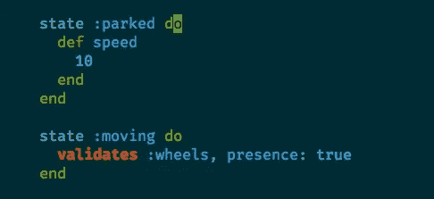

# 《终结者:机器之死 3——结束？

> 原文：<https://itnext.io/terminator-death-to-the-state-machines-iii-end-7a11a82b38a?source=collection_archive---------7----------------------->

*注:如果你还没有阅读过* [*第一部分*](/terminator-death-to-the-state-machines-i-rise-of-the-machines-33a643f48a6d) *和* [*第二部分*](/terminator-death-to-the-state-machines-ii-salvation-d46bd273e7f2) *，请阅读！它为你提供了一些我为什么写这篇文章的背景知识，以及我稍后将讨论的解决方案的一些背景知识。*

[*点击这里在 LinkedIn 上分享这篇文章*](https://www.linkedin.com/cws/share?url=https%3A%2F%2Fitnext.io%2Fterminator-death-to-the-state-machines-iii-end-7a11a82b38a)

# 前情提要…

我们已经开始了一场反对国家机器的革命(至少在我们的团队中)。现在，大多数状态机逻辑已经被替换，结果是几乎相同数量的代码行— **但是更加明确、明显和深思熟虑**。现在读起来容易多了，科技股债务像庞氏硬币一样下跌。

# 接下来去哪里？

这个问题一直困扰着我们。我们是否继续前进并最终移除国家机器宝石？从现在开始，我们会实现自己的状态机吗？到什么程度，我们会“滚动我们自己的”？

这是一次有趣的旅行。重构和清理代码就像编写新代码一样让我兴奋。我认为我们可以和机器和平共处。我仍然喜欢他们提供的 DSL 这种过渡会杀死你，让你陷入技术债务。

我不喜欢这些宝石有两个主要原因:

*   过渡之前、之后、前后——这些和回调一样糟糕。只是没有。
*   **只存在于特定状态的方法、验证、变量:**

这个调试起来很烦，说真的。如果可能的话，像躲避瘟疫一样躲避。如果没有，祝你好运。

不幸的是，这些是这种宝石的主要功能，这使我回到了这个问题:我们真的需要它吗？

我认为一些团队可以使用它，尤其是在引导一个应用程序时。不要低估 DSL 的能力——它们非常光滑、经过深思熟虑并且健壮。一旦你不断添加更多的过渡和定制的东西，它就开始变得令人毛骨悚然。

如果您只想使用一个基本的状态机，那么这是一个完美的用例。

# 但是什么是基本状态机呢？

我将它定义为不需要任何特定逻辑的东西。它也不应该在切换到某个状态时有任何触发。我最基本的用例是它从一个状态改变到另一个状态，就是这样。可以有保护条款，像一个实际的有限状态机一样，哪个状态可以转换到哪个状态，但仅此而已。没有复试。没有定制的东西。让我们把神奇的自动瞄准镜算作额外奖励吧。

总之，这些状态机宝石仍然是相关的和有用的，但是我认为应该小心使用它们，并考虑到未来。我们不想生活在一个被机器统治的未来。我们希望始终控制我们的代码，如果我们不小心，依赖非常先进的机器可能会带来麻烦。