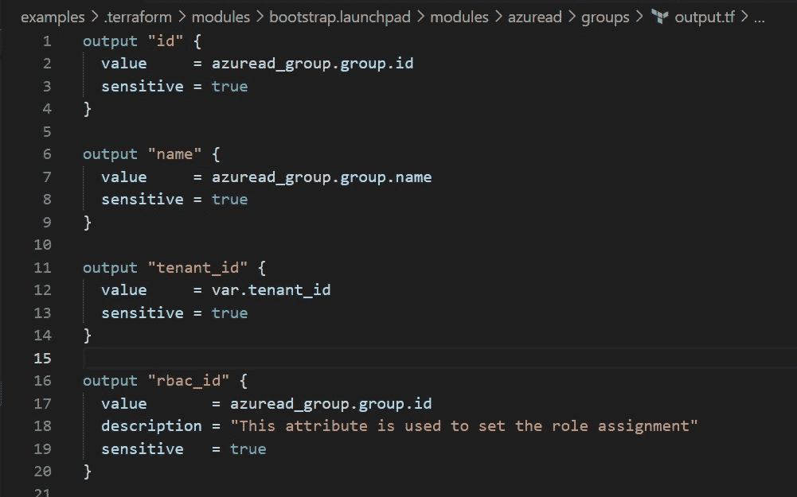

# 地形 0.14-敏感还是不敏感，这是个问题

> 原文：<https://itnext.io/terraform-0-14-to-sensitive-or-to-not-sensitive-that-is-the-question-66d3fffaf697?source=collection_archive---------4----------------------->


在我最新的博客[条目](/upgrading-to-terraform-0-14-experience-warning-18ea3f4bc396)中，我提到了 TF 0.14 中新特性的细节，在这个特性中，你可以将输入和输出标记为敏感。此功能也是 0.14.3 中出现的死机问题的原因。我很高兴地宣布这个问题已经在昨天发布的 0.14.4 中解决了。

当我继续对 Terraform 0.14 进行模块验证时，我遇到了一个新问题，这个问题源于敏感属性的使用。

```
Sensitive variable, or values derived from sensitive variables, cannot be used as for_each arguments. If used, the sensitive value could be exposed as a resource instance key.
```

当我开始排除故障时，我有点困惑，因为这个模块没有任何标记为敏感的输入或输出。然后我开始跟踪哪个模块在调用它，并跟踪它的属性。请看，predecessor 的所有输出都被标记为敏感。

错误中引用的代码如下:

```
module "azuread_group" {
  source = "./access_policy"
  for_each = {
    for key, access_policy in var.access_policies : key => access_policy
    if try(access_policy.azuread_group_key, null) != null && var.azuread_groups != {}
  } keyvault_id   = var.keyvault_id
  access_policy = each.value
  tenant_id     = var.tenant_id
  object_id     = var.azuread_groups[each.value.azuread_group_key].id
}
```

在 *for_each* 中有问题的引用是使用了从另一个上游模块传入的对象中的 *var.azuread_groups* 。然后我查看了上游模块的输出:



修复起来有些简单，因为我已经有了一个分叉版本的模块，并直接在其中进行了修改。然而，如果您碰巧没有控制代码，那么您将陷入困境，要么向上游提交一个修复，要么将其分叉。

Terraform 正在努力追踪敏感属性，并确保它们在整个图表中保持敏感。即使将敏感值传递给函数，输出也会被标记为敏感。正如你在上面看到的，这可能是痛苦的。

这个故事告诉我们，不要将属性标记为敏感，除非它确实是敏感的。如果您遵循从模块中输出完整对象的惯例，这一点尤其重要。

最后，故障排除花费的时间比我希望的要长。我认为您可以通过运行 Terraform 并启用跟踪来排除故障。这个重要模块的输出数量将是巨大的。考虑到它的严格性和破坏性，我希望有新的机制出现来帮助解决这个新功能的问题。