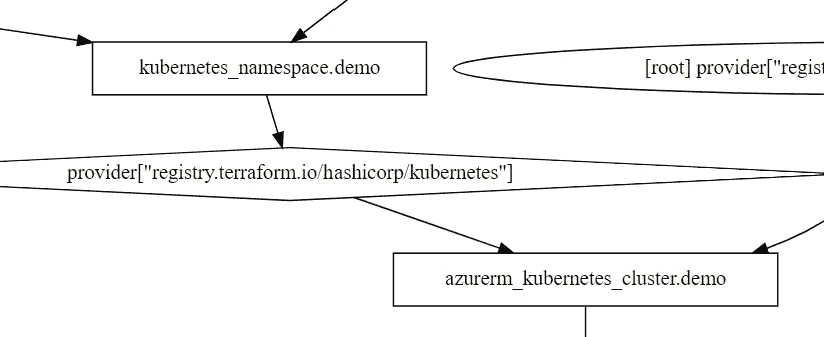

# Terraform:不要在集群资源中使用 kubernetes provider！

> 原文：<https://itnext.io/terraform-dont-use-kubernetes-provider-with-your-cluster-resource-d8ec5319d14a?source=collection_archive---------1----------------------->


由[塞巴斯蒂安·赫尔曼](https://unsplash.com/@officestock?utm_source=medium&utm_medium=referral)在 [Unsplash](https://unsplash.com?utm_source=medium&utm_medium=referral) 拍摄的照片

不要担心，您仍然可以在集群中部署名称空间，但是要小心。

所以你使用 terraform 来创建一个 kubernetes 集群。在集群中创建一些资源并不少见。像一些名称空间、RBAC、网络策略，甚至可能部署入口控制器。你决定这一切都属于基础设施，terraform 是你的 IaC 工具。

幸运的是，terraform 有 kubernetes 提供者可以做到这一点。

让我们举一个简单的例子。它在其中创建了一个 Azure Kubernetes 服务集群和一个名称空间:

如果您应用此脚本，3 个资源将按正确的顺序创建，您将看到 terraform 的*绿色结果*。到目前为止一切顺利。


在这一点上，您可能会继续向项目添加基础设施，并且永远不会回头。

但是，一旦您对集群配置进行了导致集群重新创建的更改，您就会惊讶地发现运行`terraform refresh`时会发生什么。

你将开始得到奇怪的错误。

它可能是这样的:

```
Error: Get “[http://localhost/api/v1/namespaces/demo](http://localhost/api/v1/namespaces/demo)": dial tcp 127.0.0.1:80: connect: connection refused
```

或者我还看到了这样的东西:

```
Error: Kubernetes cluster unreachable: invalid configuration: no configuration has been provided, try setting KUBERNETES_MASTER environment variable
```

kubernetes 提供者的配置好像被重置了？但为什么是在 refresh？

不，它无助于设置资源之间的显式依赖关系。图表看起来相当不错:



像往常一样，只有在四处玩耍、摸索、搜索互联网之后，你才会最终仔细阅读官方的 kubernetes 提供者文档:

> 警告
> 
> 当使用插值将凭证从其他资源传递给 Kubernetes 提供者时，**这些资源不应在使用 Kubernetes 提供者资源的同一个 Terraform 模块中创建**。**这将导致难以调试和诊断的间歇性和不可预测的错误。**根本问题在于 Terraform 本身评估提供商区块与实际资源的顺序。更多说明请参考[本节地形文件](https://www.terraform.io/docs/configuration/providers.html#provider-configuration)。

*粗体文字由我标注。*

因此这篇文章的标题。您需要将集群创建和资源创建分成两个不同的脚本。并且最好使用 [terraform 远程状态](https://www.terraform.io/docs/language/state/remote-state-data.html)数据源为 kubernetes 提供者获取所需的集群信息。