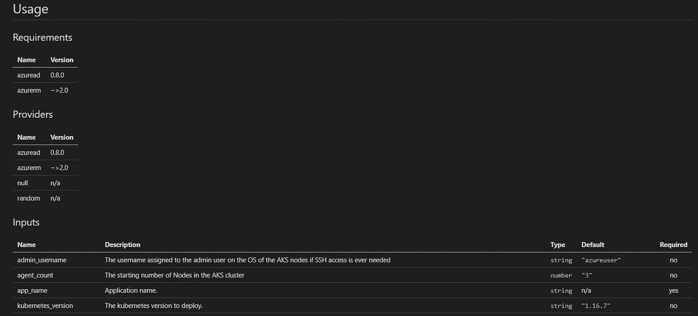

# Terraform —强制文档生成和代码格式化

> 原文：<https://itnext.io/terraform-enforcing-doc-generation-and-code-formatting-e7dc6098b3a0?source=collection_archive---------2----------------------->



生成的文档

我最近开始使用 Terraform，我非常喜欢它；几乎到了再也不想碰一个手臂模板的地步。我的初步印象肯定会导致许多博客帖子！

我一直在编写多个模块来部署和管理 AKS 基础设施。在这个过程中，我想标准化模块接口文档的生成。我还想加强使用地形林挺/格式化。

粗略的搜索让我找到了 [terraform-docs](https://github.com/segmentio/terraform-docs) 项目。该项目是一个单独的可执行文件，它将生成包含在模块文档中的元数据。可以灵活地用 markdown、ascii、json 等语言生成它。然而，我的 Terraform 文档超越了系统生成的数据(概述、限制、已知问题、示例等)。Terraform-docs 将其输出生成到 stdout，您可以将其重定向到文件。我需要一个解决方案，除了系统生成的元数据之外，它还允许我拥有自定义文档。我打算把一些东西放到 CI 管道中，直到我找到了[预提交平台](https://github.com/antonbabenko/pre-commit-terraform)开源项目。

Pre-commit-terraform 创建 git 挂钩，无论何时进行本地提交，它都会运行。我不会进入所有的设置步骤，因为该项目做得很好。安装好先决条件后，添加一个名为*的配置。将 pre-commit-config.yaml* 提交到存储库中。

```
repos:- repo: git://github.com/antonbabenko/pre-commit-terraformrev: v1.30.0 # Get the latest from: https://github.com/antonbabenko/pre-commit-terraform/releaseshooks:- id: terraform_fmt- id: terraform_docs
```

此配置将触发格式化脚本，该脚本在后台执行 terraform fmt，并使用 terraform-docs 生成文档。文档生成具有上游项目中没有的附加功能。它允许您将系统生成的数据嵌入到您的 markdown *README.md* 中。下面是一个利用这个特性的样本模板。特别注意标记；这是元数据将被插入的位置

```
**# Overview** **# Limitations** **# Known Issues** **# Usage**<!-- BEGINNING OF PRE-COMMIT-TERRAFORM DOCS HOOK --><!-- END OF PRE-COMMIT-TERRAFORM DOCS HOOK -->
```

在提交期间，降价将如下所示呈现。它包括模块需求、提供者、输入和输出。请记住，文档的质量取决于输入和输出中描述属性的使用。

```
<!-- BEGINNING OF PRE-COMMIT-TERRAFORM DOCS HOOK -->**## Requirements**| Name | Version ||------|---------|| azurerm | ~>2.0 |**## Providers**| Name | Version ||------|---------|| azurerm | ~>2.0 |**## Inputs**| Name | Description | Type | Default | Required ||------|-------------|------|---------|:--------:|| app\_name | Application nam. | `string` | n/a | yes || base\_cidr\_block | Address range for the virtual network in CIDR notation. CIDR must be a /21\. | `string` | n/a | yes || dns\_servers | List of DNS servers. | `list(string)` | `[]` | no || location | Location where the resources will be created. | `string` | n/a | yes || next\_hop\_egress\_ip | IP address of NVA/Azure Firewall for default route egress. | `string` | n/a | yes || tier\_name | Service tier the application will run. | `string` | n/a | yes |**## Outputs**| Name | Description ||------|-------------|| id | Resource id for the virtual network. || name | Virtual Network name. || rg\_name | Resource group name containing the resources |<!-- END OF PRE-COMMIT-TERRAFORM DOCS HOOK -->
```

pre-commit-terraform 项目有一些额外的挂钩，我还没有进行评估。总的来说，这些钩子有助于确保我的模块文档总是最新的，并且我的代码格式良好。

希望你喜欢这次保存博文的时间。敬请关注更多 Terraform 内容。