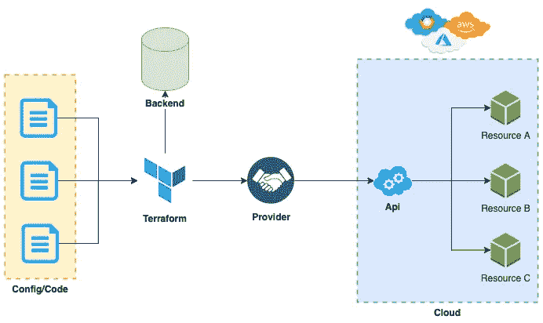
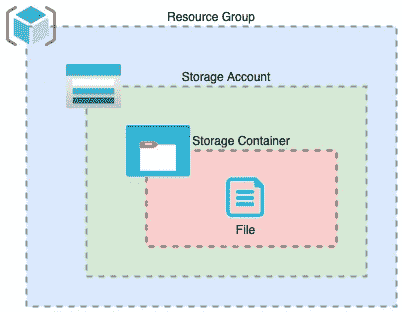
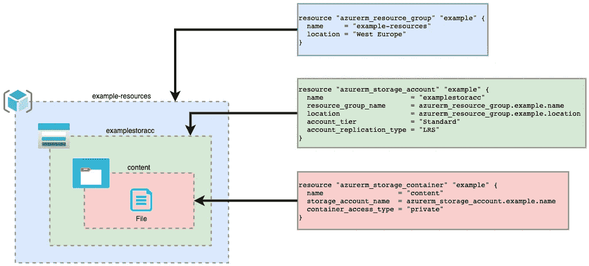
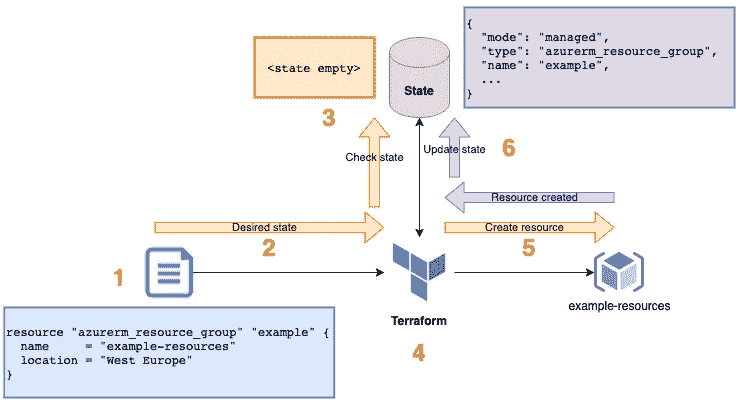
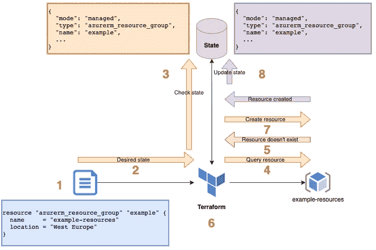

# 适合初学者的地形

> 原文：<https://itnext.io/terraform-for-beginners-dd8701c1ebdd?source=collection_archive---------0----------------------->


# 介绍

你听说过 Terraform，对吧？但是你实际上不知道它是什么或者它是如何工作的？好了，读者朋友们，请为我的初学者指南系好安全带。

在这篇文章中，我将向你解释 Terraform 的基本概念，你如何使用它，它是如何工作的，并告诉你为什么它在过去几年中获得了如此强大的追随者。我打算简单介绍一下 Terraform 的基本语法和它所使用的配置语言，而不会在更高级的主题上做太深入的探讨。我将在这篇博客之后更深入地研究这项技术。

当我开始写这篇文章的时候，我以为这只是一件简单的小事，但是当我开始写的时候，我意识到 Terraform 实际上是非常复杂的，所以这篇文章也随之发展。因此，如果你没有很多时间，只想消化摘要，请随意跳到底部，在那里你会找到 TL；灾难恢复版本🙂

# 什么是 Terraform，为什么这么大惊小怪？

好的，所以你找到这个博客的可能是因为你公司里有人说过“我们应该为此使用 Terraform”，或者因为你遇到了一个 git repo，上面写着“你可以使用这些 Terraform 脚本来部署这个解决方案”，而不想举手询问他们在谈论什么。亲爱的读者，不要害怕，12 个多月前，我确实处在你的位置上，努力从困惑中挣脱出来。

## 一言以蔽之

在其最基本的形式中，Terraform 是一种将称为 HCL *(Hashicorp 配置语言)*的配置文件转换为现实世界基础设施的应用程序，通常在 AWS、Azure 或谷歌云平台等云提供商中。

这种获取配置文件并将其转换成实际资源的概念被称为 IaC *(基础设施即代码)*，是软件工程领域的新热点。它现在变得如此热门的原因是因为这些代码可以在 repos 中与你的应用程序代码共存，可以进行版本控制，并且可以轻松集成到你的 CI/CD 管道中。

## 代码输入资源输出…简单！(不完全是)

因此，正如你们中的许多人可能已经看到的那样，IaC 的概念并不新鲜，十多年来人们一直试图自动化他们的云部署，那么为什么这个平台会变得如此受欢迎呢？

简单来说；Terraform 是一个状态驱动的云平台供应引擎。它利用抽象工具(称为*提供者*和*后端*)使我们能够编写代码，这些代码可以被解释和翻译成一致的、确定性的、特定于云提供者的 CRUD api 调用，从而消除了我们的大量跑腿工作和压力。



Terraform 如何工作的高级视图

# 基础设施作为代码

好了，你已经有了基本的电梯间推介，但这实际上意味着什么呢？简而言之，IaC 试图解决以下问题:

*   不再需要单独的团队来管理基础架构供应和应用程序代码开发。
*   允许我们使用现代源代码控制工具(如 git)来保存、创作/审查对我们基础架构的更改，并为我们提供基础架构历史/发展的良好概述。
*   使我们能够执行应用程序和基础架构的持续集成和持续部署(CI/CD );这意味着这两种元素可以同时部署。
*   允许我们轻松保持多个环境同步，而无需手动更新。
*   无需定制基础架构配置脚本和/或内部构建的工具。
*   消除了人为错误，因为自动化代码部署消除了人为因素。

*需要注意的是，IaC 并不是一个新概念，事实上它在云平台的早期就以不同的形式出现了(AWS 有 CloudFormation，Azure 有 ARM 模板)*

## 简单的例子

作为一名系统开发人员，我意识到我需要配置一些云存储。没什么特别的，但是我需要一个转储文件的地方和一个读取文件的地方。让我们看看当我们使用 Azure 和“物理”云基础设施时，这在概念上是什么样子的:



概念系统架构

所以我在这里使用微软 Azure 术语，但希望这对不熟悉这个平台的人来说不会造成很大的混乱。基本上我需要一个资源组(因为在 Azure 中，事物存在于资源组中)，一个存储帐户和一个存储容器。有了所有这些东西，我就可以安全地将我的文件存储在云中的所述容器中🙂

现在，让我们将这个概念模型转换成 Terraform HCL，看看它是什么样子:

```
terraform {
  required_providers {
    azurerm = "~> 2.64"
  }
}provider "azuread" {
}resource "azurerm_resource_group" "example" {
  name     = "example-resources"
  location = "West Europe"
}

resource "azurerm_storage_account" "example" {
  name                     = "examplestoracc"
  resource_group_name      = azurerm_resource_group.example.name
  location                 = azurerm_resource_group.example.location
  account_tier             = "Standard"
  account_replication_type = "LRS"
}

resource "azurerm_storage_container" "example" {
  name                  = "content"
  storage_account_name  = azurerm_storage_account.example.name
  container_access_type = "private"
}
```

如果用我们得到的 HCL 注释我们的概念设计:



# 分解它

好的，我知道我说过我不会深入解释 HCL 的语法，但是我认为一点概述可能有助于解释事情。

让我们以存储客户的 HCL 为例，一步一步地进行分解:

```
terraform {
  required_providers {
    azurerm = "~> 2.64"
  } backend "azurerm" {
  }
}provider "azuread" {
}resource "azurerm_resource_group" "example" {
  name     = "example-resources"
  location = "West Europe"
}resource "azurerm_storage_account" "example" {
  name                     = "examplestoracc"
  resource_group_name      = azurerm_resource_group.example.name
  location                 = azurerm_resource_group.example.location
  account_tier             = "Standard"
  account_replication_type = "LRS"
}
```

直接查看这个语法，您可以很容易地发现它与 JSON 等语言的一些相似之处。但是每个部分(或者说**阻挡**是什么意思呢？

*   `**terraform**`:允许您配置 **Terraform** 本身的一些行为，比如您希望使用哪个**提供者**以及它需要下载的版本。记住:你不能使用来自提供者的资源，除非你首先指示 Terraform 你想使用那些提供者，就像我们的 C#代码中的 nuget 包依赖或 JavaScript 中的 npm 包。[欲了解更多信息，请参见此处的文档](https://www.terraform.io/docs/language/settings/index.html)
*   `**backend**`:允许我们指定希望 Terraform 使用哪个**后端**。后端决定了两件关键的事情，我们的状态存储在哪里，我们的操作在哪里执行。本质上，如果我们正在使用 Azure，并且想要将我们的状态持久化到云中，我们可以使用`azurerm`后端来实现。如果我们不指定后端，那么就使用默认的后端，这通常被称为`local`。[在此查看官方文件](https://www.terraform.io/docs/language/settings/backends/index.html)
*   `**provider**` : **提供商**是 Terraform 用来与不同云提供商接口的插件。一些提供程序允许您在这些块中添加额外的配置。[在此查看官方文件](https://www.terraform.io/docs/language/providers/index.html)
*   `**resource**`:HCL 中的一个关键字，表示这是您想要提供的**资源**。[官方文件在此](https://www.terraform.io/docs/language/resources/index.html)
*   `**"azure_reosurce_group**"`:这是你想要的“资源”的“类型”。当它运行时，Terraform 将尝试并确定哪个“提供者”包含这个“类型”,并对其执行正确的 CRUD 操作。(我将在本文后面更详细地介绍这些 CRUD 操作)
*   `**"example"**`:这是 Terraform 脚本中资源的名称/标识符。**请不要将这与您将在 Azure 门户**中看到的资源名称混淆。最好以同样的方式来考虑这一点，在代码语言中，如 Go 或 C#等，你会有变量名。请注意，我是如何将我的两个资源称为同一个“示例”标识符的，这是因为如果资源类型和标识符的组合是唯一的，Terraform 允许复制。
*   `**name**`和`**location**`:这些是“资源”的属性或特性。这些决定了“提供商”将如何在云中调配资源。如果你使用过 Azure，我相信你会意识到名字和位置是你在资源上设置的常见事物。这里`name`指定了您将在 Azure 门户中看到的资源的名称。
*   好了，现在事情变得有趣了，这就是 Terraform 的真正力量开始显现的地方。这里我们将一个资源的“输出”传递给另一个资源。这里我们说的是`azurerm_storage_account`的`resource_group_name`属性依赖于名为`example`的`azure_resource_group`的输出。很聪明吧？

好了，希望这能让您对如何配置资源以及如何将一个资源的输出链接到另一个资源有一个很好的了解。这种资源的“链接”实际上是 Terraform 中一个非常重要的概念，因为它允许引擎构建其资源图。通过明确定义资源之间的依赖关系，它将确保引擎知道以正确的顺序供应它们(例如:在它必须进入的资源组之前，它不会尝试做存储帐户)，并将帮助 Terraform 将资源转换为其状态**。**

# **沃特州？？？那是从哪里来的？？**

**好了，如果你没有从这篇博文中得到什么，请记住它的核心就是一个状态驱动的工作流引擎。正是这种状态引擎使得 Terraform 能够运行，也使得它如此受开发者欢迎。因此，我们必须了解什么是国家，以及它是如何运作的。**

**好的，让我们想象你在一家餐馆里，当服务员来到你的桌子前，你点了以下几样菜:**

*   **汤**
*   **牛排**
*   **薯片一侧**
*   **冰淇淋**

**在 Terraform 术语中，这是你的 ***【期望状态】*** ，为了让你满意，你想要你已经订购的所有 4 个项目。所以厨房得到命令，开始做饭，但是你关心他们怎么做吗？如果你像我一样，认为他们会正确理解你的订单，按照他们的食谱，最终食物会按照你的要求到达你的餐桌，供你食用。**

**好的 Terraform 完全一样，在 Terraform 术语中，当我们的 ***【期望状态】*** 显现为现实时，就变成了所谓的 ***【实际状态】*** 。**

# **Pfffft 这个国家的事情似乎很容易…对不对？**

**好吧，我讨厌听起来像一张卡住的唱片，但是你理解状态的概念对地球的重要性真的很重要。完全诚实地说；让你的头脑了解这个概念是破解 Terraform 技术的关键。**

**当我们告诉 Terraform 进行部署时，它会执行一系列步骤:**

1.  **它将解析我们的 HCL 配置/代码文件。**
2.  **使用我们的 HCL 中的信息，Terraform 将构建一个我们想要供应的所有资源的图表 ***【所需状态】*** ，并找出它们之间的任何依赖关系，以尝试并决定它们需要创建的逻辑顺序。**
3.  **Terraform 接下来将检查它的状态，以更好地了解它已经部署和尚未部署的内容(如果这是我们的第一次部署，状态将为空)。这就是所谓的 ***感知状态。*** 之所以是感知状态，是因为 Terraform“认为”存在的东西和“实际”存在的东西之间存在脱节。**
4.  **Terraform 接下来执行我们的**期望状态**和它所知道的我们的 ***感知状态之间的逻辑增量。*** 然后它决定需要执行哪些 CRUD 动作，以及执行它们的顺序，以便使我们的 ***感知状态*** 与我们的 ***期望状态*** 一致。**
5.  **Terraform 接下来执行所有必要的操作，以达到 ***期望状态*** 。该操作的结果将是资源可能开始出现在我们的 Azure 订阅中，然后这被称为 ***实际状态。*****
6.  **Terraform 更新状态以反映它所做的事情。**

**让我们用图形来检查这个流程(用与上述步骤相对应的数字标注的图):**

****

**如你所见，状态持久性使 Terraform 能够在配置执行之间做出决定。**

## **但是为什么我们要区分“感知状态”和“实际状态”我听到你哭了？**

**让我们想象一下，你在办公室工作，你有一张每天都要坐的桌子和椅子。让我们想象一下，这是一个共享的办公室，其他人每天都来来去去。**

**现在如果我问你“你的椅子在你的桌子上吗？”…你的答案会是什么？**

**你们当中那些说“是的，当然，如果那是我的椅子，我会知道它在那里，因为那是我放它的地方”的人不幸地落入了大多数人在使用 Terraform 时都会犯的常见错误；如果不先检查，就无法知道 ***感知状态*** 是否与 ***实际状态*** 匹配。**

**在桌子和椅子的例子中，没有办法知道(不在那里看)办公室里的其他人没有“移走”你的椅子并且没有归还它。同样，在 Terraform 中，有可能有人已经“移除”了您的资源，因此 Terraform 必须首先检查我们的资源是否首先存在于状态中(也就是先前已经创建)，然后它必须检查 Azure 以确保实际状态与它期望找到的相匹配。**

**请注意:通常给这个操作链的术语是:**调和；**地形 ***将*** 期望状态调和为实际状态。**

# **这是一种精神状态**

**好了，我们已经准备好了所有的资源，工作完成了吗？时间在流逝，出于某种原因，我们需要重新部署，但是让我们想象在这段时间里，有人删除了我们的资源组😱当我们重新运行我们的地形时会发生什么？**

**正如我们已经讨论过的，希望 Terraform 足够聪明来解决这个问题:**

1.  **Terraform 解析我们的 HCL 配置。**
2.  **它看到我们想要的状态是拥有一个资源组**
3.  **它检查我们的状态，看是否有状态标识符为`example`的资源组条目(如前所述，注意资源被标识为“example ”,而不是名称属性“example-resources ”,就像其他语言中的变量一样)**
4.  **Terraform 看到状态包含一个条目***(percieved State)***，于是接下来去 Azure 查询资源组的 ***实际状态*** 。**
5.  **Azure 报告了一个 404，我们的提供者会将其解释为资源组不存在😱**
6.  **Terraform 现在执行 ***【期望状态】*** 和 ***【实际状态】*** 之间的增量，并意识到要执行的必要动作是创建它。**
7.  **Terraform 执行必要的操作来创建资源组**
8.  **Terraform 会根据需要更新其状态。**

****

**请注意，这次的关键区别在于，状态中某些东西的存在改变了 Terraform 的运行方式，因为它“感知”到了资源的存在，因为它知道云中应该有资源，所以它转向云提供商(Azure)并询问该资源的“实际状态”。然后，它会根据结果决定要做什么。**

**如果 Terraform 发现它已经拥有了我们想要的资源，这一系列事件将会一直发生。但这并不是说结果永远是创造。例如，如果有人重命名了资源组，那么结果将是 Terraform 执行资源更新，使实际状态和期望状态一致。**

# **国家可能是一把双刃剑**

**因此，如果国家是 Terraform 操作的大脑，当它变得腐败时会发生什么？让我告诉你的朋友们，如果我每次看到人们删除他们的状态，然后试图用 Terraform 做些什么，我就有 5 英镑，我现在已经是一个非常富有的人了。**

**好了，让我们来探究一下，假设设置与之前完全相同，我们已经部署了资源组，然后出于某种原因，我们删除了所有状态(相信我，很容易做到)。这次会发生什么？**

***“显然什么都没发生”*我听到你们都在哭泣…但你们又一次落入了我的陷阱😉**

**事实上这次发生的是:**

1.  **Terraform 解析我们的 HCL 配置/代码文件。**
2.  **Terraform 将建立一个我们想要的所有资源的图表。**
3.  **Terraform 检查状态，发现它是空的。**
4.  **Terraform 在我们期望的状态和它的状态之间做逻辑增量，并决定它需要创建一个资源(记住，Terraform 没有查询 Azure，因为**状态文件不存在/为空**)**
5.  **Terraform 试图创建一个名为“示例-资源”的资源组……**BANG！！！💥****
6.  **我们现在有一个 Terraform 错误的情况，因为 Azure 已经有了一个同名的资源组，我们无法创建另一个同名的资源组。**

## **这里要记住的关键是:**

> **Terraform 不知道您的云提供商提供的任何资源，除非它处于状态**

# **这全是一派胡言**

**好了，我想我已经讲过了状态，以及它的重要性，现在够了。是时候看看 Terraform 如何决定执行哪些操作了。正如我之前提到的，Terraform 只是一个状态引擎，它根据当前对世界(状态)和现实世界的理解做出决定。说到底，Terraform 能做的实际行动只有 3 个。这些通常被称为 CRUD，是**CR**eat、 **U** pdate 或 **D** elete 的缩写。**

**那么什么情况会导致执行哪种操作呢？**

## ***创建***

*   **我们的地形状态中不存在所需的资源。**
*   **一个期望的资源以 Terraform 状态存在，但最终实际上并不存在于我们的云中。**

## **更新**

*   **所需的资源存在于 Terraform 状态，但在我们的云中配置不同。**

## **删除**

*   **一个资源从我们期望的状态中移除，但是仍然存在于我们的地形状态中。**

# **这是地球生命的循环**

**好了，现在我们已经了解了 state 和 CRUD(看，我告诉过你它们很重要),我们可以更仔细地看看我们是如何执行 Terraform 的。**

**当我们在命令行上运行 Terraform 时，需要执行 3 个不同的步骤。让我们在这里浏览一下:**

## **初始化**

> **`$ terraform init`**

**我们需要运行的第一个命令是`init`。该命令用于初始化包含 Terraform 配置文件的工作目录，并指示 Terraform 询问 HCL 文件，确定所需的提供程序，下载它们，并初始化一个状态(如果该状态不存在)。多次运行`init`是绝对安全的，事实上，如果您在`Terraform`块中添加新的提供者或更改任何设置，您可能需要这样做。**

**关于`init`命令[的更多详细信息，你可以查看这里的所有文档](https://www.terraform.io/docs/cli/commands/init.html)。**

## **规划**

> **`$ terraform plan`**

**我们运行的下一个命令是`plan`。这个命令指示 Terraform 解析我们的 HCL 文件，构建我们的资源图，检查它的状态，并尝试提出一个要执行的执行计划。我们的`init`成功了，但我们的`plan`失败了，这是完全合理的。这是因为`init`并不真正关心试图确定我们的任何资源是否有效或者它们是否存在。只有当 Terraform 开始解释我们的“期望状态”时，我们才会开始在我们的文件中发现语法错误。**

**`plan`命令的输出将是 Terraform 决定执行的操作的复杂列表。强烈建议您检查这些更改，以确保它们与您预期看到的更改相匹配，因为如果操作失误，破坏性操作的成本会很高。请将此视为所有地形的“预演”。**

**同样值得注意的是，计划的输出可以保存到一个文件中，并用于下一步`apply`，因为这确保了在计划的和应用的之间没有混淆/差异。**

**关于`plan`命令的更多详细信息，可以在这里找到[文档。](https://www.terraform.io/docs/cli/commands/plan.html)**

## **应用**

> **`$ terraform apply`**

**简单地说，这个操作告诉 Terraform 执行所有计划好的操作。这通常会导致 Terraform 重做其计划(除非为命令提供了计划文件)，然后向您显示“您确定吗？”提示。这是你的不归路。如果你说是，那么 Terraform 将开始真正为你提供东西。**

**这可能是所有命令中最简单的一个，但是它确实有一些有趣的功能，比如“自动批准”和增加或减少执行并行化的能力。**

**与其他命令一样，[完整文档在此处可用](https://www.terraform.io/docs/cli/commands/apply.html)**

# **最后一句警告！**

**请记住亲爱的读者，Terraform 使用我们在 HCL 中指定的标识符来标识状态中的资源。**

**因此，如果我执行了下面的 HCL:**

```
resource "azurerm_resource_group" "example" {
  name     = "example-resources"
  location = "West Europe"
}
```

**…那么这意味着在成功完成后，在我的状态文件中应该有一个标识符设置为`example`的`azurerm_resource_group`资源的条目**

**人们在使用 Terraform 时容易陷入的一个常见陷阱是，他们会看到自己不喜欢的资源标识符，或者有时会看到错别字，并认为“哦，我会清理掉的”…但是请非常非常小心！**

**如果我将上面的代码改为:**

```
resource "azurerm_resource_group" "my_resource_group" {
  name     = "example-resources"
  location = "West Europe"
}
```

**请注意从`example`到`my_resource_group`的变化，现在我处于一个非常危险的境地。下次我的 Terraform 运行时，它会看到这个资源，查看它的状态，但没有找到任何条目(因为旧的条目被命名为`example`)，这意味着它将决定创建一个新的资源组，当然这意味着删除旧的资源组！**

**这甚至更危险，因为资源组是 Azure 中的顶级对象，这意味着它还会导致属于该资源组的所有内容也被销毁和重新创建！！！！这对于生产环境来说绝对是灾难性的。**

**所以我的建议是朋友们:**

> **如果您要重命名资源标识符，请确保这种更改是非常非常必要的！**

**注意:有一些方法可以解决这个问题，还有导入状态的方法等等。但是这超出了初学者指南的简单本质。**

# ****总之(TL；博士)****

*   **Terraform 是一个状态驱动的引擎，使我们能够轻松、一致地调配云基础架构。**
*   **Terraform 利用了被称为 HCL (Hashicorp 配置语言)的代码**
*   **HCL 使用关键字`resource`来定义我们希望在云中提供的“资源”。**
*   **HCL 允许我们将一个资源的配置/输出用作另一个资源的配置/属性的输入。**
*   **Terraform 使用提供商与不同的云技术接口。**
*   **当 terraform 运行时，它将解析 HCL 文件，并构建我们想要的资源图——称为**期望状态****
*   **通过将资源“链接”在一起，它使 Terraform 能够在其图形中的对象之间建立显式的依赖关系。**
*   **Terraform 在一个名为**状态文件的文件中存储了它以前提供的所有资源的信息。****
*   **状态文件的内容称为**感知状态**—terra form 上次使用我们的 HCL 文件运行时离开环境的状态。**
*   **Terraform 使用后端来决定状态应该如何持久化。**
*   **根据我们使用的云服务提供商以及我们希望 Terraform 如何保持状态，可以使用许多不同的后端。**
*   **当 Terraform 想要供应资源，并且该资源以其感知状态存在时，它将询问云提供商以确定**实际状态。****
*   **如果**期望**、**感知**和**实际**状态之间存在差异，Terraform 将确定所需的纠正措施，以使实际符合期望。**
*   **Terraform 有 3 个不同的生命周期阶段:`init`、`plan`和`apply`**
*   **如果你重命名一个资源标识符，Terraform 将会把它当作一个从未见过的全新资源，并清除所有与旧标识符相关的资源。**

# **最后的想法**

**正如我在这篇文章中无数次提到的，如果你没有从这篇文章中拿走任何东西。请记住:**

> **Terraform 所做的一切都围绕着国家。如果不了解 Terraform 如何管理和维护状态；你不明白地形是如何运作的**

**所以剩下的就是感谢您的时间，我希望这篇文章能对未来的 Terraform 开发者有所帮助。**

****

# **延伸阅读:**

*   **HashiCorp 的 terra form—terra form 平台的创建者为其编写的官方文档。**
*   **[hashi corp Blog:terra form](https://www.hashicorp.com/blog/products/terraform)—对于想要了解平台最新变化的人来说，必须阅读/关注。**
*   **[HashiCorp 资源库](https://www.hashicorp.com/resources)—terra form 平台目前提供的所有资源和提供商的库。**
*   **[使用 Terraform 和 Azure |微软文档](https://docs.microsoft.com/en-us/azure/developer/terraform/overview)—Azure 开发者快速入门指南。**
*   **[介绍 hashi corp terra form with Armon dad gar—YouTube](https://www.youtube.com/watch?v=h970ZBgKINg)—这是一个很好的视频，为喜欢视觉概述的人提供了上述大部分信息。**
*   **[AWS 上的 Terraform 入门| Sumeet ni nawe](https://spacelift.io/blog/terraform-tutorial)——space lift 的 peeps 撰写的掌握 Terraform 和 AWS 的伟大指南(感谢 [Mariusz Michalowski](https://pl.linkedin.com/in/mariusz-micha%C5%82owski) 让我意识到这篇伟大的帖子)**