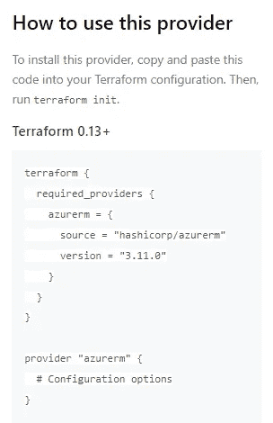

# 平台提供商

> 原文：<https://itnext.io/terraform-providers-cbb37e3974ea?source=collection_archive---------3----------------------->

## 提供者用有用的例子解释！

## **概述**

在本文中，我们将讨论平台提供者。首先，我们将看看 Terraform 中提供者的目的，以及如何使用和引用它们。然后，我们将通过示例查看一些可用的提供者。


克里斯托弗·高尔在 [Unsplash](https://unsplash.com/s/photos/code?utm_source=unsplash&utm_medium=referral&utm_content=creditCopyText) 上拍摄的照片

## Terraform 中的提供商是什么？

Terraform 中的 provider 是一个插件，支持与 API 进行交互。这包括云提供商和软件即服务提供商。提供者在 Terraform 配置代码中指定，告诉 Terraform 它需要与哪些服务进行交互。

有数百个可用的提供商可以与 Terraform 一起使用，这使它成为一个非常通用的工具。Terraform 的流行很大程度上源于这样一个事实，即它是平台不可知的，并且可以被如此广泛地使用，而不是可能特定于平台的语言，如微软 Azure ARM 模板或 Bicep(仅与 Azure API 交互)。

一旦指定了一个提供者，每个提供者都会创建一个可用于 Terraform 代码的`resources`和`data`类型的列表。这些在文档中列出，可在 [Terraform 注册表中找到。](https://registry.terraform.io/browse/providers)

每个提供程序都是独立于 Terraform 本身发布的，每个版本都提供了额外的功能和错误修复。每个提供商都有自己的发布节奏。提供商通常由 Hashicorp(提供提供商的公司的专门团队)管理(例如，`mongodb`提供商的 Mongo)，或者由对提供商使用的产品或平台感兴趣的社区团体、用户和志愿者管理。

*   Hashicorp 维护的提供商在文档页面上被标记为“官方”。
*   标记为“已验证”的提供商归官方第三方技术供应商所有。供应商也是 HashiCorp 技术合作伙伴计划的成员。
*   标记为“社区”的提供者由 Terraform 社区中的成员或组发布。

在不太可能的情况下，如果基础设施的提供商不存在，您可以尝试使用 Terraform 进行供应，或者您希望为您的产品开发一个提供商，您可以这样做。提供者是用 Go 编写的，并利用 Terraform 插件 SDK。

在 Terraform 工作流程的`terraform init`阶段，下载并安装 Terraform 提供程序。它们可以从公共注册表或本地注册表或镜像中下载。如果提供程序不在`.terraform`子目录中，则下载该提供程序，如果已经存在，则不再下载。还会检查版本号。更改配置文件中的版本号会导致下载该版本的提供程序。然而，为了节省带宽和加快运行时间，可以使用 CLI 配置文件中的`plugin_cache_dir`来指定可选插件缓存的使用，该配置文件为每个用户配置 CLI 行为(`terraform.rc`或`.terraformrc`)。例如

```
plugin_cache_dir   = "$HOME/.terraform.d/plugin-cache"
```

在 Terraform cloud 或 Terraform Enterprise 中运行时，总是下载插件。

## 提供商配置

应该在 Terraform 项目的根模块中声明提供者配置。它们可以在任何`.tf`文件中声明，但是我建议要么将它们放在`main.tf`中，专门为提供者创建一个`providers.tf`文件，而不是其他文件，要么创建一个包含`required_providers`块并指定 Terraform 版本的`versions.tf`文件。任何子模块都从根模块接收它们的提供者配置。

使用`providers`块配置提供者。一些提供商要求配置某些信息，如端点 URL 或云区域。根据您需要使用的提供者，相关的文档应该详细说明您需要配置哪些设置以及示例。要找到每个提供商的信息，请单击文档页面右上角的“使用提供商”按钮。



在上面显示的 Microsoft Azure provider `azurerm`的例子中，提供者源代码和版本在`required_providers`部分指定。然后`providers`块包含提供者所需的配置选项。例如，`azurerm`包括`features`、`clientid`、`subscription_id`、`tenant_id`等。通常，提供者配置选项包括向平台进行身份验证的各种方式。

在 Providers 块中还可以指定两个元参数，`version`和`alias`。`version`已被弃用，不应再使用，应在`required_providers`块中指定。`alias`元参数对于使用相同的提供者很有用，但是具有不同的配置选项。再次使用我们的`azurerm`示例，这方面的一个经典案例是当您的 Terraform 代码需要引用多个订阅时。这里可以指定不同的`subscription_id`值，调用资源或模块可以使用别名引用特定的提供者。例如，提供程序块可以这样配置:

```
provider "azurerm" {
  aubscription_id = "4321-4321-4321-4321"}provider "azurerm" {
  alias = "subscriptionA"
  subscription_id = "1234-1234-1234-1234"
}
```

资源本身引用特定的提供者来访问不同的订阅:

```
resource "azurerm_resource_group" "rg1" {
  provider =  azurerm.subscriptionA
  .
  .
}
```

如果子模块需要特定的提供者，可以使用`providers`元参数来引用它。

如果一个提供者没有配置`alias`选项，它将被认为是默认的，并被所有配置使用，除非另一个提供者被明确指定。

## **常用提供商**

*   [蔚蓝](https://registry.terraform.io/providers/hashicorp/azurerm/latest)
*   [AWS](https://registry.terraform.io/providers/hashicorp/aws/latest)
*   [谷歌云](https://registry.terraform.io/providers/hashicorp/google/latest)
*   [Kubernetes](https://registry.terraform.io/providers/hashicorp/kubernetes/latest)
*   [甲骨文云](https://registry.terraform.io/providers/oracle/oci/latest)
*   [阿里云](https://registry.terraform.io/providers/aliyun/alicloud/latest)

## 其他有用的提供者

*   Azure [活动目录](https://registry.terraform.io/providers/hashicorp/azuread/2.25.0)
*   [活动目录](https://registry.terraform.io/providers/hashicorp/ad/0.4.4)
*   天蓝色[栈](https://registry.terraform.io/providers/hashicorp/azurestack/0.10.0)
*   [思科](https://registry.terraform.io/namespaces/CiscoDevNet)
*   [云闪](https://registry.terraform.io/providers/cloudflare/cloudflare/3.18.0)
*   [检查站](https://registry.terraform.io/namespaces/CheckPointSW)
*   [Datadog](https://registry.terraform.io/providers/DataDog/datadog/3.12.0)
*   [舵](https://registry.terraform.io/providers/hashicorp/helm/2.6.0)
*   哈希公司产品供应商— [金库](https://registry.terraform.io/providers/hashicorp/vault/3.7.0)、[领事](https://registry.terraform.io/providers/hashicorp/consul/2.15.1)、[游牧](https://registry.terraform.io/providers/hashicorp/nomad/latest)、[边界](https://registry.terraform.io/providers/hashicorp/boundary/1.0.9)
*   [F5](https://registry.terraform.io/namespaces/F5Networks)
*   帕洛阿尔托市
*   太空飞船
*   [VMWare vSphere](https://registry.terraform.io/providers/hashicorp/vsphere/latest)

## 摘要

在学习 Terraform 时，了解提供者如何在 Terraform 中工作，以及知道如何利用 Terraform 注册表中的可用提供者是一个重要的关键概念。

有关更多信息，请查看官方文档:

[](https://www.terraform.io/language/providers) [## 提供者-配置语言|哈希公司的 Terraform

### 搜索 Terraform 文档动手操作:尝试 HashiCorp Learn 上的使用提供者执行 CRUD 操作教程…

www.terraform.io](https://www.terraform.io/language/providers) 

想要更多的 Terraform 内容？点击这里查看我在 Terraform 上的其他文章！

干杯！🍻

[](https://www.buymeacoffee.com/jackwesleyroper) [## Jack Roper 正在 Azure、Azure DevOps、Terraform、Kubernetes 和 Cloud tech 上写博客！

### 希望我的博客能帮到你，你会喜欢它的内容！我真的很喜欢写技术内容和分享…

www.buymeacoffee.com](https://www.buymeacoffee.com/jackwesleyroper)