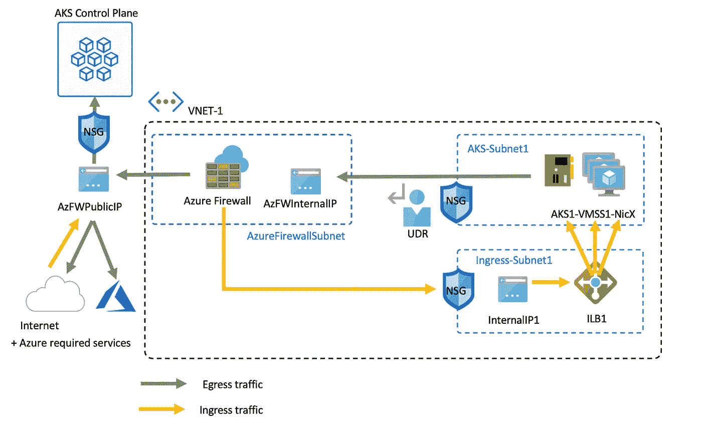
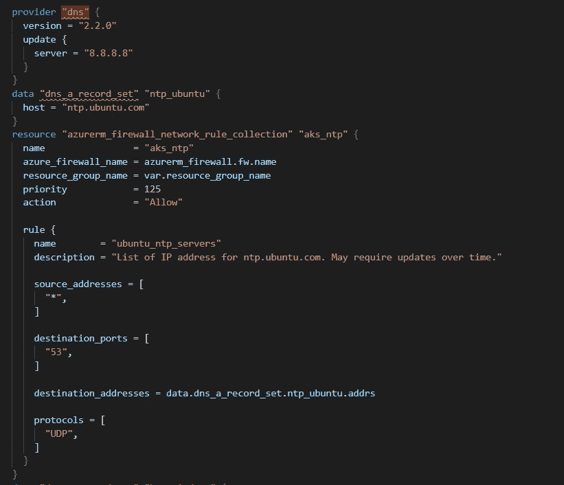

# Terraform —减少“粘合”外壳脚本

> 原文：<https://itnext.io/terraform-reducing-glue-shell-scripts-b050df339659?source=collection_archive---------5----------------------->

AKS 出口管理

在最近的一次参与中，我使用 ARM 模板自动化了 Azure Kubernetes 服务(AKS)和相关组件的部署。客户要求我们限制对互联网的访问，微软为此提供了全面的文档。

为了管理出口，我配置了一个 Azure 防火墙和一个默认路由表来指向防火墙作为下一跳。

我们面临的一个挑战是 Azure 防火墙不能很好地处理所有出口规则。所有出口规则都基于 FQDN；但不是所有的 HTTP/HTTPS。因此，我们无法使用防火墙应用程序规则来满足以下要求。我们不得不使用只接受 IP 地址的网络规则。

*   API 主服务器的 TCP 规则
*   到 ntp.ubuntu.com 的 UDP 规则
*   到 kms.windows.net 的 TCP 规则

要在 ARM 中管理这些规则，您必须解析 IP 并在部署期间将它们作为输入传递进来。这需要一个胶合脚本来执行查找，并格式化数据以作为输入变量传递。不理想，并且破坏了部署流程。

当我试图在 Terraform 中实现它时，我发现通过使用 DNS 模块实现起来更加简洁。这个过程相当简单:

*   设置提供程序
*   为主机创建要解析的数据源
*   使用资源中的数据

最终的结果是更加整洁，减少了粘合代码，并保持了用一种语言进行端到端部署。

