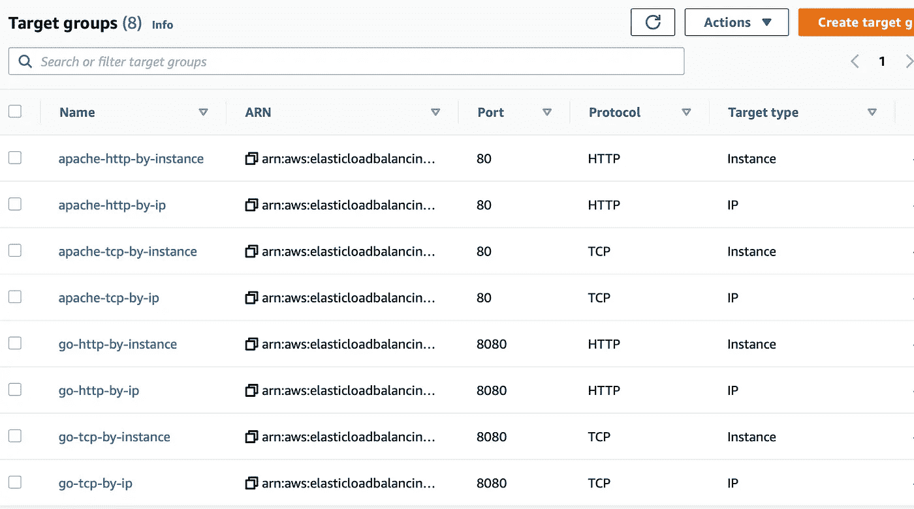
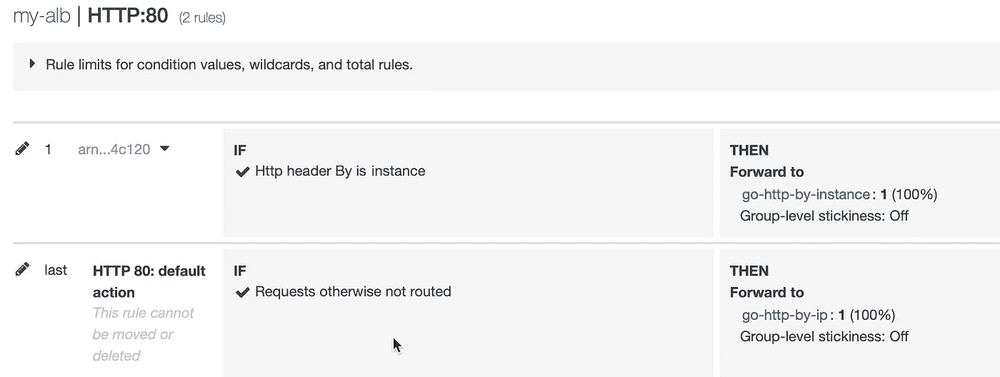
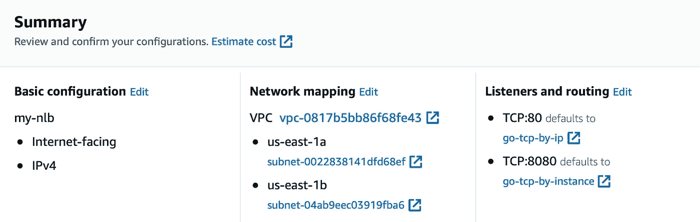

# 使用嵌套数据创建地形资源

> 原文：<https://itnext.io/terraform-resource-creation-with-nested-data-92af9a9f96ea?source=collection_archive---------1----------------------->

## 调查 AWS ALB 和 NLB 的客户端 IP 信息


在研究 AWS ALB 和 NLB 时，我想验证不同类型选项的客户端 IP 信息。

我有两个 apache web 服务器运行在两个 EC2 实例上。为了调查流量，创建了一个 golang 程序来转储 http 请求。使用 AWS web 控制台创建 ALB 和 NLB 没有太大问题。然而，在创建目标群体时，我觉得这是相当繁琐的。

首先，对于不同类型的 LB，目标群体需要分别具有不同的协议。ALB LB 只能注册基于 HTTP 的目标组，而 NLB LB 只能注册基于 TCP 的目标组。其次，每个目标可以是实例的 IP 或 EC2 实例本身(忽略其他类型，如 labmda 或 ALB)。因此，我将有 2 个协议 x 2 个目标类型 x 2 个应用程序，8 个目标组组合。我需要自动化它。

## 具有嵌套数据的目标群体的 Terraform

我们可以将一些地形资源定义如下:

```
resource "aws_lb_target_group" "apache-tcp-by-instance" {
  name     = "apache-tcp-by-instance"
  port     = 80
  protocol = "TCP"
  target_type = "instance"
  vpc_id   = data.aws_vpc.default-vpc.id
}resource "aws_lb_target_group" "apache-tcp-by-ip" {
  name        = "apache-tcp-by-ip"
  port        = 80
  protocol    = "TCP"
  target_type = "ip"
  vpc_id      = data.aws_vpc.default-vpc.id
}
# repeat for the rest 6 combinations
```

我想我重复得太多了。干！

这个循环看起来很适合创建那些相似的资源。但是，它不能在资源定义块中执行嵌套循环。我们必须在外面准备数据。这就是`locals`能帮上的忙。

```
locals {
  app_name = ["apache", "go"]
  protocols = ["http", "tcp"]
  by = ["instance", "ip"] list_of_tg_configs = flatten([
    for app in local.app_name : [
      for protocol in local.protocols: [
        for by in local.by : {
          "app": app,
          "protocol": protocol,
          "by": by,
          "port": app == "apache"? 80 : 8080,
          "key": "${app}-${protocol}-by-${by}"
        }
      ]
    ]
  ])
```

我们为 app_name、protocols 和 target by 方法定义了 3 个列表。然后，我们嵌套地遍历这 3 个列表以形成一个 dictionary 对象，它包含目标组的信息。调用 flatten 函数来形成一个没有任何其他嵌套列表的字典对象的纯列表。

然后可以使用`for_each`创建 target_group 资源。

```
resource "aws_lb_target_group" "target-groups" {
  for_each= { 
    for tgc in local.list_of_tg_configs : tgc.key => tgc
  } name = each.key port = each.value.port
  protocol = upper(each.value.protocol)
  target_type = each.value.by
  vpc_id = data.aws_vpc.default-vpc.id 
}
```

for_each 只能接收映射或字符串列表，因此我们使用`for`表达式构建一个映射。请注意，我们已经在 locals 中创建了一个键字段，可用于映射的键。

一旦创建了`for_each`的映射，就可以使用`each`来引用每个键/值对。资源的属性可以用准备好的数据来定义。注意`each.value`实际上是一个 map 对象，属性是用这个 map 的对应键定义的。

资源的结果实际上是一个 map 对象。例如，稍后可以使用`aws_lb_target_group.target-groups[key]`引用目标组，其中键与`for_each`提供的 map 对象的键相同。

## 正在向目标组注册其目标 ID

在我的测试中，我有两个 EC2 实例。要将这些目标注册到目标组中，我们需要为每个目标创建一个资源，如下所示:

```
resource "aws_lb_target_group_attachment" "tg-resgister" {
  target_group_arn  = arn value of the target group
  target_id         = ip or instance
  port              = 80 or 8080
}
```

对于每个 EC2 实例或 IP 和每个目标组，我们将有 16 个组合。我们需要使它自动化。

遵循与目标群体相同的模式，

1.  在`locals`中，通过使用`for`表达式遍历数据，构建一个具有所有必需属性的地图对象。使用`flatten`获得地图对象列表。
2.  在资源块中，创建一个供`for_each`使用的地图
3.  用`each.value`填充资源属性

`locals`部分如下图所示。

```
locals {
  # the locals for target group is shown as above, and skipped ec2_instances = {
    "web-server1": aws_instance.web-server1, 
    "web-server2": aws_instance.web-server2
  } ec2_for_target_groups = flatten([
    for ec2_name, ec2_inst in local.ec2_instances: [
      for tgc in local.list_of_tg_configs: {
        "id": "${ec2_name}-${tgc.key}",
        "ec2_name": ec2_name,
        "target_group_key": tgc.key,
        "target_id": tgc.by == "ip" ? ec2_inst.private_ip: ec2_inst.id,
        "port": tgc.port
      }
    ]
  ])
}
```

有两个 EC2 实例，为每个实例创建一个映射对象。然后，对于每个实例，遍历前面的目标组配置，用 ec2 名称和目标组的键设置一个惟一的 id 字段，获取目标组的键，以便我们可以引用它来获取它的`arn`值，根据 target by 方法设置目标 id，最后设置端口值。

创建资源。

```
resource "aws_lb_target_group_attachment" "tg-resgister" {
  for_each= { 
    for ec2_tg in local.ec2_for_target_groups : ec2_tg.id => ec2_tg
  } target_group_arn  = aws_lb_target_group.target-groups[each.value.target_group_key].arn
  target_id         = each.value.target_id
  port              = each.value.port
}
```

如前所述，为`for_each`构造一个 map 对象，然后分别用`each.value`对象的键分配属性。注意，我们使用目标组的密钥来访问它，以获得它的`arn`值。

我们准备应用 terraform 代码。目标组创建的结果如下所示，



## HTTP 转储程序

玩具 golang http 处理程序如下所示。它基本上是转储 HTTP 请求。编译并部署到 EC2 实例中。

```
package mainimport (
 "fmt"
 "log"
 "net/http"
 "net/http/httputil"
 "os"
)func greet(w http.ResponseWriter, r *http.Request) {
 // set header for no cache
 w.Header().Set("Cache-Control", "no-cache, no-store, must-revalidate")
 w.Header().Set("Pragma", "no-cache")
 w.Header().Set("Expires", "0") dump, err := httputil.DumpRequest(r, true)
 if err != nil {
  http.Error(w, fmt.Sprint(err), http.StatusInternalServerError)
  return
 } fmt.Fprintf(w, "%s", dump)
 fmt.Fprintf(w, "Remote Ip:%s\n", r.RemoteAddr) hostname, err := os.Hostname()
 if err != nil {
  log.Printf("could not get hostname: %v", err)
  return
 } fmt.Fprintf(w, "Served by:%s\n", hostname)}func main() {
 http.HandleFunc("/", greet)
 http.ListenAndServe(":8080", nil)
}
```

## 白蛋白测试

创建一个应用程序负载平衡器，添加以下规则来测试远程 IP 地址。



如果请求具有 HTTP 头键/值对`By=instance`，那么流量将被转发到由 by-instance 目标提供服务的目标组`go-http-by-instance`。否则，它将由 by-ip 目标提供服务。

运行下面的 curl 命令，

```
> curl my-alb-646133936.us-east-1.elb.amazonaws.com
GET / HTTP/1.1
Host: my-alb-646133936.us-east-1.elb.amazonaws.com
Accept: */*
User-Agent: curl/7.77.0
X-Amzn-Trace-Id: Root=1-61a7084e-2723c0666346a5756090f8ea
X-Forwarded-For: *<my router's ip>*
X-Forwarded-Port: 80
X-Forwarded-Proto: httpRemote Ip:172.31.20.133:42560
Served by:ip-172-31-42-226.ec2.internal
```

并为按实例目标设置标题，

```
> curl -H "By: instance" my-alb-646133936.us-east-1.elb.amazonaws.com
GET / HTTP/1.1
Host: my-alb-646133936.us-east-1.elb.amazonaws.com
Accept: */*
By: instance
User-Agent: curl/7.77.0
X-Amzn-Trace-Id: Root=1-61a709b6-4ff011a14a9ee5d7106de8e8
X-Forwarded-For: *<my router's ip>*
X-Forwarded-Port: 80
X-Forwarded-Proto: httpRemote Ip:172.31.20.133:9188
Served by:ip-172-31-17-239.ec2.internal
```

注意到对于`by-ip`或`by-intance`目标，HTTP 请求的远程 IP 地址是 ALB 的私有 IP 地址。而真正的客户端 IP 可以参考 ALB 添加的 HTTP 头`X-Forwarded-For`。

## NLB 的测试

同时，创建一个网络负载平衡器，分别为端口 80 和 8080 按 ip 和按实例设置目标。



卷曲到端口 80 以测试 by-ip 目标，

```
> curl my-nlb-912005c41dde1657.elb.us-east-1.amazonaws.com
GET / HTTP/1.1
Host: my-nlb-912005c41dde1657.elb.us-east-1.amazonaws.com
Accept: */*
User-Agent: curl/7.77.0
Remote Ip:172.31.42.114:4187
Served by:ip-172-31-42-226.ec2.internal
```

Curl 到端口 8080 来测试 by-instance 方法，

```
> curl my-nlb-912005c41dde1657.elb.us-east-1.amazonaws.com:8080
GET / HTTP/1.1
Host: my-nlb-912005c41dde1657.elb.us-east-1.amazonaws.com:8080
Accept: */*
User-Agent: curl/7.77.0Remote Ip:*<my router's ip>*:50010
Served by:ip-172-31-17-239.ec2.internal
```

我们可以看到，对于 NLB，按实例目标反映了真实的客户端 IP。NLB 没有添加成对的 HTTP 头键/值。