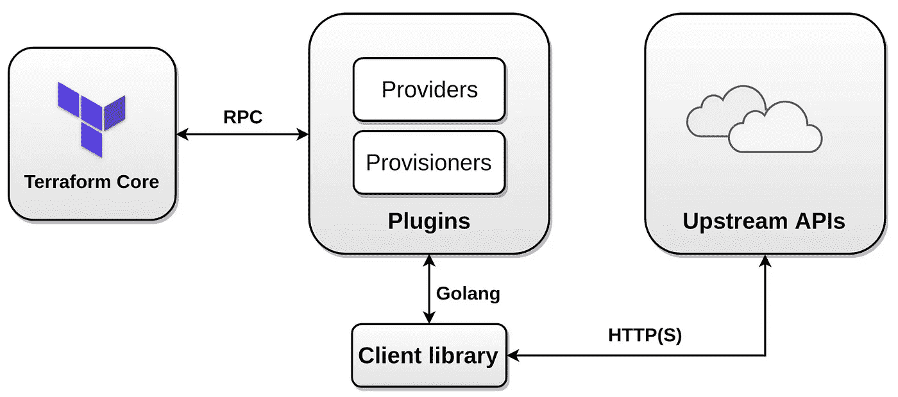
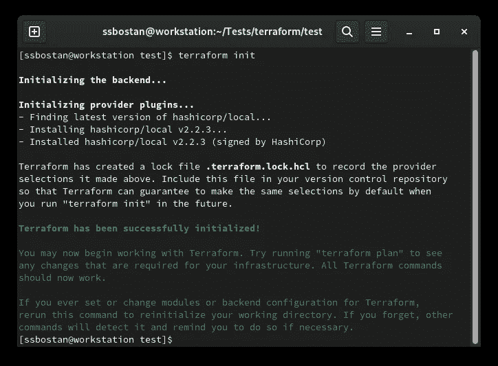
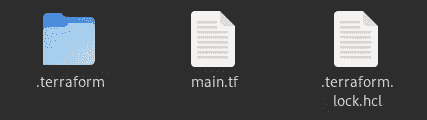
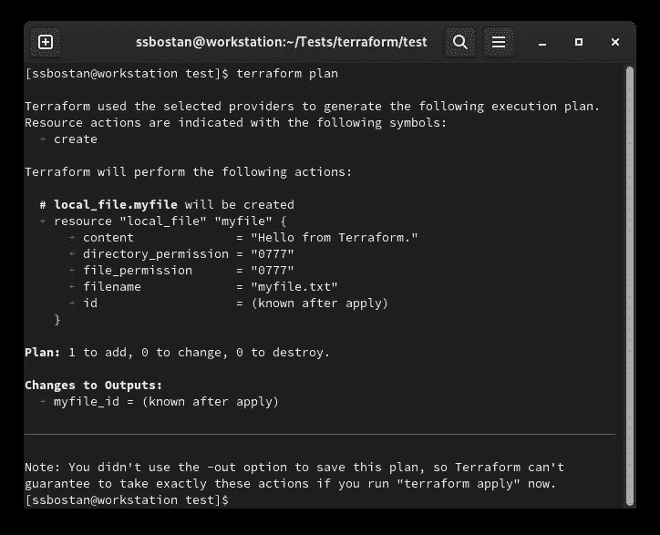
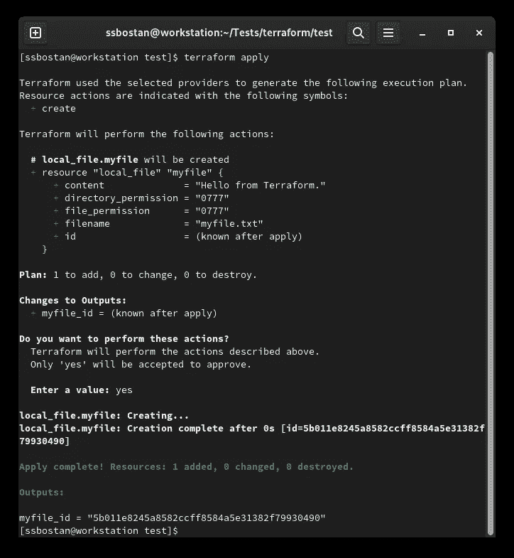
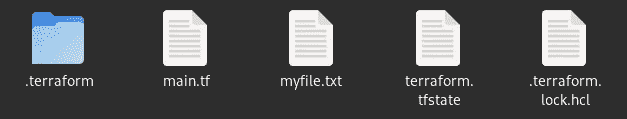
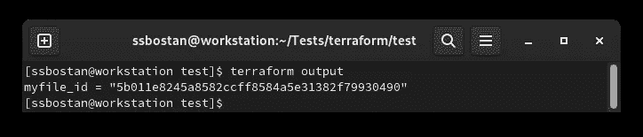
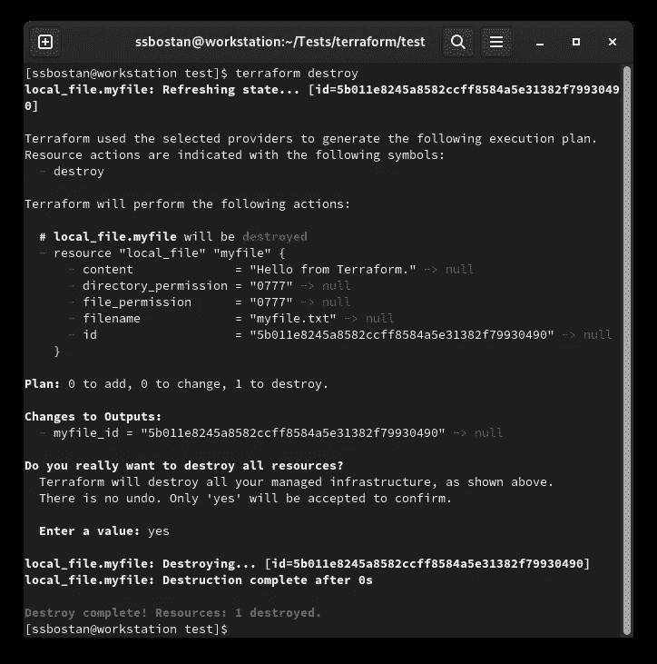

# Terraform 教程—第 1 部分—简介和基本概念

> 原文：<https://itnext.io/terraform-tutorial-part-1-intro-and-basic-concepts-7a27ae7722b6?source=collection_archive---------0----------------------->


我有好消息给 Terraform 爱好者！我打算写一个最完整的地形教程，就像 Jenkins 教程一样。在几十篇文章中，你会学到你需要的关于地形的一切，从零到英雄。让我们开始吧。

# 从过去到现在！改变了什么？

在过去，通常情况下，任何事情都是通过手动或脚本来管理的。基础设施部署在裸机上，大多数基础设施平台不提供基于 API 的服务。在那些日子里，新版本应用程序的发布速度和部署速度都不高，应用程序的生命周期(从开发到部署)进展缓慢，开发团队已经从运营团队(系统管理员)中分离出来，但如今，一切都在改变，一切的速度都在提高。应用程序以敏捷的方式开发。基础设施平台提供基于 API 的服务，企业每天发布数百个应用程序版本(新版本)。公司有新需求！他们需要更快的方法来部署基础架构和应用程序。他们需要新的方法来使其基础架构可重复使用。他们需要新的东西！你知道什么是 DevOps，正因为如此，你才在这里。作为一名 DevOps 工程师，您工作的一个典型部分是创建更易管理和可重复的基础设施，但是您如何做到这一点呢？你的答案是通过代码实现基础设施！和以前完全不同的方式。

# 什么是作为代码的基础设施？

基础设施即代码，简称 IaC，是一种实现基础设施的新方法。在这种基础设施实现模型中，不是手动实现基础设施，而是用代码编写所需的基础设施，IaC 工具负责在真实的基础设施上实现它。例如，您的 VMware 基础架构上需要一台虚拟机。以手动方式，您必须打开 VMware 控制台，登录到它，转到您的数据中心，创建一个新的虚拟机，将其分配到适当的池、数据存储区和网络，并指定其资源，如 CPU、RAM、硬盘大小等。，但是使用 IaC，您可以编写一些代码，IaC 工具会在您的 VMware 基础架构上创建虚拟机，而无需任何直接的人工交互或手动操作。以下 IaC 代码是用 Terraform DSL 语言 HCL 编写的，它在 VMware 基础架构上创建了一个新的虚拟机。这只是一个将基础设施作为代码引入的例子。我很快会解释一切。

```
provider "vsphere" {
  user                 = "ssbostan"
  password             = "justfortest"
  vsphere_server       = "myvcenter.test.local"
  allow_unverified_ssl = true
}data "vsphere_datacenter" "mydatacenter" {
  name = "mydatacenter"
}data "vsphere_datastore" "mydatastore" {
  name          = "mydatastore"
  datacenter_id = data.vsphere_datacenter.mydatacenter.id
}data "vsphere_resource_pool" "mypool" {
  name          = "mycluster/Resources"
  datacenter_id = data.vsphere_datacenter.mydatacenter.id
}data "vsphere_network" "mynetwork" {
  name          = "public"
  datacenter_id = data.vsphere_datacenter.mydatacenter.id
}resource "vsphere_virtual_machine" "myvirtualmachine" {
  name             = "myvirtualmachine"
  datastore_id     = data.vsphere_datastore.mydatastore.id
  resource_pool_id = data.vsphere_resource_pool.mypool.id
  num_cpus         = 2
  memory           = 1024
  guest_id         = "ubuntu64Guest"
  network_interface {
    network_id = data.vsphere_network.mynetwork.id
  }
  disk {
    label = "mydisk"
    size  = 20
  }
}
```

上述代码登录到 VMware infrastructure，并创建一个具有指定数量的 RAM、CPU、硬盘等的新虚拟机。

# 为什么我们需要代码形式的基础设施:

作为代码的基础架构 IaC 减少了人为错误，允许我们编写一次并部署多次，使生命周期可重复，防止手动部署模型的任何错误配置，允许我们以更好的方式管理我们的基础架构，提供更好的方法来大规模管理基础架构，以及许多其他好处。在阅读本文之前，您已经检查并了解了它的许多好处。

# 作为代码编程语言的基础设施:

从技术上来说，你可以用你选择的任何编程语言编写 IaC 代码，比如 Python、Typescript、Golang 等。，但在现实世界中，它依赖于 IaC 工具及其支持的语言。例如，使用 terra form CDKTF(terra form 的云开发工具包)，可以用 Python、Typescript、Java、C#和 Go 编写 IaC 代码。除了众所周知的编程语言之外，IaC 工具还可以提供它的 DSL 语言。对于 Terraform，您也可以用 HCL(HashiCorp 配置语言)编写 IaC 代码。除了普通的编程语言之外，其他一些 IaC 工具如 Pulumi 可以让你用 YAML 语言编写 IaC。我将很快发布最完整的 Pulumi 教程。

# 什么是 Terraform？

Terraform 是 DevOps 领域中一个众所周知的 IaC 工具，但我想称之为生命周期-代码工具，因为除了基础设施之外，您还可以管理众多应用程序的生命周期，如 Grafana、Elasticsearch、Gitlab、Jenkins 等。在 Terraform 及其提供商的帮助下，您可以专注于编写代码，而将部署和管理阶段留给 Terraform。如今，Terraform 已经成为 DevOps 生命周期中最重要的部分之一。

# 地形建筑:

Terraform 是一个基于插件的工具。因此，它有一个核心应用程序 terraform 和数百个插件。核心应用程序提供了一个统一的层来管理 IaC 代码，它负责安装所需的插件，调用它们，管理状态等。另一方面，插件在这里与真正的基础设施平台和应用程序通信，如 AWS、GCP、Azure、Grafana、Jenkins、Gitlab 等。这些插件有些是由 HashiCorp 团队官方维护的，有些是由第三方维护的。每个人都可以编写和分发自己的插件。你可以在 [Terraform Registry](https://registry.terraform.io) 网站上找到数百个插件。



Terraform 插件分为两种类型:**提供者**和**提供者**。提供者是一个插件，负责通过 API 连接到真实的基础设施或应用程序，并创建、修改和删除对象和资源，而供应者是一个插件，负责连接到被供应的基础设施，并对其进行一些更改。例如，您可以使用 AWS PROVIDER 来提供 EC2 实例，并在提供后使用 remote-exec PROVISIONER 在其上执行一些命令。您应该注意，使用置备程序根本不是最佳做法，它们是作为最后的解决方案提供的。

# 现在就开始，用 Terraform 做:

在这一系列教程和文章中，我打算用 HCL 语言解释 Terraform。我将为 CDKTF 发布另一门使用通用编程语言的课程。所以让我们开始吧。看看下面的代码。

所有 terraform 代码都应写入带有**的文件中。tf** 扩展，对于小型和非模块化代码通常为 *main.tf* 。每个地形文件可以由各种代码块组成，如资源、数据、变量、输出等。例如，在上面的代码中，我们有一个资源块。所有 terraform 块都使用以下编码约定。

```
<BLOCK TYPE> [<BLOCK PARAMETER1> <BLOCK PARAMETER2> ...] {
  <ARGUMENT NAME1> = <ARGUMENT VALUE1>
  <ARGUMENT NAME2> = <ARGUMENT VALUE2>
  ....
  <INNER BLOCK> {
      <ARGUMENT NAME1> = <ARGUMENT VALUE1>
      <ARGUMENT NAME2> = <ARGUMENT VALUE2>
  }
}
```

每个块由其类型标识，并且可以有零个或多个参数。例如，terraform 块没有参数，variable 块有一个参数，resource 块有两个参数。每个块可以有零个或多个参数和内部块。例如，在上面的代码 *intro1.tf* 中，我们有一个资源块有两个参数和两个自变量。下面的代码是一个例子，让你的眼睛熟悉各种块。

使用[官方安装](https://www.terraform.io/downloads)方法安装 Terraform。

将上述代码保存到 *main.tf* 文件中，并运行以下命令。

```
terraform init
```



运行 **init** 命令后，可以看到*。terraform* 目录和你的 *main.tf* 文件旁边的 *.terraform.lock.hcl* 。



初始化后，运行 plan 命令。

```
terraform plan
```



然后运行应用命令。

```
terraform apply
```



运行 apply 命令后，您可以在前面的文件旁边看到 myfile.txt 以及 terraform.tfstate 文件。



我们来描述一下流程、文件、目录等。

通过运行`terraform init`命令，terraform 通过创建初始文件、加载远程状态、下载插件、模块等方式初始化当前工作目录。当前项目中所有使用过的插件都将被下载到*中。terraform* 目录和 *.terraform.lock.hcl* 指向所用插件的版本及其签名。

如果您使用远程后端来存储您的 Terraform 状态文件， *terraform.tfstate* ，init 命令将在初始化过程中加载它。后面我会完整的解释。

通过运行`terraform plan`命令，你可以检查 terraform 打算做什么，创建/销毁等等。使用这个命令，您可以看到接下来会发生什么。plan 命令不会改变实际基础设施中的任何东西。您可以在不运行计划步骤的情况下应用更改。这只是在采取行动前的检查。

最后，通过运行`terraform apply`命令，Terraform 将执行一个真正的操作，资源将在远程端创建/销毁，真正的基础设施。通过运行这个命令，你会看到会有什么改变，就像**计划**命令一样，接受它之后，部署过程就开始了，之后 Terraform 制作 *terraform.tfstate* 文件，这是 terraform 生态系统的重要文件。我将在接下来的文章中深入解释它。

解释的 IaC 代码将创建一个名为 myfile.txt 的文件，其中包含指定的内容。从已定义的变量中读取内容，在创建文件后，其 id 将显示为输出。

```
terraform output
```



如果我们想要销毁基础设施或任何以前部署的资源，我们可以使用 destroy 命令。使用 destroy 命令，所有 Terraform 部署的资源都将被销毁。请注意，如果你破坏了某样东西，你不能用 Terraform 恢复它。如果某样东西被破坏了，那它就彻底没了。

```
terraform destroy
```



# 最后的话和结论:

Terraform 是 DevOps 领域的一个很酷的工具。它让 DevOps 工程师的生活变得更加甜蜜和轻松。借助 Terraform，你可以用代码管理很多事情。它使您的基础架构和应用程序生命周期可重复且更易于管理。关于地球，我有很多东西要教你。要支持这个教程，就拍拍它，星星星星下面的 GitHub 库。

关注我的 LinkedIn[https://www.linkedin.com/in/ssbostan](https://www.linkedin.com/in/ssbostan)

[](https://github.com/ssbostan/terraform-tutorial) [## ssbostan/terra form-教程

### 此时您不能执行该操作。您已使用另一个标签页或窗口登录。您已在另一个选项卡中注销，或者…

github.com](https://github.com/ssbostan/terraform-tutorial)