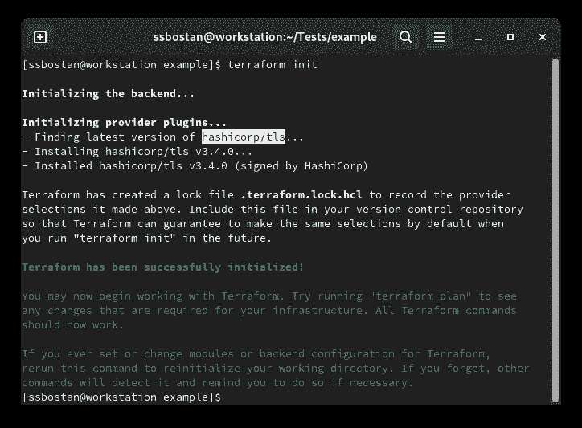
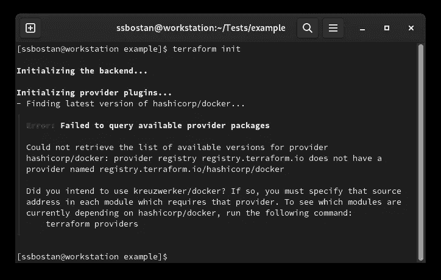
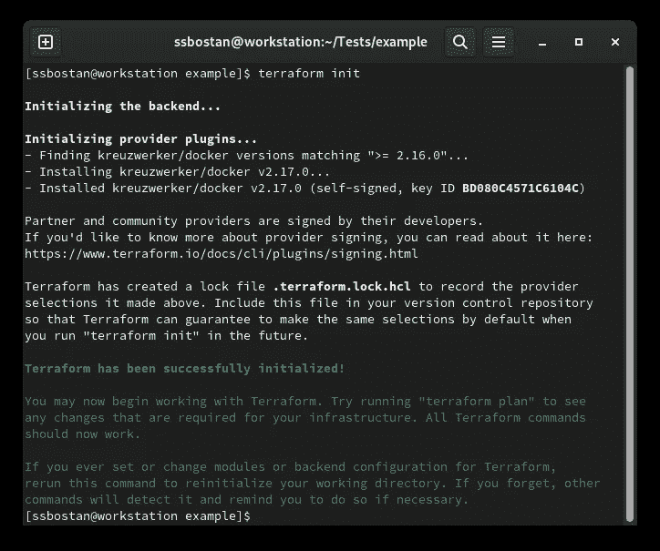
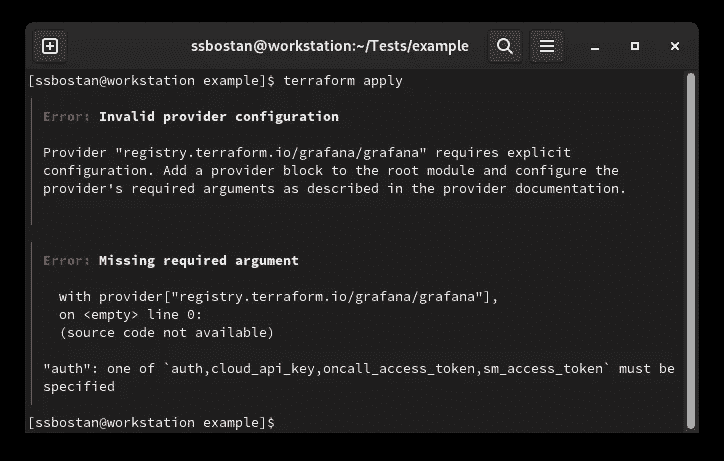
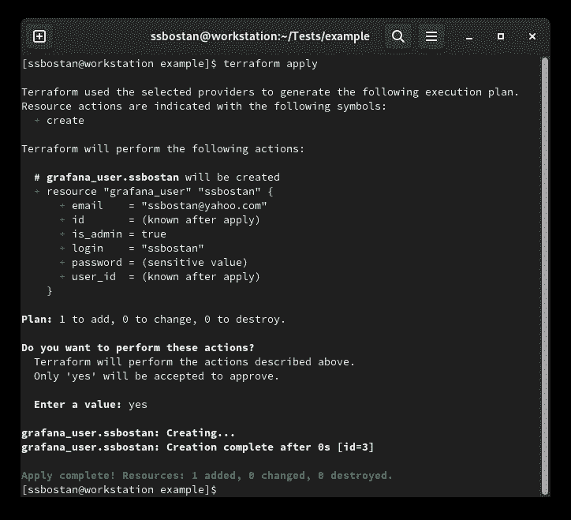
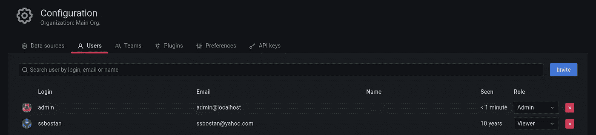

# Terraform 教程—第 2 部分—提供商和资源

> 原文：<https://itnext.io/terraform-tutorial-part-2-providers-and-resources-30121e28359b?source=collection_archive---------1----------------------->


在这篇文章中，我谈到了平台提供者和资源。如果你没有看上一篇文章，那么是时候看完再继续这篇文章了。你可以在下面的 GitHub 资源库中找到所有的 Terraform 教程及其示例。

[](https://github.com/ssbostan/terraform-tutorial) [## GitHub-ssbo stan/terraform-tutorial:最完整的 terra form 教程，参考，牛逼…

### 如果你觉得有用，就看星星。星星星星星星。Terraform 教程的参考和示例库…

github.com](https://github.com/ssbostan/terraform-tutorial) 

# 什么是提供者，它做什么？

提供商是 Terraform 的重要组成部分。一方面，他们从平台上获得他们应该做的事情，另一方面，他们与真正的基础设施、软件等进行交流。，要做实实在在的行动。他们知道 Terraform 生命周期的真实世界方面的一切。例如，当您编写 Terraform 代码以在 AWS 中创建 EC2 实例时，AWS 提供者知道如何连接到 AWS API，向其进行身份验证，应该调用哪个端点来创建 EC2 实例，并且它知道 AWS API 响应等。所以，如果你想把 Terraform 和云环境、基础设施、软件等整合起来。，你需要它的提供者使平台能够与之通信。Terraform 有大量的提供者，他们分为三种类型。**官方提供者**由 HashiCorp 团队官方开发、维护和提供。**验证提供者**由软件官方团队开发、维护和分发(例如 Cloudflare 提供者由 Cloudflare 公司提供)。**社区提供者**由像我、你或每个人这样的第三方开发、维护和分发。

您可以在 Terraform 注册表中找到所有可用的提供程序:

[https://registry . terraform . io](https://registry.terraform.io/)

# 什么是资源，它有什么作用？

资源是一个抽象的实体，它指向现实世界中的某些东西。它可能指向 VMware 基础架构中的一个虚拟机、本地系统中的一个文件、Grafana 仪表板中的一个用户、AWS 云中的一个数据库，有时，“在空资源的情况下”它什么也不指向。那么，你如何找到并使用它们呢？实际上，这取决于提供商。每个平台提供商可以提供一个或多个资源。例如，AWS 提供商提供了大量资源，使您能够在 AWS 云服务中做任何事情。您可以在提供商的文档中找到提供商提供的所有资源。例如，它是 [AWS](https://registry.terraform.io/providers/hashicorp/aws/latest/docs) 文档页面。

# 关于资源块的一些事情:

Terraform 资源块需要两个参数。资源名称和对象/实例名称。资源名来自提供者，对象名用于定义所用资源的实例。对象/实例名称在资源的当前范围内应该是唯一的。我会解释“什么是范围？”在以后的文章中，当我解释 Terraform 模块时。现在，请记住，您不能用相同的名称定义一个资源的两个或多个实例。例如，在使用“aws_instance”资源的情况下，不能创建同名的两个实例。

```
resource "**RESOURCE_NAME**" "**OBJECT_NAME**" {
  argument1 = value1
  argument2 = value2
  nested_block1 {
    argument1 = value1
    argument2 = value2
  }
  nested_block2 {
    argument1 = value1
    argument2 = value2
  }
```

例如，下面的代码为您创建了一个私钥。

要部署它，请运行以下命令:

```
terraform initterraform apply
```

运行`terraform init`命令后，您可以看到 Terraform 检测到所需的提供程序并自动安装它们。对吗？几乎没有！实际上，Terraform 能够自动安装官方提供者，如果你想使用任何非官方提供者“认证提供者或社区提供者”,你应该在 terraform 块的 **required_providers** 块中定义它们。

注:所有官方提供商都存储在 **hashicorp** 账户中。



另一个问题是 Terraform 如何意识到它应该安装 **tls** provider？Terraform 读取资源名的第一部分来检测提供者。例如，如果您定义了 tls_private_key 资源，它会读取第一个下划线(_)之前的第一部分，并将其视为提供程序名称。这是适用于所有资源和提供商的全局规则。

让我们试试另一个例子:

要部署它，请运行以下命令:

```
terraform init
```

发生了什么事？



您可以看到所需的提供商没有自动安装，因为它不是官方的 Terraform 提供商，并且不在他们的官方帐户中。因此，我们必须定义它来告诉 Terraform 应该在哪里找到提供者并安装它。为了解决上面的例子，我们需要定义 docker 提供者源。

现在让我们再次尝试 init 命令:

```
terraform init
```

您可以看到 docker 提供程序安装成功。



**重要提示:**
真正的基础设施应该在使用提供者之前就存在于现实世界中。例如，要使用 Docker 提供程序，您必须在使用之前在您的系统上安装 Docker。

# Terraform 提供商配置:

大多数提供商在使用前需要配置。例如，您应该为 AWS 提供者配置访问密钥、秘密密钥、区域等。，或者 Kubernetes 提供者提供 API 地址、用户名、密码或其他信息。在上面的例子中，docker，Terraform 如何识别在您的本地机器上部署 Docker 容器，以及我们如何告诉它部署到另一个 Docker 主机？所有这些都可以通过 provider 块进行配置。您可以为每个提供程序添加零个或多个提供程序块。有些提供程序带有默认的提供程序配置，您可能不需要更改它们，而有些提供程序需要配置。您可以从提供者文档中检查它。

运行以下代码并查看错误:

您可以使用以下命令运行它:

```
terraform initterraform apply
```

发生了什么事？



你得到了一个错误，因为 Grafana 提供者需要一个配置，但是为什么你在应用 Docker 容器时没有得到任何错误，前面的代码？是因为**默认**配置。Docker provider 带有一个默认配置，指向您的本地 Docker 主机，但是在 Grafana 的情况下，在应用之前应该设置一些必需的参数。

**那么，我该如何配置提供商呢？**
您可以在提供者文档页面上找到配置提供者的所有可用参数。当您获得一些关于提供者配置的知识时，您可以在 terraform 代码的提供者块中定义它们。例如，求解上面的代码:

如您所见，我告诉了 Terraform 提供者什么是 Grafana 仪表板地址和用户认证细节。应用上述代码后，您可以看到代码已成功部署。请注意，您应该在使用上述代码之前部署 Grafana。



现在，登录 Grafana 仪表板并查看用户页面。应该会创建一个新用户“ssbostan ”,并显示在您的仪表板中。



若要删除用户，请运行以下代码:

```
terraform destroy
```

就是这样。你用地形做到了。

# 死信:

我称之为一纸空文是因为你感染了 Terraform:)现在你对 Terraform，它的提供者和资源有了一个大的了解。要成为人形忍者，我们还有很长的路要走。如果你有任何问题或需要任何帮助，只要平我。此外，您可以在下面的资源库中找到所有示例和相关文章。启动它，并将其发送给你的朋友，同事和需要学习 Terraform 的人。

关注我的 LinkedIn[https://www.linkedin.com/in/ssbostan](https://www.linkedin.com/in/ssbostan)

[](https://github.com/ssbostan/terraform-tutorial) [## GitHub-ssbo stan/terraform-tutorial:最完整的 terra form 教程，参考，牛逼…

### 如果你觉得有用，就看星星。星星星星星星。Terraform 教程的参考和示例库…

github.com](https://github.com/ssbostan/terraform-tutorial)