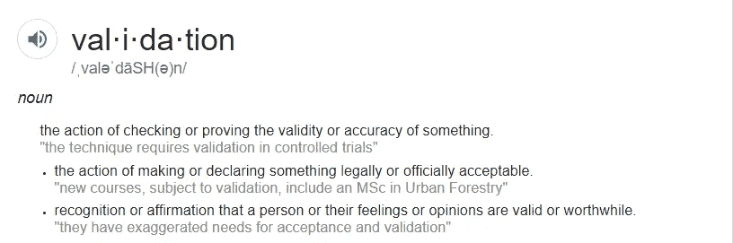

# Terraform 验证输入(实验功能)

> 原文：<https://itnext.io/terraform-validating-inputs-experimental-feature-6cc502b94357?source=collection_archive---------3----------------------->



我是 Azure ARM 模板的长期用户。我确保始终使用的一个特性是验证 ARM 输入参数。然而，我总是发现验证选项是有限的；尤其是 ARM 模板语言不可扩展。随着我使用 Terraform 的进展，我想继续验证输入，看看 TF 是否提供了额外的价值。

我在 0.12 流中开始了我的 TF 之旅，这意味着我不必处理以前版本中的限制。我惊讶地发现输入验证是一个预览/实验特性。幸运的是，它满足了我的期望，并解决了 ARM 的可扩展性问题。

作为一个实验性的特性，您必须在您的模块代码中订阅它的用法。在您的 *variables.tf* (或 any。tf 文件)。

```
terraform { experiments = [variable_validation]}
```

让我们看几个例子

首先，我有一个模块，在其中我为 AKS 集群创建了一个虚拟网络、子网和路由。我希望该模块是固执己见的执行/21 CIDR 范围。如您所见，验证条件可以利用所有可用的函数。此外，它还允许您提供有意义的错误消息。

```
variable "base_cidr_block" { type        = string description = "Address range for the virtual network in CIDR notation. CIDR must be a /21." validation { condition     = tonumber(regex("/(\\d+)", var.base_cidr_block)[0]) == 21 error_message = "A CIDR range of /21 is required to support enough Pod IPs." }}
```

我实现的第二个验证类似于 ARM 中的 contains()函数

```
variable "tier_name" { type        = string description = "Service tier the application will run." validation { condition     = contains(["prod", "nonp", "sbox"], var.tier_name) error_message = "Argument \"tier_name\" must be either \"sbox\", \"nonp\", or \"prod\"." }}
```

由于这是一个实验性的功能，YMMV。我愿意在这个时候冒这个险，因为增加的价值超过了可能的弊端。我也愿意以后做小重构。我相信这个特性最终会成为 GA。