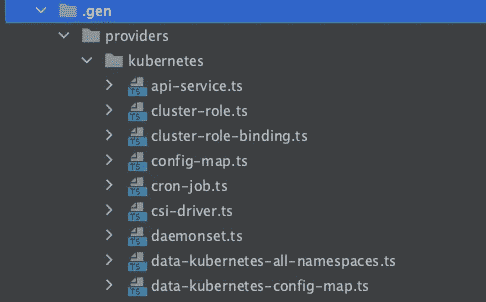
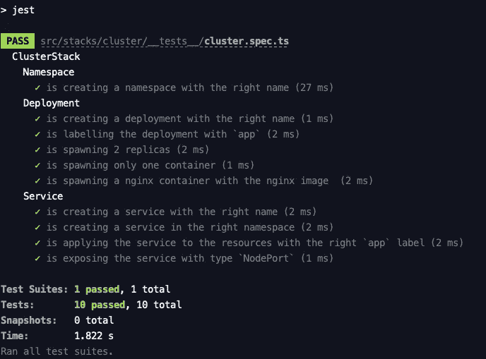

# 带打字稿的地形

> 原文：<https://itnext.io/terraform-with-typescript-7643defb4eb1?source=collection_archive---------1----------------------->


迈克·肯尼利在 [Unsplash](https://unsplash.com?utm_source=medium&utm_medium=referral) 上的照片

作为代码的基础设施正在慢慢崛起，而且是永久性的。

如今，用流行的手动方法来处理基础架构编排已不再被接受。虽然向云的转变带来了丰富的工具箱，但复杂性也呈指数级增长，因此应该部署一个管理解决方案。

过去，运营和基础架构管理一直是一个隐藏的领域，该领域完全局限于少数专家或团队。

从发展的角度来看，这个“*挑战*”可以解决吗？

当然了。面对这个问题有很多解决方案。 **Terraform** 就是其中之一。

为什么不把开发者纳入范围？

我们来了。

最近 *Hashicorp* 为 **CDK** (云开发工具包——仍在开发中)引入了新的语言，支持**类型脚本**、 **Python、**和 **Java** 。太神奇了！

在本文中，我将重点介绍如何将 Terraform 与 Typescript 结合起来，并将基础设施作为代码推向下一个层次。

# CDKTF

Hashicorp 提供的 CDKTF 使得用 Terraform 实用程序及其相关的实现提供程序创建 Typescript 环境变得简单。

在撰写本文时，有许多官方提供者和社区提供者，都可以在 Typescript 生态系统中使用。

开始使用 CDKTF 非常容易，它需要地形(> 0.12)和 NPM/纱线:

```
npm install --global cdktf-cli@next
```

或使用 brew:

```
brew install cdktf
```

# **使用 Terraform 创建和部署资源**

多亏了 CLI，才有可能创建一个基本的样板文件:

```
mkdir typescript-k8s && cd $_cdktf init --template=typescript --local
```

cdktf init 命令正在生成开始所需的文件:

*   json:包含 cdktf 配置，明确说明要使用的提供者(它们可以是官方提供的，也可以是社区提供的——最后一个需要手动安装)。
*   typescript 相关文件:package.json、main.ts 等…

我们可以做的演示是，将 Kubernetes 资源简单地部署到一个已经创建的集群中(例如本地类实例)。以下代码重复使用了 CDK Github 官方页面上的一个官方示例，或者如果你想了解更多，请访问官方页面教程。

首先，让我们将 Kubernetes 提供者添加到我们的 cdktf.json 中，作为我们的主要提供者(并用样板文件替换这个提供者):

CDKTF 的美妙之处在于，我们可以下载缺少的提供者(列在官方提供者列表中)，并使用下面的命令自动生成类型/实现(也可以作为初始引导):

```
cdktf get
```

一个*。gen* 文件夹被创建，它包含与期望的提供者相关的所有类型/实现。



。带有创建的打字和打字稿文件的 gen 文件夹

现在是编辑“main.ts”的时候了，它包括一个在开始时提供帮助的极简方法:

这个示例代码什么也不做，它只是实例化 MyStack(它扩展了 TerraformStack)并调用“synth”方法，在幕后执行 *init-plan-apply* 。

例如，我们可以在集群上部署 Nginx 控制器(名称空间、部署和相关服务):

嵌入在 main.ts 文件中的代码创建了 3 样东西:

*   将保存我们的资源的名称空间
*   具有指定 Nginx 映像的部署
*   公开 Nginx 的服务

如果我们想要部署这些资源，让我们调用以下命令:

```
cdktf deploy
```

下面您可以看到相关的输出:

如果我们用 *kubectl* 运行基本命令，比如:

```
+ kubectl get namespaces
NAME                 STATUS   AGE
default              Active   3d5h
kube-node-lease      Active   3d5h
kube-public          Active   3d5h
kube-system          Active   3d5h
local-path-storage   Active   3d5h
tf-cdk-nginx         Active   1m + kubectl get deployments -n tf-cdk-nginx
NAME               READY   UP-TO-DATE   AVAILABLE   AGE
nginx-example-tf   2/2     2            2           1m
```

一切都已正确创建！

如果愿意，我们甚至可以通过调用以下命令来销毁创建的资源:

```
cdktf destroy
```

或者，如果我们快疯了，我们可以通过再次执行 *deploy* 命令来重新部署资源。难以置信！！！

多亏了哈希公司提供的这些工具，一个新的世界打开了！

# 介绍(最后)单元测试

是什么让 IaC 更加强大？是的，单元测试！

现在，有了 Typescript 环境，我们可以连接我们喜欢的测试工具。

在这篇文章中(也是我个人的选择)，我推荐 **Jest** ！

让我们开始安装依赖项并设置测试环境:

```
npm install --save-dev jest babel-jest [@babel/core](http://twitter.com/babel/core) [@babel/preset-env](http://twitter.com/babel/preset-env) [@babel/preset-typescript](http://twitter.com/babel/preset-typescript) @types/jest
```

并创建 babel.config.js:

为了调用测试，我们实际上可以替换 package.json 中现有的“测试”脚本:

```
{
  "name": "typescript-k8s",
  ...
  "scripts": {
    ...
    "test": "jest",
    ...
  },
  ...
}
```

之后，让我们为集群堆栈添加一个简单的测试，并对我们编写的实际代码进行一些小的重构:

如果执行“npm 运行测试”,输出如下:



免责声明:这只是为了演示，可能只是测试配置(这不是一个很酷的做法)。但是，这显示了现在为准备和烘烤所需云资源的逻辑编写一些测试是多么容易。

如果你想玩它，你可以在 [Github](https://github.com/cdbkr/terraform-typescript-k8s-example) 上找到这个示例代码库。

最近推出的这些新工具为 IaaC 的专业人士和热情人士打开了新的视野。

管理基础设施在过去是一个棘手的问题，将云与开发世界结合起来实际上改善了整体体验。

我希望你从这篇文章中学到了一些新东西，并随时分享任何反馈。

干杯！！