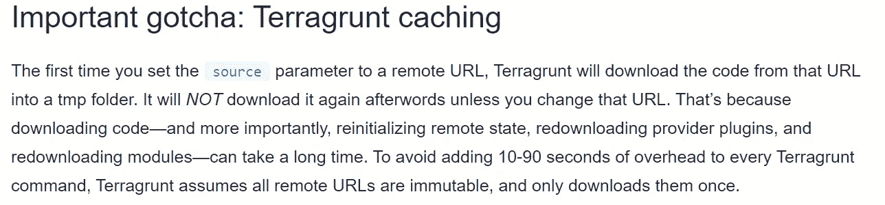

# terra grunt——与其内部行为融为一体

> 原文：<https://itnext.io/terragrunt-becoming-one-with-its-internal-behaviors-9697b6771928?source=collection_archive---------4----------------------->


terra grunt——多功能工具

Terragrunt 是 Terraform 的一个小包装器，增加了大量功能。在我以前的文章中，我关注的是能力和以新颖的方式使用它。

*   [terra grunt——围绕 Terraform 的胶水](/terragrunt-the-glue-around-terraform-ae15e2addb66)
*   [Terragrunt —动态远程状态管理](/terragrunt-dynamic-remote-state-management-1467a6992693)
*   [Terragrunt —模块间依赖管理](/terragrunt-inter-module-dependency-management-36528693acdf)
*   [terra grunt——动态使用凭证和 Azure 多订阅支持](https://patrick-picard.medium.com/terragrunt-using-credentials-dynamically-and-azure-multi-subscription-support-fa770506c913)

在本文中，我将重点介绍 Terragrunt 如何实现这些功能。我分享一些经验教训和如何排除故障。首先，我回顾了一个示例分层配置结构、Terragrunt 的操作顺序、缓存、源路径捕获和内容生成。

# 地形地貌结构

让我们从一个两级分层的 Terragrunt 配置开始。一个 *terragrunt.hcl* 在子文件夹中，一个在父文件夹中(如果所有子文件夹**都有 *include* 指令**，那么这个子文件夹将与其共享)。

下面的文件夹结构显示了 Terragrunt 配置的层次结构

```
├── core-iam
│   └── terragrunt.hcl
├── core-organization
│   └── terragrunt.hcl
├── credentials
│   └── terragrunt.hcl
├── log-analytics
│   └── terragrunt.hcl
└── terragrunt.hcl
```

让我们从*核心组织/terragrunt.hcl* 开始:

```
dependency "credentials" {
  config_path = "../credentials"
}terraform {
  source = "git::ssh://[git@github.com](mailto:git@github.com)/xxxxxx/terraform-azurerm-core-organization.git"extra_arguments "force_subscription" {
    commands = [
      "init",
      "apply",
      "destroy",
      "refresh",
      "import",
      "plan",
      "taint",
      "untaint"
    ]env_vars = {
      ARM_TENANT_ID     = dependency.credentials.outputs.tenant_id
      ARM_CLIENT_ID     = dependency.credentials.outputs.client_id
      ARM_CLIENT_SECRET = dependency.credentials.outputs.client_secret# Need to force a subscription id when logging in as SPN.
      ARM_SUBSCRIPTION_ID = local.config.management.subscription_id
    }
  }
}locals {
  config = yamldecode(file(format("%s/config.yaml", get_env("AZ_PIPELINE_CONFIG_PATH"))))
}inputs = {
  root_management_group_name = local.config.global.root_management_group_name
  connectivity_subscription_ids = [
    for sub in local.config.subscriptions.connectivity : sub.id
  ] # Configuration abbreviated
}include {
  path = find_in_parent_folders()
}
```

以及根文件夹 *terragrunt.hcl*

```
locals {
  rscfg = yamldecode(file(find_in_parent_folders("remote_state.yaml")))
}remote_state {
  backend = "azurerm"
  generate = {
    path      = "backend.tf"
    if_exists = "overwrite"
  }
  config = {
    tenant_id       = local.rscfg.remote_state.tenant_id
    subscription_id = local.rscfg.remote_state.subscription_id resource_group_name  = local.rscfg.remote_state.common.resource_group_name
    storage_account_name = local.rscfg.remote_state.common.storage_account_name
    container_name       = local.rscfg.remote_state.common.container_namekey = "${path_relative_to_include()}/terraform.tfstate"snapshot = true}
}generate "provider" {
  path      = "provider.tf"
  if_exists = "overwrite"
  contents  = <<EOF
provider "azurerm" {
  version = "~>2.0"
  features {}
}
EOF
}
```

现在我们已经有了要使用的配置，让我们来看看 Terragrunt 是如何工作的。

# 操作顺序

当您运行任何 Terragrunt 命令(init、plan、apply、destroy)时，它会执行一系列任务；其中一些取决于配置。为了简单起见，让我们使用 *terragrunt 计划*作为从 *core-organization/* 文件夹中执行的动作。

Terragrunt 查看当前文件夹 *terragrunt.hcl* 并遵循其中的所有说明:

*   查看每个*依赖关系*，确保它们的状态可用
*   初始化在 *terraform.source* 中定义的模块。Terragrunt 自动初始化模块。不需要先运行 *terragrunt init* 。在这一步，您将看到一个名为*的隐藏文件夹的创建。terragrunt-cache* (稍后会有更多细节)。
*   物化包含语句。在这种情况下，我们在父文件夹中搜索一个 *terragrunt.hcl* 。
*   父配置有一个*远程状态*和*生成*指令。remote_state 被评估并动态生成 *backend.tf* 。这个文件与其他文件一起保存在 terragrunt 缓存中。tf 文件。类似地生成 *provider.tf* 。
*   计算局部变量/输入，并且 *extra_arguments* 生成环境变量。这些信息被传递给 Terraform 以部署模块。到目前为止，这都是 Terragrunt 的魔法，控制权交给了 terraform。

# 。terragrunt-cache

Terragrunt 使用缓存作为其工作目录。该文件夹对于故障排除至关重要，并且可能是令人头疼的原因(参见下一节)。

在缓存中，创建类似 guid 的路径。当您导航到最低级别时，您会注意到一些有趣的事情。

```
ls -la .terragrunt-cache/OfnG7YSki89VGJUc7uL4eruVFG4/BoxvdZRzDTvrVMxcmMGN5EdtYOU
total 76
drwxr-xr-x 6 patrick patrick 4096 Dec 21 09:43 .
drwxr-xr-x 3 patrick patrick 4096 Dec 18 22:40 ..
drwxr-xr-x 6 patrick patrick 4096 Dec 18 22:40 .git
-rw-r--r-- 1 patrick patrick   64 Dec 18 22:40 .gitignore
-rw-r--r-- 1 patrick patrick  225 Dec 18 22:40 .pre-commit-config.yaml
drwxr-xr-x 4 patrick patrick 4096 Dec 21 09:43 .terraform
-rw-r--r-- 1 patrick patrick  239 Dec 21 09:43 .terragrunt-module-manifest
-rw-r----- 1 patrick patrick   27 Dec 18 22:40 .terragrunt-source-version
-rw-r--r-- 1 patrick patrick 2656 Dec 18 22:40 README.md
-rw-r--r-- 1 patrick patrick  456 Dec 21 09:43 backend.tf
drwxr-xr-x 4 patrick patrick 4096 Dec 18 22:40 examples
-rw-r--r-- 1 patrick patrick 1216 Dec 18 22:40 locals.tf
-rw-r--r-- 1 patrick patrick 1304 Dec 18 22:40 main.tf
-rw-r--r-- 1 patrick patrick 1472 Dec 18 22:40 output.tf
-rw-r--r-- 1 patrick patrick  106 Dec 21 09:43 provider.tf
-rwxr-xr-x 1 patrick patrick 1775 Dec 21 09:43 terragrunt.hcl
drwxr-xr-x 2 patrick patrick 4096 Dec 18 22:40 tests
-rw-r--r-- 1 patrick patrick 1397 Dec 18 22:40 variables.tf
-rw-r--r-- 1 patrick patrick  629 Dec 18 22:40 variables_naming.tf
```

该文件夹包含被指令 *terraform.module* 引用的模块中的文件。在*中。terraform* 文件夹，存储已初始化的依赖关系。还可以看到我们之前生成的 *backend.tf* 和 *provider.tf* 。

所以如果你不确定你的*远程状态*和*生成*指令，看看生成的文件！

如果您愿意，您可以导航到此文件夹并进行 terraform 应用。然而，这些输入是不可用的，因为 Terragrunt 会动态生成这些输入，并且不会将它们具体化为 tfvars。

Terragrunt 缓存是一个很好的工具，但有时您会遇到与您的配置不一致的行为。销毁缓存是绝对安全的。terragrunt-cache )并重新运行 terragrunt 来重新生成它。

# 源路径

在第一个配置中，我们使用一个 SSH URL 定义了一个模块路径，该路径将再次被复制:

```
terraform {
  source = "git::ssh://[git@github.com](mailto:git@github.com)/xxxxxx/terraform-azurerm-core-organization.git"
```

Terragrunt 支持 terraform 支持的所有路径类型。然而，有一些行为差异值得注意。远程 URL(SSH、Github 等)被认为是不可变的。一旦 Terragrunt 缓存了它，它就不会试图再次检索它。也就是说，最好使用版本控制来使 URL 可变，并在升级模块时强制重新下载。

```
source = "git::ssh://[git@github.com](mailto:git@github.com)/xxxxxx/terraform-azurerm-core-organization.git?ref=1.0.1"
```

使用相对路径的模块总是在每次运行时刷新。这在使用您正在修改的相关模块进行本地开发时非常有用。

```
source = "../../..//core-organization"
```

这种行为在[中有记录](https://terragrunt.gruntwork.io/docs/features/keep-your-terraform-code-dry/#important-gotcha-terragrunt-caching)，但经常被掩盖。这让我和我的同行们困惑了很多次。你已经被警告了。



相对 URL 与远程 URL

# 生成的内容

前面，我们看了一个 *remote_state* 和 *generate* 指令。这些通知 Terragrunt 动态创建文件，并保存在 Terragrunt 缓存中。

```
generate "provider" {
  path      = "provider.tf"
  if_exists = "overwrite"
  #......
}
```

使用 *if_exists* 属性来控制内容生成行为。该属性支持 3 个选项:

*   **覆盖** —生成文件，如果文件已经存在则覆盖
*   **跳过** —生成文件，但保留现有文件(如果有的话)
*   **错误** —如果定义了路径的文件已经存在，则错误退出。

我个人更喜欢*覆盖*选项，这样我就可以控制了。当 Terragrunt 生成一个文件时，它在内容中包含一个散列，这样它就知道内容是否在两次运行之间发生了变化(参见 Sig:)

```
# Generated by Terragrunt. Sig: nIlQXj57tbuaRZEa
provider "azurerm" {
  version = "~>2.0"
  features {}
}
```

我建议您为提供者和后端配置使用一致的名称。例如，如果某人在远程模块中有一个 *providers.tf* ，而您生成了 *provider.tf* ，terraform 将抱怨重复配置。

# 结论

这篇文章中有很多东西需要解释。我分享了很多你使用 Terragrunt 一段时间后获得的重要知识花絮。其中很多是我从战争伤疤中学到的！与你所使用的工具融为一体是很重要的。

我分享了一个示例分层配置，展示了 Terragrunt 在移交给 Terraform 之前如何执行其“包装”操作..理解 terragrunt 缓存对于故障排除非常重要，有助于理解 terraform 模块源和配置生成的行为。

尽情享受吧！