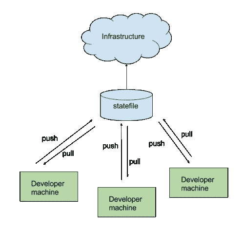

# 动态远程状态管理

> 原文：<https://itnext.io/terragrunt-dynamic-remote-state-management-1467a6992693?source=collection_archive---------2----------------------->



远程状态管理

在介绍性的博客条目中，我强调了 Terragrunt 的一项功能:动态生成远程状态配置。在深入研究它是如何工作的之前，让我们先看看如何在 vanilla Terraform 中处理它。

# Terraform 的方法

使用 Terraform，要远程存储您的状态，您需要创建一个后端配置，如下所示:

```
terraform {
  backend "azurerm" {
    tenant_id            = "xxxxxxxx-84e2-4390-b0b9-c79fdf7323ea"
    subscription_id      = "xxxxxxxx-b1ee-41e4-8bd5-e4a04300b5c1"
    resource_group_name  = "rg-tfstates-prod"
    storage_account_name = "stprod"
    container_name       = "prod"key      = "core-routing/terraform.tfstate"
    snapshot = true
  }
}
```

对于每个部署，您将需要上述配置并修改密钥，可能还需要资源组/存储帐户/容器名称。由于您可能使用整合的存储帐户，因此配置详细信息会重复出现。

第二个挑战是如何在 Git 中管理这个配置。假设您将同一个堆栈部署到生产和非生产环境中。您将需要创建 2 个存储库，每个环境一个(或者可能使用不同的分支)。理想情况下，你会想把代码和配置分开，有了 vanilla terraform，配置回购的数量会快速增长。

为了减少重复，人们可能会考虑使用变量传递*后端*对象中的配置。然而，*提供者*和*后端*的配置必须在“编译时”就知道，并且不能动态传入。

# 特拉格朗特方法

Terragrunt 在其 HCL 语言中引入了一个特殊的资源，称为 *remote_state* 。此资源适合动态生成此配置…正是我们需要的。让我们看一个生成远程状态的示例配置。

```
locals {
  rscfg = yamldecode(file(find_in_parent_folders("remote_state.yaml")))
}remote_state {
  backend = "azurerm"
  generate = {
    path      = "backend.tf"
    if_exists = "overwrite" # Always overrides the file if one exists
  }
  config = {
    tenant_id       = local.rscfg.remote_state.tenant_id
    subscription_id = local.rscfg.remote_state.subscription_idresource_group_name  = local.rscfg.remote_state.nonp.resource_group_name
    storage_account_name = local.rscfg.remote_state.nonp.storage_account_name
    container_name       = local.rscfg.remote_state.nonp.container_namekey = "${path_relative_to_include()}/terraform.tfstate"snapshot = true
  }
}
```

由于配置细节会重复出现，所以我将这些值外部化到一个 YAML 配置文件中，在运行时读取该文件以检索适当的设置。这在*局部*部分可以看到。还要注意函数 *find_in_parent_folders* 的使用，它是一个 Terragrunt 函数。

在 *remote_state* 资源中，我有一个 *generate* 语句，它将覆盖文件 *backend.tf* 如果它存在，并强制使用系统生成的文件。在 config 部分，这里提供了基本后端对象中的设置。大多数设置来自 YAML 配置。

要注意的是*键*属性的使用。该值是根据存储该 HCL 文件的文件夹层次结构生成的。它使用了一个 Terragrunt 函数(这个函数不是 Terraform 基础语言的一部分)。因此，如果您有一个如初始博客条目所示的层次结构，您将让该层次结构传播到 blob 存储命名空间。

> 警告—一旦设置了该项的值并且部署了基础结构；不要改变它。如果您更改配置中的路径，未来的计划将看不到状态文件，并将从头开始重新部署基础架构。

作为参考，我包含了这段代码来源的 YAML 文件:

```
remote_state:
  tenant_id: xxxxxxxxxx-84e2-4390-b0b9-c79fdf7323ea
  subscription_id: xxxxxxxxxx-b1ee-41e4-8bd5-e4a04300b5c1
  common:
    resource_group_name: rg-tfstates-common
    storage_account_name: stcommon
    container_name: common
  nonp:
    resource_group_name: rg-tfstates-nonp
    storage_account_name: stnonp
    container_name: nonp
  prod:
    resource_group_name: rg-tfstates-prod
    storage_account_name: stprod
    container_name: prod
```

# 结论

如您所见，Terragrunt 提供了减少代码重复和管理远程状态配置的工具。我们已经扩展了这个概念，使用 YAML 来使用集中的配置文件。Terragrunt 遵循类似 DSL 的 terraform，这使得它易于学习和使用。您已经看到了它提供的两个函数(find_in_parent_folders()和 path_relative_to_include())

有关此功能的更多信息，请查看该产品的文档[https://terra grunt . grunt work . io/docs/features/keep-your-remote-state-configuration-dry/](https://terragrunt.gruntwork.io/docs/features/keep-your-remote-state-configuration-dry/)