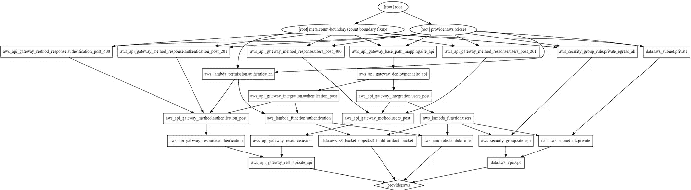
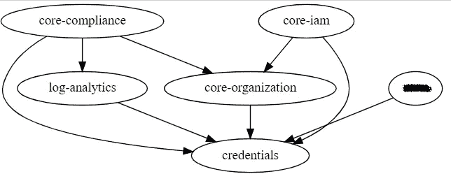

# Terragrunt —模块间依赖性管理

> 原文：<https://itnext.io/terragrunt-inter-module-dependency-management-36528693acdf?source=collection_archive---------2----------------------->



样本地形图

Terraform 提供了一个相当智能的图形引擎。当您在另一个资源中使用一个资源的属性时，它会在部署图中生成隐含的依赖关系。这可能是这种语言最好的特性之一。如果你有 code ARM 模板(Azure 的 JSON DSL)，你会生动地记得在哪里必须手工定义所有的依赖关系。

如果您不知道 Terraform 的绘图方法，请使用您最喜欢的模块并运行以下命令。它将生成一个图表，您可以在浏览器中打开它来查看依赖关系。

```
terraform graph | dot -Tsvg **>** graph.svg
```

当您部署大型基础设施的组件时，通常需要将输出从一个部署传递到另一个部署。这可以使用远程状态配置来实现，但这也有其自身的挑战。

如果您可以更干净地传递信息，并且不使用远程状态引用污染您的代码，会怎么样？

Terragrunt 又来救援了！

# Terragrunt 的依赖性方法

Terragrunt 允许您为一个部署定义一个到多个依赖项。对于大型基础设施的各种组件，依赖性管理在很大程度上取决于文件夹层次结构

一旦定义了依赖项，您现在就可以访问依赖项的输出，并可以将它们用作输入。让我们看一个例子。首先，使用*依赖关系*资源定义依赖关系。该资源需要配置该依赖项的路径(terragrunt.hcl 所在的位置)。这将允许运行时检索部署的地形状态，并导出模块的输出。

然后，在*输入*部分，您可以访问依赖关系中的任何属性，如下所示:

```
dependency.<dependency_name>.outputs.<attribute_name>
```

示例:

```
# Snippet 1 - The dependency definition
dependency "core-routing" {
  config_path = "../core-routing"
}inputs = {
  department_code = local.config.global.department_code
  environment     = local.config.dns.nonp.environmentlocation = local.config.dns.nonp.locationtags = local.config.global.tags# Configure DNS only once in the primary region folder.
  public_dns_zone = local.config.dns.nonp.public# Configure DNS only once in the primary region folder.
  private_dns_zone = local.config.dns.nonp.privatevnet_id_to_link_to_private_dns_zone = {
    # Snippet 2 - referencing a dependency's output associate_with_vnet_id = dependency.core-routing.outputs.vnet.id
    registration_enabled   = true
  }
}
```

# 先决条件

为了让 Terragrunt 检索之前部署的输出，该部署需要以前已经部署过(否则输出将不存在)

如果以前没有部署过，可以在依赖项配置中添加模拟来帮助计划工作。这不是我探索了很多的东西。如果您使用模拟，请确保模拟的输出与模块输出的结构(属性和内容)相匹配。

有关模拟输出的更多信息，请参见 Terragrunt 文档。[https://terra grunt . grunt work . io/docs/features/execute-terra form-commands-on-multi-modules-once/# unapplied-dependency-and-mock-outputs](https://terragrunt.gruntwork.io/docs/features/execute-terraform-commands-on-multiple-modules-at-once/#unapplied-dependency-and-mock-outputs)

# 绘制图形

由于 Terragrunt 是 Terraform 的扩展，它还可以绘制组件之间的依赖关系。

```
terragrunt graph-dependencies | dot -Tsvg > graph.svg
```

输出文件可以在浏览器中打开。让我们看一个样品。下图非常简单。随着基础设施的增长，依赖矩阵也会增长。使用工具来绘制层次结构图有助于理解部署的顺序。



# 结论

Terragrunt 提供了一种将输出从一个模块连接到另一个模块的本地方法，同时保持每个部署的独立性。它将 Terraform 的依赖性管理提升到了一个新的水平，并允许大型基础设施的编排。