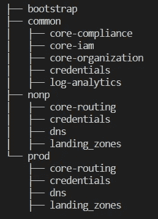
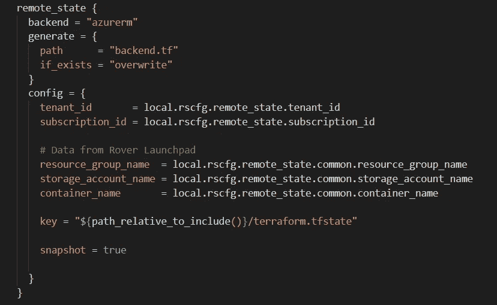
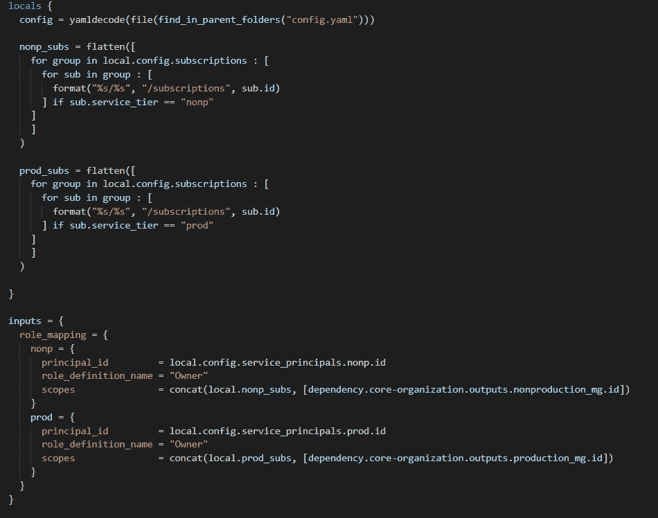
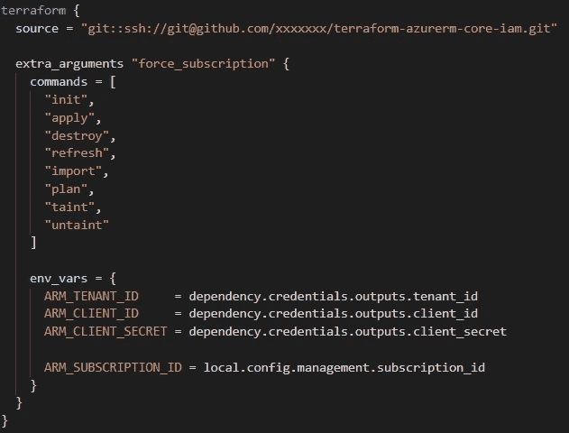

# terra grunt——围绕 Terraform 的粘合剂

> 原文：<https://itnext.io/terragrunt-the-glue-around-terraform-ae15e2addb66?source=collection_archive---------1----------------------->

Terragrunt 徽标

我已经有一段时间没有发帖了，这主要是因为我最近非常忙。我们面临的挑战之一是协调多个平台堆栈的部署。

Terraform 作为一种基础设施，与 Code DSL 一样出色。但是，在构建部署相互依赖的环境方面，它有所欠缺。当您想要管理着陆区的所有基础设施(云平台核心基础设施的基础部署)时，这变得非常具有挑战性。

在继续之前，让我澄清一下我将使用的一些术语:

*   模块— Terraform 模块封装了部署堆栈组件的逻辑。一个堆栈可以有多个模块来构成解决方案。多个模块可以在一个更大的模块中连接在一起，以构建一个堆栈。例如，您可以在用于创建 Azure DevOps 代理的更大模块中组合存储帐户、资源组、托管身份和虚拟机。
*   堆栈—提供有限功能的多个云资源。堆栈应该有自己的状态文件。示例:核心网络、DNS 区域、DNS 转发器、管理组层次结构、集中日志记录。通常，您会为每个环境(开发、质量保证、生产)多次部署一个堆栈

Terragrunt 的部署范围是一个 terraform 模块(上面定义的较大的模块)。它能够使用依赖关系拼接多个堆栈。

最初，我考虑使用远程状态在部署之间共享信息。然而，在大规模管理环境方面还存在其他问题(我稍后会谈到这些问题)。我继续寻找，遇到了 Gruntwork 的一个工具，叫做 Terragrunt。经过一个快速的概念验证(3 个小时的拼凑)，我确信这个工具有腿。让我们来看看什么是 Terragrunt。

> Terragrunt 是一个瘦包装器，它提供了额外的工具来保持您的配置干燥，使用多个 Terraform 模块，以及管理远程状态

让我们深入了解这些功能。我计划有额外的博客条目来单独涵盖它们。

*   **分层结构** —部署基础架构的组件本质上是分层的。在代码中组织这些组件遵循类似的方法。这允许您用层次结构配置您的 terragrunt 代码，并从树中的更高层继承配置；因此随后干燥。

Terragrunt 分级结构

*   **动态远程状态管理** —假设您有 10 个组件需要管理，这些组件的两个实例分别用于生产和非生产。你现在必须管理大约 20 个状态文件。因此，您需要为每个组件创建一个后端配置。这很快变得难以处理。Terragrunt 提供了使用 *remote_state* 资源动态生成后端配置的能力，并使用函数创建远程状态键。

远程状态动态生成

*   **将值传入模块时的完整 DSL 表达能力** —变量为您的模块提供了一个契约。对于 vanilla Terraform，这些值必须提前计算，并且不是动态的。使用 terragrunt，当“计算”模块的输入时，您可以完全使用 Terraform 语言；从而大大减少了在 Terraform 之外生成数据的工作。
*   **模块间依赖管理** —让我们面对现实吧，Terraform 基本上是一个图形引擎，用于确定模块中资源的部署顺序。Terragrunt 通过提供模块/栈之间的图形/依赖关系管理，将这个图形引擎推向了一个新的高度。它允许使用依赖资源将输出数据从一个模块传递到下一个模块。

DSL 表达和依赖管理

*   **多订阅/账户支持** — Terraform 主要专注于将组件部署到单一范围，如 Azure 订阅或 AWS 账户。可以在提供者配置中创建别名来解决这个问题，但是这很快就会变得难以管理。Terragrunt 允许环境变量的生成传递到 Terraform CLI 从而允许多订阅支持。

多订阅管理

*   **Terraform 代码生成** — Terragrunt 能够在规划/应用/销毁阶段动态生成配置文件。这对于生成后端配置很有用。类似地，您可以使用 *generate* 资源来创建提供者配置。通过生成配置，您能够减少代码重复并遵循 DRY 原则(不要重复自己)。
*   **多组件规划/应用/销毁** — Terraform 专注于单个堆栈部署。Terragrunt 根据 Terragrunt 代码中定义的依赖关系对其进行了扩展，以处理多个堆栈。您可以计划全部(并不完美，将在以后的文章中详细介绍)、应用全部和销毁全部。Terragrunt 构建元图，并以适当的顺序应用它。
*   **它只是工作** —好吧，那不是一种能力。但是，开发人员的体验是最重要的，Terragrunt 通过保持 DSL Terraform-like 做到了这一点。如果你熟悉 Terraform，扩展技能到 Terragrunt 是非常容易掌握的。

因此，尽管其中一些功能听起来有些神秘，请继续关注 Terragrunt 这个博客系列。我将通过代码示例来分解每个功能。

如果你好奇的话，可以看看 https://terragrunt.gruntwork.io/docs/的