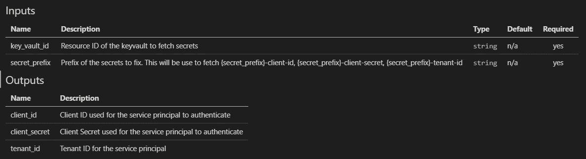
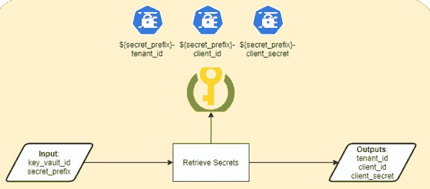

# Terragrunt —动态使用凭证和 Azure 多订阅支持

> 原文：<https://itnext.io/terragrunt-using-credentials-dynamically-and-azure-multi-subscription-support-fa770506c913?source=collection_archive---------3----------------------->

在这篇博客中，我将结合几个相关的主题:

*   多帐户/多订阅支持—将部分环境部署到不同的订阅
*   对基础架构的各个部分使用不同的凭据—允许在部署环境的各个部分时遵循最低权限方法

这篇博客扩展了之前讨论依赖性管理的内容。

# 多帐户/多订阅支持

在管理企业规模的云环境时，将它划分为功能块非常重要，这样可以实现职责分离并最大限度地减小爆炸半径。因此，平台管理、网络、身份、审计等核心组件应在单独的订阅中进行管理。

要将资源部署到不同的 Azure 订阅，可以将环境变量传递给 Terraform，并让它进行相应的身份验证。在下面的代码片段中，有 3 个感兴趣的地方:

*   凭证检索的依赖性(将在本文后面讨论)
*   凭据的环境变量(ARM_TENANT_ID、ARM_CLIENT_ID、ARM_CLIENT_SECRET)
*   用于固定部署的订阅。设置 ARM_SUBSCRIPTION_ID 的值

extra_arguments 部分需要特别注意。基本上，这个配置要求在调用下面的 Terragrunt 命令(init、apply、destroy 等)时注入 4 个环境变量。

```
# Snippet Area #1 - Required to switch to appropriate identity
dependency "credentials" {
  config_path = "../credentials"
}terraform {
  source = "git::ssh://[git@github.com](mailto:git@github.com)/xxxxxxx/terraform-azurerm-core-iam.git"extra_arguments "force_subscription" {
    commands = [
      "init",
      "apply",
      "destroy",
      "refresh",
      "import",
      "plan",
      "taint",
      "untaint"
    ]# Snippet Area #2 - Passing environment variables to Terraform
env_vars = {
      ARM_TENANT_ID     = dependency.credentials.outputs.tenant_id
      ARM_CLIENT_ID     = dependency.credentials.outputs.client_id
      ARM_CLIENT_SECRET = dependency.credentials.outputs.client_secret# Snippet Area #3 - Passing the subscription ID to deploy resourcesARM_SUBSCRIPTION_ID = local.config.management.subscription_id
    }
  }
}
```

不要错过命令数组中的任何重要操作，这一点很重要。我最初从列表中省略了“destroy ”,这意味着 Terraform 正在使用我的登录凭证和固定订阅。因此，如果我将我的默认订阅设置为不同于 terraform 状态的订阅，它将刷新状态，并意识到所有资源都已被“删除”,并将它们从状态中删除……因此在订阅中留下了混乱，我必须手动清理。我的伤疤是你的警告！

# 动态凭证检索

当您将各种组件部署到多个订阅时，您可以使用一个具有完全权限的服务主体，也可以将其分解为多个具有更严格访问权限的服务主体。后者是优选的，以遵循最小特权原则，并在凭证被泄露或操作员失误的情况下减小爆炸半径。

因此，我必须设计一种从 Azure DevOps 动态检索凭证的方法。因为我正在使用 Terraform 和 Terragrunt，所以我选择了一个感觉像 Terraform 本地的解决方案。我还想避免将此任务委托给带有 DevOps marketplace 插件的 Azure DevOps，以防我们的一些客户使用另一个 CICD 工具。

我构建了一个凭证获取器，它将从 Azure 密钥库中检索 3 个秘密，以表示租户 id、客户端 id 和客户端秘密。这个地形模块接受 2 个变量并输出 3 个值。



凭证提取器输入和输出

这是 Terraform 模块设计的示意图。可能是你能建造的最简单的地形模块之一！



要使用凭据获取器，部署必须设置对凭据获取器的依赖关系。然后它的输出可以作为环境变量传递。如果您参考上面的代码片段，请参见*片段区域#2* 。

# 含义和安全性

Terraform 部署使用状态文件来捕获模块的实时状态，包括输入、所有受管理对象的详细信息以及模块输出的值。由于来自 Azure Key Vault 的值是敏感的，所以通过状态文件将它们放在文件系统上并不理想。因此，应该对文件系统进行加密，启用传输加密，并且从 RBAC 的角度来看，非常严格地限制访问。此外，每次运行后，应该清理本地临时文件，以防止留下敏感内容。

虽然我希望每个部署只在内存中保存这些值，但是这将增加每个模块获取凭证的复杂性。

我们本可以将凭证检索转移到 Azure DevOps 并传递它们。但这将使代码特定于 Azure DevOps，并且不容易为不同的组件检索不同的凭证。我们最终会在整个基础设施的每个区域设置一条管道……我可能会在某个时候回到这个问题，避免地形状态问题。