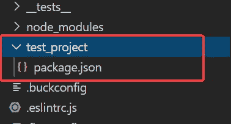
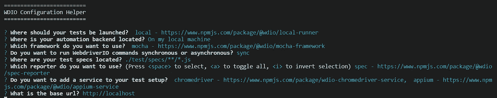
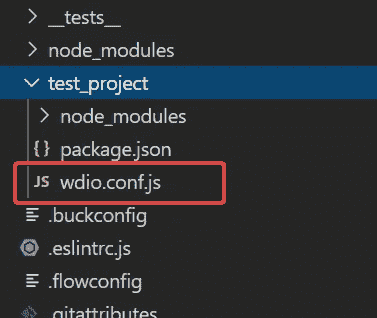
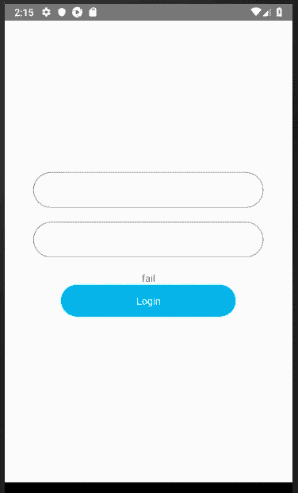
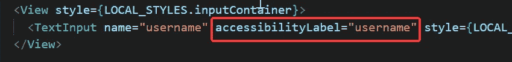
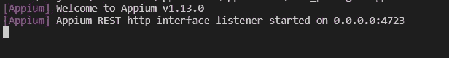
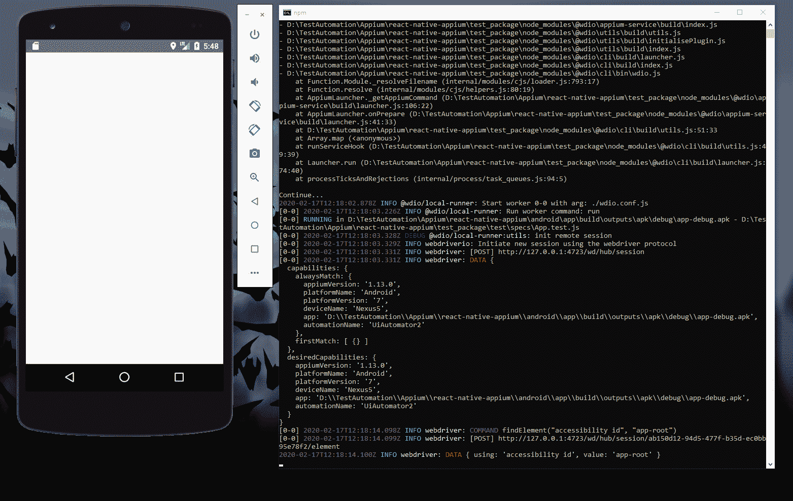
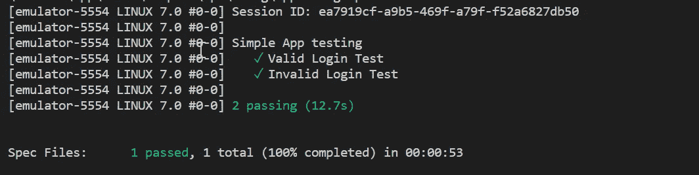

# 使用 Appium 在 React Native 中进行自动化测试

> 原文：<https://itnext.io/test-automation-in-react-native-ac9ac2330ab9?source=collection_archive---------0----------------------->

在本文中，我将讨论如何使用 Appium 在 React Native 中进行简单的 UI 测试自动化。


**Appium** 是一款开源工具，用于跨平台应用和移动应用的自动化 UI 测试。它的功能与 Selenium 服务器相同，Selenium 服务器在后台运行。它还使用了类似 Selenium 的 web 驱动程序。如果您已经体验过 Selenium，那么使用 Appium 并不是什么大事。

Appium 支持 Android 和 iOS 平台。但是在这篇文章中，我将只关注 Android 平台。

以下是我们将要经历的步骤，

*   设置项目
*   配置 web 驱动程序 IO
*   编写简单的登录表单
*   为测试设置组件选择器
*   编写测试用例
*   试探性试验

在开始之前，让我们创建一个新的 react 本地项目，

```
react-native init reactnative_test
```

# 对于不耐烦(TL；DR；)


以下是 Github 回购:

[](https://github.com/shamique/react-native-appium) [## shamique/react-native-appium

### 在 GitHub 上创建一个帐户，为 shamique/react-native-appium 开发做出贡献。

github.com](https://github.com/shamique/react-native-appium) 

# 设置项目

— Appium 服务器

您可以通过 npm 或作为独立应用程序安装 Appium(推荐)。为方便起见，我将通过 npm 安装。如果你喜欢单机版，可以从这里的[下载。](https://github.com/appium/appium-desktop/releases/)

```
npm install -g appium
```

让我们创建一个单独的目录来编写我们的测试项目。您可以在项目的根文件夹中创建此文件夹，以保持所有内容都在适当的位置。

创建测试文件夹后，在测试文件夹中启动 package.json 文件。

```
npm init -y
```



创建了 test_project 文件夹并启动了 package.json

现在让我们在 test_project 目录中安装下面的依赖项，

—网络驱动

WebdriverIO 是一个支持 Appium 的 nodejs 开源测试工具。

```
npm install --save webdriverio @wdio/cli
```

—柴框架

另外，让我们在编写测试用例时为断言安装 Chai。

```
npm install --save chai
```

# 配置 web 驱动程序 IO

现在我们需要生成 web 驱动程序配置文件。在测试项目中运行下面的命令，

```
npx wdio config
```

它会问你一系列问题，并根据你的选择安装所需的依赖项。

> **注意**:在进行配置时，请务必选择 Mocha 框架和 Appium 服务



一旦完成，test_project 目录中就会生成`wdio.conf`。



我们需要做以下更改来配置 WebDriverIO 以使用 Appium 并在 Android 模拟器上运行测试:

```
exports.config = {
  **services: ['appium'],**
  **port: 4723,** runner: 'local',
  specs: [
    './test/specs/**/*.js'
  ], capabilities: [{
 **maxInstances: 1,
     browserName: '',
     appiumVersion: '1.13.0',
     platformName: 'Android',
     platformVersion: '<Add emulator's platform version>',
     deviceName: '<Add emulator name>',
     app: '<path to APK>',
     automationName: 'UiAutomator2'**
  }],

  logLevel: 'trace',
  bail: 0,
  waitforTimeout: 10000,
  connectionRetryTimeout: 90000,
  connectionRetryCount: 3,
  framework: 'mocha',
  reporters: ['spec'],
  mochaOpts: {
    ui: 'bdd'
    timeout: 60000
  }
}
```

在配置文件中做了以下更改，

*   将 appium 添加到服务列表并设置默认端口
*   在应用程序属性中设置 APK 文件夹路径。这个文件的通常位置是`.apk`的`<PROJECT_ROOT>/android/app/build/outputs/apk/<FILE_NAME.apk>`
*   将`maxInstances`设置为 1，以避免并行运行多个测试。
*   还要将 automationName 设置为 UiAutomator2。因为 UiAutomator1 在最新的 appium 版本中已被弃用。

# 编写简单的登录页面

打开 react 本地项目中的 App.js 文件，用下面的代码替换代码，

在我们继续之前，只需运行应用程序，看看应用程序是否在运行中没有任何问题。



如您所见，我们有一个简单的登录表单。因此，我们将编写测试用例来验证我们的登录功能。基本上是根据用户的输入来测试用户的登录状态是否成功。

# 为测试设置组件选择器

为了使组件可测试，我们需要在相关组件上添加一个属性。对于 Android 来说是`accessibilityLabel`，对于 iOS 来说是`testID`。这些属性将有助于在屏幕上识别和定位可测试组件。



# 编写测试用例

好了，现在是写测试用例的时候了。在测试项目下创建一个名为`App.test.js`的文件，并在其中添加以下代码，

# 运行测试

01).在模拟器中运行 react 本机应用程序

```
react-native run-android
```

02).在单独的命令提示符下启动 Appium 服务器，

```
appium
```



Appium 服务器已启动

03).在单独的命令提示符下运行 webdriver 测试套件，

```
npx wdio ./wdio.conf.js
```

如果一切都相应地设置好了，您应该会看到下面的测试结果。



自动化测试正在进行

一旦自动化过程完成，您将会看到如下测试结果，



实验报告


谢谢你一直读到最后。你可以在下面的资源库中找到完整的源代码。

[](https://github.com/shamique/react-native-appium) [## shamique/react-native-appium

### 在 GitHub 上创建一个帐户，为 shamique/react-native-appium 开发做出贡献。

github.com](https://github.com/shamique/react-native-appium)