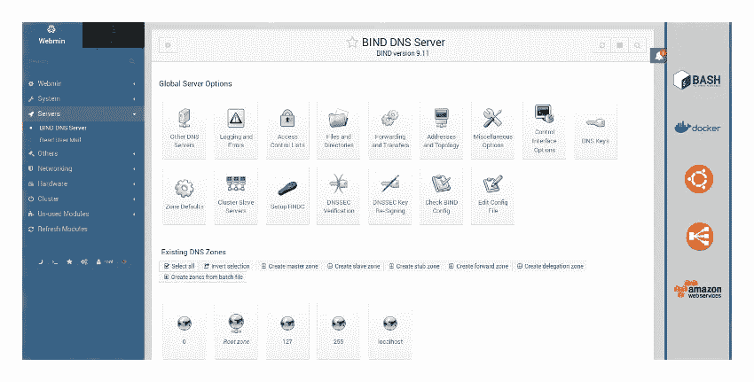
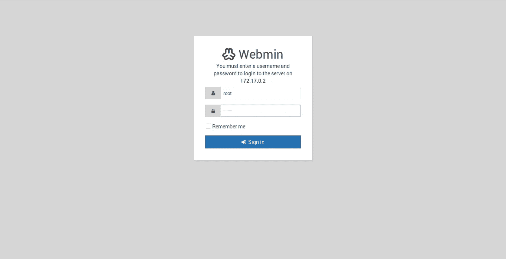
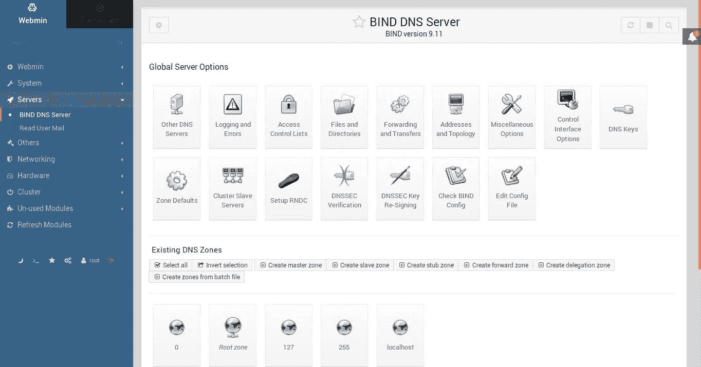
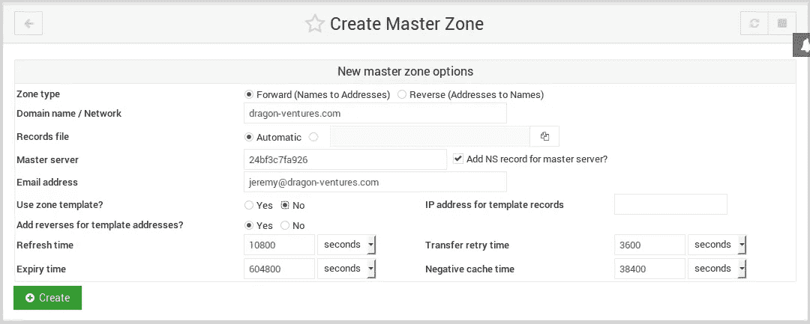
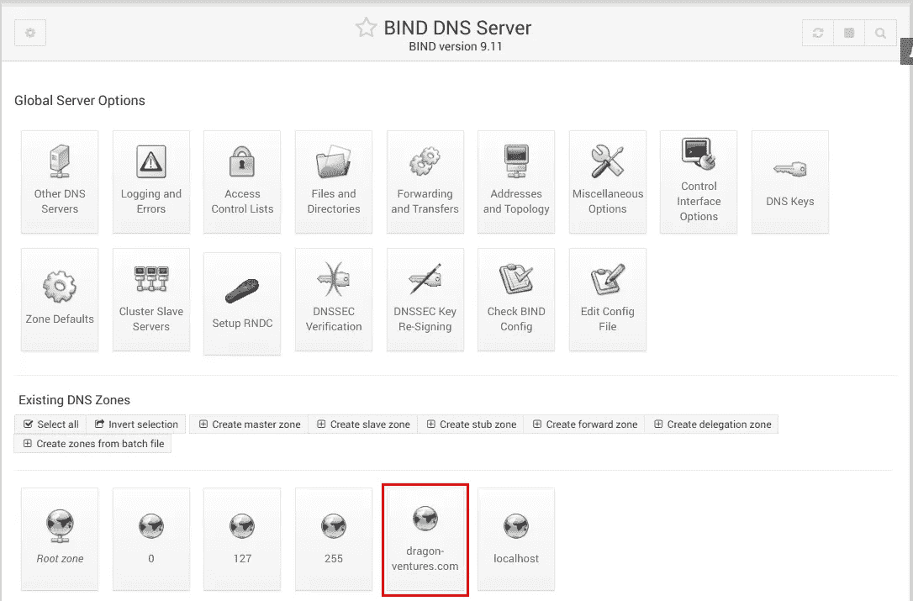
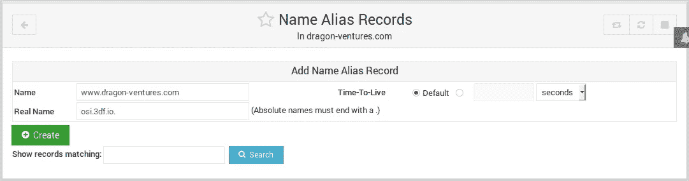
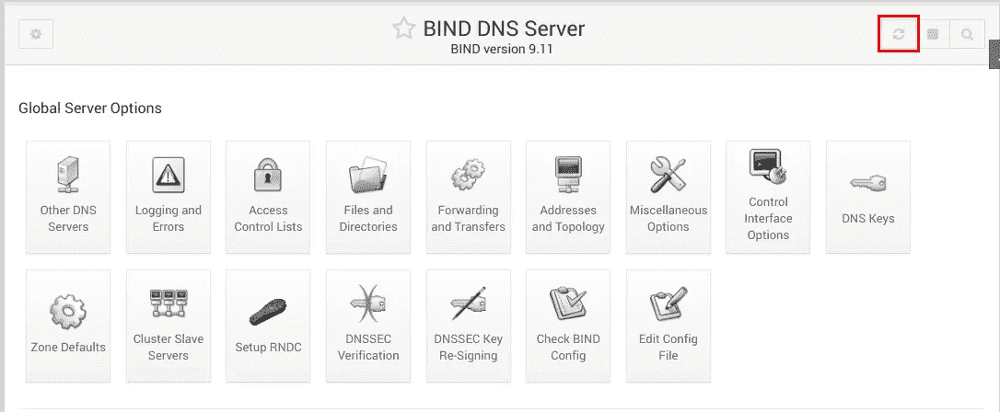

# 在本地测试带有 Dockerized 绑定的 CNAME 端点

> 原文：<https://itnext.io/test-cname-endpoints-w-dockerized-bind-locally-aa83b1dd0592?source=collection_archive---------2----------------------->



我想我们所有的 IT 人员都曾在某种程度上毒害过自己的 DNS，以便在将 web 应用程序投入生产之前对其进行测试。“A 记录”很容易处理，因为大多数现代操作系统仍然有一个叫做主机文件的东西。但是 CNAMEs 呢？例如，亚马逊的应用程序负载平衡器不提供基于 IP 的端点，而是会给你一个类似“example-GW-41709394-AP-northeast-2 . elb . Amazon AWS . com”的 URL。然后，您必须在您的域名的 DNS 配置上创建一个 CNAME，将您的域名指向它，以使事情正常运行。

现在，我要提出的可能不是唯一的解决方法，但它肯定是一个相当方便的解决方案，这要感谢 Docker 和那里精彩的 Docker 社区。我还觉得这是目前为止我能想到的最好的方法，因为将 CMS 和电子商务网站的 URL(编辑代码和数据库条目)更改为测试 URL 是不可取的，因为我想最大限度地减少生产推广的步骤，使其看起来像是在按开关。因此，我总是喜欢尽可能接近真实配置地复制生产环境，这样我就不会在部署过程中忙于修复我们的测试没有覆盖到的东西。

但是，“为什么要容器化？”你可能会问。好吧，这里有一个快速的原因列表:

1.  容器是非常便携的，我可以把这个容器放在任何工作站或服务器上，这比我所知道的任何其他方法都要快
2.  我可以通过一个命令按需启动和停止一组定制的服务或组件
3.  容器是一种很好的方法，它可以加速可处理服务的运行，而不会让您的主机系统受到以后不需要的库和配置文件的影响。只需移除容器进行清理。搞定了。
4.  如果我选择向其他队友开放 BIND，我的服务器或工作站会受到更多的保护，因为向外界开放的服务被放在沙盒中，与我的主机的其他部分隔离开来。

把上面的问题解决掉，让我们稍微谈谈我的解决方案是什么。本质上，它由以下两个部分组成:

*   在我的 Ubuntu 18.04 主机(我的笔记本电脑)上运行[sameersbn](https://github.com/sameersbn)/[docker-BIND](https://github.com/sameersbn/docker-bind)镜像(与预装的 Webmin 绑定)的容器*
*   几个 bash 脚本将通过别名运行，以自动启动/停止该容器以及使其工作所需的相关/etc/resolv.conf 编辑

我的想法是能够启动/停止绑定和改变使用容器作为我的查询的 DNS 服务器，只需 2 个简单的命令别名。这样，我可以毫不费力地在维护和排除生产环境故障以及在一台机器上测试新的替代基础设施之间切换。

## 因此，事不宜迟，我做了以下工作来整合解决方案:

如果 Docker 尚未安装，让我们从安装它开始:

```
**sudo apt install docker.io**
```

如果我们不想一直键入 sudo 来运行 docker 命令，就将我们的用户添加到/etc/group。对我来说，是“龙”:

```
**sudo vim /etc/group**
```

/etc/group 中的 docker 行应该如下所示:

```
docker:x:127:dragon
```

然后，保存、退出并重新启动，这是确保权限生效的一种简单方法，尽管我确信有很多方法可以在不重新启动的情况下实现。

笔记本电脑重启后，让我们调出[sameersbn](https://github.com/sameersbn)/[docker-bind](https://github.com/sameersbn/docker-bind)图像:

```
**docker pull sameersbn/bind:9.11.3-20180713**
9.11.3-20180713: Pulling from sameersbn/bind
6b98dfc16071: Pull complete
4001a1209541: Pull complete
6319fc68c576: Pull complete
b24603670dc3: Pull complete
97f170c87c6f: Pull complete
701c34001733: Pull complete
61f415ec66af: Pull complete
92a47682d82d: Pull complete
7428c3119443: Pull complete
Digest: sha256:53188ff6ffeca017b4451203eea419373e52b42df3434614fb6d7e582475a4b4
Status: Downloaded newer image for sameersbn/bind:9.11.3-20180713
```

然后，为容器卷创建一个目录:

```
**sudo mkdir -p /srv/docker/bind**
```

现在，我们准备尝试一下容器:

```
**docker run --name bind -d --volume /srv/docker/bind:/data sameersbn/bind:9.11.3-20180713**
24bf3c7fa926d07f9adcf5512df9e974e7cce0950f05f01a0f15bfd3cf1dbe7b
```

输出中的上述随机字符串告诉我，它成功启动了，但我们还是要检查一下:

```
**docker ps**
CONTAINER ID        IMAGE                            COMMAND                  CREATED             STATUS              PORTS                       NAMES
24bf3c7fa926        sameersbn/bind:9.11.3-20180713   "/sbin/entrypoint.sh…"   10 seconds ago         Up 3 seconds       53/tcp, 10000/tcp, 53/udp   bind
```

太好了！看来真的涨了！信不信由你，你已经有了一个预装了 Webmin 的功能齐全的 DNS 服务器，并且随时可以运行。超快的对吗？让我们找出这个容器的 IP 地址，这样我们就可以连接到它:

```
**docker inspect bind |grep IPAddress**
            "SecondaryIPAddresses": null,
            "IPAddress": "172.17.0.2",
                    "IPAddress": "172.17.0.2",
```

现在我们知道了 IP 是什么，让我们用 web 浏览器(https://172.17.0.2:10000)看一看，并绕过任何 SSL 警告，因为证书将是自签名的:



嘭！我没撒谎吧？我们有登录页面了！默认的用户名和密码是“root”和“password ”,但是我建议您更改容器上的 root 密码。为此，请运行以下命令:

```
**docker exec -ti bind passwd**
Enter new UNIX password: 
Retype new UNIX password: 
passwd: password updated successfully
```

现在我们已经更改了密码，让我们登录到 Webmin 控制台，单击站点左侧菜单上的“服务器”，然后单击“绑定 DNS 服务器”。这将带您进入以下屏幕:



从这里，点击最后一个大按钮“编辑配置文件”。

然后，单击下一个屏幕上配置文件编辑区域上方的下拉菜单，并选择/etc/bind/named.conf.options。

在配置文件编辑区域找到这一行:

```
listen-on-v6 { any; };
```

注释掉这一行，并在它下面直接添加几行，如下所示:

```
# listen-on-v6 { any; };
    listen-on port 53 { any; };
    forwarders {
        8.8.8.8;
        8.8.4.4;
        };
```

点击下面的“保存并关闭”。

这将把您带回绑定配置的主屏幕。请注意，在上面的配置块中，当 Google DNS 服务器没有可用的本地记录时，我会转发所有查询。

从那里，向下滚动到页面的以下部分，并单击用红色突出显示的小按钮，为您的域创建一个主区域:


输入如下相关信息:



如您所知，我为 dragon-ventures.com 创建了一个主区域，这是一个已经在生产中使用的域(全球 DNS)。您甚至可以看到全球 DNS 服务器中有一个与该域名相关联的网站:


接下来，我们为 www.dragon-ventures.com 创造一项 CNAME 纪录。在 BIND 主页中，单击以红色突出显示的按钮:



然后，选择以下内容，为 www.dragon-ventures.com 创建 CNAME 记录:


填写如下内容，然后点击绿色的“创建”按钮:



请注意，我将 www.dragon-ventures.com 的 T2 指向了 T4 的 3DF 开源项目网站。注意:不要忘记加一个“.”在实名之后，否则你会疑惑几个小时为什么 DNS 服务器不解析你的 CNAME。所以应该是:

```
osi.3df.io.
```

而不是:

```
osi.3df.io
```

然后，让我们返回到 BIND 主页，并单击 apply changes 按钮:



这就是设置 DNS 的部分。现在让我们让笔记本电脑使用这个 DNS 服务器。现在，让我们停止容器，因为我们稍后将使用脚本启动它:

```
docker stop bind
```

首先为你所有的个人定制脚本制作一个目录。对我来说，是~/。剧本

```
mkdir ~/.scripts
```

然后，在~/中创建一个名为 usebind.sh 的 bash 脚本。脚本/启动容器并编辑/etc/resolv.conf 以将容器用作其 DNS 服务器:

```
vim ~/.scripts/usebind.sh
```

复制并粘贴以下内容，保存并退出:

```
#!/bin/bash# Start bind container
docker start bind# Comment out any line that starts with "nameserver"
sudo sed -e '/nameserver/s/^/# /g' -i /etc/resolv.conf# Add "nameserver 172.17.0.0.2" at the end of the file
echo 'nameserver 172.17.0.2' | sudo tee --append /etc/resolv.conf > /dev/null
```

然后，在~/中创建一个名为 unbind.sh 的 bash 脚本。脚本/将/etc/resolv.conf 中的更改恢复为使用默认 DNS 服务器，然后停止容器:

```
vim ~/.scripts/unbind.sh
```

复制并粘贴以下内容，保存并退出:

```
#!/bin/bash# Remove any "#" from any line that consist of the word "nameserver"
sudo sed -i '/^#.* nameserver /s/^# //' /etc/resolv.conf# Remove any line that consists of "172.17.0.2"
sudo sed -i '/172.17.0.2/,+1 d' /etc/resolv.conf# Stop bind container
docker stop bind
```

确保我们可以执行它:

```
chmod u+x ~/.scripts/*bind*
```

然后，因为我希望能够在终端的任何地方输入简短的命令，所以我通过编辑现有的~/创建了两个新的别名。bash_aliases 或者创建它(如果没有):

```
vim ~/.bash_aliases
```

复制并粘贴以下内容，保存并退出:

```
# Dockerized DNS Server Start/Stop
alias usebind='~/.scripts/usebind.sh'
alias unbind='~/.scripts/unbind.sh'
```

现在，让我们找到别名，这样我们就不必先注销，然后再重新登录，这样就可以工作了:

```
source ~/.bashrc
```

## 就是这样。从技术上讲，我们都准备好了，让我们来测试一下吧！

运行 usebind.sh 脚本:

```
**usebind**
bind
[sudo] password for dragon:
```

实际上应该是即时的。因为这是第一次运行这个命令，所以让我们检查一下脚本是否工作正常:

```
**docker ps**
CONTAINER ID        IMAGE                            COMMAND                  CREATED             STATUS              PORTS                       NAMES
24bf3c7fa926        sameersbn/bind:9.11.3-20180713   "/sbin/entrypoint.sh…"   15 minutes ago         Up 11 seconds       53/tcp, 10000/tcp, 53/udp   bind
**cat /etc/resolv.conf |grep nameserver**
# nameserver 127.0.0.53
nameserver 172.17.0.2
```

好吧，这正是我们期望它做的。容器正在运行，我们的/etc/resolv.conf 看起来不错。因此，让我们使用 ping 来确定我是否真的在使用 DNS 容器来解析我的查询:

```
**ping osi.3df.io**
PING osi.3df.io (104.31.83.214) 56(84) bytes of data.
**ping** [**www.dragon-ventures.com**](http://www.dragon-ventures.com)
PING osi.3df.io (104.31.83.214) 56(84) bytes of data.
```

看起来[www.dragon-ventures.com](http://www.dragon-ventures.com)实际上正在解析与 osi.3df.io 相同的 IP 地址，所以我肯定称之为通过。

然后，让我们检查最后一部分，即取消绑定别名是否按预期工作:

```
**unbind**
bind
[sudo] password for dragon:
```

Check /etc/resolv.conf:

```
cat /etc/resolv.conf |grep nameserver
nameserver 127.0.0.53
```

检查容器是否正在运行:

```
**docker ps**
CONTAINER ID        IMAGE               COMMAND             CREATED             STATUS              PORTS               NAMES
```

使用 ping 检查:

```
**ping** [**www.dragon-ventures.com**](http://www.dragon-ventures.com)
PING [www.dragon-ventures.com](http://www.dragon-ventures.com) (104.31.91.41) 56(84) bytes of data.
```

DNS 设置看起来不错，container 不再运行，ping 返回一个不同的 IP 地址给[www.dragon-ventures.com。](http://www.dragon-ventures.com.)这证明了我们的 unbind.sh 脚本也是有效的。

从这一点开始，无论何时您想要测试任何具有 CNAME 端点的替代基础架构，我们所要做的就是打开一个终端并执行以下操作:

```
**usebind**
bind
[sudo] password for dragon:
```

那就开始测试吧！

当我们完成所有工作并想继续维护生产环境或对其进行故障排除时，我们要做的就是:

```
**unbind[sudo] password for dragon:**
bind
```

希望这篇文章能帮助人们简化 CNAME 测试的相关问题！

*只要稍加调整，这个解决方案也适用于 Mac 和 Windows。