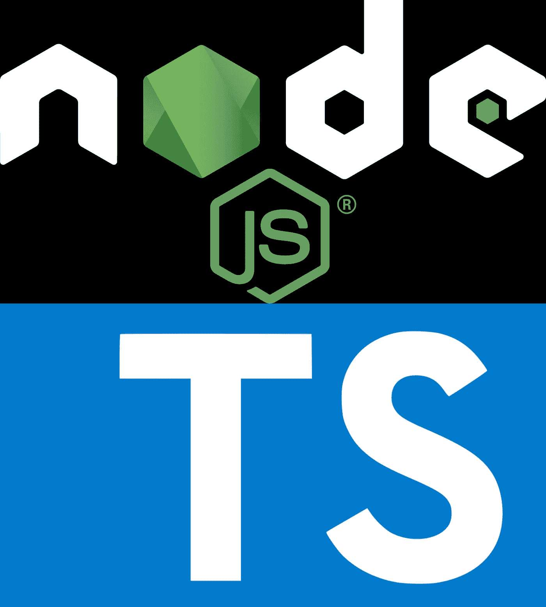

# 测试驱动使用 Node.js 中的 Jest & SuperTest 开发您的 API

> 原文：<https://itnext.io/test-driven-develop-your-api-with-jest-supertest-in-node-js-7e1c6489b0a6?source=collection_archive---------1----------------------->



[Node.js](https://nodejs.org/en/) 已经成为后端的热门选择。像 [Express](https://expressjs.com/) 这样的框架使得快速构建一个强大的 API 变得很容易。如果你提供了一个(公共的)API，那么你要确保代码的改变不会破坏你的 API。确保这一点的一种方法是编写定期执行的测试(例如，在合并拉请求之前)。

我们将使用以下技术:

*   **SuperTest** 调用我们的 API routes，因为它提供了一个易于使用的 API 来发送节点中的 HTTP 请求
*   Jest 作为测试框架，因为它为 JavaScript 项目提供了很好的测试体验
*   **TypeScript** (可选)，因为它极大地提高了开发人员的生产力

## 如何用 JavaScript / TypeScript 编写 API 测试

1.  **安装必要的依赖关系** : `npm install **jest** **supertest** @types/jest @types/supertest ts-jest --save=dev`。类型和 *ts-jest* 不是必需的，但如果使用 TypeScript，则推荐使用。还可以使用`-g`标志全局安装 Jest。
2.  在一个单独的文件中(推荐)或者在你的 *package.json* 中创建一个 Jest 配置。
3.  **创建一个包含 Jest 应该运行的规格文件**(例如*测试*)的文件夹。
4.  使用 Jest & SuperTest 编写您的测试。您应该一致地命名您的测试文件(例如 *user-routes.spec.ts* )。
5.  **使用 Jest** : `jest`运行测试一次，或者使用`jest --[watchAll](https://jestjs.io/docs/en/cli#watch)`启用观察模式。
6.  可选:**使用`[--coverage](https://jestjs.io/docs/en/cli.html#--coverageboolean)`标志测量测试覆盖率**。为了确保测试覆盖率只上升不下降，我们可以设置阈值。如果没有达到阈值，Jest 将失败。您可以通过自定义 Jest 配置中的`[coverageThreshold](https://jestjs.io/docs/en/configuration#coveragethreshold-object)`来配置目录、文件类型甚至单个文件的阈值。
7.  可选:创建一个 [**globalSetup**](https://jestjs.io/docs/en/configuration#globalsetup-string) 和一个[**global tear down**](https://jestjs.io/docs/en/configuration#globalteardown-string)**文件**，分别在所有测试执行前/后执行一次。这个想法是执行一次繁重的清理工作。用例:创建一个数据库/用户/授权&最后删除测试执行过程中创建的所有东西。
8.  可选:**用命令`npm install ***typescript*** --save=dev`安装类型脚本**。TypeScript 是现代 JavaScript 项目的最佳选择，因为它提供了类型安全，并允许开发人员甚至在旧浏览器中使用现代功能。如果你有 Java 或 C#背景，那么 TypeScript 会更好用。

下面是一个单独文件中的示例 **Jest** **配置**:

```
module.exports = {
 // preset: 'ts-jest', // use this if you are using TypeScript
 globalSetup: './jest.global-setup.js', // optional: will be called once before all tests are executed
 // globalTeardown: './jest.global-teardown.js', // optional: will be called once after all tests are executed
  coverageThreshold: {
    global: {
      branches: 80,
      functions: 80,
      lines: 80,
      statements: 80
    }
  } // optional: let Jest fail if thresholds are not met
};
```

以下是测试登录功能的示例 **SuperAgent 规格**:

```
**import request from 'supertest';**
const app = require('../app'); // our Node application***describe***('Login', () => {***it***('succeeds with correct credentials', async () => {
   const response = await post(`login`, demoUser)
     .expect(200);
    expect(res.body.user.email).toBe(demoUser.email);
  });***it***('fails with invalid credentials', async () => {
   const user = {email:'notarealmail@mycompany.com', password: 'somepassword'};
   await post(`login`, user)
     .expect(401);
  });***it***('fails with missing credentials', async () => {
   const user = {};
   await post(`login`, user)
     .expect(401);
  });});// a helper function to make a POST request.
export function post(url, body){
  const httpRequest = request(app).post(url);
  httpRequest.send(body);
  httpRequest.set('Accept', 'application/json')
  httpRequest.set('Origin', '[http://localhost:3000'](http://localhost:3000'))
  return httpRequest;
}
```

这里有一个示例 **globalSetup** 文件( *globalTeardown* 工作方式相同)。在本例中，我用 MongoDB 创建了一个新的数据库，用于我的 API 测试。如您所见，导出了一个异步函数。

```
/**
 * Connect to the test database (and create if it does not exist yet).
 * Creates all necessary MongoDB collections.
 */
export default async () => {
  const collections = ['user', 'company', ...];
  const dbManager = await getDemoDB();
  for (let collection of collections) {
    await dbManager.db.createCollection(collection);
   }
  await prepareDatabase();
}
```

## 如何在 Jest 中禁用并发性(并行执行)

默认情况下，Jest 会检测它应该并发运行多少个测试。这将加速测试，因为测试可以并行运行。然而，如果您的测试相互依赖，或者如果您想要更稳定的结果，这可能是一个问题。在这种情况下，您可以使用`--[runInBand](https://jestjs.io/docs/en/cli#runinband)`选项按顺序进行 Jest 运行测试。

## 使用您的 IDE (IntelliJ，Visual Studio 代码)运行 Jest 测试

Jetbrains(**IntelliJ IDEA/web storm**…)的开发者创建了一个 [**Jest 插件**](https://www.jetbrains.com/help/idea/running-unit-tests-on-jest.html) ，它允许你直接从你的 IDE 运行测试。如果你使用的是 **Visual Studio 代码**，你可以很容易地**创建一个启动配置**，你可以在里面执行它。你需要做的就是在你的**中创建一个 [**launch.json**](https://code.visualstudio.com/docs/editor/debugging#_launch-configurations) 文件。vscode** 文件夹，并添加以下配置:

```
{
      "type": "node",
      "request": "launch",
      "name": "Jest: Run all",
      "program": "${workspaceFolder}/node_modules/.bin/jest",
      "args": [],
      "console": "integratedTerminal",
      "internalConsoleOptions": "neverOpen",
      "disableOptimisticBPs": true
    },
    {
      "type": "node",
      "request": "launch",
      "name": "Jest: Run current File",
      "program": "${workspaceFolder}/node_modules/.bin/jest",
      "args": [
        "${relativeFile}"
      ],
      "console": "integratedTerminal",
      "internalConsoleOptions": "neverOpen",
      "disableOptimisticBPs": true
    }
}
```

## 结论

感谢阅读这篇文章。如您所见，用 JavaScript 编写 API 测试很容易。[正如我在帖子中提到的在 Angular 项目中使用 Jest](/how-to-use-jest-in-angular-aka-make-unit-testing-great-again-e4be2d2e92d1),**Jest**再次证明了它可以在任何类型的 JavaScript 项目中使用。TypeScript 有助于使代码更加整洁，并通过静态类型更快地识别问题。并且 **SuperTest** 允许我们在测试中轻松地发出 HTTP 请求。你用什么来写 Node.js 的 API 测试？请在评论中告诉我。