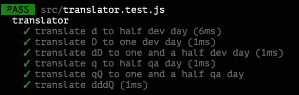

# jest 测试驱动开发 101

> 原文：<https://itnext.io/test-driven-development-101-with-jest-a6e666d090a5?source=collection_archive---------1----------------------->

*这段摘录来自我的书* [用 React](https://www.apress.com/gp/book/9781484269718) *测试驱动开发。这是本书的基础部分——关于应用 TDD 的端到端示例，请点击* [*此链接*](https://www.apress.com/gp/book/9781484269718) *了解更多细节。*

在这一章中，我们将通过一步一步的指导，一起学习如何在你的日常开发程序中应用`TDD`。通过这个演示，您将了解如何将一个大任务分割成相对较小的任务，并通过一组通过测试和一点重构技术来完成每个任务。在我们深入研究代码之前，让我们对如何编写一个合适的测试有一些基本的了解。


由 [Marvin Meyer](https://unsplash.com/@marvelous?utm_source=medium&utm_medium=referral) 在 [Unsplash](https://unsplash.com?utm_source=medium&utm_medium=referral) 上拍摄的照片

# 如何写出一份像样的试卷？

那么，如何开始编写测试呢？通常需要 3 个步骤(一如既往，甚至把大象放进冰箱)。首先，做一些准备工作，如建立数据库，初始化被测对象或加载一些夹具数据。第二，调用被测试的方法/函数，你通常会把结果赋给一些变量。最后做一些断言，看看结果是不是预期的。

通常描述为`Given`、`When`、`Then`或所谓的`3A` s 格式，其中`3A` s 代表`Arrange`、`Action`和`Assertion`。这两种方式基本上描述的是同一个东西。

在`Given`子句中，你可以描述所有的准备(设置依赖)工作。在步骤`When`中，你触发动作或者改变被测对象的状态，通常是带有准备好的参数的函数调用。最后，在`Then`中，您检查结果，看它是否在某些方面与预期的结果匹配(确切地等于某个值，或者包含特定的模式，或者抛出一个错误，等等)

例如，假设我们有以下代码片段:

```
*// given* 
const user = User.create({ name: 'Juntao', address: 'ThoughtWorks Software Technologies (Melbourne)' })*// when*
const name = user.getName()
const address = user.getAddress()*// then*
expect(name).toEqual('Juntao')
expect(address).toEqual('ThoughtWorks Software Technologies (Melbourne)')
```

通常，您可以将带有许多断言的测试用例分割成几个独立的用例，并让每个用例有一个单独的断言，就像:

```
it('creates user name', () => {
  *// given* 
  const user = User.create({ name: 'Juntao', address: 'ThoughtWorks Software Technologies (Melbourne)' }) *// when*
  const name = user.getName() *// then*
  expect(name).toEqual('Juntao')
});it('creates user address', () => {
  *// given* 
  const user = User.create({ name: 'Juntao', address: 'ThoughtWorks Software Technologies (Melbourne)' }) *// when*
  const address = user.getAddress() *// then*
  expect(address).toEqual('ThoughtWorks Software Technologies (Melbourne)')
});
```

# 三角测量

有几种方法可以编写测试并驱动实现。一种普遍接受的方法叫做`triangulation`。让我们用一些例子来仔细看看如何做。

假设我们正在用`TDD`实现一个计算器。对`addition`的测试可能是一个理想的起点。

# 第一次测试

所以`addition`的规格可以是

```
describe('addition', () => {
  it('return 5 when add 2 and 3', () => {
      const a = 2, b = 3
      const result = add(a, b)
      expect(result).toEqual(5)
  })
})
```

最简单的实现甚至可以是

```
const add = () => 5
```

你可能会说这样写代码没有意义，但是现在请耐心听我说。那么第二个测试会是什么呢？

我们可以再写一个`addition`的例子:

```
it('return 6 when add 2 and 4', () => {
    const a = 2, b = 4
    const result = add(a, b)
    expect(result).toEqual(6)
})
```

为了通过测试，最简单的解决方案是:

```
const add = (a, b) => 2 + b
```

这个想法是编写一个失败但具体的测试，在每一步中驱动实现代码更加通用。因此，现在的实现比第一步更通用。但是，它仍然有改进的空间。

第三个测试可能是这样的:

```
it('return 7 when add 3 and 4', () => {
    const a = 3, b = 4
    const result = add(a, b)
    expect(result).toEqual(7)
})
```

这一次，测试数据中不再有模式可循，我们必须编写一些更复杂的东西来使它通过。实现结果是:

```
const add = (a, b) => a + b
```

现在实现更加通用，可以覆盖大多数`addition`情况。在未来，我们的计算器可能需要支持虚数的`addition`，我们仍然可以通过添加更多的测试来以同样的方式得出解决方案。

这种写测试的方法被称为`Triangulation`:你写一个失败的测试，然后写足够的代码来通过测试，然后你写另一个测试来从另一个角度驱动变化。这反过来会让你的实现更通用一点。您以这种方式一步一步地工作，直到代码变得足够通用，能够支持大多数能够满足业务需求的情况。

乍一看，这样做可能太简单太慢，但是这是一个你可以并且应该依赖的坚实基础。对于一个简单的任务，你这样做，对于更复杂的任务，你仍然应用同样的方法。这是一种将简化任务和将大任务分割成小块的能力。

好了，让我们更进一步，看看一个复杂的例子，并学习如何在相对困难的场景中应用`TDD`。

# 通过示例分配任务

在我目前从事的项目中，我们的团队使用一种非常简单的方式来跟踪每个用户故事所付出的努力(一小块可以独立完成的工作)。通常，一张卡在其生命周期中可能处于以下状态:`analysis`、`doing`、`testing`、`done`。然而，当它所依赖的东西未完成或尚未准备好时，它可能是`block`。

我们使用的对故事的努力的测量是非常简单的。基本上，我们跟踪开发人员在编码上花了多少时间，或者它被阻塞了多少天。这样，项目经理就有机会了解项目的进展情况，以及项目的整体健康状况，也许还可以采取进一步的措施来改进。

我们在一张卡片的标题中用小写的`d`表示已经在`development`下半天，大写的`D`表示一整天。不出意外，`q`半天`QA`，一整天`Q`。因此，在任何给定的时刻，你都会在卡片的标题上看到类似这样的内容`[ddDQbq] Allow user login to their profile page`，`b`在这里当然是被封锁了。

然后，让我们构建一个解析器，它可以读取跟踪标记`ddDQbq`并将其翻译成一些人类可读的格式，如下所示:

```
{
  "Dev days": 2.0,
  "QA days": 1,
  "Blocked": 0.5
}
```

看起来很简单，对吧？迫不及待地跳起来写代码？等等，让我们先做个测试，了解一下在这种情况下如何应用`TDD`。

因此，第一个问题可能是:**我们如何将这样的任务分成更小的任务，以便于实现和验证？当然，有不止一种方法可以做到这一点，合理的拆分可以是:**

1.  编写一个测试来确保我们可以将`d`转换为半天开发时间
2.  编写一个测试来确保我们可以将`D`转换为一个开发日
3.  编写一个测试来处理多个标记，如`dD`
4.  编写一个测试来处理`q`
5.  编写一个测试来处理`qQ`
6.  写一个测试来处理`ddQ`

正如我们在第一章中所讨论的，拆分对于应用 TDD 是必不可少的。小任务可以以不同的方式吸引和鼓励你:

1.  这很有趣(已经证明小成就可以通过一种叫做多巴胺的化学物质来愉悦你的大脑)
2.  确保你得到快速的反馈
3.  知道在任何给定的时间任务的进展如何

# 第一次测试

好了，说够了，让我们动手吧。根据`tasking`步骤的输出，第一次测试应该是

```
it('translate d to half dev day', () => {
  expect(translate('d')).toEqual({'Dev': 0.5})
})
```

非常简单的是，实现可能很简单:

```
const translate = () => ({'Dev': 0.5})
```

它忽略输入并返回一个哑元`{'Dev': 0.5}`，但是你不得不佩服它正好满足了当前子任务的要求。又快又脏，但很管用。

## 第二个测试

让我们检查一下任务列表中的第一个待办事项，然后继续。

```
it('translate D to one dev day', () => {
  expect(translate('D')).toEqual({'Dev': 1.0})
})
```

你想到的最直接的解决方案是什么？没错！

```
const translate = (c) => (c === 'd' ? {'Dev': 0.5}: {'Dev': 1.0})
```

我知道用这种方式写代码看起来相对“愚蠢”。然而，正如您所看到的，我们的实现是由相关的测试驱动的，只要测试通过——这意味着需求得到满足——我们就可以称之为满意。我们编写代码的唯一原因是满足一些业务需求，对吗？

既然测试现在已经通过了，如果你发现有可以改进的地方，比如`magic numbers`，方法体太长等等，你可以做一些重构。然而，现在，我想我们可以继续。

所以第三个测试可能是:

```
it('translate dD to one and a half dev day', () => {
  expect(translate('dD')).toEqual({'Dev': 1.5})
})
```

嗯，现在事情变得更复杂了，我们必须单独解析字符串，并对结果求和。下面的代码片段应该可以解决问题:

```
const translate = (input) => {
  let sum = 0;
  input.split('').forEach((c) => sum += c === 'd' ? 0.5: 1.0)
  return {'Dev': sum}
}
```

现在我们的程序可以毫无问题地处理所有的`d`或`D`组合序列，如`ddd`或`DDdDd`。接下来是任务 4:

```
it('translate q to half qa day', () => {
    expect(translate('q')).toEqual({'QA': 0.5})
  })
```

似乎我们需要为每种状态设置一个`sum`函数，例如`Dev`中的`sum`，以及`QA`中的`sum`。如果我们能稍微重构一下代码，使更改变得更容易，那就更方便了。TDD 最漂亮的部分出现了——您不必担心意外破坏现有的功能，因为您有测试来覆盖它们。

## 重构

让我们将解析部分提取出来作为一个函数本身，并在`translate`中使用该函数。

重构后，函数`translate`可能是这样的:

```
const parse = (c) => {
  switch(c) {
    case 'd': return {status: 'Dev', effort: 0.5}
    case 'D': return {status: 'Dev', effort: 1}
  }
}const translate = (input) => {
  const state = {
    'Dev': 0,
    'QA': 0
  } input.split('').forEach((c) => {
    const {status, effort} = parse(c)
    state[status] = state[status] + effort
  }) return state
}
```

现在，通过新的测试应该不难了。我们可以在`parse`中增加一个新的`case`:

```
const parse = (c) => {
  switch(c) {
    case 'd': return {status: 'Dev', effort: 0.5}
    case 'D': return {status: 'Dev', effort: 1}
    case 'q': return {status: 'QA', effort: 0.5}
  }
}
```

酷，我喜欢。

# 更进一步

同样，标记`Q`也是如此。事实上，对于包含不同标记的任务，根本不需要修改代码。然而，作为一个体面的程序员，我们可以不断清理代码，直到达到理想状态。例如，我们可以将解析提取为一些查找字典:

```
const dict = {
  'd': {
    status: 'Dev',
    effort: 0.5
  },
  'D': {
    status: 'Dev',
    effort: 1.0
  },
  'q': {
    status: 'QA',
    effort: 0.5
  },
  'Q': {
    status: 'QA',
    effort: 1.0
  }
}
```

这将把`parse`简化为类似于

```
const parse = (c) => dict[c]
```

为了清晰起见，您甚至可以将`dict`作为数据提取到一个名为`constants`的单独文件中，并导入到`translator.js`中。对于函数`translate`中的`forEach`，我们可以使用`Array.reduce`使其更短:

```
const translate = (input) => {
  const items = input.split('')
  return items.reduce((accumulator, current) => {
    const { status, effort } = parse(current)
    accumulator[status] = (accumulator[status] || 0) + effort
    return accumulator
  }, {})
}
```

又漂亮又干净，对吧？



# 摘要

我们学习了编写正确测试的三个基本步骤。现在了解如何使用`Triangulation`在测试中推出不同的路径。然后我们学习了如何执行`tasking`来帮助我们编写测试。还有，我们一步一步地按照`TDD`的方式走过一个合理的小程序，最终得到了一个现实场景中有用的东西。

同样，[如果你觉得这篇文章有帮助，多读读这本书](https://www.apress.com/gp/book/9781484269718)。