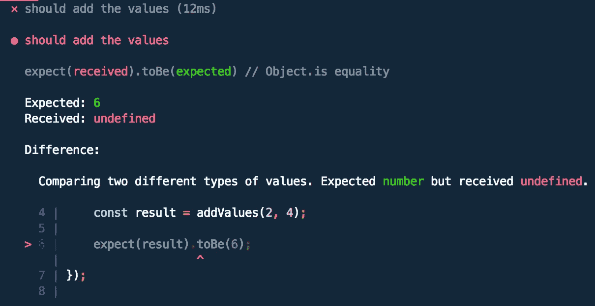
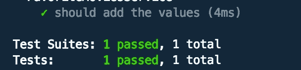
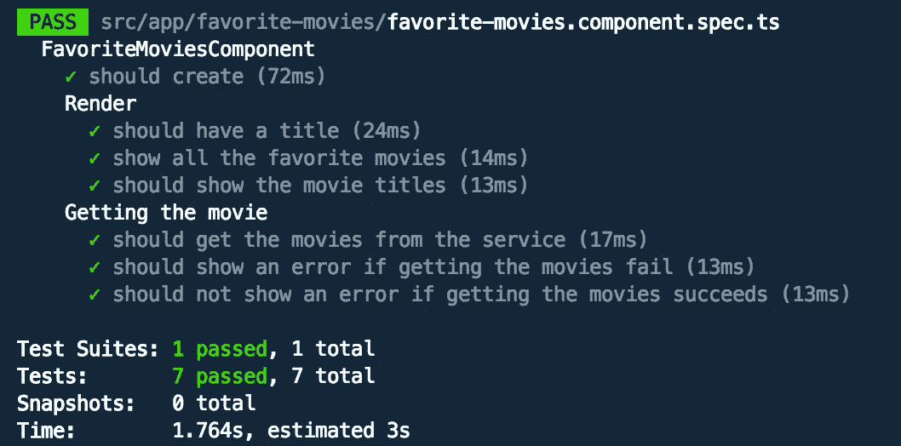

# 角度世界中的测试驱动开发—第 1 部分

> 原文：<https://itnext.io/test-driven-development-in-an-angular-world-92c0c42a54d0?source=collection_archive---------0----------------------->

## 测试角度分量

*第二部分这里:* [*测试 HTTP 服务*](https://catalincodes.com/posts/test-driven-development-in-an-angular-world-part-2) *。*

*第三部分这里:* [*测试智能组件*](https://catalincodes.com/posts/test-driven-development-in-an-angular-world-part-3) *。*

# #等等！什么是 TDD？

所以，你一直听到这个 TDD 的事情，并想开始使用它，但不知道为什么。别急，互联网来救援了！但是首先，什么是 TDD？

**TDD** 代表测试驱动开发，是一种编写代码的方式。这意味着您首先编写您的测试，您看到它失败，然后您编写代码使它通过。这也被称为**红色** - **绿色**方法。长话短说，它是由测试驱动的开发。

**小例子**:假设你要写一个 2 个数相加的方法。现在，您先编写测试，而不是实现方法:

现在，您运行测试并看到它失败了:



只有现在，你知道问题是什么，所以你可以实现方法:

现在，测试通过了:



现在，这很令人满意，对吧？

这做了几件事:

*   确保你的代码被测试，这样你就不必在 sprint 的最后两天为你写的所有代码写测试了(这永远不会发生)
*   确保您以实用的方式编写代码。有一种东西叫做 YAGNI(你不会需要它)，它是关于开发者过度思考并试图用下一段代码解决气候变化和世界饥饿的。可以肯定地说，大多数情况下，这使得代码过于复杂而没有任何真正的好处。
*   当你以这种方式写完一个特性时，你看到所有的测试都通过了，这给了你信心，如果/当你重构时，如果测试仍然通过，那么你没有破坏任何东西。您有多害怕因为简单的拉动请求而破坏产品？感觉是这样的:
*   最后但并非最不重要的，这是所有的颜色！看到颜色让我们开心。看到一些事情失败然后过去，会让我们更加快乐。

3 个月和 500 次测试之后，我们对我们正在开发的产品有了真正的信心。

这里的关键词是:**信心**

# #现在，回到角度和我们的组成部分

所以，现在你知道什么是 TDD 了。下一步，在组件中使用它。在这篇文章中，我假设你对 **Angular、**有一个基本的了解，所以我不会详细介绍它是如何工作的。

我将使用 **Jest** 进行测试，但原理是一样的。

对于我们的例子，让我们使用一个虚构的应用程序，让我们创建电影列表。现在，在空间和时间的某个地方，我们决定也要一个用户可以看到他/她喜欢的电影的页面。所以，事不宜迟，我们来建吧！

首先，让我们生成组件:

```
ng g c favorite-movies
```

现在，这将生成一个组件。那么，让我们看看，我们首先想做什么？我们想添加一个标题，如*最喜欢的电影。*动手吧！

**哇哦！**我们讨论了什么？编写测试，然后编写修复它的代码。

那会是什么样子呢？大概是这样的:

我们为**渲染**创建了一个新的描述块，并在那里添加了一个新的测试来检查是否有一个 **h1** 标签以及它是否有正确的内容。现在，我们运行测试，令人惊讶的是，它失败了！别担心，我们可以解决它:

我们将它添加到 HTML 模板中，现在我们的测试通过了！

**恭喜你！**你用 **TDD** 的方式编写了你的第一段代码。花些时间拍拍自己的背。干得好！现在停下来。我们有更多的工作要做。

接下来，我们想测试给定一个电影列表，它们是否显示在 HTML 中。那么，我们该怎么办？我们为它写一个测试！

这里，我们向组件添加了一个新的 **@Input()** 属性，创建了一个新的电影列表，并将它们作为输入传递给组件。然后，我们测试呈现的 HTML 是否包含正确数量的类为 **movie** 的元素，以及是否显示了所有的电影标题。

当然，这个测试失败了。所以，让我们让它过去:

这是我们添加到模板中的内容。耶！测试现在通过！

**neeeext！**

如果我们的数据实际上是异步地来自一个服务呢？

让我们为此调整我们的测试:

现在，我们的测试假设注入了一个服务。我们所做的是模拟响应并检查服务是否被调用。测试失败，让我们修复它们！

现在，我们的组件使用服务，而不是使用 **@Input()** 。最后一块拼图是模板:

因此，现在我们有了一个完整的工作组件，它从服务中获取数据并呈现出来。我们还需要什么？没什么！是时候回家玩红色死亡救赎 2 了🐴。

**哇哦！**有错误怎么办？

好吧，好吧，让我们写几个测试来确保万一有什么东西失败了，它得到了正确的处理:

因此，我们希望确保如果未能获得喜爱的电影，错误会显示出来，如果一切按计划进行，错误会隐藏起来。

我们需要的是捕捉组件中的错误:

并显示模板中的错误:

现在，经过我们所有的努力，我们有了一个完全工作的组件，它使用异步服务来获取数据、处理错误并呈现我们期望的一切。

现在，是时候来点赏心悦目的东西了:



很酷吧？

现在，为了让它工作，您不需要实现服务。它只需要存在并有一个名为 **getFavoriteMovies 的方法。**

# #总结

我知道，我知道，很多话。我尽量简洁，不遗漏任何重要信息。说起来容易做起来难。这是我的第一篇媒体文章，所以，我还在学习。希望在下一集里，我们会讨论测试一个**角度服务。当然是 TDD** 了。

希望你喜欢这个节目📺。下一集再见！

如果你喜欢这篇文章，嗯，可以在推特上关注我:

[](https://twitter.com/_utukku) [## ciubotaru Catalin(@ _ utukku)| Twitter

### Ciubotaru Catalin 的最新推文(@_utukku)。所有的东西都有棱角。荷兰乌得勒支

twitter.com](https://twitter.com/_utukku) 

# #最终文件

**规格文件:**

**组件文件:**

**HTML 文件:**

# #我们将何去何从？

如果您想了解如何测试 HTTP 服务，第 2 部分可能会有所帮助。

如果你想了解如何测试一个智能组件，也许第 3 部分会有所帮助。

# #延伸阅读？

一些有棱角的万能小贴士🖥:

1.  [Angular life:带 Angular Universal 的服务器状态代码](https://catalincodes.com/posts/server-status-codes-with-angular)
2.  [Angular life:用户首选语言带 Angular Universal](https://catalincodes.com/posts/user-preferred-language-with-angular)

一些笔记📓我拍的:

1.  [备注:NativeScript + Angular](/notes-nativescript-angular-5ae7dbe18672?source=friends_link&sk=30e20b23026b8cf15fbabaed268f4687)
2.  注释:React + Redux

另外，如果你对🧪测试驱动开发感兴趣:

1.  [角度世界中的测试驱动开发:第 1 部分](https://catalincodes.com/posts/test-driven-development-in-an-angular-world-part-1)
2.  角度世界中的测试驱动开发:第二部分
3.  角度世界中的测试驱动开发:第三部分

[](https://twitter.com/c5n_c8u) [## JavaScript 不可用。

### 编辑描述

twitter.com](https://twitter.com/c5n_c8u) 

# #结束通话