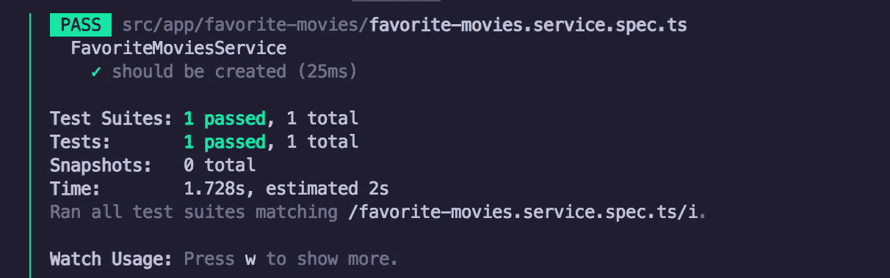
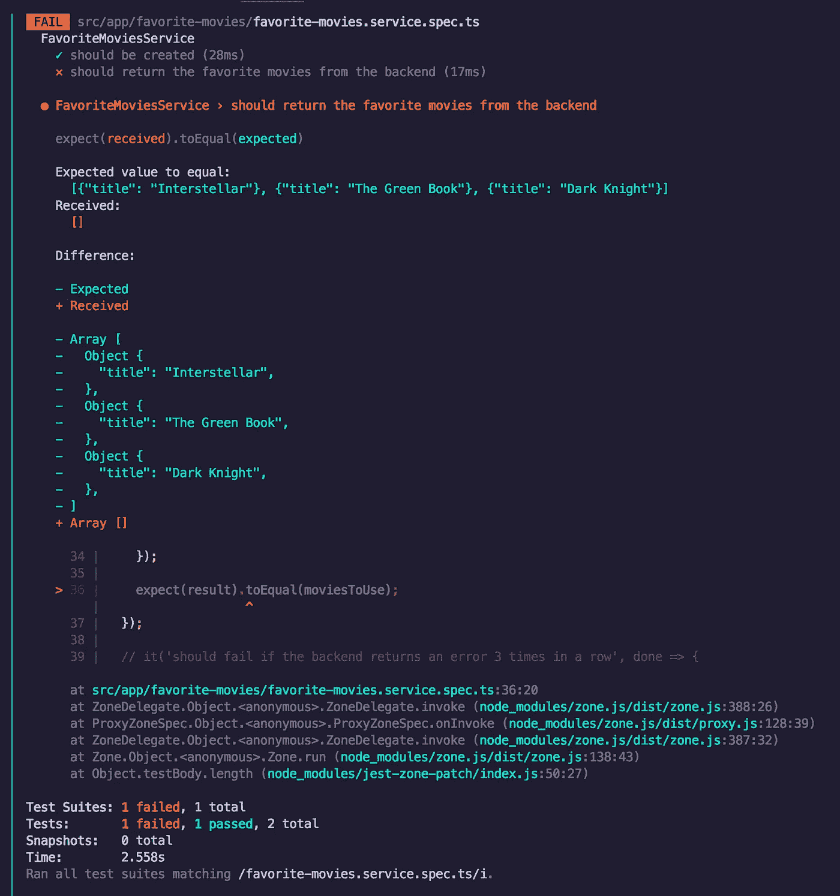
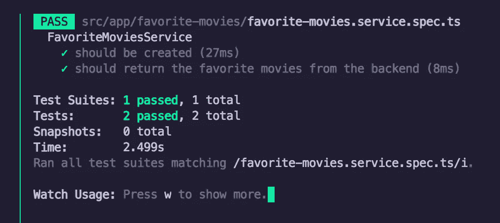
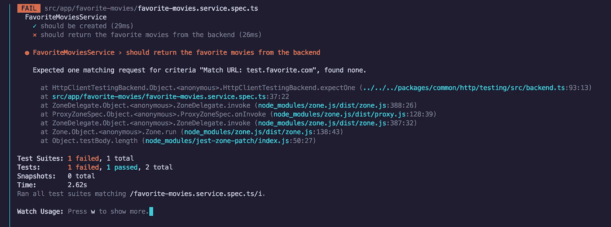
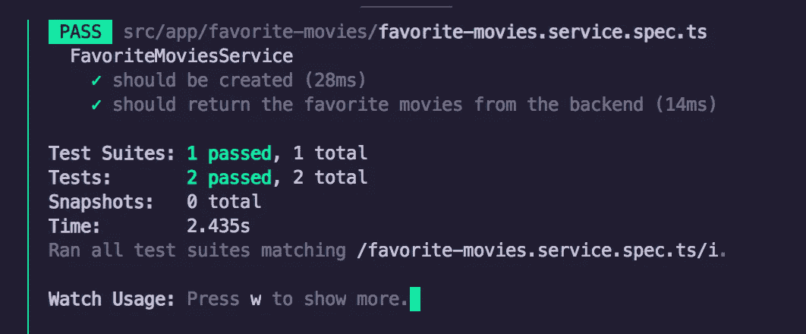
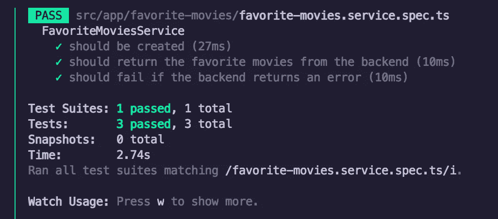
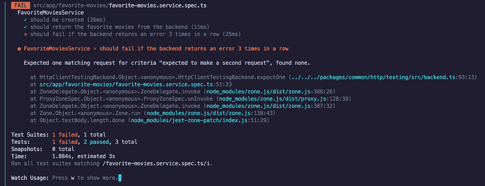
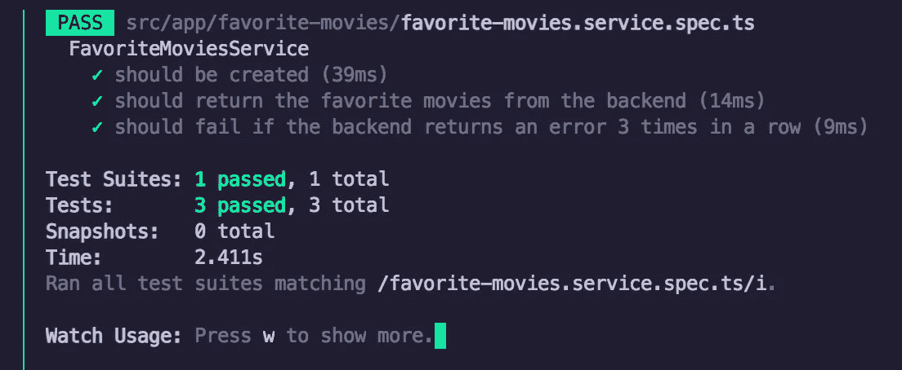
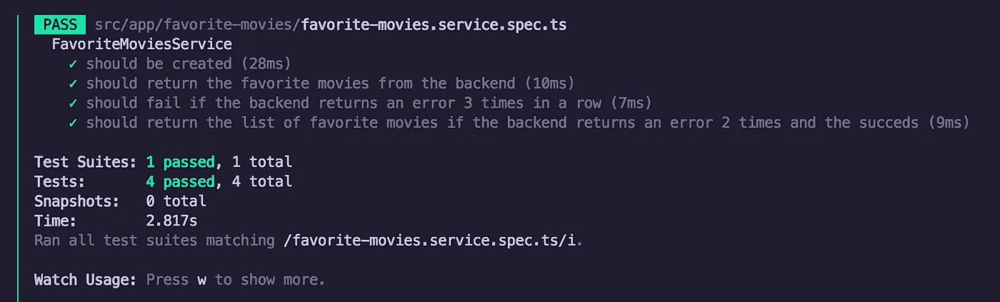

# 角度世界中的测试驱动开发—第二部分

> 原文：<https://itnext.io/test-driven-development-in-an-angular-world-d6475d6f4bfa?source=collection_archive---------2----------------------->

## 测试 Http 服务

在进一步阅读之前，我建议先阅读第 1 部分，了解一些背景知识。

[当你完成后想知道如何测试一个智能组件时，也许第 3 部分会有所帮助。](https://catalincodes.com/posts/test-driven-development-in-an-angular-world-part-3)

# #为什么是 Http 服务？

上次我们谈到了角分量，以及如何测试它。现在，这是一个“愚蠢”的组成部分，但嘿，我们必须从某处开始。我保证在不久的将来，我会向你展示如何测试一个“智能”组件。

那么，回到我们的**为什么**的问题。我认为除了组件，服务在我们的角度应用中占了很大一部分。然后，在所有服务中，我注意到人们在测试那些进行 HTTP 调用的服务时遇到了问题。所以，事不宜迟，以下是我的看法。

*不要担心，这仍将以测试驱动的开发方式来完成。*

# #我们离开的地方

如果你还记得上一次，我们依赖于一个 **FavoriteMoviesService** 的存在。因为这超出了当时的目的，它只是实际功能的一个外壳。这是它最后的样子:

# **#创建服务规范文件**

所以，首先要做的是:我们需要一个 **spec** 文件用于我们的服务。这是我们编写测试的地方。那么，让我们来创建它:

这是什么？这是在 Angular 中测试任何服务的样板。它包含初始化和检查服务是否已创建的测试。

然后，我们为测试下的**服务添加一个变量，并在每个**之前在**中初始化它，这样我们就不必在每个测试中都这样做。**

此外，我们添加了一个电影列表，我们将使用这些电影作为测试的模拟数据。稍后会详细介绍。

大概就是这样。

那么，我们现在运行我们的测试，它做什么？

太好了！它过去了。

# #如何开始？

既然已经解决了，我们该怎么办？嗯，我们希望确保我们的服务返回我们期望的结果。我们如何实现这一目标？我们将为它编写一个测试:

因此，这里我们有一个新的测试，订阅我们的方法，并检查它返回的是我们期望的电影的实际列表。

让我们运行它:

你看看这个。失败了！

现在，按照**红绿**的方法，让我们修复它。我们如何解决它？做最少量的必要工作。记住，我们很懒。

所以，我们只返回我们知道它是预期的列表，包装在一个可观察的。你可能会认为这是一个黑客，它有点，但它很好。别担心。这是一项正在进行的工作。

现在，当我们运行测试时:

检查！

# HTTP 部分呢？

我们为什么在这里？是的，测试 HTTP 服务。所以，到目前为止，还没有 HTTP。让我们改变这一点。

第一步是确保我们的环境有一个变量，该变量带有我们期望被调用的 URL。这只是很好的练习。

这使得我们的服务是可配置的，因此我们可以为开发、测试和生产提供不同的 URL。

现在，回到我们的测试。我们希望确保我们的服务对我们的端点进行 HTTP 调用，并返回该调用返回的任何内容。这将需要测试中的一些变化:

首先，我们导入 **HttpClientTestingModule** 。这将帮助我们测试/模拟/拦截/分析 HTTP 流量。然后，我们为 http helper 创建一个新变量，因为我们将在更多的测试中需要它，这比在每个测试中都这样做要干净得多。

现在，进行实际测试。首先，我们更改了名称，以反映我们期望数据来自后端。之后，会发生一些事情:

*   我们使用新的 http 变量来检查是否有且只有一个调用是针对我们的端点的。这将返回我们的服务发出的请求(如果有)。
*   我们检查这个请求的 HTTP 方法以确保它是一个 GET
*   我们使用这个请求对象来刷新数据。这是我们嘲笑来自后端的响应的方式
*   最后但同样重要的是，我们调用 **verify()** 方法来确保没有挂起的 HTTP 调用。这是为了确保我们不会做比预期更多的请求，或者我们没有任何未处理的请求。

现在，让我们运行它！

当然失败了。**红绿**，记得吗？所以，它说它期望对我们的 URL 有一个请求，但是没有找到。让我们解决这个问题。

因此，为了让我们的测试通过，我们在服务中注入了 **HttpClient** ，并使用它来调用我们的 **favoriteUrl** 端点。我们返回那个的响应。让我们试着再做一次测试。

检查！

# #我们还应该测试什么？

我喜欢测试的另一件事是错误处理。我们希望确保我们的错误得到妥善处理，不会被掩盖。

我听到的是什么？该进行另一项测试了！

因此，这里我们使用 subscribe 方法的第二个参数，即错误回调。该方法在出错时被调用。我们想检查一下，如果后端返回一个错误，这个错误不是被我们的服务吞掉，而是冒泡，因此消费者可以进行处理。

然后我们告诉我们的 http 返回一个**500**错误。

这是非常主观的。你也可以在你的服务中注入一个记录器，这里不是检查 **bubblesUpTheError** 变量，而是检查记录器是否被要求记录一个错误(还记得[第一课](https://medium.com/@utukku/test-driven-development-in-an-angular-world-92c0c42a54d0)中的**间谍**？).你觉得怎样都行。为了简单起见，我采用了这种方法。我只是想向**展示**如何测试这个场景。

现在，让我们进行测试:

检查！

# #让我们想象一下。重试

既然基本功能已经测试完毕，让我们来做些有趣的事情。

我们有一个新的功能请求。由于我们的后端不可靠，让我们确保我们的服务在实际失败之前尝试获取数据 3 次。有趣吧？

现在，让我们更改之前的测试来检查该功能:

这里我们又创建了 3 个请求检查。每个检查都有自己的错误信息，所以我们更容易知道什么失败了。因此，我们期望 3 个 HTTP GET 调用到达我们的端点，如果它们都失败，我们期望一个错误。

让我们运行我们的测试:

你看到了吗？我们的助手错误消息派上了用场。它失败了，但我们知道为什么。它没有提出第二项请求。现在，让我们通过这个测试:

我们完成这一步的方法是使用重试操作符。我们告诉它:如果请求失败，在真正传递错误之前重试 2 次。

现在运行我们的测试:

检查！

# #最后一次上路测试

现在，为了进行健全性检查，我们可能希望编写一个测试来检查后端两次失败但第三次成功时的情况。在这种情况下，我们希望确保数据被返回并且没有错误。测试会是什么样的呢？

这看起来与我们之前的测试非常相似。不同之处在于我们拦截的最后一个请求。我们告诉它返回数据而不是失败。然后，我们检查数据是否确实被返回。很简单。

让我们运行它:

它还活着！！

# #给我看文件

以下是便于参考的服务和规范文件:

# #摘要

我们学到了什么？

*   测试 HTTP 服务很重要
*   测试是否进行了实际的 HTTP 调用。测试 HTTP 方法并检查返回的数据
*   测试错误是否得到正确处理
*   测试您处理来自服务器的响应的任何额外逻辑

并且记住:**红色= >绿色= >成功**

更多信息，关于智能组件的第 3 部分可能会有用。

# #延伸阅读？

一些其他角通用提示🖥:

1.  [Angular life:带 Angular Universal 的服务器状态代码](https://catalincodes.com/posts/server-status-codes-with-angular)
2.  [Angular life:带 Angular Universal 的用户首选语言](https://catalincodes.com/posts/user-preferred-language-with-angular)

一些笔记📓我拍的:

1.  [备注:NativeScript + Angular](/notes-nativescript-angular-5ae7dbe18672?source=friends_link&sk=30e20b23026b8cf15fbabaed268f4687)
2.  [备注:React + Redux](/notes-react-redux-e0c7a4d62e69)

另外，如果你对🧪 **测试驱动开发**感兴趣:

1.  [角度世界中的测试驱动开发:第 1 部分](https://catalincodes.com/posts/test-driven-development-in-an-angular-world-part-1)
2.  [角度世界中的测试驱动开发:第 2 部分](https://catalincodes.com/posts/test-driven-development-in-an-angular-world-part-2)
3.  [角度世界中的测试驱动开发:第 3 部分](https://catalincodes.com/posts/test-driven-development-in-an-angular-world-part-3)

 [## JavaScript 不可用。

### 编辑描述

twitter.com](https://twitter.com/c5n_c8u) 

# #结束通话