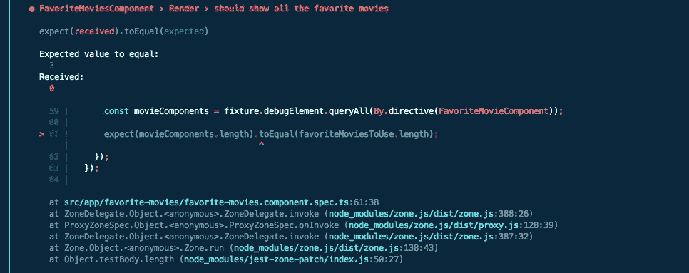
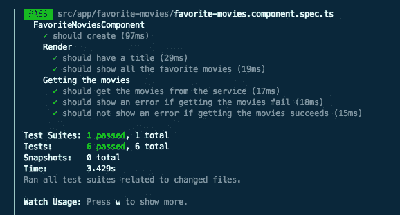
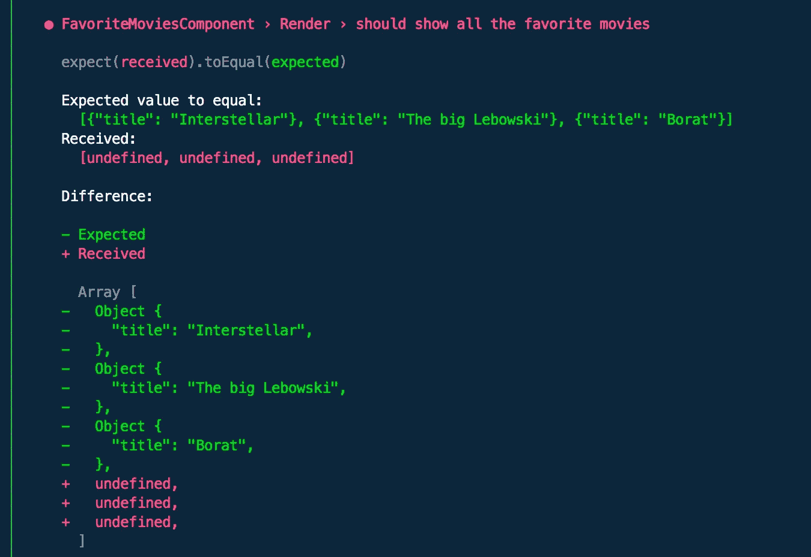
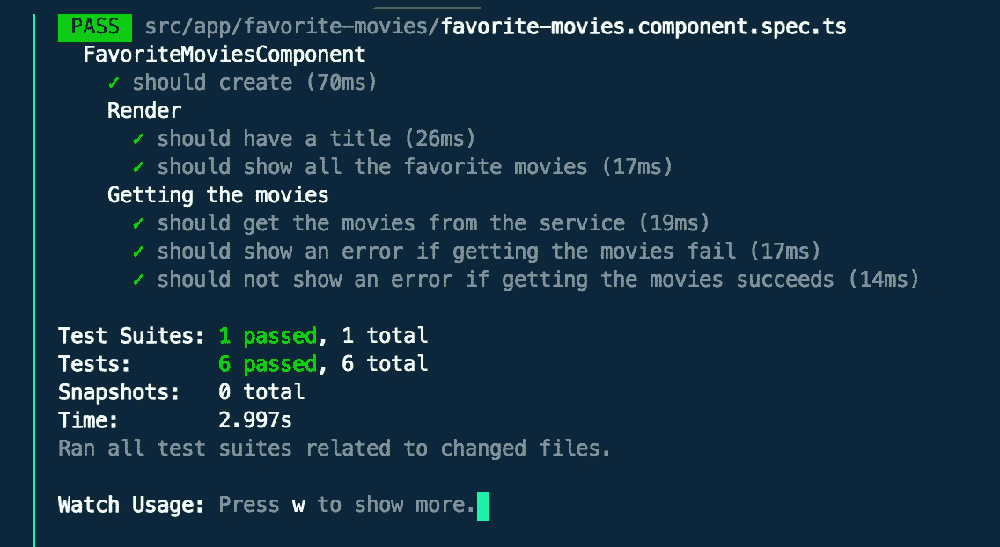
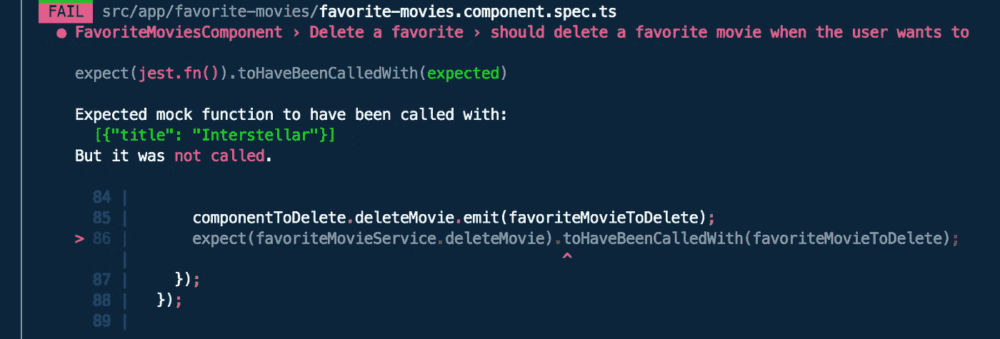
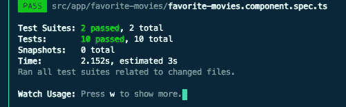
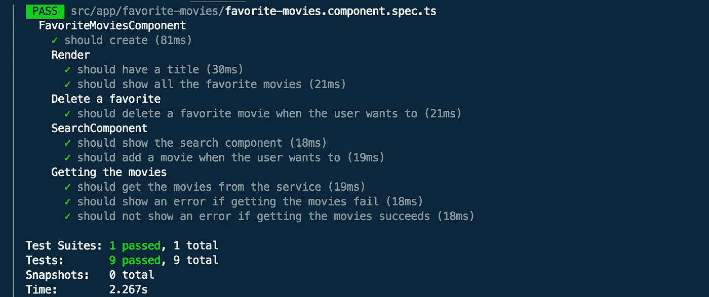

# 角度世界中的测试驱动开发:第 3 部分

> 原文：<https://itnext.io/test-driven-development-in-an-angular-world-part-3-fc65f0d44383?source=collection_archive---------2----------------------->

## 测试智能组件

下面是第一部分和第二部分的[和](https://catalincodes.com/posts/test-driven-development-in-an-angular-world-part-1)[的一些背景。](https://catalincodes.com/posts/test-driven-development-in-an-angular-world-part-2)

# #什么是智能组件

构建角度应用的一个推荐方法是使用所谓的**智能**和**非智能**组件。或**容器**和**呈现**组件。它们的意思是一样的:

1.  您可以通过将组件作为编排器来构建应用程序。他们使用服务，获取数据，处理事件，决定在屏幕上显示什么。这些是**智能** / **容器**组件。
2.  您使用不做任何处理的小型可重用组件。他们负责显示数据，冒泡事件，样式等。这些是**哑** / **演示**组件。

🧪测试哑组件非常简单。这甚至比我们在测试**最喜爱的电影**组件[时所做的还要简单。您只需检查是否显示了正确的信息，以及事件是否冒泡。你不应该担心任何依赖，模块等。](/test-driven-development-in-an-angular-world-92c0c42a54d0)

# #我们离开的地方

因此，在前面的文章中，我们学习了如何测试一个常规组件和一个 HTTP 服务。让我们更进一步，看看一个**智能** **组件**。我们将 **Angular** 与 **Jest** 一起使用，所以让我们继续使用它。我们不想每隔一周就改变框架😅。

# #架构考虑因素

现在，在我们进入代码之前，让我们想一想我们想要什么样的结构。

我提议:让我们有一个**FavoriteMoviesComponent**来显示所有喜欢的电影。该组件将显示 0->n**FavoriteMovieComponent**s。该组件还将显示一个搜索电影部分，用户可以在其中搜索电影并将其添加到收藏夹列表中。

因此，就责任而言，**FavoriteMoviesComponent**将知道如何添加电影、删除电影、显示所有电影。

有异议吗？没有吗？很好！很高兴我们意见一致。

我们继续吧。

# #生成哑组件

从我们上面的场景中，我们可以确定需要 2 个新组件:FavoriteMovie ( **哑巴**)和 SearchMovie (姑且称之为**智能**)。为了保持这篇文章(相对)简短，我们不会关心它们的实际实现。我们只知道它们看起来像这样:

# FavoriteMovies 组件的当前状态

现在，我们已经在组件模板中显示了所有喜爱的电影，但是没有可重用组件的帮助。因此，我们想重构这一部分:

我们希望:

1.  使用我们新的 FavoriteMovie 组件，而不只是一个 div
2.  在此基础上使用我们新的 SearchMovie 组件
3.  监听来自这些组件的事件，并相应地采取行动

所以，我们开始吧！让我们使用我们的新**哑组件！**

哇哦！这篇文章的标题是什么？ **TDD** 意为测试驱动开发。记得吗？编写测试，看着它们失败，然后让它们通过。

很好，让我们添加一个测试来检查我们的**favorite movies**(**Smart**)组件显示了正确数量的**favorite movie**(**Dumb**)组件。

现在，我们运行它 aaaaand:

失败！别担心。这是命中注定的。这个错误很明显。它期望 3，它得到 0。现在，让我们来解决这个问题。

如您所见，我们用可重用组件替换了

。现在，当我们再次运行测试时，我们得到这个:

这意味着我们的测试模块不知道<kpd-favorite-movie>标签是什么。我们有几个选择。</kpd-favorite-movie>

1.  我们可以向我们的测试平台配置添加— *模式:[ NO_ERRORS_SCHEMA ] —* 。这告诉它忽略任何它不知道的东西。我不太喜欢这样，因为它忽略了智能组件的部分核心职责。
2.  我们可以将 **FavoriteMovieComponent** 添加到测试床配置中的声明数组中。我不喜欢这样，因为如果你的**愚蠢的**组件有依赖关系，或者如果你也依赖于其他**智能的**组件，你突然不得不提供大量额外的服务并照顾它们。这只会造成污染💨您的 spec 文件，因为它与您当前正在测试的组件的责任并不真正相关。
3.  我们可以使用像 [ng-mocks](https://www.npmjs.com/package/ng-mocks) 这样的库来声明一个 **MockComponent** 。这适用于组件、管道、指令等。这将为您提供一个假组件，它具有实际组件的形状，但没有它的实现。

正如你可能发现的，我通常选择第三个选项。

所以，之后

> 纱线添加 ng-mock

我们将模拟组件添加到声明中:

现在，我们的测试通过了:

太好了！我们进行了第一次测试，检查我们的**智能**组件如何使用非智能组件。但这就够了吗？

# #检查细节

这样够了吗？不完全是。想想吧。该测试检查组件是否在页面上，但并不真正检查它们是否收到了它们应该收到的内容。事实上，他们什么也没收到。

让我们快速完成之前的测试。

在这里，我们检查了 **FavoriteMovie** 组件的所有输入是否包含了我们想要播放的所有喜爱的电影。当然，这只是检查的一种方式。我们也可以一个接一个地迭代，检查它是否存在，等等。你的选择。重要的是检查一下。

现在，我们该怎么办？我们进行测试！

这并不奇怪。它期望通过电影作为输入，但是什么都没有通过。修复非常简单:

再次运行测试向我们展示了这一点:

那种绿色🍏伙计。好东西。

# #事件怎么样？

你说得对！我们还需要检查事件。因此，我们的 **FavoriteMovie** 组件将在电影被删除时发出一个事件。我们的**智能**组件需要监听并告诉 **FavoriteMoviesService** 删除指定的电影。同样，我们在这里已经介绍了 HTTP 服务[的测试/实现，所以我们不会再重复了。](/test-driven-development-in-an-angular-world-d6475d6f4bfa)

像往常一样，我们从测试开始:

这里发生了几件事:

1.  我们窥探服务的删除方法
2.  我们得到了想要发出删除事件的组件
3.  我们发出删除事件
4.  我们检查它是否被正确地处理到服务中

现在，运行测试当然是:红色🔴

下一站:绿色！🍏

我们如何到达那里？我们添加实现。这包括 2 个步骤:在模板中捕获事件，并在组件代码中处理它。

☝️在这里我们听事件的组成部分。

☝️:在这里，我们告诉服务，我们想删除这部电影。

现在，如果我们再次运行我们的测试:

它是绿色的🍏！多好的一天啊！多好的一天啊！

# #好，现在快一点

因此，我们现在有了一个经过全面测试的流程，其中一个**智能**组件使用了一个**非智能**组件。让我们对 **SearchMovie** 组件做同样的事情。

我们从测试开始:

因此，我们将*mock component(SearchMovieComponent)*添加到测试床配置的声明中，然后我们为该特性编写测试。

模板现在看起来像这样:

还有最后一块拼图，实现为 *addMovie* 的方法:

测试结果是:

哇！考试不是很美好吗？😍

现在我们有了一个经过全面测试的搜索功能(从**智能**组件的角度来看)。

# #那么，关于那些可重复使用的组件

当我们可以把所有东西都放在一个模板中时，为什么要大费周章地使用可重用组件呢？我想到了几个原因:

1.  它们非常容易测试
2.  它们非常容易在多个页面中使用
3.  他们可以/应该使用 **ChangeDetection。OnPush** (大幅提升性能明智)。谷歌一下。
4.  他们使**智能**组件更容易测试，并将所有东西连接在一起。

# #摘要

所以，如果你只是跳过了这面墙的文字(我经常这样做😅)至少要记住这一点🧠: **可重用组件对你有好处，易于测试并且对性能有很大帮助🏍和维护**。

如果你想知道更多，这里有一些我漫谈的其他事情:

1.  [角度世界中的测试驱动开发:测试角度组件](https://catalincodes.com/posts/test-driven-development-in-an-angular-world-part-1)
2.  [角度世界中的测试驱动开发:测试 HTTP 服务](https://catalincodes.com/posts/test-driven-development-in-an-angular-world-part-2)

一些有棱角的万能小贴士🖥:

1.  [Angular life:带 Angular Universal 的服务器状态代码](https://catalincodes.com/posts/server-status-codes-with-angular)
2.  [角度寿命:用户首选语言，角度通用](https://catalincodes.com/posts/user-preferred-language-with-angular)

一些笔记📓我拍的:

1.  [备注:NativeScript + Angular](/notes-nativescript-angular-5ae7dbe18672?source=friends_link&sk=30e20b23026b8cf15fbabaed268f4687)
2.  [备注:React + Redux](/notes-react-redux-e0c7a4d62e69)

如果你喜欢这篇文章，嗯，也许可以在推特上关注我

 [## JavaScript 不可用。

### 编辑描述

twitter.com](https://twitter.com/c5n_c8u) 

# #结束通话