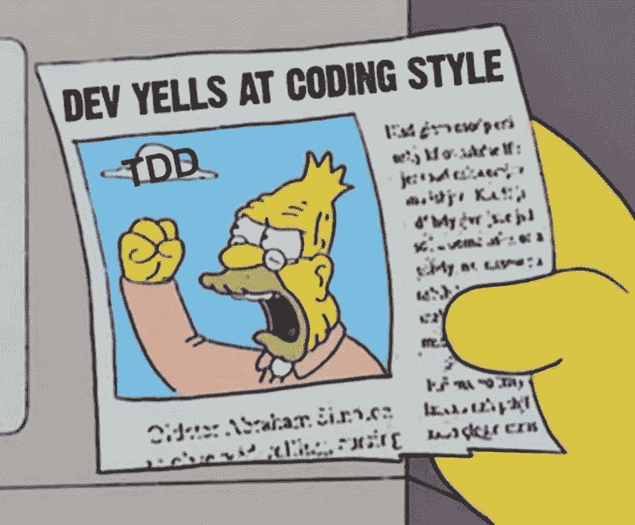
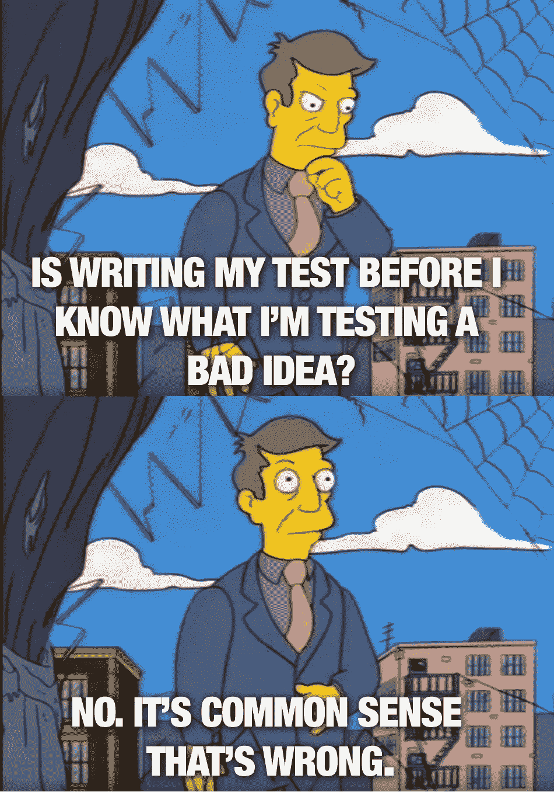

# 测试驱动开发是愚蠢的。跟我打。

> 原文：<https://itnext.io/test-driven-development-is-dumb-fight-me-a38b3033280c?source=collection_archive---------0----------------------->

## 一个伟大的想法隐藏在一个糟糕的实现背后

没错，我认为测试驱动开发(TDD)是直截了当的不好。更糟糕的是，就像一个阴暗的影响者巧妙地删除了他们的自然脂肪团，这给了小开发者不切实际的目标。所以，让我直言不讳地说，为不存在的函数编写测试是多么疯狂。

图为:我在互联网上浪费时间发表意见

# 为什么我会有这种感觉？

也就是说，因为这周我需要写点东西，但是*也是*因为我一直在和有实际经验的资深开发者交谈。不是不喜欢 TDD 的人，而是喜欢*的人。当我问他们如何使用 TDD 时，他们滔滔不绝地讲述了所有的好处。但是当我接着问，“那么，你在工作中做吗？”我得到了 ***非常*** 不同的回应。*

# “哦，嗯，关于 TDD 的事情是…”

“没时间”“不是文化的问题”“我一对本来不想”“我和我女朋友一直用 TDD，你就是不了解她，她上的是不同的学校。”对于一件如此伟大的事情，似乎没有多少人去做。这尤其令人沮丧，因为在训练营，我从未见过我的任何一位老师这样做，但他们都在谈论你应该是怎样的人。听到每个人谈论它开始让我产生一种情结，因为在内心深处，我从来不明白为什么倒着做事情更好。

# TDD 到底有什么好处？

那些支持 TDD 的人将会承认，它确实走得比较慢。但是，他们声称产生的代码将是如此干净和深思熟虑的，从长远来看，您将节省时间。但是我开始意识到 TDD 花费这么长时间的原因是它只是…效率低下。前几天有人试图做 TDD 的时候，我很好地演示了这一点。

# 该事件

我很兴奋，一位资深开发人员将向我展示如何做到这一点。我们讨论了这个特性和我们的第一个函数，设计了一个测试，看着它失败。我们开始了这项活动，但大约十分钟后，他们停止了。他们注意到我们构造函数的方式意味着测试实际上不会检测到它。我们不得不*停止*对我们功能的工作，然后回去再次进行测试。

我们重新开始我们的功能，但是感觉我们不理解它将如何与我们系统的其余部分交互。所以我们开始修改代码，看看它会有什么反应。我们将改变特征函数，然后记录结果。我们发现如果我们修改一个配置文件并做一些小的改动会更容易，所以我们很快就做了。这花了我们一些时间，但是我们最终理解了这个特性是如何与系统交互的。就在那时，我注意到: **1)** 我们的函数被完全编码，而 **2)** 测试是错误的。又来了。

# TDD 为什么不行？

因为在工作中开发软件并不简单。当然，当开发玩具应用程序时，TDD 听起来很不错。但是在现实生活中，特征要比`Function X should take a name and output a greeting with that name`复杂得多。很多时候，产品请求会在中途改变，或者你会意识到特性不能按要求工作。也许你原来的理解是有缺陷的，你必须重新开始。

所有这些情况都是正常的，但是每次都必须在开始时停下来编写测试只会使每个问题变得更糟。更简单的是编写代码，手动进行一些 QA 测试，然后*和*编写模拟这些情况的自动化测试，特别是针对你编写的代码。有了适当的测试，您就可以自由地转移到下一个特性或重构，而不用担心会出问题。通过将测试用作护栏而不是地图，您将获得测试的所有好处，而没有试图预测任何事情的问题。

# 但是 TDD 确实有一些好的想法

TDD 有很多让人喜欢的地方。事实上，除了考试，几乎所有的东西都很棒。TDD 背后的想法是，你能够编写一个测试，因为你先坐下来思考问题。太好了！太多的开发人员(我)没有考虑他们实际上需要代码做什么就开始编码。仅仅写下一个功能的目标和需求将会让你获得 TDD 的所有好处，而不需要逐字写测试的麻烦。

# 总之…

我说这个是因为测试很重要。不对生产应用进行测试就像在没有车道的高速公路上行驶。我只是说，TDD 就像在你铺设高速公路之前试图油漆高速公路。也许你不同意，也许你真的每天都在使用 TDD 并且喜欢它。但是如果你不用，那也没关系！我们必须对自己诚实。如果一种编码风格在理论上很棒，但在实践中却不行，那就让我们保留起作用的部分，把剩下的扔掉。我的复杂观点是:有许多编码方式，我们需要停止将其中任何一种作为“最佳”方式。

也就是说，行为驱动的开发是完美的，如果你不这样做，你就是一个傻瓜。

开玩笑，

麦克风

*最新文章:*