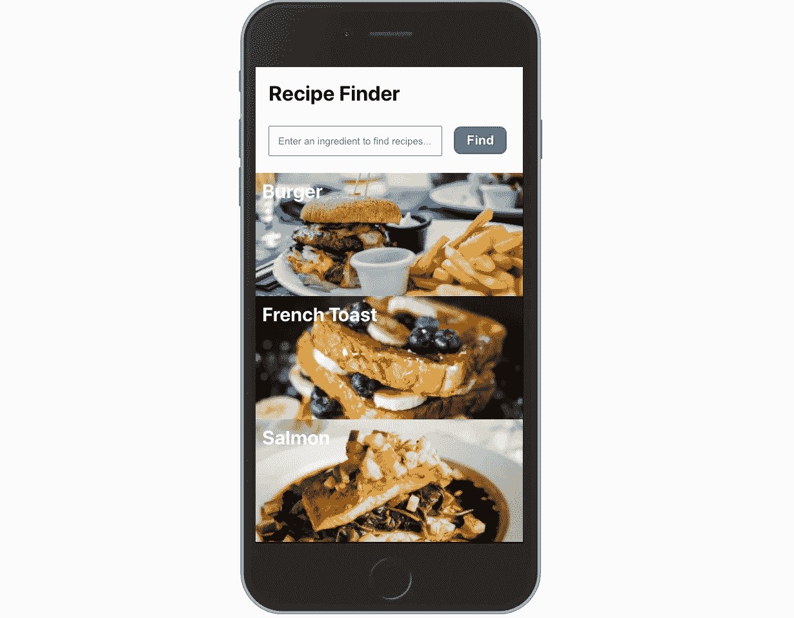

# 使用 React 测试库和模拟服务人员进行测试驱动开发(TDD)

> 原文：<https://itnext.io/test-driven-development-tdd-with-react-testing-library-mock-service-worker-b23c9fedf6fa?source=collection_archive---------0----------------------->


Logos: React，测试库和模拟服务人员

让我们用两个非常适合 TDD 方法的有用的库来加强我们的测试。

# 安装

每当我想尝试一些与 React 相关的东西时，我就使用库 [create-react-app](https://create-react-app.dev/docs/getting-started/) 。它为您提供了一个无需配置即可使用的基本 React 应用程序。最近的版本也捆绑了 react 测试库，所以如果你使用最新的 *create-react-app* ，你可以马上开始使用 React 测试库。如果没有，在现有的 react 应用程序中安装 [@testing-library/react](https://www.npmjs.com/package/@testing-library/react) 和[@ testing-library/jest-DOM](https://www.npmjs.com/package/@testing-library/jest-dom)。

我要实现以下功能:一个简单的搜索功能食谱列表。在移动浏览器中，用户会看到这样的内容:



图片来源:罗宾·斯蒂克尔[在](https://unsplash.com/@robinstickel?utm_source=unsplash&utm_medium=referral&utm_content=creditCopyText) [Unsplash](https://unsplash.com/s/photos/burger?utm_source=unsplash&utm_medium=referral&utm_content=creditCopyText) 上的汉堡照片，约瑟夫·冈萨雷斯[在](https://unsplash.com/@miracletwentyone?utm_source=unsplash&utm_medium=referral&utm_content=creditCopyText) [Unsplash](https://unsplash.com/s/photos/food?utm_source=unsplash&utm_medium=referral&utm_content=creditCopyText) 上的法式吐司照片，凯西·李在 [Unsplash](https://unsplash.com/s/photos/food?utm_source=unsplash&utm_medium=referral&utm_content=creditCopyText) 上的三文鱼照片

# 从失败的测试开始

我想使用 TDD 方法，所以让我们从一个失败的测试开始。在这一点上，还没有组件，所以当然无论我们写什么测试都会失败。但是让我们从小处着手；我想要一个名为'食谱'的组件，呈现预期的标题文本。以下是我对这种期望的测试:

React 测试库导出一个 *render* 方法，该方法将呈现一个组件及其所有子组件。它还导出了一个*屏幕*对象，其中保存了一些[查询](https://testing-library.com/docs/dom-testing-library/api-queries)，我们可以用它们来选择渲染组件中的不同元素(及其子组件)。 **getByRole** 查询让我选择标题元素并对其文本内容做出断言。

为什么选择标题元素是根据它的角色，而不是一个 CSS 类？React 测试库的指导原则是[“你的测试越像你的软件被使用的方式，它们就越能给你信心。”](https://testing-library.com/)因此，我们希望编写的测试尽可能接近最终测试人员——最终用户——使用应用程序的方式。用户看不到 CSS 类或数据属性；它们与文本、标签文本以及语义元素和角色进行交互。使用像 **getByRole** 这样的查询也鼓励我们编写可访问的代码，因为每个人都可以使用这些选择器，包括屏幕阅读器的用户。

# 通过测试

我们的第一次测试不出所料地失败了。**配方未定义。但是这是 TDD 的第一步——一个失败的测试。现在，让我们通过编写带有正确标题的最简单的< Recipes / >组件，然后将其导入到我们的测试文件中。现在，让我们重新运行测试。它过去了！**

使用进一步的查询，我们可以对输入元素和“Find”按钮做出类似的期望。按钮也有作用，但是对于输入字段，我将使用 **getByPlaceholderText** 查询，因为这可能是最接近用户在页面上如何找到它的查询。

从失败的测试开始…

…并实施必要的更改以使其通过:

这样，我们知道我们期望从代码中得到什么，更重要的是，如果之前通过的测试突然失败，我们将知道我们是否破坏了任何功能。

TDD 中的一个重要步骤是*重构*步骤，在这个步骤中，我们改进了我们的代码，例如，使其更容易阅读，变得更有效，并消除任何重复。在我们重构之后，测试仍然应该通过。

# **设置我们的模拟场景**

当应用程序第一次呈现时，我想显示我所有食谱的列表，就像上面的视觉设计一样。这需要与 API 进行某种通信。我们将使用[模拟服务工作者](https://mswjs.io/)来模拟 HTTP 请求，这样我们就可以控制响应数据。使用 npm 安装模拟服务人员，如下所示:

```
npm install msw --save-dev
```

使用 Mock Service Worker，我们不是在模仿一个特定的模块(不像我们使用 Jest.mock)，这意味着我是使用 *fetch* 还是使用第三方库比如 *axios* 来获取数据没有任何区别。这使得它非常灵活。让我们将以下导入添加到我们的测试文件中:

```
import { ***rest*** } from 'msw';
import { ***setupServer*** } from 'msw/node';
```

下面是我如何设置模拟对配方列表端点的调用:

```
GET /api/recipes
```

如果您使用过 NodeJS 和 Express，语法看起来非常熟悉。对“/api/recipes”的 GET 请求将用包含 allRecipes 数组的 JSON 响应，就像真正的 api 一样。这两行确保服务器在测试运行之前开始监听(拦截),并在该文件中的测试运行完毕后关闭其连接:

```
beforeAll(() => server.listen());
afterAll(() => server.close());
```

# **测试异步代码**

让我们编写一个新的测试，验证组件呈现时食谱列表是否显示。由于显示的配方是异步操作的结果，我们需要确保测试在断言它们的出现之前等待一段时间。React 测试库为此提供了异步查询，即 **findBy*** 查询。如果经过一定次数的重试后，查询的元素不存在，测试将超时并失败。在我们的测试中使用 *async await* ，我们可以找到所有具有 *listitem* 角色的元素(< li >元素)，一旦它们被获取和呈现:

不要忘记进行异步测试！

我们现在可以在我们的<recipes>组件中写一些代码，让这个测试也通过。它可能看起来像这样:</recipes>

这只是实现获取和显示食谱列表的许多方法之一

# **模拟用户交互**

React 测试库为此公开了另一个方法— **fireEvent** 。同样，让我们从编写一个我们知道会失败的测试场景开始:

FireEvent 从与**渲染**和**屏幕**相同的地方导入:

```
import { ***fireEvent***, **render**, ***screen*** } from '@testing-library/react';
```

使用 **fireEvent** ，我们可以模拟一个 *change* 事件和一个 *click* 事件，以使测试行为更接近用户输入和提交表单的方式。如果用户在输入字段中键入单词“fish”并单击“Find”按钮，我们期望看到消息“显示 fish 的结果:”并且只有一个< li >元素，其文本内容是“Salmon”。

但是等等——我们的 mock 已经设置为当我们对‘API/recipes’端点进行 GET 调用时总是返回完整的食谱列表。我们必须能够处理请求查询字符串来模拟过滤后的响应。幸运的是，这很容易通过模拟服务人员来完成。

# 用查询字符串模拟调用

在我们的 GET 请求处理程序中，我们可以访问带有 **req.url.searchParams.** 的请求的查询字符串，通过对请求处理程序做一个小的改变，我们可以确保当测试遇到一个请求时:

```
GET /api/recipes?ingredient=fish
```

我们的模拟将返回过滤后的数据；只包含鲑鱼食谱的数组。

现在我们可以在<recipes>中实现必要的逻辑来通过测试了！在本文的最后，我已经添加了完整的实现，但是这里有一个片段显示了 fetch 调用:</recipes>

向下滚动到本文末尾，查看完整的示例

# 模拟服务器端错误

我们可能还想在食谱应用程序中实现一些错误处理。像往常一样，让我们从一个失败的测试开始，概述我们的期望:

为了让我们的模拟返回内部服务器错误，我们简单地创建一个状态为 500 和“内部服务器错误”消息的响应处理程序，类似于真实 API 的响应方式。但是，我们只希望 mock 在这个特定的测试用例中做出不同的响应——之前编写的测试仍然应该期待一个成功的 mock API 响应。模拟服务工作者让我们用*服务器覆盖前面的响应处理程序。在特定的测试中使用*:

重要的是，当我们开始在测试套件中覆盖先前模拟的响应时，我们在测试上方添加以下行:

```
afterEach(() => server.resetHandlers());
```

这确保了在测试运行期间设置的任何处理程序，都不会“泄漏”到后续的测试中。

# 包扎

当然，我们可以用测试驱动的方法来实现更多的特性、错误处理和表单验证，但是希望现在您有一些灵感来开始自己的项目！

我想强调的是，你如何实现你用 React 测试库和模拟服务工作者测试的代码并不重要。在我的例子中，我使用了一个带有 **useState** 和 **useEffect** 钩子的函数组件，并用 **fetch** 来检索数据。然而，我可以将这个组件重构为一个类组件，甚至更小的子组件，只要逻辑不中断，测试仍然会通过。就像你的最终用户不关心有多少子组件被渲染或者你是否用 **setState** 或 **useState** 处理状态一样，React 测试库也不关心。与其他测试工具相比，这是一个巨大的优势。每当我们对实现细节进行更改时，知道我们不必担心破坏测试是一种很好的感觉。这也非常符合 TDD 哲学，因为 TDD 过程中的一个重要步骤是重构。

下面是一个完整的例子，由我们上面的测试案例驱动: