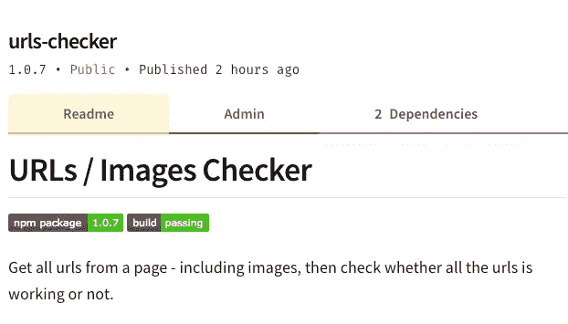
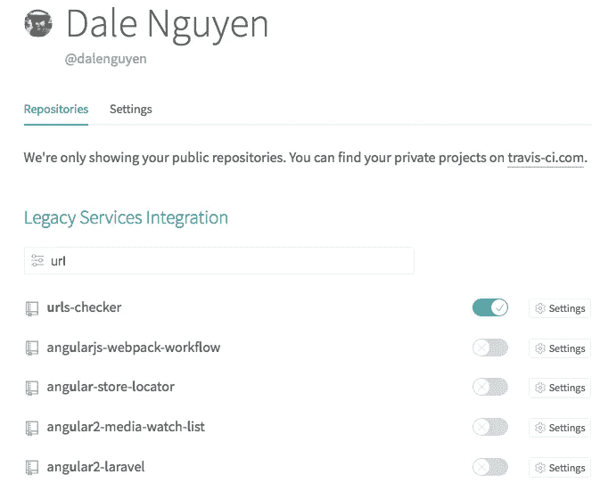
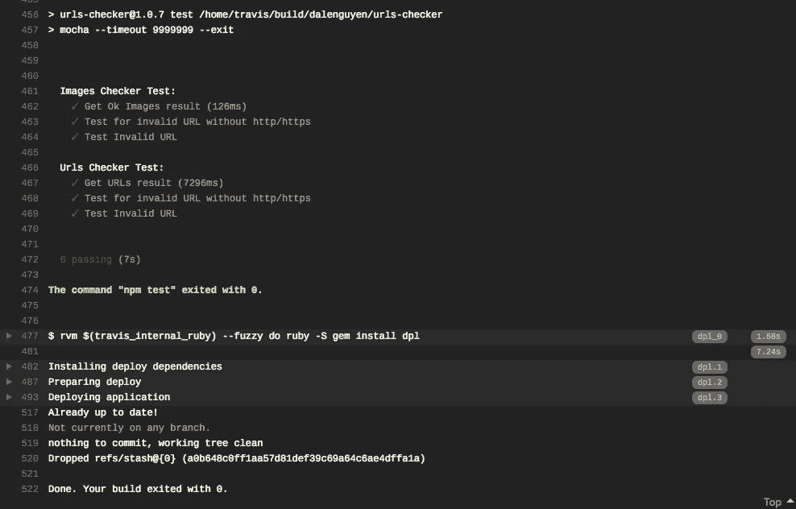

# 使用 CI/CD 的测试驱动开发示例:NPM 包

> 原文：<https://itnext.io/test-driven-development-with-ci-cd-example-npm-package-1169aa5df746?source=collection_archive---------0----------------------->


光看标题，就觉得引擎盖下有很多事。这是真的，这些是我们应该知道的事情，因为这将使我们的生活变得更容易。我是说，差很多！

**创建并发布 NPM 包—常规方法**

[](https://www.npmjs.com/package/urls-checker) [## urls 检查器

### 从一个页面中获取所有的 URL/图片，然后检查所有的 URL 是否工作正常。

www.npmjs.com](https://www.npmjs.com/package/urls-checker) 

这是我写的一个 NPM 包，用来检查网页中 URL 和图片的真实性。

通常，当我完成开发并准备发布时。我将把它提交到 GitHub，然后发布到 NPMJS——冒着包可能不工作或丢失某些元素的风险。

现在借助于测试驱动的开发方法、持续集成和持续部署。我再也不用担心我的代码不能工作了。我所需要做的就是向 Github 提交一个请求。在那之后，一切都被处理好了。



我的包的状态显示一切正常

**测试驱动开发**

我猜你可能听说过这个软件开发过程。 ***简而言之，这种类型的开发依赖于非常短的开发周期的重复:需求被转化为非常具体的测试用例，然后软件被改进以通过新的测试，只有*** 。如果你想了解更多关于测试驱动开发的内容，维基百科[上有一个很好的读物。](https://en.wikipedia.org/wiki/Test-driven_development)


我没有用这种方法开始我的包，但是这些是我应该开始的步骤。我不打算谈论如何开始和发布一个全新项目的细节。如果你想看完整的代码，请访问 [urls-checker 资源库](https://github.com/dalenguyen/urls-checker)。

1.  **开始新项目**

```
npm init -y
```

2.**添加需求包**

```
npm install mocha chai --save-dev
```

3.**编写一些测试用例并运行测试**

是的，您必须编写测试用例，就好像您的方法已经存在并且完全正常工作一样。

```
// test/urls.js'use strict';const { urlsChecker } = require('../index');
const expect = require('chai').expect;describe('Urls Checker Test:', () => {
    it('Get URLs result', async () => {        
        let results = await urlsChecker('[https://google.ca'](https://google.ca'));               
        expect(results.ok.length).to.be.above(0);
    });
})
```

当然，跑了也会失败，这才是重点。

```
mocha --timeout 10000 --exit
```

4.**编写通过测试用例的方法**

太长太复杂，请参考知识库:P

5.**添加 CI/CD 配置(Travis)**

现在，它是主要部分。通常，在完成项目后，我们会将其发布到 NPMJS。推你的包超级容易。

```
npm login // [Create an account](https://www.npmjs.com/signup) if you don't have
npm publish
```

但是，在 CI/CD 的帮助下，每次你提交 GitHub，你的代码都会被检查，如果通过。您的包将自动发布。于是告别了 ***npm 发布***；)

**与特拉维斯的持续融合**

有很多工具可以帮助你做 CI/CD，比如 Jenkins，Travis CI，Bamboo，Gitlab CI…在这篇文章中，我将尝试 [Travis](https://travis-ci.org) 。我们需要做的是一个 Github 账户和一个 Travis 账户。实际上，您将通过您的 Github 帐户登录 Travis。因此，您将在 Travis dashboard 中列出您的所有公共项目。



您可以选择启用或禁用与任何项目的集成

为了让您的项目利用 Travis 的持续集成，您必须为它添加一个配置文件。这是一个 NodeJS 项目，Node 的版本是 8。

```
// .travis.yml
language: node_js
node_js:
 - '8'
```

之后，您可以将构建状态标记添加到您的 **readme.md** 文件中。

```
// Replace the username and project name with yours[](https://travis-ci.org/dalenguyen/urls-checker)
```

从现在开始，每次推送 Github。Travis 将运行并测试您的项目，所以请确保您已经准备好了测试用例，并将测试脚本添加到 package.json 中

```
// package.json"scripts": {
    "test": "mocha --timeout 10000 --exit"
},
```

**持续部署到 NPMJS**

最后一步是确保如果一切都通过了，您的包将被发布到 NPMJS。为此，我们需要编辑 travis 的配置。

您可以从 travis cli 运行以下命令:

```
travis setup npm
```

或者手动添加到 ***.travis.yml*** 文件中

```
// .travis.yml...
deploy:
  provider: npm
  email: "YOUR_EMAIL_ADDRESS"
  api_key: "YOUR_AUTH_TOKEN"
```

如果您的机器上没有 travis cli，请查看 [Travis 说明页](https://github.com/travis-ci/travis.rb#installation)。这就是在 MacOS 上安装的方法。

```
brew install travis
```

为了获得 api_key，您需要从您的帐户创建新的令牌:

```
https://www.npmjs.com/settings/your-username/tokens/
```

但是，请不要将您的令牌放在公共网站上。按照这个步骤来保护它。

```
travis encrypt your-npm-token --add deploy.api_key
```

之后我的. travis.yml 正在更新中

```
// .travis.yml
language: node_js
node_js:
- '8'
deploy:
  provider: npm
  email: [dungnq@itbox4vn.com](mailto:dungnq@itbox4vn.com)
  api_key:
    secure: BSjy5UrLZOgrTnaA...
  on:
    branch: master
    tags: true
```

您可以删除 ***标签:true*** ，因为只有当您使用标签提交时，它才会部署到 NPMJS。

```
git push --tags
```

开始部署



从现在开始，我的包是安全的，并且在 Github 和 NPMJS 上总是最新的。希望这篇文章对你有所帮助；)