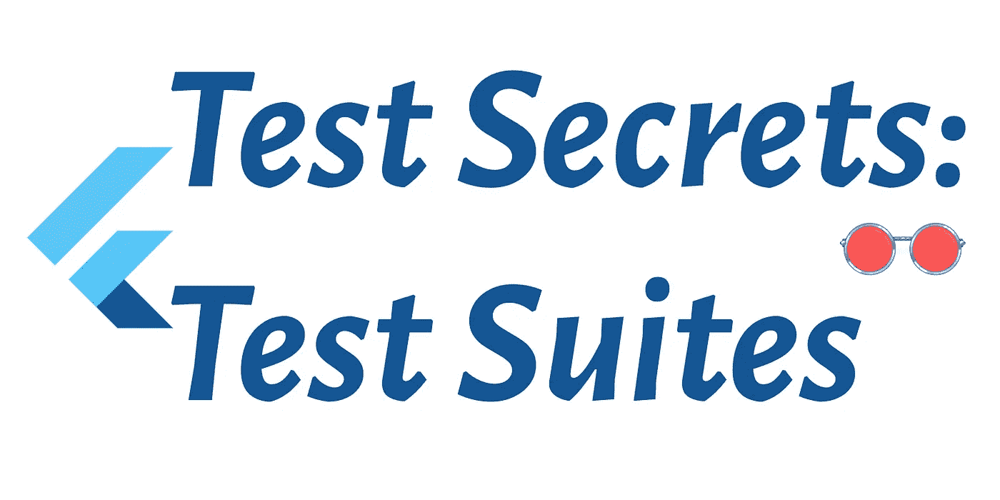

# 测试秘密，测试套件

> 原文：<https://itnext.io/test-secrets-test-suites-99f8390b8d4b?source=collection_archive---------2----------------------->



如果你在谷歌甚至 Reddit 上的 flutterdev 论坛上快速搜索，你会空手而归。测试套件的编写只是一个秘密，因为它隐藏在 SDK 本身的深处。不要等到工作面试时才知道。

# **背景**

我们编写测试套件，以确保 UI 组件的行为与我们对应用程序设计外观和行为的愿景一致。但是，如果它的构造方式不是用人类的母语；然后，需要更多的认知能力来理解测试通过或失败对那些编写添加到特定测试套件的单独测试的人意味着什么。

这通常是一个问题，因为当一个人的开发团队在一个月后再次查看代码时，他们已经忘记了代码序列，或者在一个扩展团队的情况下，通常是不同的团队成员编写单独的单元测试来扩展测试套件。

我要感谢易贝大学的 flutter 应用程序开发团队对 flutter SDK 的深入研究，以及 Flutter 团队如何测试 Flutter SDK，以找到扩展它的方法，使编写 Flutter 测试套件变得更加容易。

# **易贝的 Give When Then 和页面对象插件**

我们将使用易贝的 flutter 插件是 give_when_then 和 page_object 插件。您可以通过以下方式安装它们:

```
dev_dependencies: given_when_then: ^0.2.0 page_object: ^0.2.0
```

和往常一样，我正在为我的第一本 flutter dev 书整理代码和设计资料，网址是:

【https://github.com/fredgrott/flutter_rose_glasses 

这个特殊的示例 repo 是 fproject_layout repo:

[https://github.com/fredgrott/fproject_layout](https://github.com/fredgrott/fproject_layout)

我将向您展示一个使用 give_when_then 插件的示例，即 app_bar 的测试:

一个测试套件中总会有两个部分，装具和测试。它是通过扩展建立的，所以当我们编写单元测试时，它读起来几乎像真正的人类英语:

```
group('appbar test', () {testWidgets('AppBar Title is FProject Layout', harness((given, when, then) async {await given.myAppExists();await when.appBarFound();await then.appBarTitleIs();}));});
```

因此，当没有编写测试套件的人读到这句话时；理解测试测试什么有点容易。

现在，让我们开始使用 page_object。

# **页面对象**

页面对象只是提供了一种更好的方法，通过匹配和查找来抓取屏幕中的组件。我们以专柜 app 的首页画面为例。通常，我们有一个主页屏幕，如下所示:

我们在测试文件夹中创建了一组页面对象:

然后我们的主页测试套件变成:

# **满源**

完整的源代码，包括 flutter counter 应用程序，这是我自己修改的 flutter 应用程序模板，位于:

[https://github.com/fredgrott/fproject_layout](https://github.com/fredgrott/fproject_layout)

# **秘密**

哦，你以为我们结束了！我确实在你眼皮底下偷偷摸摸的藏了些东西！让我们再来看看我们的应用程序栏测试:

你看到的是 BDD 测试！我们不需要去学习另一种语言！换句话说，我们将 BDD 和验收测试合并到我们以这种方式编写的每个测试套件中！

# **结论**

虽然，是的，谷歌改变了一些东西，使我们可以在 CI 服务器上进行集成仪器测试是好的，但它也有其他真正的好处。我们可以在小部件测试和仪器测试中重用我们的测试技术和策略。

我们还可以在使用易贝 give_when_then 和 page_object 插件的小部件测试中重用使用 dart 扩展创建可读 BDD 用例的技术。

# **资源**

飘动玫瑰眼镜 https://github.com/fredgrott/flutter_rose_glasses

https://github.com/fredgrott/fproject_layout 项目布局

一般颤振和飞镖资源；

https://flutter.dev/community 颤振社区资源

颤振 SDK https://flutter.dev/docs/get-started/install

Android Studio IDE https://developer.android.com/studio

微软的 Visual Studio 代码 https://code.visualstudio.com/

https://flutter.dev/docs 颤振博士

https://dart.dev/guides dart Docs

谷歌 Firebase 移动设备测试实验室[https://firebase.google.com/docs/test-lab](https://firebase.google.com/docs/test-lab)

# **商标公告**

Google LLC 拥有以下商标:飞镖，颤振，机器人，机器人，诺托。苹果公司拥有 iOS、MacOSX、Swift 和 Objective-C 的商标。苹果公司拥有 SF Pro、Sf Compact、SF mono 和 New York 字体的商标。JetBeans Inc .拥有 JetBeans、IntelliJ 和 Kotlin 的商标。甲骨文公司拥有 Java 商标。微软公司拥有微软视窗操作系统和 Powershell 的商标。Gradle 是 Gradle Inc .的商标。Git 项目拥有 Git 的商标。Linux 基金会拥有 Linux 的商标。智能手机 OEM 自有商标到其手机产品名称。尽我所能，我遵守上述商标的品牌和使用指南。

# **关于弗雷德·格罗特**

我是一个疯狂的 SOB，作为一名前 android 移动开发者，我开始写关于 flutter 移动应用程序开发、设计和生活的文章(见 [Eff 新冠肺炎和 GOP](https://fredgrott.medium.com/eff-covid-and-the-gop-e912db0548b8) )。我会达到关键的每月 100 万观众大关吗？坐下来看。在[邢](https://www.xing.com/profile/Fred_Grott/cv)、 [LinkedIN](https://www.linkedin.com/in/fredgrottstartupfluttermobileappdesigner/) 、 [Keybase](https://keybase.io/fredgrott) 、 [Twitter](https://twitter.com/fredgrott) 这些社交平台上找我。