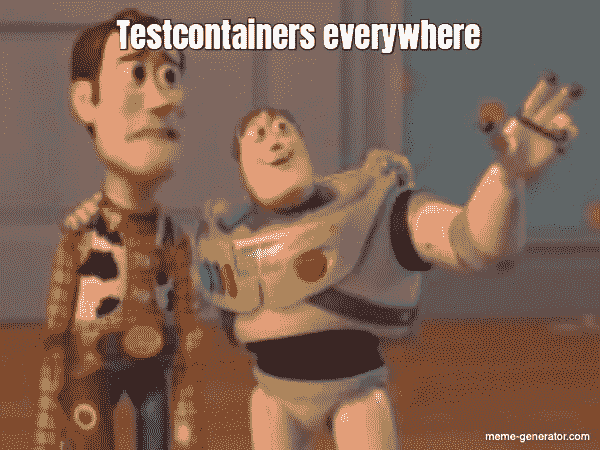

# 借助 Testcontainers 测试您的 Java 代码

> 原文：<https://itnext.io/test-your-java-code-with-the-help-of-testcontainers-898d31b64883?source=collection_archive---------3----------------------->

当一个人在写软件时，测试是其中很大的一部分。算法的单元测试很容易实现和运行，并且可能(但愿如此！)如今一个公认的标准。


等待测试的单元

当外部依赖开始起作用时，事情变得更有趣了。这通常被称为集成测试。但是实际上，我们想要测试的并不是与目标环境的集成，而是关于如何与其他系统交互的基本假设得到了满足。模拟对象经常发挥作用，例如抽象数据库访问以提供结果对象。不幸的是，这留下了两个问题:a)谁来测试模拟，b)模拟对象在多大程度上代表了现实？但是我跑题了。

进行这些测试的另一种方法是部署依赖项，然后针对这些依赖项运行您的代码。当以传统方式做这件事时，这意味着很多痛苦。可能是一个中央数据库服务器或消息总线或类似的东西。每个开发人员都有他们自己的模式或目的地(-前缀)或类似的东西，所以互相冒犯的可能性是最小的。或者开发人员建立他们自己的依赖关系的本地实例，这可能与不同项目的设置冲突和/或经常使用稀缺的系统资源。

## 拯救测试容器

幸运的是，Linux 容器已经成为 IT 环境的一部分好几年了。容器可以快速启动，并且可以限制在其中运行的软件。停止(和删除)容器还会清除更改，以便可以为下一次运行建立定义的开始/基础(假设它们不会将更改保存在主机文件系统中)。



Testcontainers 现在是一种从 Java 代码中轻松启动容器映像的方法，这些映像具有这样的依赖关系，然后使它们对您的测试可用。Testcontainers 与 JUnit 之类的测试框架集成得很好。

**使用 PostgreSQL**

让我们看一些例子，从 Postgres 数据库开始:

```
@QuarkusTest              // **(1)**
class RestApiTest {

  @ClassRule
  private static PostgreSQLContainer *postgreSQLContainer* =
      new PostgreSQLContainer("postgres");   // **(2)**
```

在这里，我们说这是一个测试类，它应该通过启动 Quarkus 来运行测试，因为这是我选择的应用服务器(1 ),然后设置一个 Postgres 容器。参数“postgres”实际上是图像名称，可以省略。现在我们有了这个，我们需要从图像中启动一个容器，并告诉我们的代码在哪里可以找到它:

```
@BeforeAll
private static void setupPostgres() throws Exception {
  *postgreSQLContainer*.start();  // **(3)**
  // Now that postgres is started, we need to get its URL and tell 
  //      Quarkus
  System.*setProperty*("quarkus.datasource.url",
           *postgreSQLContainer*.getJdbcUrl());  
  System.*setProperty*("quarkus.datasource.username","test");// **(4)**
  System.*setProperty*("quarkus.datasource.password","test");
```

(3)启动容器和里面的 Postgres 实例。一旦它开始运行，我们就可以从它那里获得 JDBC URL，并通过系统属性(4)将其传递给 Quarkus。我们还需要设置访问数据库的凭证。在示例中，这是硬编码的“test ”,因为这是我在 PostgreSQLContainer 的源代码中找到的，但理想情况下，应该将其参数化，如下所示。

接下来，我们需要建立一个模式(除非您的代码像 Hibernates auto-DDL 模式那样做)。我在这里使用的是 [Liquibase](http://www.liquibase.org/) ，但是[也可以通过参数](https://www.testcontainers.org/modules/databases/#using-an-init-script-from-a-file)传递 DDL 脚本。

```
PGSimpleDataSource ds = new PGSimpleDataSource(); // **(5)**

// Datasource initialization
ds.setUrl(*postgreSQLContainer*.getJdbcUrl());
ds.setUser(*postgreSQLContainer*.getUsername());
ds.setPassword(*postgreSQLContainer*.getPassword());

DatabaseConnection dbconn = new JdbcConnection(ds.getConnection());
ResourceAccessor ra = new FileSystemResourceAccessor("src/test/sql");
Liquibase liquibase = new Liquibase("dbinit.sql", ra, dbconn);//**(6)**
liquibase.dropAll();
liquibase.update(new Contexts());    // **(7)**
```

在(5)中，我建立了一个简单的数据源，然后对其进行参数化，并从中获得一个数据库连接。然后，我们(6)告诉 Liquibase 使用这个连接和我们的 DDL 脚本来用 DDL 更新数据库(7)，基本上是设置模式和测试数据。

**使用模拟 HTTP 服务器**

我的代码还向另一个服务发出 http 请求，这在我的服务测试期间不一定可用。但是没问题，有一个 [Mockserver](https://www.testcontainers.org/modules/mockserver/) 可以实现这个目的。同样，我们首先定义服务器:

```
@ClassRule
public static MockServerContainer *mockServer* = new MockServerContainer();
```

然后再启动它:

```
*mockServer*.start();
System.*err*.println("Mock engine at http://" + 
      *mockServer*.getContainerIpAddress() + ":" + // **(8)**
      *mockServer*.getServerPort());
```

容器在“随机”位置暴露它们的端口以避免冲突(除非有不同的说明)。我们需要在(8)中获取端口，并告诉我们的代码服务器在哪里。

现在的问题是服务器如何知道提供什么？有几种方法可以做这件事。我喜欢的一个是请求匹配和提供响应的流畅 API。为此，我们需要类路径上的 org . mock-server:mock server-client-Java。棘手的是客户端版本需要与 Testcontainer 的 Mockserver 中的服务器版本相匹配。解决这个问题后，我们可以在设置代码中使用它:

```
new MockServerClient(*mockServer*.getContainerIpAddress(), 
                     *mockServer*.getServerPort())
    .when(*request*()
        .withPath("/api/v1/verifyPolicy")
    )
    .respond(*response*()
        .withStatusCode(201)
        .withHeader("Content-Type","application/json")
        .withBody("{ \"msg\" : \"ok\" }")
    ); System.*setProperty*("engine/mp-rest/url",
                   "http://" + 
                   *mockServer*.getContainerIpAddress() + 
                   ":" + 
                   *mockServer*.getServerPort());
```

**使用卡夫卡**

最后但同样重要的是，我们看一下如何在 Testcontainer 中设置 Kafka，并将其告知 MicroProfile 反应式消息客户端:

```
@ClassRule
private static KafkaContainer *kafka* = new KafkaContainer();
```

我想你可以在这里看到一个模式:-)

```
// Start Kafka
*kafka*.start();
// It is running, so pass the bootstrap server location to Quarkus
String kafkaBootstrap =  *kafka*.getBootstrapServers();
System.*setProperty*("kafka.bootstrap.servers", kafkaBootstrap);
```

这种基本设置非常简单，没有必要处理所有遗留的麻烦。

## 结论

Testcontainers 可以为您提供一种非常容易地建立一个相对复杂的环境来测试您的代码的方法。这种设置可以用于 CI 系统，如 Travis 或其他支持 Docker 容器(Testcontainers 依赖于 Docker，所以目前不支持其他容器运行时)的地方，这些地方包括开发人员的机器。

上面[的(大部分)例子的代码可以在网上找到](https://github.com/RedHatInsights/custom-policies-ui-backend/blob/928a8648b3093d076272dcbb1731d5eef5de0605/src/test/java/com/redhat/cloud/custompolicies/app/RestApiTest.java#L66)。